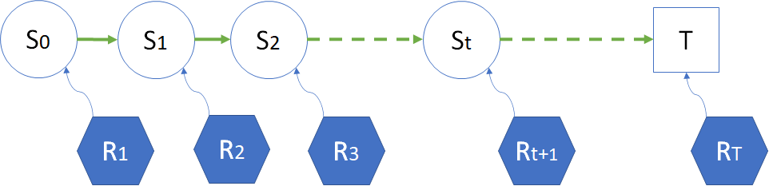

# 第 5 章 从普通过程到奖励过程

### 温故知新

前面学习了马尔可夫链，它可以帮助分析像醉汉回家这种简单的左右转移问题，也可以分析更复杂的多状态转移问题。真实世界的马尔科夫链的状态空间很可能是成千上万个，转移路径也更复杂。下面我们通过对学生学习问题的分析，来学习更多的强化学习基础知识。

### 参考资料

https://blog.csdn.net/gsww404/article/details/80803295

- David Silver RL course
- Sutton 强化学习
- 奖励函数设计 https://cloud.tencent.com/developer/article/1693899

## 5.1 学生学习问题

### 5.1.1 提出问题

图 5.1.1 学生学习问题

在本章中的问题是这样的：

相信读者都经历过幸（痛）福（苦）的学生时代，有些优秀的同学，会顺利地度过上学、上课、作业、考试、结业等过程，而一些不爱学习的同学，就会经历逃学、补课、贪玩、补考，甚至居家的过程。

优秀的同学，总会得到老师家长的夸奖，而不爱学习的同学，经常会受到批评甚至责骂，所以有人觉得幸福，有人觉得痛苦。

如何对以上问题建立马尔可夫过程模型呢？然后又如何鼓励智能体（模拟人们的青少年时代）去努力学习呢？

### 5.1.2 建立模型

图 5.1.2 是笔者根据自己的理解建立的模型，各位读者可能有不同的建模方法，因为这个学生学习问题不是一个严格的学术问题，所以答案可能多种多样，只要能讲出道理，或者没有严重的不合理即可。

图 5.1.2 学生学习问题的状态转移概率图

图 5.1.2 的模型解释请看表 5.1.1，包括：状态、描述、下游状态转移概率三列。

表 5.1.1 学生学习问题模型解释

| 状态 | 代码 | 描述                                                 | 下游状态转移概率                                             |
| ---- | ---- | ---------------------------------------------------- | ------------------------------------------------------------ |
| 居家 | CX   | 辍学、休学、退学、学龄前 等等不在校受教育的状态。 | 0.5：概率会继续居家； 0.5：去上学。                       |
| 在校 | ZX   | 在学校接受教育。                                     | 0.9：去上课； 0.1：逃学。                                 |
| 逃学 | TX   | 本来该在学校但是不在。                               | 0.6：逃学回来后需要补课； 0.4：持续逃学，变成了居家。     |
| 上课 | SK   | 是一个要多次经历的状态。                             | 0.7：上完课后去完成课后作业； 0.2：没听懂找老师或者同学补课； 0.1：上课过程中逃学。 |
| 补课 | BK   | 上课没听懂，找同学或者老师补课。                     | 0.8：补课结束后要去完成作业； 0.2：补课不认真，接着逃学。 |
| 作业 | ZY   | 完成课后作业。                                       | 0.7：回到第二天的上课状态； 0.1：贪玩，不写作业； 0.1：到了期中期末考试阶段； 0.1：错过考试，直接补考。 |
| 贪玩 | TW   | 放学后贪玩，不写作业。                               | 0.8：需要补课； 0.2：逃学。                               |
| 考试 | KS   | 期中或者期末考试。                                   | 0.8：及格，毕业； 0.2：不及格，需要补考。                 |
| 补考 | BS   | 考试不及格需要补考。                                 | 0.7：可以通过； 0.3：补考不及格，肄业。                   |
| 毕业 | BY   | 结束本学期的学习。                                   | 1.0：结束学业。                                              |
| 肄业 | YY   | 成绩不合格结束。                                     | 1.0：结束学业。                                              |
| 结束 | End  | 终止状态。                                           | 不再转移。                                                   |

### 5.1.3 从模型形成过程

在第 4 章中我们学习过，醉汉（智能体）通过自己的随机游走，形成了一个回家的过程，在本章中，可以把一个学生看作是智能体，让他/她在图 5.1.2 的模型中按照转移概率“体验人生”，这样就可以形成过程。

#### 终止状态（End State）

首先我们提出一个概念：有**终止状态**的马尔可夫链。

- 在租车问题中，车辆不断地在四个门店中按一定概率随机出现，状态虽然不太少，但实际**没有尽头**（除非车辆损坏更换或者公司倒闭）。

- 在醉汉回家问题中，在每个时刻 $t$，只有左右两个状态可以选择（当然也可原地发呆），但是也从理论证明了醉汉最终是可以到家的，并且到家后不再出来（到达吸收状态），是一个有**终止状态**的过程。

在本章中，我们假设一个学期的期末就是终止状态。一旦到达终止状态，就不再转移出去。

#### 分幕（Episode）

由于终止状态的存在（图 5.1.2 中的“结业”状态），可以引入一个新的强化学习中的重要概念：**分幕**（Episode）。比如：

- 在醉汉回家问题中，醉汉到家了，整个过程叫做一幕；第二天该醉汉又喝醉了，再次到家后，又叫做一幕。
- 在学生学习问题中，经过了一个学期的努力，终于结业了，叫做一幕。
- 一局射击游戏中，每打中一个敌人，不叫作一幕，把所有敌人消灭才叫做一幕。
- 一盘棋中，最终双方分出输赢或者打平，叫做一幕。
- 打桥牌中，每个人出完手中的最后一张牌，桌面上有 13 墩牌，叫做一幕。
- 一个扫地机器人，完成当天任务回到充电状态，叫做一幕；如果在打扫过程中电量过低，不得不暂时回到充电状态，不叫作完成一幕。

#### 采样（Sampling）

在图 5.1.2 中，可以根据不同的学生在一个学期中的经历，获得不同的到达终点路径，比如：

- 学生甲

  居家 - 在校 - 上课 - 作业 - 考试 - 毕业 - 结束。

- 学生乙

  居家 - 在校 - 上课 - 补课 - 作业 - 考试 - 毕业 - 结束。

- 学生丙

  居家 - 在校 - 上课 - 作业 - 贪玩 - 补课 - 作业 - 考试 - 毕业 - 结束。

- 学生丁

  居家 - 在校 - 逃学 - 补课 - 作业 - 考试 - 补考 - 肄业 - 结束。

  ......

上述的过程叫做**采样**（Sampling）。对于大多数学生来说，经历的都是第一个路径，而有极少的学生走的其它几个路径。

根据转移概率，经过采样后到达终点，得到一幕状态序列。没有到达终点的状态序列不叫作完整的状态序列，也不叫做一幕，但是这些序列片段仍然有研究价值。

另外，读者可能注意到在上述采样的例子中，都是从“居家”开始的，似乎有一个隐含的开始状态。在某些问题中，我们指定一些状态为开始状态，原因是：

- 一是为了符合实际问题的逻辑需要，比如本例中，学生时代一般都是从不在校的状态开始的（学龄前）。
- 二是为了不过分简化问题的难度。比如一个迷宫，如果不指定开始状态，而是从快到出口的一个位置作为起始位置，将会大大降低问题的难度。

## 5.2 奖励和回报

### 5.2.1 奖励（Reward）

#### 奖励值的设定

上过学的读者都会知道：学习成绩好，老师会在全班同学面前表扬，家长也会要什么给什么；相反，成绩不好，老师就会经常批评，家长也会被经常叫到学校来谈话，很没有面子。

更具体地，我们看一看一些负面的影响：

- 居家，家长不给你好脸子看，是一种精神惩罚；
- 逃学，可能会在社会上学坏；
- 补课，耽误别人和自己的时间；
- 贪玩，该做的作业没有做；
- 补考，需要提前结束假期返校补考。

正面的影响会是：

- 在校，首先可以保证人身安全（校园凌霸毕竟是极少发生）；
- 上课，学到知识，课堂提问还可以得学分；
- 作业，巩固学到的知识，在作业本上会有老师给的得分；
- 考试，检验学到的知识，在试卷上会有得分；
- 结业，进入假期状态好好娱乐一下。

笔者至今还记得小学时代，不经意地从课桌里拿出以往考试的七张试卷，被同学们发现是 7 个鲜红的 100 分，甚是自豪，那也是一种奖励形式。

其实以上这些只是一种主观感受上的奖励，或者叫精神奖励，但是它可影响到以毕业后的工作状态，能拿多少薪水，那就是真金白银的奖励了。

**奖励**，有的文献中叫做**收益**，在本书中我们混用这两种称呼。

在强化学习中，智能体的目标被形式化表征为一种特殊信号，称为奖励/收益，它通过环境传递给智能体。在每个时刻，收益都是一个单一标量数值。使用奖励信号来形式化目标是强化学习最显著的特征之一。

具体到学生学习问题，我们需要给每个状态一个具体的奖励值，便于强化学习系统做定量的分析、学习。如图 5.2.1 所示。

图 5.2.1 学生学习问题中对状态的奖励

在每个状态的旁边，标注了一个红色的分数，比如 $R=+1$，表示“在校”状态可以得到 1 分的奖励。

读者可以明显地发觉，在橙色的状态中，越往后得分越高；而在蓝色的状态中，也是如此，越往前越负。这是从该状态对人生的影响大小来设定的奖励值。

当然也可以有 0 分的奖励，也叫做奖励，比如“在校”状态，如果普遍认为是“理所应当”的状态，就可以设定 $R=0$。原则是蓝色状态比“在校”状态奖励值低即可，**只与相互之间的大小有关，与正负号无关**。

#### 奖励的定义方式

奖励有两种定义方式，如图 5.2.2 所示。

图 5.2.2 奖励的两种定义方式
（左图：转移过程奖励；中图：当前状态奖励；右图：两种方式的转换）

- 给转移过程定义奖励 —— **过程奖励**
  图 5.2.2 左图：

  - 从状态 $s_a$ 到达 $s_c$ 时，获得奖励 $r_1$，该奖励给与 $s_a$，并非 $s_c$。
  - 从状态 $s_a$ 到达 $s_d$ 时，获得奖励 $r_2$，该奖励给与 $s_a$，并非 $s_d$。
  - 从状态 $s_b$ 到达 $s_d$ 时，获得奖励 $r_3$，该奖励给与 $s_b$，并非 $s_d$。

  这个奖励**与源状态和目标状态的组合有关**。比如，到达 $s_d$ 后，是给与 $r_2$ 还是 $r_3$，取决去是从 $s_a$ 还是 $s_b$ 来的。

  现实中的例子有：

  - 同样是考上清华大学，一个城市里的学生和一个大山里的学生所经历的历程不一样，受教育的环境也不同，应该获得不同的奖励值。
  - 同样是攀登珠穆朗玛峰，很多国外登山队从印度所在的南坡攀登，而我们国家的登山队都是从西藏所在的北坡攀登，难度相差极大，都抵达峰顶后，登山界给与从北坡攀登的队的褒奖更多一些。

  **过程奖励，我们用小写的 $r$ 来表示。**

- 给当前状态定义奖励 —— **状态奖励**
  图 5.2.2 中图：

  - 到达状态 $s_a$ 时，获得奖励 $R_1$。
  - 到达状态 $s_b$ 时，获得奖励 $R_2$。

  可以看到，只要到达 $s_a$，就可以获得 $R_1$，**奖励是给与当前状态的，与未来状态无关**。

  游戏中的例子有：

  - 射击游戏，对面远处有一个敌人，你拥有一把狙击枪会得到较高的奖励；如果对面近距离有一堆敌人，你拥有一把冲锋枪会得到较高的奖励。先不用管是否可以开枪击中敌人，就智能体的选择来说，就已经可以得到相应的奖励了。

  - 迷宫游戏，距离出口远的地方所得到的奖励会比距离出口近的地方要低，原因很简单，因为后者更容易走出迷宫。

  **状态奖励，我们用大写的 $R$ 来表示。**

更正式的定义是图 5.2.2 左图中的方法，即 **过程奖励**，用数学语言表述就是 $S \times S' \to r$，意为奖励 $r$ 由 $S,S'$ 共同决定，不同的过程会有不同的奖励。

但是在目前阶段为了讲述问题方便，我们会使用图 5.2.2 中图的定义，即 $S \to R$。这两种方式很容易区分，在本书中，读者只需要看 $R$ 或 $r$ 是大写还是小写即可；在别的文献中，要看在图中标注的位置及相关说明。

有没有一种方式可以**统一这两种定义方式**呢？有！那就是图 5.2.2 右图的方式。

因为在状态转移时，会有一个转移概率 $p$，图中我们假设 从 $s_a$ 到 $s_c,s_d$ 的转移概率为 $p_1,p_2$，奖励为 $r_1,r_2$，$p1+p2=1$。从 $s_b$ 到 $s_d$ 的转移概率为 $p_3$，奖励为 $r_3$，$p_3=1$。则有：

$$
\begin{aligned}
R_1 &= p_1 \cdot r_1 + p_2 \cdot r_2
\\
R_2 &= p_3 \cdot r_3 = r_3
\end{aligned}
\tag{5.2.1}
$$

在后面学习贝尔曼方程时，再来具体解释。

### 5.2.2 回报（Return/Gain）

股票市场起起伏伏，今天挣的钱，明天就可能赔回去了。所以有“一年五倍易，五年一倍难”的说法，意为一年赚五倍的大有人在，但是第二年就可能赔光了，而五年下来，能够稳稳地赚一倍的，却是很难做到。所以，我们更看中的是长期积累的收益。

图 5.2.3 关注长期的奖励

比如在图 5.2.3 中，黑色数字表示转移概率，红色数字表示奖励。从 $s_a$ 出发，你有两条路可以选：去 $s_b$ 得到 +2 的奖励，或者去 $s_c$ 得到 +1 的奖励。你选择哪一个呢？

如果只关注短期收益，大家当然会去选 $s_b$；但是从 $s_c$ 有 0.4 的概率可以达到 $s_d$，从而得到 +3 的奖励，累积起来，会比左侧这条路要多。

如何定义“长期的累积收益”呢？那就是**回报**。

在英文中用 Return（收获）来表示，但是在公式中一般用 G 来表示，所以我们不妨理解为 Gain 这个单词。而且 Return 的首字母与奖励（Reward）的首字母相同，容易混淆。

式（5.2.2）就是回报的定义：

$$
G_t = R_{t+1}+R_{t+2}+R_{t+3}+ \cdots +R_{T} \tag{5.2.2}
$$

第一次见到式（5.2.2）的读者会感觉奇怪，为什么是 $R_{t+1}$ 而不是 $R_t$？

这只是一种定义方式，强调了奖励是在到达某新状态时获得的，而不是离开时获得的。

图 5.2.4 奖励与回报

图 5.2.4 中展示了 $G_0，G_1$ 和 $G_t$ 的计算方式，表示了在同一个马尔可夫过程中的状态 $S_0，S_1$ 和 $S_t$ 的回报，同时也告诉读者，在一个完整的序列中，我们可以从任意时刻 $t$ 开始计算 $S_t$ 状态的回报，而忽略前面的数据。

图 5.2.4 实际上还是状态奖励定义方式，但是它很“巧妙”地把 $R_{t+1}$ 引出的箭头指向了 $S_t$ 的右侧靠近出口处，预示着是对未来的一种预期。这样的话，在 $S_0$ 处的奖励 $R_1$，实际上已经确定了能够到达 $S_2$。

如果从图 5.2.4 中删掉 $S_0$，从 $S_1$ 为起点出发的话，则 $R_1$ 就不会存在，必须从 $R_2$ 开始，就能计算出 $G_1$ 来。

有的读者可能会有疑问：我目前处于 $S_t$ 的位置，根本得不到将来的状态和奖励，我如何计算总的回报呢？

请注意，强化学习和其它机器学习都是一样的，不能预测没有见过的事件。在图 5.2.4 中，虽然你目前处于 $S_t$ 位置，但是由于训练样本是完整的，也就是有前人经历过这些过程，已经获得了经验，所以我们才能够把这些经验（完整的一幕数据序列）拿来做训练。这里的“将来”对你来说是未知的，对于有些人来说已经是“过去”。

智能体的目标是最大化其收到的总收益，即回报 $G$。这意味着需要最大化的**不是当前收益，而是长期的累积收益**。我们所有的“目标”或“目的”都可以归结为：最大化智能体接收到的标量信号累积和的概率期望值。

智能体总是学习如何最大化回报。如果我们想要它为我们做某件事，我们提供奖励的方式必须要使得智能体在最大化回报的同时也实现我们的目标。因此，至关重要的一点就是，我们设立奖励的方式要能真正表明我们的目标。

### 5.2.3 奖励函数（Reward Shaping）

#### 以数学期望为奖励函数

我们学习了什么是奖励，但是奖励函数是什么？

在没有形成马尔科夫链时，我们静态地看一组状态及其奖励设置时，无法确切知道其形成过程，也就不能确定具体获得是哪个奖励，因此要用数学期望的方式来定义。

图 5.2.2 左图：

- 对于 $s_b$ 来说，奖励函数 $R_{t+1}=R(s_b)=r_3$，很明确。

- 对于 $s_a$ 来说，不知道 $S_{t+1}$ 是 $s_c$ 还是 $s_d$，所以也无法确定奖励值 $R_{t+1}$是 $r_1$ 还是 $r_2$，所以把奖励函数定义为一个数学期望：$R(s_a)= p_1 \cdot r_1 + p_2 \cdot r_2=\mathbb E[R_{t+1}|S_t=s_a]$。其中，$r_1,r_2 \in R_{t+1}$。

在图 5.2.2 中图：

- 对于 $s_b$ 来说，它只有一个下游状态 $s_d$，因此在 $s_d$ 处得到的奖励 $R_2$，就是它的奖励：$R_{t+1}=R(s_b) = R_2$。

- 对于 $s_a$ 来说，它有两个下游状态，不确定 $S_{t+1}$ 是谁，所以把奖励函数定义为一个数学期望：$R(s_a)=\mathbb E[R_{t+1}|S_t=s_a]$。

更通用的写法是：

$$
R(s)=\mathbb E[R_{t+1}|S_t=s] \tag{5.2.3}
$$

根据式（5.2.3），在图 5.2.2 中的 $R_1,R_2$ 应该写作 $R(s_a),R(s_b)$。在实际应用中，如果是这种定义方式，我们直接把 $R_1,R_2$ 当作 $R_{t+1}$ 即可。

#### 以状态属性为参数的奖励函数

另外一种情况是，奖励有可能不是一个简单的值，而是要通过状态的属性做为参数计算得到，因此有了函数的概念。

什么是状态属性？比如在赛车游戏中，车辆当前的位置、速度、方向、外挂设备等，就是状态的属性，它们共同构成了一个状态。

在一些复杂的问题中，确实需要奖励函数，而非简单的奖励值，最常见的有以下几类。

- 稀疏奖励

  稀疏奖励是最常见的一种奖励，在游戏中有很多的应用，即“完成比赛得分，输掉比赛不得分”这种形式。这个问题已经一直困扰了 RL 很多年了。

  比如下围棋，下的过程中是没有任何奖励的，只有下到最后才会出现一个 reward 信号说谁赢了。这对于强化学习不利。

  连续的奖励非常有利，而且奖励值有大有小。比如 Atari 游戏中的打砖块，打一个得一分，一个回合就是一次游戏得多少分，这样对于系统的学习也就很有利。

- 形式化奖励

  如果有一个机器人的目标是学会跑步步态，奖励是速度，这就是一种形式化的奖励。机器人越接近奖励目标，系统给予的奖励就越多。这和稀疏奖励形成鲜明对比。这种形式化的奖励通常更容易促进学习，因为即使策略没有找到解决问题的完整解决方案，它们也能提供积极的反馈。

- 分布奖励

  分布奖励思想来源于概率论中的分布，通常的做法是将奖励根据高斯分布等做，也有在 RNN 算法中通过记忆等做的。

  比如第 2 章中的多臂赌博机，就是用高斯分布来决定是否给与奖励。

- 系数变化奖励

  就是奖励是随其他变量而变化的。比如，打保龄球，距离线的距离就可以算作每次发力的奖励。

- 中间难度起点奖励

  强化学习过程中经常会出现一个问题，刚开始学习全部是负面奖励，则学习起来很慢，但要是全部是积极奖励，系统又学不到不好的一面，于是科学家就提出了一种中间难度起点奖励，就是从中间开始的意思。

在此不再深入讨论，有兴趣的读者请自行学习相关概念。

#### 常见误区

但在实际工程中，奖励设计是一个深不见底的大坑，里面埋葬了很多工程师的大量时间。在大部分情况下，我们都要小心翼翼地不断调整参数，还要防止智能体投机取巧找到刷分技巧。听说的一些比较有趣（崩溃）的案例有：

- 用强化学习模仿作画，结果智能体学会了白色大笔一挥，然后用小黑笔不断在画布上戳，以此刷分；
- 用强化学习让机器人学习叠积木，把奖励设计在积木的底面高度上，结果机器人学会了把积木直接打翻成底面向上，就拿到了奖励。

而在实际工程中，即使没有出现智能体刷分这样糟糕的情形，为了算法的效果，我们也需要对环境的奖励不断调优。特别是有关战斗AI，或者某种游戏的胜负，这样的场景中如果只用最终的结果作为奖励很可能太过于稀疏，导致最终训练效果不佳。而如果你为了解决这个问题开始针对具体问题设计奖励函数了，那么你接下来的很长一段时间都将在“训练-微调奖励函数-训练-微调奖励函数”这样的循环中度过。

举一个简单的例子来初步理解奖励函数设计的原则，在后面讲到价值函数时，我们会做进一步的讨论。

图 5.2.5 奖励函数的设计

如图 5.2.5 中所示，状态 $s_1,s_2,s_3$ 在相互转移时都没有奖励，或者奖励同为 0，只有到状态 $T$ 时才有 +100 的奖励，但是从 $s_3$ 到 $s_T$ 的概率（0.2）很低。为了加快学习进度，把奖励函数做如图 5.2.6 的修改。

图 5.2.6 奖励函数的修改

图 5.2.6 的奖励设定，本意是要加快从 $s_1$ 到 $s_2$ 再到 $s_3$ 的学习过程，但是学习过程很可能陷入 $s_1,s_2,s_1,s_2,\cdots$ 的循环中（如红色箭头所示），循环了 100+ 次以后，可以得到比 +100 更高的回报，根本不用到达目标状态 $s_T$，这就违背了我们的初衷。

特别地，奖励信号并不是传授智能体如何实现目标的先验知识。例如：

- 国际象棋智能体只有当最终获胜时才能获得奖励，而并非达到某个子目标，比如吃掉对方的子或者控制中心区域。如果实现这些子目标也能得到奖励，那么智能体可能会找到某种即使绕开最终目的也能实现这些子目标的方式。例如它可能会找到一种以输掉比赛为代价的方式来吃对方的王后。奖励信号只能用来传达什么是你想要实现的目标，而不是如何实现这个目标。
- 在狼吃羊的强化学习训练中，如果给狼的每一步移动的奖励设置为 -1，吃到羊的奖励为 +100，那么狼需要在 100 步之内吃到羊才会有正的回报，而在大多数情况下是负值。所以狼可能会选择一开始就一头撞死在障碍物上，以获得 0 分的回报。

如何避免上述情况呢？我们可以做如图 5.2.7 的修改，使得智能体在两个状态间循环时只能得到回报为 0 的过程。

图 5.2.7 最终的奖励函数

## 5.3 马尔可夫奖励过程

### 5.3.1 马尔可夫奖励过程（Markov Reward Process）

有了回报 $G$ 的定义，自然就会把所有的历史状态和对应的奖励串联起来，形成一个过程，叫做马尔可夫奖励过程 MRP（Markov Reward Process）。

一个完整的奖励过程如图 5.3.1 所示。就是在状态转移图中，给每个状态都定义一个奖励值，当到达这个状态时，强化学习过程就会获得相应的奖励值，使得整个过程向着获得最大收益的方向优化和运行。

图 5.3.1 马尔科夫奖励过程

很明显，这是用**状态奖励**的定义方式。

在图 5.3.1 中：

- 到达 $S_0$ 状态时，会得到 $R_1$ 的奖励；
- 到达 $S_1$ 状态时，会得到 $R_2$ 的奖励；
  ......
- 到达 $S_t$ 状态时，会得到 $R_{t+1}$ 的奖励；
  ......
- 到达终点 $T$ 时，会得到$R_{T}$的奖励。

这些状态的下标值，只表示前后发生的顺序，即**时刻**，而与状态的序号无关。比如一个状态集中有 4 个状态 $\{s_a,s_b,s_c,s_T\}$，马尔可夫链的顺序有可能是 [$s_a,s_b,s_a,s_c,s_T]$，那么有：$S_1=s_a,\ S_2=s_b,\ S_3=s_a,\ S_4=s_c,\ S_5=s_T$。

在本书中使用大写的 $S$ 表示某个时刻的状态，如 $S_1,S_t$，分别表示时刻 1 和时刻 t 的状态。用小写的 $s$ 表示具体问题的状态实例。

如在图 5.1.2 中，$s_{SK}$，表示学生学习问题中的“上课”状态，那么 $S_3=s_{SK}$ 的含义就是在时刻 t=3 时处于状态 $s_{SK}$。

在本书中使用这种定义方式：整个序列的序号是 $S_0,R_1,S_1,R_2,\cdots,S_t,R_{t+1},\cdots$ 的过程，即 $R$ 的序号是 $S$ 的序号+1。而在有些资料中，用这种定义方式：$S_0,R_0,S_1,R_1,\cdots,S_t,R_{t},\cdots$，需要读者事先注意。

如果用一个文字公式来表示 MRP（Markov Reward Process，马尔可夫奖励过程）：

$$
\begin{aligned}
马尔可夫奖励过程 &= 马尔可夫链 + 奖励函数
\\
MRP &= Markov Chain + Reward
\end{aligned}
$$

所以，得到一个马尔科夫奖励过程需要条件和过程是：

1. 有模型图（含状态转移）；
2. 有奖励（目前可以是面向结果的奖励，即，到达某个状态后可以得到相应的奖励值）；
3. 有采样，这样才可以串联起**状态**和**奖励**，以便获得完整的 MRP：$S_0,R_1,S_1,R_2,\cdots$ 过程；
4. 得到奖励后，把它们相加，就可以得到回报 $G$，而 $G$ 是后面要学习的所有算法的基础。

与马尔可夫过程的二元组 $\langle S,P \rangle$ 相比，马尔可夫奖励过程是一个元组的数据序列：$\langle S,P,R \rangle$，分别表示状态 $S$、转移概率 $P$、奖励 $R$。但是 $P$ 只体现在采样过程中，而不存在于采样结果中。

下面我们结合模型、状态、终止状态、奖励、采样、回报的定义，来经历一下马尔科夫奖励过程。为了方便起见，把图 5.2.1 拷贝过来随时查阅。

由图 5.2.1 学生学习问题中对状态的奖励

在图 5.1.2 中，可以根据不同的学生在一个学期中的经历，获得不同的到达终点路径。我们以“居家- 在校 - 上课 - 补课 - 作业 - 考试 - 补考 - 毕业 - 结束”为例，解释完整过程：

0. $S_0=$ “居家”。可以得到 $R_1=0$ 的奖励值。
1. $S_1=$ “在校”。可以得到 $R_2=1$ 的奖励。
2. $S_2=$ “上课”。可以得到 $R_3=1$ 的奖励。
3. $S_3=$ “补课”。可以得到 $R_4=0$ 的奖励。
4. $S_4=$ “作业”。可以得到 $R_5=1$ 的奖励。
5. $S_5=$ “考试”。可以得到 $R_6=0$ 的奖励。
6. $S_6=$ “补考”。可以得到 $R_7=-1$ 的奖励。
7. $S_7=$ “毕业”。可以得到 $R_8=4$ 的奖励。
8. $S_T=$ “结束”。一般我们把最后一个状态写做 $S_T$，没有奖励。

所以，马尔科夫奖励过程为：
$$
MRP_1 = \langle s_{居家},0,s_{在校},1,s_{上课},1,s_{补课},0,s_{作业},1,s_{考试},0,s_{补考},-1,s_{毕业},4,s_{结束} \rangle
$$

再举几个有可能的过程是：

$$
\begin{aligned}
MRP_2 &= \langle s_{居家},0,s_{在校},1,s_{上课},1,s_{作业},1,s_{考试},0,s_{毕业},4,s_{结束} \rangle
\\
MRP_3 &= \langle s_{居家},0,s_{在校},1,s_{逃学},-3,s_{补课},0,s_{作业},1,s_{考试},0,s_{补考},-1,s_{毕业},4,s_{结束} \rangle
\\
MRP_4 &= \langle s_{居家},0,s_{在校},1,s_{上课},1,s_{作业},1,s_{贪玩},-2,s_{补课},0,s_{作业},1,s_{补考},-1,s_{肄业},-4,s_{结束}\rangle
\end{aligned}
$$

得到完整的采样序列后，就可以计算回报值，列在表 5.3.1 中。

表 5.3.1 不同的 MRP 的回报值计算

| MRP     | 回报值计算                 |
| ------- | -------------------------- |
| $MPR_1$ | $G_0=0+1+1+0+1+0-1+4=6$    |
| $MPR_2$ | $G_0=0+1+1+1+0+4=7$        |
| $MPR_3$ | $G_0=0+1-3+0+1+0-1+4=2$    |
| $MPR_4$ | $G_0=0+1+1+1-2+0+1-1-4=-3$ |

读者可能会有疑问：为什么表 5.3.1 中都是以“在家”状态为起点 $S_0$，计算 $G_0$ 的回报值，但是有不同的结果？这是因为采样不同，路径不同，造成的回报值不同，这种情况是正常的。

### 5.3.2 折扣因子 $\gamma$

如果把**回报**定义为**奖励**的简单相加的话，整个学习框架就会失去一些“灵动”，没有可以调节收益信号大小的“开关”，甚至带来如图 5.2.6 所示的无限循环怪圈。

如何避免这个问题呢？

这里要引入一个**折扣因子**（简称**折扣**，discount factor）的概念，通常用 $\gamma$ 符号来表示，其取值范围是 [0,1]。具体定义是：

$$
\begin{aligned}
G_t &= R_{t+1}+\gamma R_{t+2}+\gamma^2 R_{t+3}+ \cdots +\gamma^{T-t-1} R_{T} 
\\
&= \sum_{k=0}^{T-t-1} \gamma^k R_{t+1+k}
\\
&=R_{t+1}+\gamma (R_{t+2}+\gamma R_{t+3}+ \cdots +\gamma^{T-t-2} R_{T})
\\
&=R_{t+1}+ \gamma G_{t+1}, \qquad (0 \le \gamma \le 1)
\end{aligned}
\tag{5.3.1}
$$

式（5.3.1）有一个有趣的现象，可以递归地用下一个时刻的回报来定义当前时刻的回报，这一点在我们后面的算法研究上非常有帮助。

引入折扣因子的原因如下：

- 有些马尔可夫过程是带环的，需要避免这种无穷的奖励。当过程很长时，$\gamma^t$ 的值越来越小，那么后面的奖励乘以 $\gamma^t$ 的值就可以忽略不计了。
- 因为模型不完备的原因，对未来的评估不一定是准确的。因为这种不确定性，所以对未来的预估增加一个折扣。
- 对于某些行业问题，如金融领域，希望尽可能快地得到奖励，而不是在未来得到奖励。可以想象为通货膨胀的例子，现在是 10 块钱和十年后的 10 块钱，是会相差好几倍的，所以把十年后的 10 块钱折扣为当前的 2 块钱比较合适。
- 人们总是希望得到即时的奖励，比如一个孩子在成长过程中，对于任何行为随时给与奖励或者惩罚，可以给出强烈的学习信号。智能体也是如此，比如在下围棋时，如果每走一步都有奖励的话，训练会变得容易很多。
- 当关注即时奖励时，可以设置系数 $\gamma=0$。
- 当想要未来获得的奖励跟当前获得的奖励是一样的，可以设为 $\gamma=1$。

折扣作为一种超参存在于强化学习系统中，不同的折扣值会带来智能体的不同的学习效果。

表 5.3.2 带折扣的回报计算

| MRP     | 回报值计算，$\gamma=0.5$（精确到两位小数）                   |
| ------- | ------------------------------------------------------------ |
| $MPR_1$ | $\footnotesize{G_0=0+0.5\cdot1+0.5^2\cdot1+0.5^3\cdot0+0.5^4\cdot1+0.5^4\cdot0-0.5^6\cdot1+0.5^7\cdot4=0.83}$ |
| $MPR_2$ | $\footnotesize{G_0=0+0.5\cdot1+0.5^2\cdot1+0.5^3\cdot1+0.5^4\cdot0+0.5^5\cdot4=1.00}$ |
| $MPR_3$ | $\footnotesize{G_0=0+0.5\cdot1-0.5^2\cdot3+0.5^3\cdot0+0.5^4\cdot1+0.5^5\cdot0-0.5^6\cdot1+0.5^7\cdot4=-0.17}$ |
| $MPR_4$ | $\footnotesize{G_0=0+0.5\cdot1+0.5^2\cdot1+0.5^3\cdot1-0.5^4\cdot2+0.5^5\cdot0+0.5^6\cdot1-0.5^7\cdot1-0.5^8\cdot4=0.74}$ |

如果折扣为 0，则回报值 $G$ 就等于当前状态的奖励值 $R$，即 $G_t = R_{t+1}$，那么表 5.3.2 中的值都为 $G_0=0$。

在式（5.3.1）中，如果 $T$ 很大的话，$G$ 就会变得很大，从而无法计算。但由于限定 $\gamma \le 1$，所以回报值还是不会大得离谱的。特别地，如果奖励值为常数 +1，则回报是：

$$
G_t = \sum_{k=0}^{\infty} \gamma^k = \frac{1}{1-\gamma} \tag{5.3.2}
$$

所以，马尔可夫奖励过程的元组的数据序列中增加了折扣因子：$\langle S,P,R,\gamma\rangle$。但是 $P,\gamma$ 只体现在采样过程中，而不存在于采样结果中。

