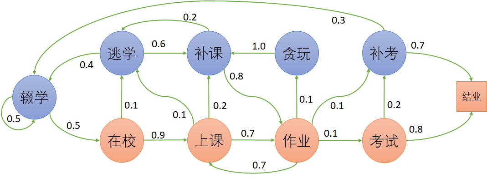

## 5.1 学生学习问题

### 5.1.1 提出问题

图 5.1.1 学生学习问题

在本章中的问题是这样的：

相信读者都经历过幸（痛）福（苦）的学生时代，有些优秀的同学，会顺利地度过上学、上课、作业、考试、结业等过程，而一些不爱学习的同学，就会经历逃学、补课、贪玩、补考，甚至居家的过程。

优秀的同学，总会得到老师家长的夸奖，而不爱学习的同学，经常会受到批评甚至责骂，所以有人觉得幸福，有人觉得痛苦。

如何对以上问题建立马尔可夫过程模型呢？然后又如何鼓励智能体（模拟人们的青少年时代）去努力学习呢？

### 5.1.2 建立模型

图 5.1.2 是笔者根据自己的理解建立的模型，各位读者可能有不同的建模方法，因为这个学生学习问题不是一个严格的学术问题，所以答案可能多种多样，只要能讲出道理，或者没有严重的不合理即可。

图 5.1.2 学生学习问题的状态转移概率图

图 5.1.2 的模型解释请看表 5.1.1，包括：状态、描述、下游状态转移概率三列。

表 5.1.1 学生学习问题模型解释

|状态|代码|描述|下游状态转移概率|
|-|-|-|-|
|居家|CX|辍学、休学、退学、学龄前 等等不在校受教育的状态。| 0.5：概率会继续居家； 0.5：去上学。|
|在校|ZX|在学校接受教育。|0.9：去上课； 0.1：逃学。|
|逃学|TX|本来该在学校但是不在。|0.6：逃学回来后需要补课； 0.4：持续逃学，变成了居家。|
|上课|SK|是一个要多次经历的状态。|0.7：上完课后去完成课后作业； 0.2：没听懂找老师或者同学补课； 0.1：上课过程中逃学。|
|补课|BK|上课没听懂，找同学或者老师补课。|0.8：补课结束后要去完成作业； 0.2：补课不认真，接着逃学。|
|作业|ZY|完成课后作业。|0.7：回到第二天的上课状态； 0.1：贪玩，不写作业； 0.1：到了期中期末考试阶段； 0.1：错过考试，直接补考。|
|贪玩|TW|放学后贪玩，不写作业。|0.8：需要补课； 0.2：逃学。|
|考试|KS|期中或者期末考试。|0.8：及格，毕业； 0.2：不及格，需要补考。|
|补考|BS|考试不及格需要补考。|0.7：可以通过； 0.3：补考不及格，肄业。|
|毕业|BY|结束本学期的学习。|1.0：结束学业。|
|肄业|YY|成绩不合格结束。|1.0：结束学业。|
|结束|End|终止状态。|不再转移。|

### 5.1.3 从模型形成过程

在第 4 章中我们学习过，醉汉（智能体）通过自己的随机游走，形成了一个回家的过程，在本章中，可以把一个学生看作是智能体，让他/她在图 5.1.2 的模型中按照转移概率“体验人生”，这样就可以形成过程。

#### 终止状态（End State）

首先我们提出一个概念：有**终止状态**的马尔可夫链。

- 在租车问题中，车辆不断地在四个门店中按一定概率随机出现，状态虽然不太少，但实际**没有尽头**（除非车辆损坏更换或者公司倒闭）。

- 在醉汉回家问题中，在每个时刻 $t$，只有左右两个状态可以选择（当然也可原地发呆），但是也从理论证明了醉汉最终是可以到家的，并且到家后不再出来（到达吸收状态），是一个有**终止状态**的过程。

在本章中，我们假设一个学期的期末就是终止状态。一旦到达终止状态，就不再转移出去。

#### 分幕（Episode）

由于终止状态的存在（图 5.1.2 中的“结业”状态），可以引入一个新的强化学习中的重要概念：**分幕**（Episode）。比如：

- 在醉汉回家问题中，醉汉到家了，整个过程叫做一幕；第二天该醉汉又喝醉了，再次到家后，又叫做一幕。
- 在学生学习问题中，经过了一个学期的努力，终于结业了，叫做一幕。
- 一局射击游戏中，每打中一个敌人，不叫作一幕，把所有敌人消灭才叫做一幕。
- 一盘棋中，最终双方分出输赢或者打平，叫做一幕。
- 打桥牌中，每个人出完手中的最后一张牌，桌面上有 13 墩牌，叫做一幕。
- 一个扫地机器人，完成当天任务回到充电状态，叫做一幕；如果在打扫过程中电量过低，不得不暂时回到充电状态，不叫作完成一幕。

#### 采样（Sampling）

在图 5.1.2 中，可以根据不同的学生在一个学期中的经历，获得不同的到达终点路径，比如：
- 学生甲

  居家 - 在校 - 上课 - 作业 - 考试 - 毕业 - 结束。

- 学生乙

  居家 - 在校 - 上课 - 补课 - 作业 - 考试 - 毕业 - 结束。

- 学生丙

  居家 - 在校 - 上课 - 作业 - 贪玩 - 补课 - 作业 - 考试 - 毕业 - 结束。

- 学生丁

  居家 - 在校 - 逃学 - 补课 - 作业 - 考试 - 补考 - 肄业 - 结束。

  ......

上述的过程叫做**采样**（Sampling）。对于大多数学生来说，经历的都是第一个路径，而有极少的学生走的其它几个路径。

根据转移概率，经过采样后到达终点，得到一幕状态序列。没有到达终点的状态序列不叫作完整的状态序列，也不叫做一幕，但是这些序列片段仍然有研究价值。

另外，读者可能注意到在上述采样的例子中，都是从“居家”开始的，似乎有一个隐含的开始状态。在某些问题中，我们指定一些状态为开始状态，原因是：

- 一是为了符合实际问题的逻辑需要，比如本例中，学生时代一般都是从不在校的状态开始的（学龄前）。
- 二是为了不过分简化问题的难度。比如一个迷宫，如果不指定开始状态，而是从快到出口的一个位置作为起始位置，将会大大降低问题的难度。
