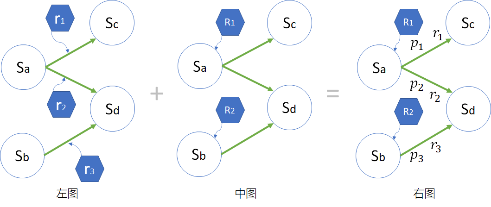
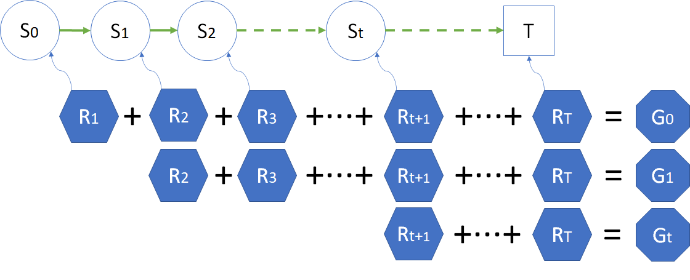

## 5.2 奖励和收益

### 5.2.1 奖励（Reward）

#### 奖励值的设定

上过学的读者都会知道：学习成绩好，老师会在全班同学面前表扬，家长也会要什么给什么；相反，成绩不好，老师就会经常批评，家长也会被经常叫到学校来谈话，很没有面子。

更具体地，我们看一看一些负面的影响：

- 辍学，家长不给你好脸子看，是一种精神惩罚；
- 逃学，可能会在社会上学坏；
- 补课，耽误别人和自己的时间；
- 贪玩，该做的作业没有做；
- 补考，需要提前结束假期返校补考。

正面的影响会是：

- 在校，首先可以保证人身安全（校园凌霸毕竟是极少发生）；
- 上课，学到知识，课堂提问还可以得学分；
- 作业，巩固学到的知识，在作业本上会有老师给的得分；
- 考试，检验学到的知识，在试卷上会有得分；
- 结业，进入假期状态好好娱乐一下。

笔者至今还记得小学时代，不经意地从课桌里拿出以往考试的七张试卷，被同学们发现是 7 个鲜红的 100 分，甚是自豪，那也是一种奖励形式。

其实以上这些只是一种主观感受上的奖励，或者叫精神奖励，但是它可影响到以后的工作状态，能拿多少薪水，那就是真金白银的奖励了。

**奖励**，有的文献中叫做**收益**，在本书中我们混用这两种称呼。

在强化学习中，智能体的目标被形式化表征为一种特殊信号，称为奖励/收益，它通过环境传递给智能体。在每个时刻，收益都是一个单一标量数值。使用奖励信号来形式化目标是强化学习最显著的特征之一。

具体到学生学习问题，我们需要给每个状态一个具体的奖励值，便于强化学习系统做定量的分析、学习。如图 5.2.1 所示。

图 5.2.1 学生学习问题中对状态的奖励

在每个状态的旁边，出现了一个红色的分数，比如 $R=+1$，表示“在校”状态可以得到 1 分的奖励。

读者可以明显地发觉，在橙色的状态中，越往后得分越高；而在蓝色的状态中，也是如此，越往前越负。这是从该状态对人生的影响大小来设定的奖励值。

当然也可以有 0 分的奖励，也叫做奖励，比如“在校”状态，如果普遍认为是“理所应当”的状态，就可以设定 $R=0$。原则是蓝色状态比“在校”状态奖励值低即可，**只与相互之间的大小有关，与正负号无关**。

#### 奖励的定义方式

奖励有两种定义方式，如图 5.2.2 所示。

图 5.2.2 奖励的两种定义方式
（左侧：面向结果的奖励定义；右侧：面向过程的奖励定义）

- 给状态定义奖励 —— **面向结果**
  图 5.2.2 左图中：
  - 从状态 $s_a$ 到达 $s_c$ 后，获得奖励 $R_1$。
  - 从状态 $s_a$ 到达 $s_d$ 后，获得奖励 $R_2$。
  - 从状态 $s_b$ 到达 $s_d$ 后，获得奖励 $R_2$。
  
  可以看到，只要到达 $s_d$，就可以获得 $R_2$，**奖励是给与目标状态的，与源状态无关**。
  
  比如，走一个迷宫，别人找到了最佳路径用了 1 分钟完成任务，而你走了弯路，3 分钟才完成任务，但是裁判并不会因为你花费了更多的力气而给你更多的奖励，**面向结果**。

  此时：
    - 对于 $S_c$ 来说，奖励函数 $R(S_c)=R_1$。
    - 对于 $S_d$ 来说，奖励函数 $R(S_d)=R_2$。

- 给转移定义奖励 —— **面向过程**
  图 5.2.2 右图中：
  - 从状态 $s_a$ 到达 $s_c$ 时，获得奖励 $r_1$。
  - 从状态 $s_a$ 到达 $s_d$ 时，获得奖励 $r_2$。
  - 从状态 $s_b$ 到达 $s_d$ 时，获得奖励 $r_3$。
  
  注意，与前面的定义不同，这个**奖励与源状态和目标状态的组合有关**。
  
  比如，同样是考上清华大学，一个城市里的学生和一个大山里的学生所经历的历程不一样，受教育的环境也不同，应该获得不同的奖励值，**面向过程**。

  此时：
    - 对于 $S_c$ 来说，奖励函数 $R(S_c)=R_1$。
    - 对于 $S_d$ 来说，由于奖励来自两个过程，没有上下文的话，无法确切知道其奖励函数值底是哪个，所以把奖励函数定义为一个数学期望：$R(S_d)=\mathbb E[R_{t+1}|S_t=s_d]$。

  更通用的写法是：

$$
R(s)=\mathbb E[R_{t+1}|S_t=s] \tag{1}
$$

更正式的定义是图 2 右图中的方法，即**面向过程**，用数学语言表述就是 $S \times S' \to R$，意为奖励 $R$ 由 $S,S'$ 共同决定，不同的过程会有不同的奖励。但是在目前阶段为了研究问题方便，我们会使用图 2 左图中的定义，即 $S' \to R$。这两种方式很容易区分，读者只需要看 $R$ 在图中标注的位置就可以了。

有没有一种方式可以统一这两种定义方式呢？在后面学习贝尔曼方程时，再来具体解释。在那之前，我们一直会用**面向结果**的方式，因为它对初学者来说比较容易理解，计算也简便。

一个完整的奖励过程如图 3 所示。就是在状态转移图中，给每个状态都定义一个奖励值，当到达这个状态时，强化学习过程就会获得相应的奖励值，使得整个过程向着获得最大收益的方向优化和运行。

图 3 马尔科夫奖励过程

很明显，这是用**面向结果**的方式来定义奖励。如果是**面向过程**的话，图 3 的 $S_1$ 状态应该没有奖励值，因为看上去它是**起始**状态，没有任何**过程**可以定义它的奖励。

在图 3 中：
- 到达$S_1$状态时，会得到$R_2$的奖励；
- 到达$S_2$状态时，会得到$R_3$的奖励；
......
- 到达$S_t$状态时，会得到$R_{t+1}$的奖励；
......
- 到达终点 $T$ 时，会得到$R_{T}$的奖励。

这些状态的下标值，只表示前后发生的顺序，即**时刻**，而与状态的序号无关。比如一个状态集中有 4 个状态 $[s_a,s_b,s_c,s_T]$，马尔可夫链的顺序有可能是 $s_a,s_b,s_a,s_c,s_T$，那么有：$S_1=s_a,\ S_2=s_b,\ S_3=s_a,\ S_4=s_c,\ S_5=s_T$。

*注：在本书中使用大写的 $S$ 表示某个时刻的状态，如 $S_1,S_t$，分别表示时刻 1 和时刻 t 的状态。用小写的 $s$ 表示具体问题的状态，如 $s_S,s_N$，表示安全驾驶问题中的 **出发** 状态和 **正常行驶** 状态。那么 $S_3=s_N$* 的含义就是在时刻 t=3 时处于状态 $s_N$。

*注：在本书中使用这种定义方式：整个序列的序号是 $S_1,R_2,S_2,R_3,\cdots,S_t,R_{t+1},\cdots$ 的过程，即 $R$ 的序号是 $S$ 的序号+1。而在有些资料中，用这种定义方式：$S_1,R_1,S_2,R_2,\cdots,S_t,R_{t},\cdots$，需要读者事先注意。*

### 5.2.2 回报（Return/Gain）

如何定义“长期的累积收益”呢？那就是**回报**。

在英文中用 Return（收获）来表示，但是在公式中一般用 G 来表示，所以我们不妨理解为 Gain 这个单词。而且 Return 的首字母与奖励（Reward）的首字母相同，容易混淆。

式 1 就是回报的定义：

$$
G_t = R_{t+1}+R_{t+2}+R_{t+3}+ \cdots +R_{T} \tag{1}
$$

智能体的目标是最大化其收到的总收益，即回报。这意味着需要最大化的**不是当前收益，而是长期的累积收益**。我们所有的“目标”或“目的”都可以归结为：最大化智能体接收到的标量信号累积和的概率期望值。

图 4 奖励与回报

图 4 中展示了 $G_1$ 和 $G_t$ 的计算方式，表示了在同一个马尔可夫过程中的状态 $S_1$ 和 $S_t$ 的回报，同时也告诉读者，在一个完整的序列中，我们可以从任意时刻 $t$ 开始计算 $S_t$ 状态的回报，而忽略前面的数据。

有的读者可能会有疑问：我目前处于 $S_t$ 的位置，根本得不到将来的状态和奖励，我如何计算总的回报呢？

请注意，强化学习和其它机器学习都是一样的，不能预测没有见过的事件。在图 4 中，虽然你目前处于 $S_t$ 位置，但是由于训练样本是完整的，也就是有前人经历过这些过程，已经获得了经验，所以我们才能够把这些经验（完整的一幕数据序列）拿来做训练。这里的“将来”对你来说是未知的，对于有些人来说已经是“过去”。

智能体总是学习如何最大化回报。如果我们想要它为我们做某件事，我们提供奖励的方式必须要使得智能体在最大化回报的同时也实现我们的目标。因此，至关重要的一点就是，我们设立奖励的方式要能真正表明我们的目标。

