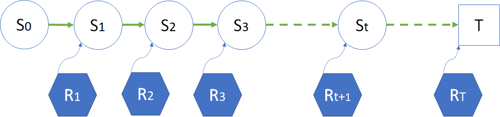

## 5.3 马尔可夫奖励过程

### 5.3.1 马尔可夫奖励过程（Markov Reward Process）

有了回报 G 的定义，自然就会把所有的历史状态和对应的奖励串联起来，形成一个过程，叫做马尔可夫奖励过程 MRP（Markov Reward Process）。

一个完整的奖励过程如图 5.3.1 所示。就是在状态转移图中，给每个状态都定义一个奖励值，当到达这个状态时，强化学习过程就会获得相应的奖励值，使得整个过程向着获得最大收益的方向优化和运行。

图 5.3.1 马尔科夫奖励过程

很明显，这是用**面向结果**的方式来定义奖励。

在图 5.3.1 中：
- 到达$S_1$状态时，会得到$R_1$的奖励；
- 到达$S_2$状态时，会得到$R_2$的奖励；
......
- 到达$S_t$状态时，会得到$R_{t+1}$的奖励；
......
- 到达终点 $T$ 时，会得到$R_{T}$的奖励。

这些状态的下标值，只表示前后发生的顺序，即**时刻**，而与状态的序号无关。比如一个状态集中有 4 个状态 $[s_a,s_b,s_c,s_T]$，马尔可夫链的顺序有可能是 $s_a,s_b,s_a,s_c,s_T$，那么有：$S_1=s_a,\ S_2=s_b,\ S_3=s_a,\ S_4=s_c,\ S_5=s_T$。

在本书中使用大写的 $S$ 表示某个时刻的状态，如 $S_1,S_t$，分别表示时刻 1 和时刻 t 的状态。用小写的 $s$ 表示具体问题的状态实例。

如在图 5.1.2 中，$s_{SK}$，表示学生学习问题中的“上课”状态，那么 $S_3=s_{SK}$ 的含义就是在时刻 t=3 时处于状态 $s_{SK}$。

在本书中使用这种定义方式：整个序列的序号是 $S_0,R_1,S_1,R_2,\cdots,S_t,R_{t+1},\cdots$ 的过程，即 $R$ 的序号是 $S$ 的序号+1。而在有些资料中，用这种定义方式：$S_0,R_0,S_1,R_1,\cdots,S_t,R_{t},\cdots$，需要读者事先注意。

如果用一个文字公式来表示 MRP（Markov Reward Process，马尔可夫奖励过程）：

$$
\begin{aligned}
马尔可夫奖励过程 &= 马尔可夫链 + 奖励函数
\\
MRP &= Markov Chain + Reward
\end{aligned}
$$

所以，得到一个马尔科夫奖励过程需要条件和过程是：
1. 有模型图（含状态转移）；
2. 有奖励（目前可以是面向结果的奖励，即，到达某个状态后可以得到相应的奖励值）；
3. 有采样，这样才可以串联起**状态**和**奖励**，以便获得完整的 MRP：$S_0,R_1,S_1,R_2,\cdots$ 过程；
4. 得到奖励后，把它们相加，就可以得到回报 $G$，而 $G$ 是后面要学习的所有算法的基础。

与马尔可夫过程的二元组 $\langle S,P \rangle$ 相比，马尔可夫奖励过程是一个元组的数据序列：$\langle S,P,R \rangle$，分别表示状态 $S$、转移概率 $P$、奖励 $R$。但是 $P$ 只体现在采样过程中，而不存在于采样结果中。

下面我们结合模型、状态、终止状态、奖励、采样、回报的定义，来经历一下马尔科夫奖励过程。为了方便起见，把图 5.2.1 拷贝过来随时查阅。

由图 5.2.1 学生学习问题中对状态的奖励

在图 5.1.2 中，可以根据不同的学生在一个学期中的经历，获得不同的到达终点路径。我们以“居家- 在校 - 上课 - 补课 - 作业 - 考试 - 补考 - 结业。”为例，解释完整过程：

0. $S_0=$ “居家（学龄前）”。虽然在图 5.2.1 中的“居家”状态旁边标有 $R=-5$ 的奖励值，但是根据定义，作为 $S_0$ 状态，它是没有奖励值的，只有从别的状态转移到“居家”状态时，$R=-5$ 才会生效。
1. $S_1=$ “在校”。此时可以得到 $R_1=+1$ 的奖励，即 $R_1=+1$，但是这个 $R_1$ 在马尔可夫过程中要写在 $S_0,S_1$ 之间，而不是 $S_1$ 之后。
2. $S_2=$ “上课”。此时可以得到 $R_2=+2$ 的奖励。
3. $S_3=$ “补课”。此时可以得到 $R_3=-3$ 的奖励。
4. $S_4=$ “作业”。此时可以得到 $R_4=+3$ 的奖励。
5. $S_5=$ “考试”。此时可以得到 $R_5=+4$ 的奖励。
6. $S_6=$ “补考”。此时可以得到 $R_6=-1$ 的奖励。
7. $S_T=$ “结业”。一般我们把最后一个状态写做 $S_T$，此时可以得到 $R_T=+5$ 的奖励。

所以，马尔科夫奖励过程为：
$$
MRP_1 = \langle 居家,+1,在校,+2,上课,-3,补课,+3,作业,+4,考试,-1,补考,+5,结业 \rangle
$$

再举几个有可能的过程是：

$$
\begin{aligned}
MRP_2 &= \langle 居家,+1,在校,+2,上课,+3,作业,+4,考试,+5,结业 \rangle
\\
MRP_3 &= \langle 居家,+1,在校,-4,逃学,-3,补课,-4,逃学,-3,补课,+3,作业+4,考试,-1,补考,+5,结业 \rangle
\\
MRP_4 &= \langle 居家,+1,在校,+2,上课,+3,作业,-4,贪玩,-3,补课,+3,作业,+4,考试,+5,结业\rangle
\end{aligned}
$$

得到完整的采样序列后，就可以计算回报值，列在表 5.3.1 中。

表 5.3.1 不同的 MRP 的回报值计算

|MRP|回报值计算|
|-|-|
|$MPR_1$|$G_0=1+2-3+3+4-1+5=11$|
|$MPR_2$|$G_0=1+2+3+4+5=15$|
|$MPR_3$|$G_0=1-4-3-4-3+3+4-1+5=-2$|
|$MPR_4$|$G_0=1+2+3-4-3+3+4+5=11$|

读者可能会有疑问：为什么表 5.3.1 中都是以“在家”状态为起点 $S_0$，计算 $G_0$ 的回报值，但是有不同的结果？这是因为采样不同，路径不同，造成的回报值不同，这种情况是正常的。

### 5.3.2 折扣因子 $\gamma$

如果把**回报**定义为**奖励**的简单相加的话，整个学习框架就会失去一些“灵动”，没有可以调节收益信号大小的“开关”，甚至带来如图 5.2.6 所示的无限循环怪圈。

如何避免这个问题呢？

这里要引入一个**折扣因子**（简称**折扣**，discount factor）的概念，通常用 $\gamma$ 符号来表示，其取值范围是 [0,1]。具体定义是：

$$
\begin{aligned}
G_t &= R_{t+1}+\gamma R_{t+2}+\gamma^2 R_{t+3}+ \cdots +\gamma^{T-t-1} R_{T} 
\\
&= \sum_{k=0}^{T-t-1} \gamma^k R_{t+1+k}
\\
&=R_{t+1}+\gamma (R_{t+2}+\gamma R_{t+3}+ \cdots +\gamma^{T-t-2} R_{T})
\\
&=R_{t+1}+ \gamma G_{t+1}, \qquad (0 \le \gamma \le 1)
\end{aligned}
\tag{5.3.1}
$$

式（5.3.1）有一个有趣的现象，可以递归地用下一个时刻的回报来定义当前时刻的回报，这一点在我们后面的算法研究上非常有帮助。

引入折扣因子的原因如下：

- 有些马尔可夫过程是带环的，需要避免这种无穷的奖励。当过程很长时，$\gamma^t$ 的值越来越小，那么后面的奖励乘以 $\gamma^t$ 的值就可以忽略不计了。
- 因为模型不完备的原因，对未来的评估不一定是准确的。因为这种不确定性，所以对未来的预估增加一个折扣。
- 对于某些行业问题，如金融领域，希望尽可能快地得到奖励，而不是在未来得到奖励。可以想象为通货膨胀的例子，现在是 10 块钱和十年后的 10 块钱，是会相差好几倍的，所以把十年后的 10 块钱折扣为当前的 2 块钱比较合适。
- 人们总是希望得到即时的奖励，比如一个孩子在成长过程中，对于任何行为随时给与奖励或者惩罚，可以给出强烈的学习信号。智能体也是如此，比如在下围棋时，如果每走一步都有奖励的话，训练会变得容易很多。
- 当关注即时奖励时，可以设置系数 $\gamma=0$。
- 当想要未来获得的奖励跟当前获得的奖励是一样的，可以设为 $\gamma=1$。

折扣作为一种超参存在于强化学习系统中，不同的折扣值会带来智能体的不同的学习效果。

表 5.3.2 带折扣的回报计算

|MRP|回报值计算，$\gamma=0.5$（精确到两位小数）|
|-|-|
|$MPR_1$|$\footnotesize{G_0=1+0.5*2-0.5^2*3+0.5^3*3+0.5^4*4-0.5^5*1+0.5^6*5=1.92}$|
|$MPR_2$|$\footnotesize{G_0=1+0.5*2+0.5^2*3+0.5^3*4+0.5^4*5=3.56}$|
|$MPR_3$|$\footnotesize{G_0=1-0.5*4-0.5^2*3-0.5^3*4-0.5^4*3+0.5^5*3+0.5^6*4-0.5^7*1+0.5^8*5=-2.27}$|
|$MPR_4$|$\footnotesize{G_0=1+0.5*2+0.5^2*3-0.5^3*4-0.5^4*3+0.5^5*3+0.5^6*4+0.5^7*5=2.26}$|

如果折扣为 0，则回报值 $G$ 就等于当前状态的奖励值 $R$，即 $G_t = R_{t+1}$，那么表 5.3.2 中的值都为 $G_0=1$。

在式 5.2.1 中，如果 $T$ 很大的话，$G$ 就会变得很大，从而无法计算。但由于限定 $\gamma \le 1$，所以回报值还是不会大得离谱的。特别地，如果奖励值为常数 +1，则回报是：

$$
G_t = \sum_{k=0}^{\infty} \gamma^k = \frac{1}{1-\gamma} \tag{5.3.2}
$$

所以，马尔可夫奖励过程的元组的数据序列中增加了折扣因子：$\langle S,P,R,\gamma\rangle$。但是 $P,\gamma$ 只体现在采样过程中，而不存在于采样结果中。

