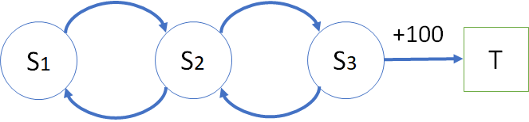
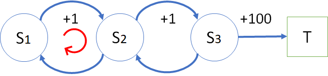

## 5.3 马尔可夫奖励过程（Markov Reward Process）

用一个文字公式来表示 MRP（Markov Reward Process，马尔可夫奖励过程）：

$$
马尔可夫奖励过程 = 马尔可夫链 + 奖励函数
$$

根据上面学习的知识，再结合上面的状态转移图 1，我们给每个状态定义一个奖励，如图 5 所示。

图 5 安全驾驶问题的马尔可夫奖励过程

显然，这里使用了图 2 中的第一种方式（**面向结果**）来定义奖励，举例来说，无论状态“发生事故”是通过什么路径到达的（可以通过“拨打手机”到达，也可以通过“路口闯灯”到达），都可以得到 -12 的奖励（实际上是惩罚）。

奖励函数（值）的设计一般是人工设定的，是通过分析目标问题的实际科学意义或者人文意义来决定的。比如，在图 5 中，通过交通规则的学习，给出制定奖励的过程如下：

1. 按交规，超速行驶扣 3 分，开车打电话扣 3 分，闯红灯扣 6 分。
2. 发生事故扣 1 分。有的读者会有疑问：为什么出了事故只扣 1 分？因为在交规中，出了事故后，不会因为事故本身（比如有无人员伤亡，车俩的损失程度等）而扣分，而是分析出事故的原因，对原因扣分。所以，这里只是象征性地扣 1 分。至于后期要做经济赔偿等等，是属于附带的责任，而不是奖励或惩罚。
3. 礼让行人在交规上不加分，但是在强化学习系统中可以加 1 分，以鼓励自动驾驶的智能体强化此状态，保证安全。
4. 正常行驶是一个常见状态，得 0 分；
5. 闹市减速、小区内减速，和礼让行人一样，都给 1 分奖励。
6. 安全抵达给 5 分奖励。之所以给的奖励值很高，是要强化安全驾驶行为/状态，让智能体更倾向于安全驾驶的习惯。
7. 出发和结束都是 0 分。

根据状态转移可以得到一些完整的分幕采样，从而可以计算出每个采样的回报值，列在表 1 中。

表 1 分幕采样和回报计算

||分幕采样序列|回报值计算|
|-|-|-|
|1|S - N - L - G - E|$G_{S}=0+0+1+5+0=6$|
|2|S - N - P - N - L - G - E|$G_{S}=0+0+1+0+1+5+0=7$|
|3|S - N - R - C - E|$G_{S}=0+0-6-1+0=-7$|
|4|S - X - R - N - R - C - E|$G_{S}=0-3-6+0-6-1+0=-16$|

读者可能会产生怀疑：为什么表 1 中都是同样计算 $G_{S}$ 的回报值，但是有不同的结果？这是因为采样不同，路径不同，造成的回报值不同，这种情况是正常的。

与马尔可夫过程的二元组 $<S,P>$ 相比，马尔可夫奖励过程是一个元组的数据序列：$<S,P,R>$，分别表示状态 $S$、转移概率 $P$、奖励 $R$。

### 6 奖励函数的设计

我们学习了什么是奖励，但是奖励函数是什么？

函数这个词可以很宽泛，不一定非得用数学表达式才能表达出来，也可以不是连续的。比如图 5，，我们可以给状态 $[S_1, S_2, S3]$ 定义奖励为 $[0, -1, 5]$，这也可以称为“函数”，所以它只是一种“定义”方法。

而在一些复杂的问题中，确实需要奖励函数，而非简单的奖励值，最常见的有：
- 稀疏奖励
- 形式化奖励
- 分布奖励
- 系数变化奖励
- 中间难度起点奖励

在此不再深入讨论，有兴趣的读者请自行学习相关概念。

但在实际工程中，奖励设计是一个深不见底的大坑，里面埋葬了很多工程师的大量时间。在大部分情况下，我们都要小心翼翼地不断调整参数，还要防止智能体投机取巧找到刷分技巧。听说的一些比较有意思的案例有：
- 用强化学习模仿作画，结果智能体学会了白色大笔一挥，然后用小黑笔不断在画布上戳，以此刷分；
- 还有用强化学习让机器人学习叠积木，把奖励设计在积木的底面高度上，结果机器人学会了把积木直接打翻成底面向上，就拿到了奖励。

而在实际工程中，即使没有出现智能体刷分这样糟糕的情形，为了算法的效果，我们也需要对环境的奖励不断调优。特别是有关战斗AI，或者某种游戏的胜负，这样的场景中如果只用最终的结果作为奖励很可能太过于稀疏，导致最终训练效果不佳。而如果你为了解决这个问题开始针对具体问题设计奖励函数了，那么你接下来的很长一段时间都将在“训练-微调奖励函数-训练-微调奖励函数”这样的循环中度过。

举一个简单的例子来初步理解奖励函数设计的原则，在后面讲到价值函数时，我们会做进一步的讨论。

图 6 奖励函数的设计

如图 6 中所示，状态 $S_1,S_2,S_3$ 在相互转移时都没有奖励，或者奖励同为 0，只有到状态 $T$ 时才有 +100 的奖励。为了加快学习进度，把奖励函数做如图 7 的修改。

图 7 奖励函数的修改

图 7 的学习难度降低了，速度也加快了，但是学习过程很可能陷入 $S_1,S_2,S_1,S_2,\cdots$的循环中（如红色箭头所示），循环了 100+ 次以后，可以得到比 +100 更高的回报，根本不用到达目标状态 $S_T$，这就违背了我们的初衷。

特别地，奖励信号并不是传授智能体如何实现目标的先验知识。例如：
- 国际象棋智能体只有当最终获胜时才能获得奖励，而并非达到某个子目标，比如吃掉对方的子或者控制中心区域。如果实现这些子目标也能得到奖励，那么智能体可能会找到某种即使绕开最终目的也能实现这些子目标的方式。例如它可能会找到一种以输掉比赛为代价的方式来吃对方的子。奖励信号只能用来传达什么是你想要实现的目标，而不是如何实现这个目标。
- 在狼吃羊的强化学习训练中，如果给狼的每一步移动的奖励设置为 -1，吃到羊的奖励为 +100，那么狼需要在 100 步之内吃到羊才会有正的回报，而在大多数情况下是负值。所以狼可能会选择一开始就一头撞死在障碍物上，以获得 0 分的回报。

如何避免上述情况呢？我们可以做如图 8 的修改，使得智能体在两个状态间循环时只能得到回报为 0 的过程。

图 8 最终的奖励函数

### 7 折扣因子 $\gamma$

如果把**回报**定义为**奖励**的简单相加的话，整个学习框架就会失去一些“灵动”，没有可以调节收益信号大小的“开关”，甚至带来如图 7 所示的灾难。

如何避免这个问题呢？

这里要引入一个**折扣因子**（简称**折扣**，discount factor）的概念，通常用 $\gamma$ 符号来表示，其取值范围是 [0,1]。具体定义是：

$$
\begin{aligned}
G_t &= R_{t+1}+\gamma R_{t+2}+\gamma^2 R_{t+3}+ \cdots +\gamma^{T-t-1} R_{T} 
\\
&= \sum_{k=0}^{T-t-1} \gamma^k R_{t+1+k}
\\
&=R_{t+1}+\gamma (R_{t+2}+\gamma R_{t+3}+ \cdots +\gamma^{T-t-2} R_{T})
\\
&=R_{t+1}+ \gamma G_{t+1}, \qquad (0 \le \gamma \le 1)
\end{aligned}
\tag{2}
$$

式 2 有一个有趣的现象，可以递归地用下一个时刻的回报来定义当前时刻的回报，这一点在我们后面的算法研究上非常有帮助。

引入折扣因子的原因如下：

- 有些马尔可夫过程是带环的，需要避免这种无穷的奖励。当过程很长时，$\gamma^t$ 的值越来越小，那么后面的奖励乘以 $\gamma^t$ 的值就可以忽略不计了。
- 因为模型不完备的原因，对未来的评估不一定是准确的。因为这种不确定性，所以对未来的预估增加一个折扣。
- 对于某些行业问题，如金融领域，希望尽可能快地得到奖励，而不是在未来得到奖励。可以想象为通货膨胀的例子，现在是10块钱和十年后的10块钱，是会相差好几倍的。
- 人们总是希望得到即时的奖励，比如一个孩子在成长过程中，对于任何行为随时给与奖励或者惩罚，可以给出强烈的学习信号，智能体也是如此。
- 当关注即时奖励时，可以设置系数 $\gamma=0$。
- 当想要未来获得的奖励跟当前获得的奖励是一样的，可以设为 $\gamma=1$。

折扣作为一种超参存在于强化学习系统中，不同的折扣值会带来智能体的不同的学习效果。

表 2 带折扣的分幕采样和回报计算

||分幕采样序列|回报值计算（$\gamma=0.9$）|
|-|-|-|
|1|Start - N - L - G - End|$G_{S}=0+0.9*0+0.9^2*1+0.9^3*10+0.9^4*0=8.1$|
|2|Start - N - P - N - L - G - End|$G_{S}=0+0.9*0+0.9^2*1+0.9^3*0+0.9^4*1+0.9^5*10+0.9^6*0=7.371$|
|3|Start - N - R - C - End|$G_{S}=0+0.9*0-0.9^2*6-0.9^3*12+0.9^4*0=-13.608$|
|4|Start - X - R - N - R - C - End|$G_{S}=0-0.9*3-0.9^2*6+0.9^3*0-0.9^4*6-0.9^5*12+0.9^6*0=-18.58$|

如果折扣为 0，则回报值 $G$ 就等于当前状态的奖励值 $R$，即 $G_t = R_{t+1}$。

在式 2 中，如果 $T$ 很大的话，似乎 $G$ 就会变得很大，从而无法计算。但由于限定 $\gamma \le 1$，所以回报值还是不会大得离谱的。特别低，如果奖励值为常数 +1，则回报是：

$$
G_t = \sum_k^{\infty} \gamma^k = \frac{1}{1-\gamma} \tag{3}
$$

所以，马尔可夫奖励过程的元组的数据序列中增加了折扣因子：$<S,P,R,\gamma>$。

### 参考资料

- David Silver RL course
- Sutton 强化学习
- 奖励函数设计 https://cloud.tencent.com/developer/article/1693899