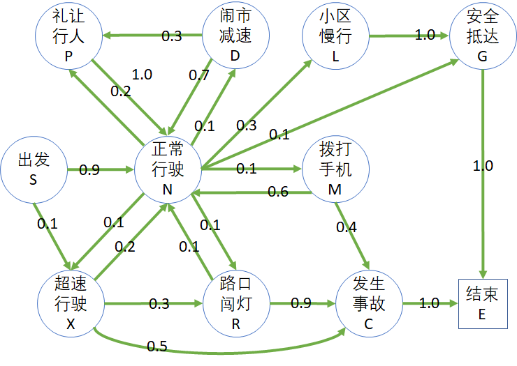
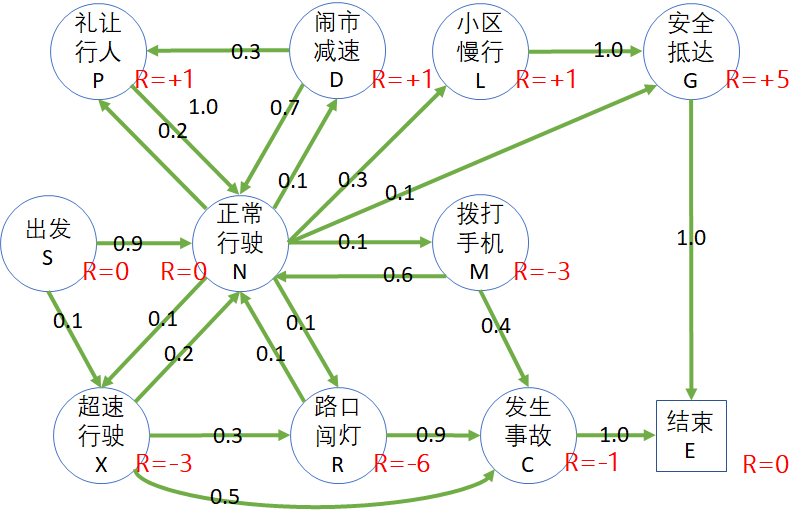

# 第 6 章 从奖励过程到价值估算

## 6.1 安全驾驶问题

### 6.1.1 提出问题

每个年轻人都有驾驶机动车飞驰的梦想。想当年中国还没有大规模汽车产业的时候，摩托车成为年轻人追逐的目标。经过十几年以后，听说第一批拥有摩托车驾驶证的人，已经死伤大半，所剩无几了。于是新一代年轻人开始追逐汽车梦了。

但现实是残酷的：

- 2021年中国机动车保有量4亿辆，同比增长6.2%；中国汽车保有量为3亿辆，同比增长7.5%，机动车趋于饱和状态。
- 2021年中国机动车驾驶人数为4.81亿人，同比增长5.5%；中国新领证驾驶人数为2750万人，同比增长23.3%。
- 但中国道路交通事故万车死亡人数逐年下降，其中2020年中国道路交通万车死亡人数为1.66人，同比下降7.8%。

凡在行车过程中，因违反规章制度，违反劳动纪律，技术设备不良及其他原因，在行车中造成人员伤亡、设备损害、经济损失、影响正常行车或危及行车安全的，均构成行车事故。

行车事故（即道路交通事故）的发生，是由于车辆一驾驶员一道路交通环境之间关系的不协调、不稳定状态造成的。因此，车辆、驾驶员和道路交通环境是引起行车事故的三大基本因素。

<center>


图 6.1.1 安全驾驶问题
</center>

所以，本章的问题是，如果一个新手或者一个智能体，要通过强化学习来训练其安全驾驶意识，应该如何建模？

### 6.1.2 建立模型

以一个司机驾车上路为例，我们可根据日常驾驶经验以及在路上遇到的各种路况来建立一个模型。图 6.1.2 是一个有关安全驾驶的模型。当然，读者也可以根据自己的理解建立不同的模型。

<center>



图 6.1.2 安全驾驶问题的状态转移概率图
</center>

表 6.1.1 状态的缩写字母及其说明

| 状态        | 简要说明                                                     | 概率：状态转移                                               |
| ----------- | ------------------------------------------------------------ | ------------------------------------------------------------ |
| S：出发     | 起点。                                                       | 0.9：心情较好，进入正常行驶状态；<br>0.1：可能有急事而超速行驶。 |
| N：正常行驶 | 正常行驶是标准状态，<br>但是由于各种车况、路况、<br>人况，可能会转移到其它<br>几个状态。 | 0.1：由于路况好或与他人斗气飙车<br>0.1：开车时心不在焉，在路口闯灯<br>0.2：斑马线前礼让行人；<br> 0.1：开到闹市时减速行驶；<br>0.1：遇到急事而拨打手机；<br>  0.4：进入目的地区域后减速行驶。 |
| M：拨打手机 | 指的是开车过程中拨打手机，<br>属于危险行为。                 | 0.6：结束通话返回正常行驶；<br>0.4：发生事故。               |
| P：礼让行人 | 在斑马线礼让行人。                                           | 1.0：回到正常行驶状态。                                      |
| L：小区慢行 | 进入小区车速降到5公里以下。                                  | 1.0：安全抵达终点。                                          |
| G：安全抵达 | 安全抵达                                                     | 1.0：进入结束状态。                                          |
| D：闹市减速 | 在闹市低速行驶，注意来往<br>行人车俩，禁止鸣笛。             | 0.3：遇到行人较多，礼让；<br> 0.7：回到正常行驶状态。        |
| X：超速行驶 | 属于危险驾驶行为，<br>“十次事故九次快”。                     | 0.2：回到正常行驶；<br>0.3：闯红灯；<br>0.5：发生事故。      |
| R：路口闯灯 |                                                              | 0.9：出事故；<br>0.1：侥幸回到正常行驶。                     |
| C：发生事故 | 车撞车、车撞人、车撞物。                                     | 1.0：结束，不能再达到目的地。                                |
| E：结束     | 终止状态。                                                   | 进入此状态后将不再进行转移。                                 |

有的读者可能会较真儿：进入小区慢行状态后，就一定可以安全抵达吗？当然，在小区里可能会有很多突发情况，比如老人儿童突然横穿道路等等。在此我们就不再细化这个模型了。

在上一章的学生学习问题中，“结业”是终止状态；在图 6.1.2 中，“安全抵达”和“发生事故”都可以做为终止状态，为什么还有一个单独的“结束”状态呢？这涉及到了本章后面要学习的状态价值函数的一些规则，请读者继续阅读。

### 6.1.3 奖励机制

通过学习交通法规以及上路实践，读者会知道：

- 如果超速行驶，会面临至少 3 分的扣分；
- 如果闯红灯，扣 6 分；
- 如果驾驶时拨打手机，扣 3 分
  ......

在自动驾驶中，如何让智能体也“懂得”这些交通规则呢？

一个办法是制定一些规则，以代码的形式硬编到逻辑中；另外一个办法是通过学习，知道什么可以做，什么不可以做，但是要给与每个状态以奖励或惩罚。

奖励函数（值）的设计一般是人工设定的，是通过分析目标问题的实际科学意义或者人文意义来决定的。比如，在图 6.1.2 中，通过交通规则的学习，给出制定奖励的过程如下：

1. 按交规，以下行为要扣分：

   - 超速行驶扣 3 分；
   - 开车打电话扣 3 分；
   - 闯红灯扣 6 分；

2. 发生事故扣 1 分。

   有的读者会有疑问：为什么出了事故只扣 1 分？因为在交规中，出了事故后，不会因为事故本身（比如有无人员伤亡，车俩的损失程度等）而扣分，而是分析出事故的原因，对原因扣分。所以，这里只是象征性地扣 1 分。至于后期要做经济赔偿等等，是属于附带的责任，而不是奖励或惩罚。

3. 以下行为在交规上不加分，但是在强化学习系统中可以加分，以鼓励自动驾驶的智能体强化此状态，保证安全：

   - 礼让行人加 1 分；
   - 闹市减速加 1 分；
   - 小区内低速行驶加 1 分；

4. 正常行驶 0 分。

   正常行驶是一个常见状态，得 0 分；

5. 安全抵达给 5 分奖励。

   之所以给的奖励值很高，是要强化安全驾驶行为/状态，让智能体更倾向于安全驾驶的习惯。

6. 出发和结束都是 0 分。

根据上面学习的知识，再结合基本模型，我们给每个状态定义的奖励值如图 6.1.3 所示。

<center>



图 6.1.3 安全驾驶问题的奖励
</center>

显然，这里使用了**面向结果**的方式来定义奖励，举例来说：

- 给“出发”状态 0 分，

- 状态“发生事故”可以通过“拨打手机”到达，也可以通过“路口闯灯”到达，都得到 -1 的奖励（实际上是惩罚）。

- 特别设立“结束”状态为终止状态，以避免有两个“终止”状态（安全抵达，发生事故），并且给与该终止状态 0 分的奖励。

### 6.1.4 分幕采样

在图 6.1.3 中，可以根据不同的司机上路的经历（状态转移），获得不同的到达终点路径，比如：

- S:出发 - N:正常行驶 - L:小区慢行 - G:安全抵达 - E:结束。
- S:出发 - N:正常行驶 - P:礼让行人 - N:正常行驶 - L:小区慢行 - G:安全抵达 - E:结束。
- S:出发 - N:正常行驶 - R:路口闯灯 - C:发生事故 - E:结束。
- S:出发 - X:超速行驶 - R:路口闯灯 - N:正常行驶 - R:路口闯灯 - C:发生事故 - E:结束。
  ......

然后列出马尔科夫奖励过程的数据序列，如表 6.1.2。

表 6.1.2 采样和奖励过程

| 序号 | 状态序列                  | 奖励过程                                      |
| :--: | ------------------------- | --------------------------------------------- |
|  1   | S - N - L - G - E         | $s_S,0,s_N,0,s_L,1,s_G,5,s_E$                 |
|  2   | S - N - P - N - L - G - E | $s_S,0,s_N,0,s_P,1,s_N,0,s_L,1,s_G,5,s_E$     |
|  3   | S - N - R - C - E         | $s_S,0,s_N,0,s_R,-6,s_C,-1,s_E$               |
|  4   | S - X - R - N - R - C - E | $s_S,0,s_X,-3,s_R,-6,s_N,0,s_R,-3,s_C,-1,s_E$ |

表 6.1.2 中奖励过程一列中的 $s$ 表示状态，数字表示奖励值。从而可以计算出每个采样的回报值，列在表 6.1.3 中。

表 6.1.3 分幕采样和回报计算

| 序号 | 数据序列                                      | 回报值计算              |
| :--: | --------------------------------------------- | ----------------------- |
|  1   | $s_S,0,s_N,0,s_L,1,s_G,5,s_E$                 | $G_{S}=0+0+1+5=6$       |
|  2   | $s_S,0,s_N,0,s_P,1,s_N,0,s_L,1,s_G,5,s_E$     | $G_{S}=0+0+1+0+1+5=7$   |
|  3   | $s_S,0,s_N,0,s_R,-6,s_C,-1,s_E$               | $G_{S}=0+0-6-1=-7$      |
|  4   | $s_S,0,s_X,-3,s_R,-6,s_N,0,s_R,-3,s_C,-1,s_E$ | $G_{S}=0-3-6+0-3-1=-13$ |

本来应该写成 $G_0$，但是我们都是以“S:出发”状态为 $S_0$ 的，所以直接写成 $G_S$，以明确表示是状态 S 的回报值。

### 6.1.4 折扣

表 6.1.4 是表 6.1.3 的拷贝，只不过设置折扣值为 0.9。

表 6.1.4 带折扣的回报计算

|序号|回报值计算（$\gamma=0.9$）|
|:-:|-|-|
|1|$\footnotesize{G_{S}=0+0.9\cdot0+0.9^2\cdot1+0.9^3\cdot5=4.455}$|
|2|$\footnotesize{G_{S}=0+0.9\cdot0+0.9^2\cdot1+0.9^3\cdot0+0.9^4\cdot1+0.9^5\cdot5=4.42}$|
|3|$\footnotesize{G_{S}=0+0.9\cdot0-0.9^2\cdot6-0.9^3\cdot1=-5.59}$|
|4|$\footnotesize{G_{S}=0-0.9\cdot3-0.9^2\cdot6+0.9^3\cdot0-0.9^4\cdot3-0.9^5*1=-10.12}$|

OK！到此为止，我们已经复习好了上一章学习的内容，并应用于一个新的场景中。下面我们要一起来学习状态价值函数。


## 6.2 状态价值函数（State-Value Function）

### 6.2.1 状态价值函数的定义

上个小节中，我们建立了模型，给其中的各个状态以奖励值，并通过采样生成马尔科夫奖励过程，计算了“出发”状态的回报值。读者可能会会产生几个问题：

1. 有了回报值后，怎么使用？
2. 不同的分幕数据序列产生了不同的回报，如何处理？
3. 折扣值 $\gamma$ 设置成什么数值才算合理？
4. 这个奖励值可以真正表示这个状态的好坏吗？
5. 具有相同奖励值的状态，哪个更好？


先回忆一下回报的定义：

$$
G_t = R_{t+1}+\gamma R_{t+2}+\gamma^2 R_{t+3}+ \cdots +\gamma^{T-t-1} R_{T} 
\tag{由式5.3.1}
$$


读者可以看到，这里面只定义了时间步 $t$ 和奖励 $R$，没有与状态挂钩。考虑到以上几个疑问，定义状态价值函数如下：

$$
\begin{aligned}
v(s) &= \mathbb E [G_t | S_t = s]
\\
&=\mathbb E [ R_{t+1}+\gamma R_{t+2}+\gamma^2 R_{t+3}+ \gamma^3 R_{t+4}+ \cdots]
\end{aligned}
\tag{6.2.1}
$$

关于状态价值函数，我们用小写的 $v(s)$ 来表示状态 $s$ 的价值函数 $v$，用大写的 $V$ 表示所有状态的价值函数值数组，所以有时候会把状态价值函数叫做 V 函数。

式（6.2.1）的含义是，状态价值函数 $v$ 是以状态 $s$ 为起点的回报 $G$ 的**数学期望**。时刻 $t$ 在这里只起到一个按顺序串联状态 $S$ 从而得到奖励 $R$ 的作用。


### 6.2.2 数学期望

简单地回忆一下**数学期望**的概念。

一个正常的六面的骰子，投出去后可以得到 $\{1,2,3,4,5,6\}$ 六种结果，而且概率相等，那么这个骰子的期望值是 $\mathbb E\big[正常的骰子\big] = (1+2+3+4+5+6)/6=3.5$。哈哈，读者可能会发现 3.5 这个数子，骰子无法投出来，所以它只是一种定义。

但是，一个不正常的骰子，比如 $[4,5,6]$ 出现的概率 $p$ 都是 $\frac{1}{5}$，而 $[1,2,3]$ 出现的概率 $p$ 都是 $\frac{2}{15}$，那么它的数学期望是：

$$
\begin{aligned}
\mathbb E\big[不正常的骰子\big]&=\sum_{i=1}^6 p_i v_i
\\
&= \frac{2}{15} \times 1+\frac{2}{15} \times 2+\frac{2}{15} \times 3+\frac{1}{5} \times 4+\frac{1}{5} \times 5+\frac{1}{5} \times 6
\\
&=3.8
\end{aligned}
$$

观察式（6.2.1），在定义状态价值函数时，数学期望对于 $G_t$ 没有定义权重或概率，所以每一幕的 $G_t$ 值都是同等价值的，因此，状态价值函数就是若干幕的 $G_t$ 的算术平均值。

以表 6.1.2 中的数据为例：$v(Start)=[6+7+(-7)+(-13)]/4=-1.75$

以表 6.1.3 中的数据为例：$v(Start)=[4.455+4.42-5.59-10.12)]/4=-6.835$

但是，只有 4 幕采样并不能准确计算出真正的期望值，正如投骰子，投 6 次的平均值也基本不可能是 3.5，因此，我们需要更多的采样。一般情况下，采样的数量级应该是成千上万的，才会得到一个比较稳定的数学期望值。

### 6.2.3 获得更多的采样 - 大数定律

如何获得更多的采样来模拟成千上万的司机的不同驾驶行为呢？

大数定律（Law of Large Numbers），或者称为大数定理、大数法则等等，是概率论与数理统计学的基本定理之一，是关于随机变量序列的算术平均值向常数收敛的一系列极限定理的统称。其表达方式主要有：切比雪夫（Cheby—shev）大数法则、贝努利（Bernoulli）大数法则和泊松（Poisson）大数法法则。

- 弱大数定律

条件：

1. 设 $\{X_1,X_2,\cdots\}$ 为独立同分布（相互之间没关系，但是都遵从与同一个分布）的随机序列，并且 $\mathbb E[X_i] = \mu$ 存在（即 $X_i$ 的期望值为 $\mu$），以及 $var(X_i)=\sigma^2$ 存在；

2. 样本序列 $[X_1,X_2,\cdots,X_n]$ 的平均值 $\overline {X}_n=\frac{1}{n}(X_1+X_2+\cdots+X_n)$；

3. 对于任意正数 $\varepsilon$（一般指的是很小的一个正数）；

则有：

$$
\lim_{n \to \infty} \mathbb P\{|\overline {X}_n - \mu|\lt \varepsilon\}= 1
$$

意思是当样本序列的数量 $n$ 越来越大时，其均值收敛到期望值的概率越来越大（趋近于 1）。

- 强大数定律

条件与弱大数定律相同，但表述为：

$$
\mathbb P\{ \lim_{n\to\infty} \overline X_n=\mu\}=1
$$

意思是当样本序列的数量 $n$ 越来越大时，其均值以概率 1 收敛到期望值。

有了大数定律，我们就可以放心地采样，当样本数量足够多时，就会有 $\mathbb E[G_t] \to v(s)$。

我们有了模型，其中包含了状态定义及状态转移概率，而且我们有了奖励函数，并且可以设置折扣值 $\gamma=1.0$ 或小于 1 的数值，这样马尔科夫奖励过程所需要的四要素 $\langle S,P,R,\gamma\rangle$ 就都具备了。接下来的事情就是用代码来模拟司机的行为了，而司机们的行为，在模型的定义下，不外乎就是根据状态转移概率来进行的。

表 6.2.1 中列出了状态转移矩阵，与租车还车问题中的形式相同。

表 6.2.1 状态定义和状态转移概率

<font size=2>

| P: 从$\rightarrow$到 | 出发 | 正常<br>行驶 | 礼让<br>行人 | 闹市<br>减速 | 超速<br>行驶 | 路口<br>闯灯 | 小区<br>减速 | 拨打<br>手机 | 发生<br>事故 | 安全<br>抵达 | 结束 |
| -------------------- | :--: | :----------: | :----------: | :----------: | :----------: | :----------: | :----------: | :----------: | :----------: | :----------: | :--: |
| S：出发              |  -   |     0.9      |      -       |      -       |     0.1      |      -       |      -       |      -       |      -       |      -       |  -   |
| N：正常行驶          |  -   |      -       |     0.2      |     0.1      |     0.1      |     0.1      |     0.3      |     0.1      |      -       |     0.1      |  -   |
| P：礼让行人          |  -   |     1.0      |      -       |      -       |      -       |      -       |      -       |      -       |      -       |      -       |  -   |
| D：闹市减速          |  -   |     0.7      |     0.3      |      -       |      -       |      -       |      -       |      -       |      -       |      -       |  -   |
| X：超速行驶          |  -   |     0.2      |      -       |      -       |      -       |     0.3      |      -       |      -       |     0.5      |      -       |  -   |
| R：路口闯灯          |  -   |     0.1      |      -       |      -       |      -       |      -       |      -       |      -       |     0.9      |      -       |  -   |
| L：小区慢行          |  -   |      -       |      -       |      -       |      -       |      -       |      -       |      -       |      -       |     1.0      |  -   |
| M：拨打手机          |  -   |     0.6      |      -       |      -       |      -       |      -       |      -       |      -       |     0.4      |      -       |  -   |
| C：发生事故          |  -   |      -       |      -       |      -       |      -       |      -       |      -       |      -       |      -       |      -       | 1.0  |
| G：安全抵达          |  -   |      -       |      -       |      -       |      -       |      -       |      -       |      -       |      -       |      -       | 1.0  |
| E：结束              |  -   |      -       |      -       |      -       |      -       |      -       |      -       |      -       |      -       |      -       | 1.0  |
| </font>              |      |              |              |              |              |              |              |              |              |              |      |


## 6.3 估算状态价值函数

### 6.3.1 搭建模型环境

#### 定义状态集

根据表 6.1.1 定义的状态，在代码中用枚举的方式来定义各个状态。

【代码位置：SafetyDrive_DataModel.py】

```Python
# 状态
class States(Enum):
    Start = 0           # S:出发
    Normal = 1          # N:正常行驶
    Pedestrians = 2     # P:礼让行人
    DownSpeed = 3       # D:闹市减速
    ExceedSpeed = 4     # X:超速行驶
    RedLight = 5        # R:路口闯灯
    LowSpeed = 6        # L:小区慢行
    MobilePhone = 7     # M:拨打手机
    Crash = 8           # C:发生事故
    Goal = 9            # G:安全抵达
    End = 10            # E:结束
```

由于本问题中状态比较少，所以可以用枚举方式来定义状态集，name 部分也可以用单个字母（如 S,N,P 等）来表示。

如果状态太多，并且有规律，就可以直接用序号来定义，但是序号应该保证连续，避免程序处理起来过于复杂。

#### 定义奖励函数

奖励函数，在本问题中是直接给到状态上的，所以可以根据状态的顺序，定义一个列表。在此使用一个简单的向量来定义奖励值，按顺序对应到状态上。

```Python
# 奖励向量
# |出发|正常行驶|礼让行人|闹市减速|超速行驶|路口闯灯|小区减速|拨打手机|发生事故|安全抵达|结束|
R = [0,  0,      +1,       +1,     -3,      -6,     +1,     -3,      -1,   +5,    0]
```

当然，如果使用字典形式，代码的可读性更强。比如：

```python
R={
    States.Start: 0,
    States.Noraml: 0,
    States.Pedestrians: 1,
    ......
}
```

#### 定义状态转移矩阵

```Python
# 状态转移概率 from->to
P = np.array(
    [
        [0.0, 0.9, 0.0, 0.0, 0.1, 0.0, 0.0, 0.0, 0.0, 0.0, 0.0],
        [0.0, 0.0, 0.2, 0.1, 0.1, 0.1, 0.3, 0.1, 0.0, 0.1, 0.0],
        [0.0, 1.0, 0.0, 0.0, 0.0, 0.0, 0.0, 0.0, 0.0, 0.0, 0.0],
        [0.0, 0.7, 0.3, 0.0, 0.0, 0.0, 0.0, 0.0, 0.0, 0.0, 0.0],
        [0.0, 0.2, 0.0, 0.0, 0.0, 0.3, 0.0, 0.0, 0.5, 0.0, 0.0],
        [0.0, 0.1, 0.0, 0.0, 0.0, 0.0, 0.0, 0.0, 0.9, 0.0, 0.0],
        [0.0, 0.0, 0.0, 0.0, 0.0, 0.0, 0.0, 0.0, 0.0, 1.0, 0.0],
        [0.0, 0.6, 0.0, 0.0, 0.0, 0.0, 0.0, 0.0, 0.4, 0.0, 0.0],
        [0.0, 0.0, 0.0, 0.0, 0.0, 0.0, 0.0, 0.0, 0.0, 0.0, 1.0],
        [0.0, 0.0, 0.0, 0.0, 0.0, 0.0, 0.0, 0.0, 0.0, 0.0, 1.0],
        [0.0, 0.0, 0.0, 0.0, 0.0, 0.0, 0.0, 0.0, 0.0, 0.0, 1.0]
    ]
)
```

这是完全按照表 6.2.1 来书写的，请读者自己核对一下。首先要确定每行的数值的和为 1.0，其次要确定 "from->to" 坐标位置是否正确。万一搞错的话，会给后面 debug 代码时带来困难。


#### 定义模型

按理说有了上面的状态集、奖励、转移矩阵，就可以开始估算 G 值了。但是定义一个统一的模型，把细节封装成一些标准的交互函数，会让代码可读性好，出错概率低，复用性高，并帮助读者加深对概念的理解。

```Python
class DataModel(object):
    def __init__(self):
        self.P = P                          # 状态转移矩阵
        self.R = R                          # 奖励
        self.S = States                     # 状态集
        self.nS = len(self.S)               # 状态数量
        self.end_states = [self.S.End]      # 终止状态集
    
    # 判断给定状态是否为终止状态
    def is_end(self, s):
        if (s in self.end_states):
            return True
        return False

    # 获得即时奖励，保留此函数可以为将来更复杂的奖励函数做准备
    def get_reward(self, s):
        return self.R[s.value]

    # 根据转移概率前进一步，返回（下一个状态、当前状态的奖励、下个状态是否为终止）
    def step(self, s):
        next_s = np.random.choice(self.S, p=self.P[s.value])
        return next_s, self.get_reward(s), self.is_end(next_s)
```

上面的代码中的注释已经足够丰富了，不再赘述。唯一要提醒的是，我们使用了枚举定义状态，在函数之间传值时都用枚举变量而非具体数值。在函数内部要注意使用 s.value 来做具体索引值。

### 6.3.2 模拟采样并估算状态价值函数

OK! 模型已经建立好了，现在可以开始根据式 1 来估算学生学习模型的状态价值函数了。

#### 算法描述

针对某个状态的价值函数估算。

----

输入：起始状态 $s, Episodes, \gamma$
初始化：$G_{sum} \leftarrow 0$  # 累计多幕的G值以便求平均
多幕 $Episodes$ 循环：
　　当前幕的 $G \leftarrow 0$
　　计数器 $t \leftarrow 0$
　　幕内循环直到终止状态：
　　　　从 $S$ 根据状态转移概率得到 $s',r$ 以及是否终止的标志
　　　　$G \leftarrow G + \gamma^t r$
　　　　$t \leftarrow t+1$
　　　　$s \leftarrow s'$
　　$G_{sum} \leftarrow G_{sum}+G$
$v(s) \leftarrow G_{sum} / Episodes$
输出：$v(s)$

---

#### 算法说明

这个算法有一个很神秘的名字，叫做**蒙特卡洛方法**，专门用于采样，然后估算概率或者数学期望。在后面我们还会更深入地学习其理论知识，读者先记住这个名字就可以。

以表 6.1.2 中的第 1 个采样序列为例，说明算法的执行过程。

<center>


图 6.3.1 采样算法说明
</center>

图 6.3.1 中展示了以 5 个状态组成的序列为例的 $G$ 的计算过程：

1. 起始状态为 $s_S$，得到奖励 $R_1$，保存到 $G$ 中，其中的下标 $G_{[1]}$ 表示第一步；
2. 转移到状态 $s_N$，得到奖励 $R_2$，乘以 $\gamma$ 后与第一步的 $G$ 相加，仍然保存到 $G$ 中，原来的 $G$ 值就被替换掉了；
3. 以此类推，一直到最后的 $s_E$ 状态，得到 $R_T$，与第 $[4]$ 步的 $G$ 相加，终止幕内循环，得到状态 $s_S$ 的一个采样序列的回报值 $G_{S}$；
4. 多次重复上述过程，得到不同的采样序列的 $G_S$ 值，累计；
5. 最后的累计值除以幕数，就可以认为是 $G$ 的数学期望，因而得到状态价值函数值 $v(S)$。

这个算法的特点是使用了最少的变量，在算法过程中，一共只用了 $G_{sum},G,R,t,s,s'$ 等几个变量，没有使用任何列表或数组来存储历史数据，而且完全是按照回报的定义以及状态价值函数的定义来实现的，便于读者理解。

#### 算法实现

【代码位置：Algo_Sampling.py】

```Python
# 多次采样获得回报 G 的数学期望，即状态价值函数 v(start_state)
def Sampling(dataModel, start_state, episodes, gamma):
    G_sum = 0  # 定义最终的返回值，G 的平均数
    # 循环多幕
    for episode in tqdm.trange(episodes):
        s = start_state # 把给定的起始状态作为当前状态
        G = 0           # 设置本幕的初始值 G=0
        t = 0           # 步数计数器
        is_end = False
        while not is_end:
            s_next, reward, is_end = dataModel.step(s)
            G += math.pow(gamma, t) * reward
            t += 1
            s = s_next
        # end while
        G_sum += G # 先暂时不估算平均值，而是简单地累加
    # end for
    v = G_sum / episodes   # 最后再一次性估算平均值，避免增加估算开销
    return v
```

上述代码可以通过多次循环（由 Episodes）指定，估算指定状态 start_state 的多个回报值 $G$ 的平均值，作为理论上的数学期望值。

这段代码单独作为一个模块，可以被任何其它应用场景调用，需要关于 dataModel 的接口匹配即可。

那么 Episodes 的具体数值是多少合适呢？后面再解释。

#### 主过程调用

【代码位置：SafetyDrive_1_Sampling.py】

```Python
if __name__=="__main__":
    start = time.time()
    episodes = 10000        # 估算 10000 次的试验的均值作为数学期望值
    gammas = [0, 0.9, 1]    # 折扣因子
    dataModel = data.DataModel()    
    for gamma in gammas:
        V = {}
        for s in dataModel.S:   # 遍历每个状态
            v = Sampling(dataModel, s, episodes, gamma) # 采样估算价值函数
            V[s] = v            # 保存到字典中
        # 打印输出
        print("gamma =", gamma)
        for key, value in V.items():
            print(str.format("{0}:\t{1}", key.name, value))
```

读者可以自己运行 SafetyDrive_1_Sampling.py 以得到输出，为了方便阅读，我们把输出结果整理在表 6.3.1 中。

#### 估算结果

表 6.3.1 各个状态的奖励值和价值函数（分幕采样数为 1000）

| 状态                 |    R | $\gamma = 0$ | $\gamma = 0.9$ | $\gamma = 1$ |
| -------------------- | ---: | -----------: | -------------: | -----------: |
| 出发 Start           |    0 |          0.0 |           0.48 |         1.08 |
| 正常行驶 Normal      |    0 |          0.0 |           1.26 |         1.71 |
| 礼让行人 Pedestrians |   +1 |          1.0 |           2.15 |         2.89 |
| 闹市减速 DownSpeed   |   +1 |          1.0 |           2.31 |         3.02 |
| 超速行驶 ExceedSpeed |   -3 |         -3.0 |          -5.02 |        -5.17 |
| 路口闯灯 RedLight    |   -6 |         -6.0 |          -6.69 |        -6.71 |
| 小区慢行 LowSpeed    |   +1 |          1.0 |           5.50 |         6.00 |
| 拨打电话 MobilePhone |   -3 |         -3.0 |          -2.64 |        -2.34 |
| 发生事故 Crash       |   -1 |         -1.0 |          -1.00 |        -1.00 |
| 安全抵达 Goal        |   +5 |          5.0 |           5.00 |         5.00 |
| 终止 End             |    0 |          0.0 |           0.00 |         0.00 |

表 6.3.1 集中展示了不同折扣值下的各个状态的价值函数值。从中我们可以得到一些基本的概念：

- $\gamma=0$ 时，状态价值函数值等于奖励值 $R$。
- $\gamma=0.9$ 时的值比 $\gamma=1$ 时要低一些，因为折扣的原因。但是靠近终点的几个状态值没有减少，是因为 $t=0$，所以 $\gamma^t=1$，相当于没有折扣。
- 处于安全驾驶状态的价值函数都是正数，相反，处于危险驾驶状态的价值函数都是负数，这符合我们的预期。
- “出发”状态的价值函数为正，但是是其中最小的一个正数值，这是因为处于该状态时，不知道后面会发生什么情况。理想状态下，应该调整奖励函数，使得该状态的价值函数趋近于 0。不过目前这个值在折扣 0.9 下可以接受。
- **终止状态的状态价值函数定义为 0**，因为后续不会再有任何过程和奖励发生。

#### 多进程并发估算

在本问题的状态集中一共有 11 个状态。根据上面的算法，首先要指定起始状态，可以遍历状态集中的每个状态作为起始状态。在估算两个状态的状态函数值时互相不干扰，所以，可以考虑使用多进程来并发估算每个指定的起始状态。

读者可以根据自己的估算机的 CPU 数量修改 processes=4 的值，但是一定要注意，这个值如果大于你的估算机的 CPU 数量，程序运行速度反而会变慢，因为要在进程间不断切换。

在单进程时，代码 SafetyDrive_1_Sampling.py 在笔者的笔记本上运行了 49 秒；而多进程代码 SafetyDrive_2_MultiProcess.py 运行了 26 秒，快了一倍。这样我们可以把 Episodes 的数量增加一些，以提高采样估算的准确性。

表 6.3.2 各个状态的奖励值和价值函数（分幕采样数为 5000）

| 状态                 |    R | $\gamma = 0$ | $\gamma = 0.9$ | $\gamma = 1$ |
| -------------------- | ---: | -----------: | -------------: | -----------: |
| 出发 Start           |    0 |          0.0 |           0.56 |         1.02 |
| 正常行驶 Normal      |    0 |          0.0 |           1.21 |         1.69 |
| 礼让行人 Pedestrians |   +1 |          1.0 |           2.11 |         2.67 |
| 闹市减速 DownSpeed   |   +1 |          1.0 |           2.32 |         3.06 |
| 超速行驶 ExceedSpeed |   -3 |         -3.0 |          -5.04 |        -5.19 |
| 路口闯灯 RedLight    |   -6 |         -6.0 |          -6.69 |        -6.71 |
| 小区慢行 LowSpeed    |   +1 |          1.0 |           5.50 |         6.00 |
| 拨打电话 MobilePhone |   -3 |         -3.0 |          -2.69 |        -2.37 |
| 发生事故 Crash       |   -1 |         -1.0 |          -1.00 |        -1.00 |
| 安全抵达 Goal        |   +5 |          5.0 |           5.00 |         5.00 |
| 终止 End             |    0 |          0.0 |           0.00 |         0.00 |

表 6.3.2 的数据与表 6.3.1 的比较，相差不多，说明 1000 次分幕采样的数据已经比较准确了。

### 问题与讨论

1. 为什么在不同的折扣因子情况下，“安全抵达”的状态的值永远是 10.0，而“终止” 状态的值永远是 0.0 ？
2. 假设 $Episodes=10000,\gamma=0.9$，多次估算状态值，哪个状态的方差最大？为什么？
3. 为什么 *安全抵达* 的状态值和奖励值相等，而其它的具有正奖励值的状态值都比奖励值大？
4. 使用 RMSE 为计算差的方法，衡量分幕数为500,700,900,1000 时，两组相邻数据的误差，以确定理想的分幕数。


## 6.4 状态奖励方式与价值函数

有了价值函数后，可以对一个强化学习问题模型中的状态有了可以衡量的标准，更深刻地理解算法原理。但是读者可以明显地感觉到，奖励函数的设计对状态价值函数有着根本性的影响，一个合理的奖励函数设计可以让问题尽快收敛得到答案。在本节和下节中，我们一起做一些比较简单的试验，来深刻体会奖励函数与状态价值函数的关系。

安全驾驶问题有些复杂，状态转移太多，所以我们用前面的醉汉回家再简化一下来做研究。

状态定义如下，简化为一共 6 个状态：

```Python
# 状态定义
class States(Enum):
    Start = 0
    A = 1
    B = 2
    C = 3
    D = 4
    Home = 5    # 终止状态
```

状态转移矩阵定义如下：

```python
# 状态转移矩阵
P = np.array(
    [  # S    A    B    C    D    Home     
        [0.5, 0.5, 0,   0,   0,   0,  ], # S
        [0.5, 0,   0.5, 0,   0,   0,  ], # A
        [0,   0.5, 0,   0.5, 0,   0,  ], # B
        [0,   0,   0.5, 0,   0.5, 0,  ], # C
        [0,   0,   0,   0.5, 0,   0.5,], # D
        [0,   0,   0,   0,   0,   1.0,]  # Home(End)
])
```

左右各有 0.5 的概率随机游走。

按 5.2 节中所讲述的，奖励函数可以有两种设计方式：

- 状态奖励方式
- 过程奖励方式

通过对这两种方式的比较，读者可以得到一些基本的概念，为后面的贝尔曼方程的学习做好准备。

除了方式的不同外，在一种方式中，如果奖励值不同，对状态价值函数也会有影响，所以在每种方式中，我们会设计三组不同的方式来做比较。

### 6.4.1 状态奖励方式一

所谓状态奖励，就是根据应用场景的需要，直接给状态设定奖励，$S \to R$，而不管其过程如何。具体设置为：

**只有到达家的状态奖励设置为 +1，其它状态的奖励都是 0。**

如图 6.4.1 所示。

<center>


图 6.4.1 状态奖励方式一
</center>

状态奖励值定义如下：

【代码位置：RandomWalker_1_R1.py】

```Python
# 状态奖励值
#     S, A, B, C, D, H
R1 = [0, 0, 0, 0, 0, 1]
```

这种方式试图达到的效果是：一旦智能体跌跌撞撞地达到了一次家的状态，可以得到 +1 的奖励，它就会尝到甜头并牢记，在后面的学习中会不断强化这种记忆和过程。

下面仍然使用“采样求平均”的办法来计算每个状态的价值函数，即：

- 从 Start 状态开始，做 1000 次采样，得到每次采样的 G 值，然后求平均值；
- 从 A 出发（假设醉汉目前在 A 的位置），做 1000 次采样，得到每次采样的 G 值，然后求平均值；
  ......
- Home 状态属于终止状态，**按照定义，终止状态的价值为 0**，因为没有状态转移发生，也就没有奖励发生。

采样 1000 次求平均后的各个状态的价值函数如表 6.4.1 所示。

表 6.4.1 状态奖励方式一的结果

| 状态$\to$    | Start | A    | B    | C    | D    | Home |
| ------------ | ----- | ---- | ---- | ---- | ---- | ---- |
| $\gamma=1$   | 0.0   | 0.0  | 0.0  | 0.0  | 0.0  | 1.0  |
| $\gamma=0.9$ | 0.0   | 0.0  | 0.0  | 0.0  | 0.0  | 1.0  |

结果解读：

- 各个状态全是 0，没有价值差异，不可用。

- 只有终止状态为 1，这与 **终止状态的价值为 0** 的定义不符。

比较图 6.4.1 和图 6.1.3，后者在终止状态上的 $R=0$，而前者在终止状态 Home 上的 $R=1$，所以造成了 $v(s_{Home})=1$ 的错误结果。如果我们修改代码，令在终止状态时返回 r = 0，将会带来灾难性的后果：所有状态的价值函数值都会为 0。那么整个模型将会变得没有意义。

所以，这种奖励的定义值是错误的，而并非算法或模型的错误。在下面的试验中，尝试修改一下奖励函数的设计，看看是否可以避免上述问题。

### 6.4.2 状态奖励方式二

既然第一种奖励值设计有错误，我们把所有的奖励值都减 1，会不会是同样的效果呢？如图 2 所示。

<center>


图 6.4.2  状态奖励方式二
</center>

在代码中设置奖励值如下：

【代码位置：RandomWalker_1_R2.py】

```python
# 状态奖励值
#     S,   A,  B,  C,  D, H
#R1 = [0,  0,  0,  0,  0, 1]
R2 = [-1, -1, -1, -1, -1, 0]
```

有的读者可能会问：D 状态距离终点最近，为什么它的奖励值不会比别的状态高呢？

- 首先，到了 D 状态后，也不是一定可以到家，虽然可以到家的概率较其它状态要大。智能体（醉汉）到达 D 后，只知道得到了 -1 的奖励，并不知道下一步向右走就可以到家，读者也不要做这种假设，否则就是替智能体来学习了。

- 其次，不要把状态奖励值和状态价值混为一谈。奖励值没有累加效应，但是状态价值具有全局观察能力。

同样是运行 1000 幕，得到结果如表 6.4.2。

表 6.4.2  状态奖励方式二的结果

| 状态$\to$    | Start | A    | B    | C    | D    | Home |
| ------------ | ----- | ---- | ---- | ---- | ---- | ---- |
| $\gamma=1$   | -30   | -28  | -24  | -18  | -10  | 0.0  |
| $\gamma=0.9$ | -8.4  | -8.1 | -7.3 | -5.8 | -3.7 | 0.0  |

结果解读：

1. 终止状态 Home 的价值函数值为 0

   这是我们希望看到的，也符合定义。

2. 其它的状态函数值

   - 情况发生了变化，状态价值并不是在第一种情况的基础上普遍减 1，而是发生了显著的变化，这是因为 $R=-1$ 的不断累加使得远离终止状态的值变得非常小。

   - 起始状态 S 的状态值为什么不是 -1-1-1-1-1=-5 而是 -30 ？因为根据式 1，状态函数值是 $G$ 的期望，$G$ 代表了状态变化序列，由于在每个状态上都有 0.5 的概率返回上一个状态，所以状态变化序列（即马尔科夫链）会变得非常曲折，就会让 -1 这个值累加得越来越大。

   - 还有一个细节，当 $\gamma=1$ 时，各个状态价值的差值依次以 $-2,-4,-6,-8,-10$ 递减，原因不明（后面的章节再来研究）。

   - 从左向右，各个状态的价值依次增加，即距离 Home 越近的状态价值越高，这符合应用场景的期望。

3. 折扣的作用

   当有折扣存在时，这种负值累加效果会减弱很多，所以当 $\gamma=0.9$ 时，各个状态的函数值的差别会变得比较平缓。

4. 正负数

   表中的状态价值都是负数，这合理吗？作为一个价值体系来说，正值和负值其实没有绝对意义，相互之间的差值才能够真正体现状态价值。所以只要越靠近终点的状态价值越高，就可以了。

所以，大家在阅读强化学习的资料时，通常会看到如情况二这种奖励方式。这也是笔者开始学习时感到不解的地方，经过试验后，想必大家应该明白了。

另外，还有一个方法可以避免终止状态不为 0 的问题，就是像安全驾驶问题中那样建模：虽然“安全到家”和“发生事故”已经可以看作是终止状态了，但是可以人为地定义一个独立的“终止”状态，令“安全到家”和“发生事故”都以 100% 的概率转移到该终止状态。

### 6.4.3 状态奖励方式三

既然方式一的模型容易造成奖励值设置不合理，索性像安全驾驶问题的模型一样，我们给最后加一个单独的终止状态，形成图 6.4.3 所示的模型。

<center>


图 6.4.3  状态奖励方式三
</center>

然后把 Home 状态的奖励值设置为 1，其它为 0，看看价值函数计算结果如何。

首先新增加一个 End 状态：

```python
# 状态定义
class States(Enum):
    ......
    Home = 5
    End = 6    # 终止状态
```

然后修改状态转移矩阵，增加从 Home 到 End 的转移：

```python
# 状态转移矩阵
P = np.array(
    [  # S    A    B    C    D    Home End    
        [0.5, 0.5, 0,   0,   0,   0,    0], # S
        [0.5, 0,   0.5, 0,   0,   0,    0], # A
        [0,   0.5, 0,   0.5, 0,   0,    0], # B
        [0,   0,   0.5, 0,   0.5, 0,    0], # C
        [0,   0,   0,   0.5, 0,   0.5,  0], # D
        [0,   0,   0,   0,   0,   0,    1], # Home
        [0,   0,   0,   0,   0,   0,    1]  # End
])
```

设置奖励值：

```python
#  Start, A, B, C, D, H, End
R1 = [0,  0, 0, 0, 0, 1, 0]
```

由于终止状态改变，所以要在 DataModel 的初始化函数中修改 self.end_states 的值，不再是以前的 Home 状态，而是新增加的 End 状态。

```python
class DataModel(object):
    def __init__(self, R):
        ......
        self.end_states = [self.S.End]      # 终止状态集
```

主函数部分没有变化，运行 1000 次采样后，得到结果如表 6.4.3。

表 6.4.3 状态奖励方式三结果

| 状态$\to$    | Start | A    | B    | C    | D    | Home | End  |
| ------------ | ----- | ---- | ---- | ---- | ---- | ---- | ---- |
| $\gamma=1$   | 1.0   | 1.0  | 1.0  | 1.0  | 1.0  | 1.0  | 0.0  |
| $\gamma=0.9$ | 0.15  | 0.19 | 0.27 | 0.41 | 0.63 | 1.0  | 0.0  |

- 当 $\gamma=1$ 时，不太理想，因为前面所有的状态值都是 -1，不能区分出好坏。
- 当 $\gamma=0.9$ 时，可以区分出状态好坏了。

接下来，读者可以自己修改奖励值进行更多的试验，如思考与练习中的题目 1。

### 思考与练习

1. 如果修改图 6.4.3 的奖励设置为 R = [-1, -1, -1, -1, -1, 0, 0]。看看状态价值函数的计算结果如何？（折扣为 1 和 0.9 时。）

2. 根据第 5 章学生学习问题的模型和奖励函数设计，计算其状态价值函数。


## 6.5 过程奖励方式与价值函数

下面我们研究 5.2 节所讲的过程奖励方式对价值函数的影响。状态定义和状态转移概率与 6.4 节中相同，只不过奖励不是定义在某个状态上的，而是定义在状态转移过程中的，即 $S \times S' \to r$。

### 6.5.1 过程奖励方式一

假设每走一步都有 0 的奖励，相当于没有任何奖励或惩罚，只有最后一步到家的过程才给 1 的奖励，模型与图 6.4.1 一致，但是奖励定义在过程上，如图 6.5.1 所示。

<center>


图 6.5.1 过程奖励方式一
</center>

给过程定义奖励，需要用到双重字典如下：

【代码位置：RandomWalker_2_R1.py】

```Python
# 过程奖励值
R1 = {
    States.Start: {States.Start: 0,    States.A:0},     # S->S:0, S->A:0
    States.A:     {States.Start:0,     States.B:0},     # A->S:0, A->B:0
    States.B:     {States.A:0,         States.C:0},     # B->A:0, B->C:0
    States.C:     {States.B:0,         States.D:0},     # C->B:0, C->D:0
    States.D:     {States.C:0,         States.Home:1},  # D->C:0, D->H:1
    States.Home:  {States.Home:0},                      # H->H:0
}
```

用第一行数据举例，含义是：从 Start 状态开始，到 Start 状态的奖励为 0，到 A 状态的奖励为 0。这样设计的好处是可以用 $O(1)$ 的效率，根据前后两个状态获得奖励值。当然用表格的方法可以达到同样的效果，只不过是一个稀疏表格，手工创建不方便。

数据结构变化了，代码逻辑当然需要变化。获得奖励的代码需要两个参数：

【代码位置：RandomWalker_2_DataModel.py】

```Python
    def get_reward(self, s, s_next):
        return self.R[s][s_next]
```

模型中的 step() 函数相应地变为：

```python
    # 根据转移概率前进一步，返回（下一个状态、即时奖励、是否为终止）
    def step(self, s):
        s_next = np.random.choice(self.S, p=self.P[s.value])
        return s_next, self.get_reward(s, s_next), self.is_end(s_next)
```

与 RandomWalker_1_DataModel.py 相比，self.get_reward() 的调用发生了变化，需要输入两个参数。但是，采用这样的封装方式，采样算法部分的代码不需要任何改动，依然使用 Algo_Sampling.py 中的函数。

同样是运行 1000 幕后得到结果如表 6.5.1。

表 6.5.1 过程奖励方式一的结果

|状态$\to$|Start|A|B|C|D|Home|
|-|-|-|-|-|-|-|-|
|$\gamma=1$|1.0|1.0|1.0|1.0|1.0|0.0|
|$\gamma=0.9$|0.17|0.22|0.29|0.44|0.72|0.0|

结果解读：

1. 当 $\gamma=1$ 时
   - Home 状态是 0，符合规定了。
   - 为什么前几个状态的价值都是 1 呢？因为根据公式 $v(s)=\mathbb E[R_{t+1}+ R_{t+2} + \cdots + R_T]$，最后的一个 $R_T=1$ 可以作用于前面的所有状态。这样的话，就无法区分状态价值好坏。即，对智能体来说，无法确定性地获得从左向右移动的知识。

2. 当 $\gamma=0.9$ 时
   在这种奖励函数设计的条件下，令折扣值小于 1，是一个好的办法，可以区分状态价值的好坏。

### 6.5.2 过程奖励方式二

换一种思路，假设每走一步都有 -1 的“奖励”，实际上是惩罚（相当于是很多游戏设计中的体力值降低），意在鼓励智能体（一个还没有接受强化训练的智能体和醉汉没什么区别）尽快找到回家的路，最后累计的负值越小越好。如图 6.5.2 所示。

<center>


图 6.5.2 过程奖励方式二
</center>

过程奖励值定义如下：

```Python
# 过程奖励值
R2 = {
    States.Start: {States.Start:-1,    States.A:-1},    # S->S:-1, S->A:-1
    States.A:     {States.Start:-1,    States.B:-1},
    States.B:     {States.A:-1,        States.C:-1},
    States.C:     {States.B:-1,        States.D:-1},
    States.D:     {States.C:-1,        States.Home:0},  # D->C:-1, D->H:0
    States.Home:  {States.End:0},
}
```

采样 1000 次，运行结果如表 6.5.2。

表 6.5.2 过程奖励方式二的结果

| 状态$\to$    | S     | A     | B     | C     | D    | H    |
| ------------ | ----- | ----- | ----- | ----- | ---- | ---- |
| $\gamma=1$   | -29.2 | -27.1 | -23.3 | -17.2 | -9.3 | 0.0  |
| $\gamma=0.9$ | -8.2  | -7.8  | -7.0  | -5.4  | -3.0 | 0.0  |

结果解读：

1. 即使在折扣为 1 （无折扣）的情况下，也可以区分出状态值的好坏了。这是因为 -1 奖励值从后向前累积的结果。如果奖励是 0 的话，则没有这种累积效果。
2. 使用折扣会使得数据比较平滑，并不会破坏原有的大小关系。
3. 经过试验可知，无论最后从 D 到 Home 的过程奖励是多少，都可以保持 Home 的状态价值为 0，符合规范。所以，这种奖励方式比较合理，但是面向状态的奖励方式比较简单易操作，但是要注意合理的奖励设置。

### 6.5.3 对于过程奖励的理解

我们把图 5.2.2 拷贝过来便于阅读。

<center>


由图 5.2.2 奖励的两种定义方式
（左图：转移过程奖励；中图：当前状态奖励；右图：两种方式的转换）
</center>

同时，由式（5.2.1），解释了图 5.2.2 中三种方式的关系。

$$
\begin{aligned}
R_1 &= p_1 \cdot r_1 + p_2 \cdot r_2
\\
R_2 &= p_3 \cdot r_3 = r_3
\end{aligned}
\tag{由5.2.1}
$$

在 6.4 节中，我们试验了中图的方式；在 6.5 节中，试验了左图的方式。现在来验证一下式（5.2.1）的实际含义。

在 6.5.1 节和 6.5.2 节中的定义，都与图 5.2.2 右图中的 $s_a \to s_c,s_d$ 的转移相同，所以根据式（5.2.1）可以把相应的过程奖励做一个转换。

我们先看图 6.5.1 中的 $S$ 状态，它有两个转移方向：$S \to S,A$，对应的 $p_1=p_2=0.5，r_1=r_2=0$，所以有：

$$
R(s_{Start})=p_1 \cdot r_1 + p_2 \cdot r_2=0.5\cdot0+0.5\cdot0=0
$$

哦，好无聊，都是 0，所以我们看看不是 0 的状态 $D$，它的两个转移方向是 $D \to C,Home$，对应的 $p_1=p_2=0.5, r_1=0,r_2=1$，所以有：

$$
R(s_{D})=p_1 \cdot r_1 + p_2 \cdot r_2=0.5\cdot0+0.5\cdot1=0.5
$$

因此，可以把过程奖励 R1 转化为：

【代码位置：RandomWalker_2_R3R4.py】

```python
#     S, A, B, C, D,   Home
R3 = [0, 0, 0, 0, 0.5, 0]
```

同理，过程奖励 R2 转化为：

```python
R4 = [
    0.5*(-1)+0.5*(-1),  # S->S,A = -1
    0.5*(-1)+0.5*(-1),  # A->S,B = -1
    0.5*(-1)+0.5*(-1),  # B->A,C = -1
    0.5*(-1)+0.5*(-1),  # C->B,D = -1
    0.5*(-1)+0.5*0,     # D->C,H = -0.5
    1.0*0               # H->H   = 0
]
```

上面代码中没有直接写出奖励值，而是用式（5.2.1）计算出来的，便于读者理解。以状态 D 为例，到下游状态 C 的 $p_1=0.5,r_1=-1$，到下游状态 H 的 $p_1=0.5,r_1=0$，所以有：

$$
R(s_{D})=p_1 \cdot r_1 + p_2 \cdot r_2=0.5\cdot(-1)+0.5\cdot0=-0.5
$$

最后运行代码 RandomWalker_2_R3R4.py，得到以下结果：

```
奖励值: [0, 0, 0, 0, 0.5, 0]
----------
gamma = 1
状态价值函数计算结果(数组) : [1.01  0.98 1.02  1.02  0.99 0.]
----------
gamma = 0.9
状态价值函数计算结果(数组) : [0.18 0.22 0.29 0.46 0.71 0.]
==============================
奖励值: [-1.0, -1.0, -1.0, -1.0, -0.5, 0.0]
----------
gamma = 1
状态价值函数计算结果(数组) : [-29.15 -26.61 -23.74 -17.27  -8.99   0.]
----------
gamma = 0.9
状态价值函数计算结果(数组) : [-8.31 -7.9  -6.97 -5.58 -3.02  0.]
```

以上结果和表 6.5.1，表 6.5.2 的结果基本一致，有差异的原因是采样估算不精确的问题。

### 6.5.4 小结

通过 6.4,6.5 两个小节的试验，我们学习了奖励函数对状态价值函数的影响。可以得出一些基本的结论：

1. 采用状态奖励的方式比较方便，一般是使用给每一步移动都有惩罚值的方式。要保证终止状态的价值函数值为 0。
2. 过程奖励方式更合理，可以精细控制。过程奖励方式可以转化为状态奖励方式。
3. 最好使用 $\gamma < 1$ 的折扣值。

### 思考与练习

1. 在过程奖励的奖励中，第二种情况，如果把最后的 R=0 换成 R=5 或者更大的数，会对结果有影响吗？
2. 
