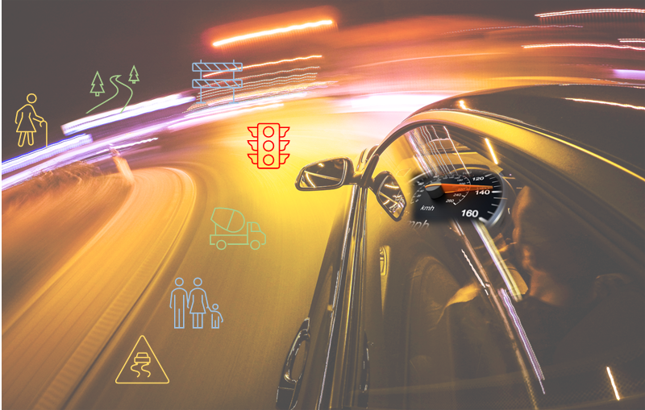
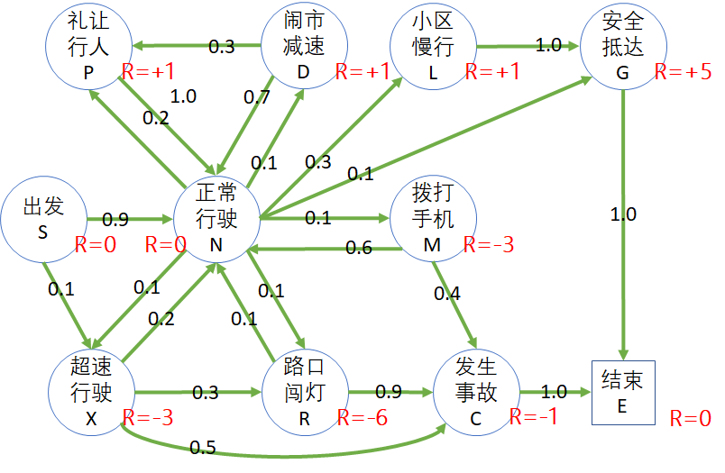

## 6.1 安全驾驶问题

### 6.1.1 提出问题

每个年轻人都有驾驶机动车飞驰的梦想。想当年中国还没有大规模汽车产业的时候，摩托车成为年轻人追逐的目标。经过十几年以后，听说第一批拥有摩托车驾驶证的人，已经死伤大半，所剩无几了。于是新一代年轻人开始追逐汽车梦了。

但现实是残酷的：

- 2021年中国机动车保有量4亿辆，同比增长6.2%；中国汽车保有量为3亿辆，同比增长7.5%，机动车趋于饱和状态。
- 2021年中国机动车驾驶人数为4.81亿人，同比增长5.5%；中国新领证驾驶人数为2750万人，同比增长23.3%。
- 但中国道路交通事故万车死亡人数逐年下降，其中2020年中国道路交通万车死亡人数为1.66人，同比下降7.8%。

凡在行车过程中，因违反规章制度，违反劳动纪律，技术设备不良及其他原因，在行车中造成人员伤亡、设备损害、经济损失、影响正常行车或危及行车安全的，均构成行车事故。

行车事故（即道路交通事故）的发生，是由于车辆一驾驶员一道路交通环境之间关系的不协调、不稳定状态造成的。因此，车辆、驾驶员和道路交通环境是引起行车事故的三大基本因素。

图 6.1.1 安全驾驶问题

所以，本章的问题是，如果一个新手或者一个智能体，要通过强化学习来训练其安全驾驶意识，应该如何建模？

### 6.1.2 建立模型

以一个司机驾车上路为例，我们可根据日常驾驶经验以及在路上遇到的各种路况来建立一个模型。图 6.1.2 是一个有关安全驾驶的模型。当然，读者也可以根据自己的理解建立不同的模型。

图 6.1.2 安全驾驶问题的状态转移概率图

表 6.1.1 状态的缩写字母及其说明

|状态|简要说明|概率：状态转移|
|-|-|-|
|S：出发|起点。|0.9：心情较好，进入正常行驶状态； 0.1：可能有急事而超速行驶。|
|N：正常行驶|正常行驶是标准状态， 但是由于各种车况、路况、 人况，可能会转移到其它 几个状态。|0.1：由于路况好或与他人斗气飙车 0.1：开车时心不在焉，在路口闯灯 0.2：斑马线前礼让行人；  0.1：开到闹市时减速行驶； 0.1：遇到急事而拨打手机；   0.4：进入目的地区域后减速行驶。|
|M：拨打手机|指的是开车过程中拨打手机， 属于危险行为。|0.6：结束通话返回正常行驶； 0.4：发生事故。|
|P：礼让行人|在斑马线礼让行人。|1.0：回到正常行驶状态。||
|L：小区慢行|进入小区车速降到5公里以下。|1.0：安全抵达终点。|
|G：安全抵达|安全抵达|1.0：进入结束状态。|
|D：闹市减速|在闹市低速行驶，注意来往 行人车俩，禁止鸣笛。|0.3：遇到行人较多，礼让；  0.7：回到正常行驶状态。|
|X：超速行驶|属于危险驾驶行为， “十次事故九次快”。|0.2：回到正常行驶； 0.3：闯红灯； 0.5：发生事故。|
|R：路口闯灯||0.9：出事故； 0.1：侥幸回到正常行驶。|
|C：发生事故|车撞车、车撞人、车撞物。|1.0：结束，不能再达到目的地。|
|E：结束|终止状态。|进入此状态后将不再进行转移。||

有的读者可能会较真儿：进入小区慢行状态后，就一定可以安全抵达吗？当然，在小区里可能会有很多突发情况，比如老人儿童突然横穿道路等等。在此我们就不再细化这个模型了。

在上一章的学生学习问题中，“结业”是终止状态；在图 6.1.2 中，“安全抵达”和“发生事故”都可以做为终止状态，为什么还有一个单独的“结束”状态呢？这涉及到了本章后面要学习的状态价值函数的一些规则，请读者继续阅读。

### 6.1.3 奖励机制

通过学习交通法规以及上路实践，读者会知道：
- 如果超速行驶，会面临至少 3 分的扣分；
- 如果闯红灯，扣 6 分；
- 如果驾驶时拨打手机，扣 3 分
......

在自动驾驶中，如何让智能体也“懂得”这些交通规则呢？

一个办法是制定一些规则，以代码的形式硬编到逻辑中；另外一个办法是通过学习，知道什么可以做，什么不可以做，但是要给与每个状态以奖励或惩罚。

奖励函数（值）的设计一般是人工设定的，是通过分析目标问题的实际科学意义或者人文意义来决定的。比如，在图 6.1.2 中，通过交通规则的学习，给出制定奖励的过程如下：

1. 按交规，以下行为要扣分：
    - 超速行驶扣 3 分；
    - 开车打电话扣 3 分；
    - 闯红灯扣 6 分；

2. 发生事故扣 1 分。

    有的读者会有疑问：为什么出了事故只扣 1 分？因为在交规中，出了事故后，不会因为事故本身（比如有无人员伤亡，车俩的损失程度等）而扣分，而是分析出事故的原因，对原因扣分。所以，这里只是象征性地扣 1 分。至于后期要做经济赔偿等等，是属于附带的责任，而不是奖励或惩罚。

3. 以下行为在交规上不加分，但是在强化学习系统中可以加分，以鼓励自动驾驶的智能体强化此状态，保证安全：
    - 礼让行人加 1 分；
    - 闹市减速加 1 分；
    - 小区内低速行驶加 1 分；

4. 正常行驶 0 分。
    
    正常行驶是一个常见状态，得 0 分；

5. 安全抵达给 5 分奖励。

    之所以给的奖励值很高，是要强化安全驾驶行为/状态，让智能体更倾向于安全驾驶的习惯。

6. 出发和结束都是 0 分。

根据上面学习的知识，再结合基本模型，我们给每个状态定义的奖励值如图 6.1.3 所示。

图 6.1.3 安全驾驶问题的奖励

显然，这里使用了**面向结果**的方式来定义奖励，举例来说：

- 给“出发”状态 0 分，

- 状态“发生事故”可以通过“拨打手机”到达，也可以通过“路口闯灯”到达，都得到 -1 的奖励（实际上是惩罚）。

- 特别设立“结束”状态为终止状态，以避免有两个“终止”状态（安全抵达，发生事故），并且给与该终止状态 0 分的奖励。

### 6.1.4 分幕采样

在图 6.1.3 中，可以根据不同的司机上路的经历（状态转移），获得不同的到达终点路径，比如：

- S:出发 - N:正常行驶 - L:小区慢行 - G:安全抵达 - E:结束。
- S:出发 - N:正常行驶 - P:礼让行人 - N:正常行驶 - L:小区慢行 - G:安全抵达 - E:结束。
- S:出发 - N:正常行驶 - R:路口闯灯 - C:发生事故 - E:结束。
- S:出发 - X:超速行驶 - R:路口闯灯 - N:正常行驶 - R:路口闯灯 - C:发生事故 - E:结束。
......

然后列出马尔科夫奖励过程的数据序列，如表 6.1.2。

表 6.1.2 采样和奖励过程

|序号|状态序列|奖励过程|
|:-:|-|-|
|1|S - N - L - G - E|$s_S,0,s_N,0,s_L,1,s_G,5,s_E$|
|2|S - N - P - N - L - G - E|$s_S,0,s_N,0,s_P,1,s_N,0,s_L,1,s_G,5,s_E$|
|3|S - N - R - C - E|$s_S,0,s_N,0,s_R,-6,s_C,-1,s_E$|
|4|S - X - R - N - R - C - E|$s_S,0,s_X,-3,s_R,-6,s_N,0,s_R,-3,s_C,-1,s_E$|

表 6.1.2 中奖励过程一列中的 $s$ 表示状态，数字表示奖励值。从而可以计算出每个采样的回报值，列在表 6.1.3 中。

表 6.1.3 分幕采样和回报计算

|序号|数据序列|回报值计算|
|:-:|-|-|
|1|$s_S,0,s_N,0,s_L,1,s_G,5,s_E$|$G_{S}=0+0+1+5=6$|
|2|$s_S,0,s_N,0,s_P,1,s_N,0,s_L,1,s_G,5,s_E$|$G_{S}=0+0+1+0+1+5=7$|
|3|$s_S,0,s_N,0,s_R,-6,s_C,-1,s_E$|$G_{S}=0+0-6-1=-7$|
|4|$s_S,0,s_X,-3,s_R,-6,s_N,0,s_R,-3,s_C,-1,s_E$|$G_{S}=0-3-6+0-3-1=-13$|

本来应该写成 $G_0$，但是我们都是以“S:出发”状态为 $S_0$ 的，所以直接写成 $G_S$，以明确表示是状态 S 的回报值。

### 6.1.4 折扣

表 6.1.4 是表 6.1.3 的拷贝，只不过设置折扣值为 0.9。

表 6.1.4 带折扣的回报计算

|序号|回报值计算（$\gamma=0.9$）|
|:-:|-|-|
|1|$\footnotesize{G_{S}=0+0.9\cdot0+0.9^2\cdot1+0.9^3\cdot5=4.455}$|
|2|$\footnotesize{G_{S}=0+0.9\cdot0+0.9^2\cdot1+0.9^3\cdot0+0.9^4\cdot1+0.9^5\cdot5=4.42}$|
|3|$\footnotesize{G_{S}=0+0.9\cdot0-0.9^2\cdot6-0.9^3\cdot1=-5.59}$|
|4|$\footnotesize{G_{S}=0-0.9\cdot3-0.9^2\cdot6+0.9^3\cdot0-0.9^4\cdot3-0.9^5*1=-10.12}$|

OK！到此为止，我们已经复习好了上一章学习的内容，并应用于一个新的场景中。下面我们要一起来学习状态价值函数。
