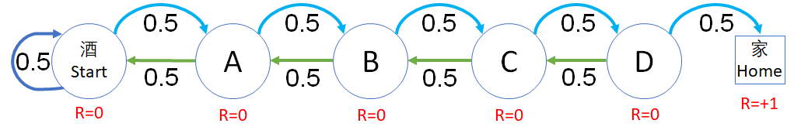
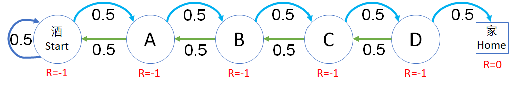
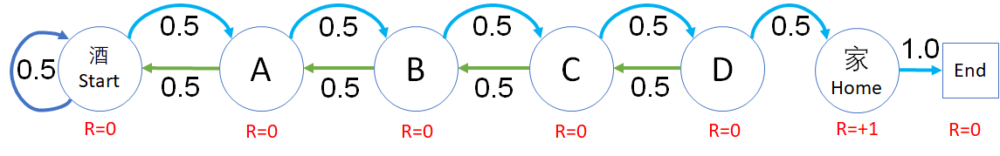

## 6.4 状态奖励方式与价值函数

有了价值函数后，可以对一个强化学习问题模型中的状态有了可以衡量的标准，更深刻地理解算法原理。但是读者可以明显地感觉到，奖励函数的设计对状态价值函数有着根本性的影响，一个合理的奖励函数设计可以让问题尽快收敛得到答案。在本节和下节中，我们一起做一些比较简单的试验，来深刻体会奖励函数与状态价值函数的关系。

安全驾驶问题有些复杂，状态转移太多，所以我们用前面的醉汉回家再简化一下来做研究。

状态定义如下，简化为一共 6 个状态：

```Python
# 状态定义
class States(Enum):
    Start = 0
    A = 1
    B = 2
    C = 3
    D = 4
    Home = 5    # 终止状态
```

状态转移矩阵定义如下：

```python
# 状态转移矩阵
P = np.array(
    [  # S    A    B    C    D    Home     
        [0.5, 0.5, 0,   0,   0,   0,  ], # S
        [0.5, 0,   0.5, 0,   0,   0,  ], # A
        [0,   0.5, 0,   0.5, 0,   0,  ], # B
        [0,   0,   0.5, 0,   0.5, 0,  ], # C
        [0,   0,   0,   0.5, 0,   0.5,], # D
        [0,   0,   0,   0,   0,   1.0,]  # Home(End)
])
```

左右各有 0.5 的概率随机游走。

按 5.2 节中所讲述的，奖励函数可以有两种设计方式：

- 状态奖励方式
- 过程奖励方式

通过对这两种方式的比较，读者可以得到一些基本的概念，为后面的贝尔曼方程的学习做好准备。

除了方式的不同外，在一种方式中，如果奖励值不同，对状态价值函数也会有影响，所以在每种方式中，我们会设计三组不同的方式来做比较。

### 6.4.1 状态奖励方式一

所谓状态奖励，就是根据应用场景的需要，直接给状态设定奖励，$S \to R$，而不管其过程如何。具体设置为：

**只有到达家的状态奖励设置为 +1，其它状态的奖励都是 0。**

如图 6.4.1 所示。

<center>


图 6.4.1 状态奖励方式一
</center>

状态奖励值定义如下：

【代码位置：RandomWalker_1_R1.py】

```Python
# 状态奖励值
#     S, A, B, C, D, H
R1 = [0, 0, 0, 0, 0, 1]
```

这种方式试图达到的效果是：一旦智能体跌跌撞撞地达到了一次家的状态，可以得到 +1 的奖励，它就会尝到甜头并牢记，在后面的学习中会不断强化这种记忆和过程。

下面仍然使用“采样求平均”的办法来计算每个状态的价值函数，即：

- 从 Start 状态开始，做 1000 次采样，得到每次采样的 G 值，然后求平均值；
- 从 A 出发（假设醉汉目前在 A 的位置），做 1000 次采样，得到每次采样的 G 值，然后求平均值；
......
- Home 状态属于终止状态，**按照定义，终止状态的价值为 0**，因为没有状态转移发生，也就没有奖励发生。

采样 1000 次求平均后的各个状态的价值函数如表 6.4.1 所示。

表 6.4.1 状态奖励方式一的结果

|状态$\to$|Start|A|B|C|D|Home|
|-|-|-|-|-|-|-|
|$\gamma=1$|0.0|0.0|0.0|0.0|0.0|1.0|
|$\gamma=0.9$|0.0|0.0|0.0|0.0|0.0|1.0|

结果解读：

- 各个状态全是 0，没有价值差异，不可用。

- 只有终止状态为 1，这与 **终止状态的价值为 0** 的定义不符。

比较图 6.4.1 和图 6.1.3，后者在终止状态上的 $R=0$，而前者在终止状态 Home 上的 $R=1$，所以造成了 $v(s_{Home})=1$ 的错误结果。如果我们修改代码，令在终止状态时返回 r = 0，将会带来灾难性的后果：所有状态的价值函数值都会为 0。那么整个模型将会变得没有意义。

所以，这种奖励的定义值是错误的，而并非算法或模型的错误。在下面的试验中，尝试修改一下奖励函数的设计，看看是否可以避免上述问题。

### 6.4.2 状态奖励方式二

既然第一种奖励值设计有错误，我们把所有的奖励值都减 1，会不会是同样的效果呢？如图 2 所示。

<center>


图 6.4.2  状态奖励方式二
</center>

在代码中设置奖励值如下：

【代码位置：RandomWalker_1_R2.py】

```python
# 状态奖励值
#     S,   A,  B,  C,  D, H
#R1 = [0,  0,  0,  0,  0, 1]
R2 = [-1, -1, -1, -1, -1, 0]
```
有的读者可能会问：D 状态距离终点最近，为什么它的奖励值不会比别的状态高呢？

- 首先，到了 D 状态后，也不是一定可以到家，虽然可以到家的概率较其它状态要大。智能体（醉汉）到达 D 后，只知道得到了 -1 的奖励，并不知道下一步向右走就可以到家，读者也不要做这种假设，否则就是替智能体来学习了。

- 其次，不要把状态奖励值和状态价值混为一谈。奖励值没有累加效应，但是状态价值具有全局观察能力。

同样是运行 1000 幕，得到结果如表 6.4.2。

表 6.4.2  状态奖励方式二的结果

|状态$\to$|Start|A|B|C|D|Home|
|-|-|-|-|-|-|-|
|$\gamma=1$|-30|-28|-24|-18|-10|0.0|
|$\gamma=0.9$|-8.4|-8.1|-7.3|-5.8|-3.7|0.0|

结果解读：

1. 终止状态 Home 的价值函数值为 0

    这是我们希望看到的，也符合定义。

2. 其它的状态函数值

    - 情况发生了变化，状态价值并不是在第一种情况的基础上普遍减 1，而是发生了显著的变化，这是因为 $R=-1$ 的不断累加使得远离终止状态的值变得非常小。

    - 起始状态 S 的状态值为什么不是 -1-1-1-1-1=-5 而是 -30 ？因为根据式 1，状态函数值是 $G$ 的期望，$G$ 代表了状态变化序列，由于在每个状态上都有 0.5 的概率返回上一个状态，所以状态变化序列（即马尔科夫链）会变得非常曲折，就会让 -1 这个值累加得越来越大。

    - 还有一个细节，当 $\gamma=1$ 时，各个状态价值的差值依次以 $-2,-4,-6,-8,-10$ 递减，原因不明（后面的章节再来研究）。

    - 从左向右，各个状态的价值依次增加，即距离 Home 越近的状态价值越高，这符合应用场景的期望。

3. 折扣的作用

    当有折扣存在时，这种负值累加效果会减弱很多，所以当 $\gamma=0.9$ 时，各个状态的函数值的差别会变得比较平缓。

4. 正负数

    表中的状态价值都是负数，这合理吗？作为一个价值体系来说，正值和负值其实没有绝对意义，相互之间的差值才能够真正体现状态价值。所以只要越靠近终点的状态价值越高，就可以了。

所以，大家在阅读强化学习的资料时，通常会看到如情况二这种奖励方式。这也是笔者开始学习时感到不解的地方，经过试验后，想必大家应该明白了。

另外，还有一个方法可以避免终止状态不为 0 的问题，就是像安全驾驶问题中那样建模：虽然“安全到家”和“发生事故”已经可以看作是终止状态了，但是可以人为地定义一个独立的“终止”状态，令“安全到家”和“发生事故”都以 100% 的概率转移到该终止状态。

### 6.4.3 状态奖励方式三

既然方式一的模型容易造成奖励值设置不合理，索性像安全驾驶问题的模型一样，我们给最后加一个单独的终止状态，形成图 6.4.3 所示的模型。

<center>


图 6.4.3  状态奖励方式三
</center>

然后把 Home 状态的奖励值设置为 1，其它为 0，看看价值函数计算结果如何。

首先新增加一个 End 状态：

```python
# 状态定义
class States(Enum):
    ......
    Home = 5
    End = 6    # 终止状态
```

然后修改状态转移矩阵，增加从 Home 到 End 的转移：

```python
# 状态转移矩阵
P = np.array(
    [  # S    A    B    C    D    Home End    
        [0.5, 0.5, 0,   0,   0,   0,    0], # S
        [0.5, 0,   0.5, 0,   0,   0,    0], # A
        [0,   0.5, 0,   0.5, 0,   0,    0], # B
        [0,   0,   0.5, 0,   0.5, 0,    0], # C
        [0,   0,   0,   0.5, 0,   0.5,  0], # D
        [0,   0,   0,   0,   0,   0,    1], # Home
        [0,   0,   0,   0,   0,   0,    1]  # End
])
```

设置奖励值：

```python
#  Start, A, B, C, D, H, End
R1 = [0,  0, 0, 0, 0, 1, 0]
```

由于终止状态改变，所以要在 DataModel 的初始化函数中修改 self.end_states 的值，不再是以前的 Home 状态，而是新增加的 End 状态。

```python
class DataModel(object):
    def __init__(self, R):
        ......
        self.end_states = [self.S.End]      # 终止状态集
```

主函数部分没有变化，运行 1000 次采样后，得到结果如表 6.4.3。

表 6.4.3 状态奖励方式三结果

|状态$\to$|Start|A|B|C|D|Home|End|
|-|-|-|-|-|-|-|-|
|$\gamma=1$|1.0|1.0|1.0|1.0|1.0|1.0|0.0|
|$\gamma=0.9$|0.15|0.19|0.27|0.41|0.63|1.0|0.0|

- 当 $\gamma=1$ 时，不太理想，因为前面所有的状态值都是 -1，不能区分出好坏。
- 当 $\gamma=0.9$ 时，可以区分出状态好坏了。

接下来，读者可以自己修改奖励值进行更多的试验，如思考与练习中的题目 1。

### 思考与练习

1. 如果修改图 6.4.3 的奖励设置为 R = [-1, -1, -1, -1, -1, 0, 0]。看看状态价值函数的计算结果如何？（折扣为 1 和 0.9 时。）

2. 根据第 5 章学生学习问题的模型和奖励函数设计，计算其状态价值函数。
