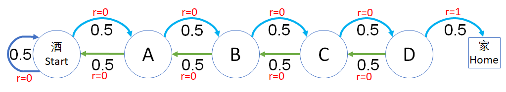
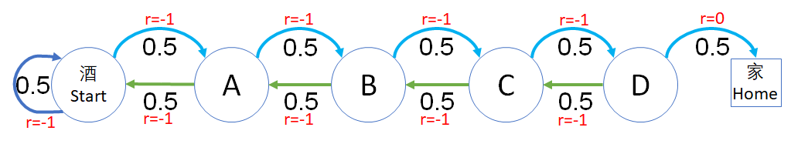
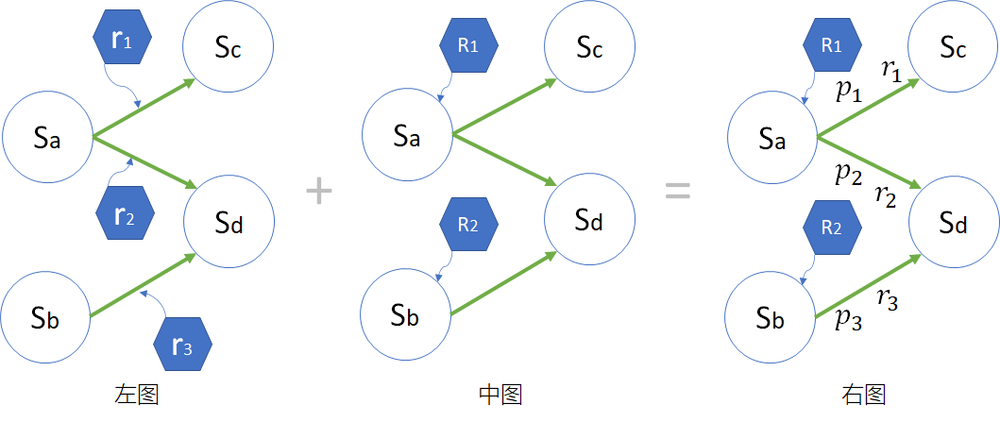

## 6.5 过程奖励方式与价值函数

下面我们研究 5.2 节所讲的过程奖励方式对价值函数的影响。状态定义和状态转移概率与 6.4 节中相同，只不过奖励不是定义在某个状态上的，而是定义在状态转移过程中的，即 $S \times S' \to r$。

### 6.5.1 过程奖励方式一

假设每走一步都有 0 的奖励，相当于没有任何奖励或惩罚，只有最后一步到家的过程才给 1 的奖励，模型与图 6.4.1 一致，但是奖励定义在过程上，如图 6.5.1 所示。

<center>


图 6.5.1 过程奖励方式一
</center>

给过程定义奖励，需要用到双重字典如下：

【代码位置：RandomWalker_2_R1.py】

```Python
# 过程奖励值
R1 = {
    States.Start: {States.Start: 0,    States.A:0},     # S->S:0, S->A:0
    States.A:     {States.Start:0,     States.B:0},     # A->S:0, A->B:0
    States.B:     {States.A:0,         States.C:0},     # B->A:0, B->C:0
    States.C:     {States.B:0,         States.D:0},     # C->B:0, C->D:0
    States.D:     {States.C:0,         States.Home:1},  # D->C:0, D->H:1
    States.Home:  {States.Home:0},                      # H->H:0
}
```

用第一行数据举例，含义是：从 Start 状态开始，到 Start 状态的奖励为 0，到 A 状态的奖励为 0。这样设计的好处是可以用 $O(1)$ 的效率，根据前后两个状态获得奖励值。当然用表格的方法可以达到同样的效果，只不过是一个稀疏表格，手工创建不方便。

数据结构变化了，代码逻辑当然需要变化。获得奖励的代码需要两个参数：

【代码位置：RandomWalker_2_DataModel.py】

```Python
    def get_reward(self, s, s_next):
        return self.R[s][s_next]
```

模型中的 step() 函数相应地变为：

```python
    # 根据转移概率前进一步，返回（下一个状态、即时奖励、是否为终止）
    def step(self, s):
        s_next = np.random.choice(self.S, p=self.P[s.value])
        return s_next, self.get_reward(s, s_next), self.is_end(s_next)
```
与 RandomWalker_1_DataModel.py 相比，self.get_reward() 的调用发生了变化，需要输入两个参数。但是，采用这样的封装方式，采样算法部分的代码不需要任何改动，依然使用 Algo_Sampling.py 中的函数。

同样是运行 1000 幕后得到结果如表 6.5.1。

表 6.5.1 过程奖励方式一的结果

|状态$\to$|Start|A|B|C|D|Home|
|-|-|-|-|-|-|-|-|
|$\gamma=1$|1.0|1.0|1.0|1.0|1.0|0.0|
|$\gamma=0.9$|0.17|0.22|0.29|0.44|0.72|0.0|

结果解读：

1. 当 $\gamma=1$ 时
    - Home 状态是 0，符合规定了。
    - 为什么前几个状态的价值都是 1 呢？因为根据公式 $v(s)=\mathbb E[R_{t+1}+ R_{t+2} + \cdots + R_T]$，最后的一个 $R_T=1$ 可以作用于前面的所有状态。这样的话，就无法区分状态价值好坏。即，对智能体来说，无法确定性地获得从左向右移动的知识。

2. 当 $\gamma=0.9$ 时
    在这种奖励函数设计的条件下，令折扣值小于 1，是一个好的办法，可以区分状态价值的好坏。

### 6.5.2 过程奖励方式二

换一种思路，假设每走一步都有 -1 的“奖励”，实际上是惩罚（相当于是很多游戏设计中的体力值降低），意在鼓励智能体（一个还没有接受强化训练的智能体和醉汉没什么区别）尽快找到回家的路，最后累计的负值越小越好。如图 6.5.2 所示。

<center>


图 6.5.2 过程奖励方式二
</center>

过程奖励值定义如下：

```Python
# 过程奖励值
R2 = {
    States.Start: {States.Start:-1,    States.A:-1},    # S->S:-1, S->A:-1
    States.A:     {States.Start:-1,    States.B:-1},
    States.B:     {States.A:-1,        States.C:-1},
    States.C:     {States.B:-1,        States.D:-1},
    States.D:     {States.C:-1,        States.Home:0},  # D->C:-1, D->H:0
    States.Home:  {States.End:0},
}
```
采样 1000 次，运行结果如表 6.5.2。

表 6.5.2 过程奖励方式二的结果

|状态$\to$|S|A|B|C|D|H|
|-|-|-|-|-|-|-|
|$\gamma=1$|-29.2|-27.1|-23.3|-17.2|-9.3|0.0|
|$\gamma=0.9$|-8.2|-7.8|-7.0|-5.4|-3.0|0.0|

结果解读：

1. 即使在折扣为 1 （无折扣）的情况下，也可以区分出状态值的好坏了。这是因为 -1 奖励值从后向前累积的结果。如果奖励是 0 的话，则没有这种累积效果。
2. 使用折扣会使得数据比较平滑，并不会破坏原有的大小关系。
3. 经过试验可知，无论最后从 D 到 Home 的过程奖励是多少，都可以保持 Home 的状态价值为 0，符合规范。所以，这种奖励方式比较合理，但是面向状态的奖励方式比较简单易操作，但是要注意合理的奖励设置。

### 6.5.3 对于过程奖励的理解

我们把图 5.2.2 拷贝过来便于阅读。

<center>


由图 5.2.2 奖励的两种定义方式
（左图：转移过程奖励；中图：当前状态奖励；右图：两种方式的转换）
</center>

同时，由式（5.2.1），解释了图 5.2.2 中三种方式的关系。

$$
\begin{aligned}
R_1 &= p_1 \cdot r_1 + p_2 \cdot r_2
\\
R_2 &= p_3 \cdot r_3 = r_3
\end{aligned}
\tag{由5.2.1}
$$

在 6.4 节中，我们试验了中图的方式；在 6.5 节中，试验了左图的方式。现在来验证一下式（5.2.1）的实际含义。

在 6.5.1 节和 6.5.2 节中的定义，都与图 5.2.2 右图中的 $s_a \to s_c,s_d$ 的转移相同，所以根据式（5.2.1）可以把相应的过程奖励做一个转换。

我们先看图 6.5.1 中的 $S$ 状态，它有两个转移方向：$S \to S,A$，对应的 $p_1=p_2=0.5，r_1=r_2=0$，所以有：

$$
R(s_{Start})=p_1 \cdot r_1 + p_2 \cdot r_2=0.5\cdot0+0.5\cdot0=0
$$

哦，好无聊，都是 0，所以我们看看不是 0 的状态 $D$，它的两个转移方向是 $D \to C,Home$，对应的 $p_1=p_2=0.5, r_1=0,r_2=1$，所以有：

$$
R(s_{D})=p_1 \cdot r_1 + p_2 \cdot r_2=0.5\cdot0+0.5\cdot1=0.5
$$

因此，可以把过程奖励 R1 转化为：

【代码位置：RandomWalker_2_R3R4.py】

```python
#     S, A, B, C, D,   Home
R3 = [0, 0, 0, 0, 0.5, 0]
```

同理，过程奖励 R2 转化为：

```python
R4 = [
    0.5*(-1)+0.5*(-1),  # S->S,A = -1
    0.5*(-1)+0.5*(-1),  # A->S,B = -1
    0.5*(-1)+0.5*(-1),  # B->A,C = -1
    0.5*(-1)+0.5*(-1),  # C->B,D = -1
    0.5*(-1)+0.5*0,     # D->C,H = -0.5
    1.0*0               # H->H   = 0
]
```

上面代码中没有直接写出奖励值，而是用式（5.2.1）计算出来的，便于读者理解。以状态 D 为例，到下游状态 C 的 $p_1=0.5,r_1=-1$，到下游状态 H 的 $p_1=0.5,r_1=0$，所以有：

$$
R(s_{D})=p_1 \cdot r_1 + p_2 \cdot r_2=0.5\cdot(-1)+0.5\cdot0=-0.5
$$

最后运行代码 RandomWalker_2_R3R4.py，得到以下结果：

```
奖励值: [0, 0, 0, 0, 0.5, 0]
----------
gamma = 1
状态价值函数计算结果(数组) : [1.01  0.98 1.02  1.02  0.99 0.]
----------
gamma = 0.9
状态价值函数计算结果(数组) : [0.18 0.22 0.29 0.46 0.71 0.]
==============================
奖励值: [-1.0, -1.0, -1.0, -1.0, -0.5, 0.0]
----------
gamma = 1
状态价值函数计算结果(数组) : [-29.15 -26.61 -23.74 -17.27  -8.99   0.]
----------
gamma = 0.9
状态价值函数计算结果(数组) : [-8.31 -7.9  -6.97 -5.58 -3.02  0.]
```

以上结果和表 6.5.1，表 6.5.2 的结果基本一致，有差异的原因是采样估算不精确的问题。

### 6.5.4 小结

通过 6.4,6.5 两个小节的试验，我们学习了奖励函数对状态价值函数的影响。可以得出一些基本的结论：

1. 采用状态奖励的方式比较方便，一般是使用给每一步移动都有惩罚值的方式。要保证终止状态的价值函数值为 0。
2. 过程奖励方式更合理，可以精细控制。过程奖励方式可以转化为状态奖励方式。
3. 最好使用 $\gamma < 1$ 的折扣值。

### 思考与练习

1. 在过程奖励的奖励中，第二种情况，如果把最后的 R=0 换成 R=5 或者更大的数，会对结果有影响吗？
