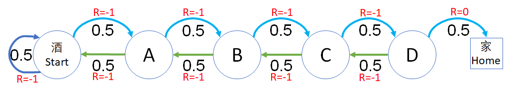

## 6.5 过程奖励方式对价值函数的影响

有了价值函数后，可以对一个强化学习问题模型中的状态有了可以衡量的标准，更深刻地理解算法原理。但是读者可以明显地感觉到，奖励函数的设计对状态价值函数有着根本性的影响，一个合理的奖励函数设计可以让问题尽快收敛得到答案。在本节中，我们一起做一些比较简单的试验，来深刻体会奖励函数与状态价值函数的关系。

安全驾驶问题有些复杂，状态转移太多，所以我们用前面的醉汉回家再简化一下来做研究。

在醉汉回家的例子中，奖励函数可以有两种设计方式：

- 状态奖励方式
- 过程奖励方式

通过对这两种方式的比较，读者可以得到一些基本的概念，为后面的贝尔曼方程的学习做好准备。

除了方式的不同外，在一种方式中，如果奖励值不同，对状态价值函数也会有影响，所以在每种方式中，我们会设计两种不同的奖励值来做比较。

```Python
# 状态定义
class States(Enum):
    Start = 0
    A = 1
    B = 2
    C = 3
    D = 4
    Home = 5    # 终止状态

# 状态转移矩阵
P = np.array(
    [  # S    A    B    C    D    Home     
        [0.5, 0.5, 0,   0,   0,   0,  ], # S
        [0.5, 0,   0.5, 0,   0,   0,  ], # A
        [0,   0.5, 0,   0.5, 0,   0,  ], # B
        [0,   0,   0.5, 0,   0.5, 0,  ], # C
        [0,   0,   0,   0.5, 0,   0.5,], # D
        [0,   0,   0,   0,   0,   1.0,]  # Home(End)
])
```

### 6.4.2 过程奖励方式

下面我们研究过程奖励方法对状态函数值的影响。

### 6.5.1 第一种情况

假设每走一步都有 0 的“奖励”，相当于没有任何奖励或惩罚，只有最后一步到家的过程才给 1 的奖励，其含义和图 1 差不多。如图 3 所示。

<center>


图 3 醉汉回家
</center>

这次我们要过程奖励给与奖励了，所以用了双重字典如下：

```Python
# 过程奖励值
R1 = {
    States.Start: {States.Start: 0,    States.A:0},
    States.A:     {States.Start:0,     States.B:0},
    States.B:     {States.A:0,         States.C:0},
    States.C:     {States.B:0,         States.D:0},
    States.D:     {States.C:0,         States.Home:1},
    States.Home:  {States.End:0},
    States.End:   {States.End:0}
}
```
用第一行数据举例，含义是：从 Start 状态开始，到 Start 状态的奖励为 0，到 A 状态的奖励为 0。这样设计的好处是可以用 $O(1)$ 的效率，根据前后两个状态获得奖励值。当然用表格的方法可以达到同样的效果，只不过是一个稀疏表格，维护不方便。

数据结构变化了，代码逻辑当然需要变化。获得奖励的代码需要两个参数：
```Python
    def get_reward(self, s_curr, s_next):
        return self.R[s_curr][s_next]
```

分幕采样的代码逻辑也要改动，以适应两个状态作为输入的要求。主要改动是把 get_next() 函数的调用提前了，以便得到两个好处：
1. 得到下一个状态以便调用 get_reward() 方法获得过程奖励值。
2. 如果下一个状态是 None，说明已经到达终点，即时终止本幕循环。

另外还增加了一个新变量 s_next，以便同时保持当前状态 s_curr 和下一个状态。

```Python
# 多次采样获得回报 G 的数学期望，即状态价值函数 V
def Sampling(dataModel, start_state, episodes, gamma):
    G_sum = 0  # 多幕 G 的和, 最后求平均值
    # 循环多幕
    for episode in tqdm.trange(episodes):
        s_curr = start_state # 把给定的起始状态作为当前状态
        G = 0           # 设置本幕的初始值 G=0
        t = 0           # 步数计数器
        while True:
            s_next = dataModel.get_next(s_curr)   # 得到下一个转移状态
            if (s_next is None):
                break
            r = dataModel.get_reward(s_curr, s_next) # 获得过程奖励值
            G += math.pow(gamma, t) * r # 当t=0时, G += r
            t += 1                      # 时间步+1
            s_curr = s_next
        # end while
        G_sum += G # 先暂时不计算平均值，而是简单地累加
    # end for
    V = G_sum / episodes   # 最后再一次性计算平均值，避免增加计算开销
    return V
``` 

同样是运行 1000 幕后得到结果如表 3

表 3

|状态$\to$|S|A|B|C|D|H|
|-|-|-|-|-|-|-|-|
|$\gamma=1$|1|1|1|1|1|0|
|$\gamma=0.9$|0.17|0.21|0.30|0.47|0.70|0.0|

结果解读：

1. 当 $\gamma=1$ 时
    虽然 Home 状态是 0，符合规定了，但是前面的状态值都是 1，无法区分状态价值好坏。
2. 当 $\gamma=0.9$ 时
    与基于状态的奖励方法一样，在这种奖励函数设计的条件下，令折扣值小于 1，仍然是一个好的办法，可以区分状态价值的好坏。

### 6.5.2 第二种情况

换一种思路，假设每走一步都有 -1 的“奖励”，实际上是惩罚（相当于是很多游戏设计中的体力值降低），意在鼓励智能体（一个还没有接受强化训练的智能体和醉汉没什么区别）尽快找到回家的路，最后累计的负值越小越好。如图 4 所示。

<center>


图 4 醉汉回家
</center>

过程奖励值定义如下：

```Python
# 过程奖励值
R2 = {
    States.Start: {States.Start:-1,    States.A:-1},
    States.A:     {States.Start:-1,    States.B:-1},
    States.B:     {States.A:-1,        States.C:-1},
    States.C:     {States.B:-1,        States.D:-1},
    States.D:     {States.C:-1,        States.Home:0},
    States.Home:  {States.End:0},
}
```
运行结果如表 4

表 4

|状态$\to$|S|A|B|C|D|H|
|-|-|-|-|-|-|-|
|$\gamma=1$|-29|-27|-23|-17|-9|0.0|
|$\gamma=0.9$|-8.2|-7.8|-7.0|-5.4|-3.0|0.0|

结果解读：

1. 即使在折扣为 1 （无折扣）的情况下，也可以区分出状态值的好坏了。
2. 使用折扣会使得数据比较平滑。
3. 经过试验可知，无论最后从 D 到 Home 的过程奖励是多少，都可以保持 Home 的状态价值为 0，符合规范。所以，这种奖励方式比较合理，但是面向状态的奖励方式比较简单易操作，但是要注意合理的奖励设置。

### 思考与练习

1. 在过程奖励的奖励中，第二种情况，如果把最后的 R=0 换成 R=5 或者更大的数，会对结果有影响吗？
