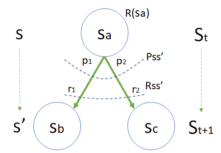
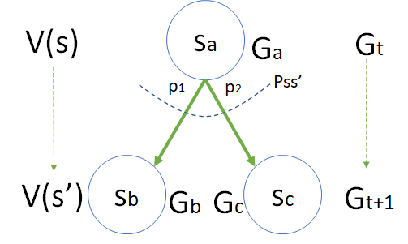
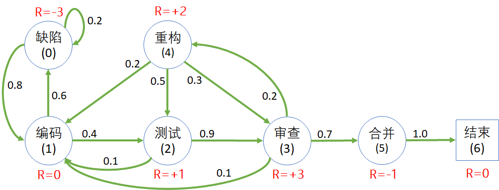
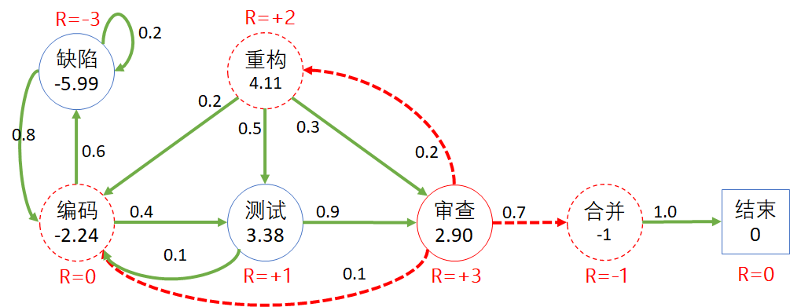

# 第 7 章 从价值估算到价值计算


### 温故知新


### 参考资料

Bertsekas, D. P. (1976). Dynamic Programming and Stochastic Control. Academic Press, Inc.


### 参考资料

https://cloud.tencent.com/developer/article/1817113

https://zhuanlan.zhihu.com/p/70689256

https://blog.csdn.net/weixin_41082481/article/details/115922389


## 7.1 开发流程问题

### 7.1.1 提出问题

在解决安全驾驶问题的过程中，我们学习了马尔可夫奖励过程、状态价值函数等强化学习的重要概念。其中，计算价值函数需要大量的采样然后求平均值，才能得到**比较理想的结果**，并不能说是**准确的结果**，因为我们无法衡量什么叫做准确。

那么有没有更好的方法呢？

在本节中，我们以软件开发流程（代码的生命周期）问题为例，通过描述开发过程（编码、测试、审查、合并等）的状态/过程，来寻找用于分析解决有模型问题的**更好的办法**，而不是一味地使用采样方法依靠大数定律来计算状态价值函数。

<center>


图 7.1.1 开发流程问题模型
</center>


各个软件公司可能都有自己习惯使用的开发流程，传统的、现代的、瀑布式的、敏捷型的等等，但是关于代码生命周期部分都大致相同：

1. 开发人员根据需求写代码（编码）；
2. 单元测试，发现 Bug 及时修改；
3. 开一个新的 Branch，提交代码到代码仓库，提交成功后，具有 CI/CD pipeline 的系统会进行自动测试；
4. 测试不通过的话，要回到编码状态修改问题；通过的话会进入人工审查（review）阶段；
5. 审查发现小问题，要修改编码；发现大问题，要重构；没有问题的话，可以把代码合并到 main branch；
6. 重构其实也是一种编码，侧重于结构上的调整，而不是侧重于编写新的功能模块。如果需要添加功能，则回到编码状态；如果结构调整完毕，直接进入测试，或者再次进入审查阶段；
7. 代码合并到主分支后，结束代码生命周期。

下面我们会给以上过程进行建模，最终目标是求解各个状态的价值函数。

### 7.1.2 建立模型

根据上个小节中描述的开发流程中的代码生命周期问题，笔者建立的模型如图 7.1.2 所示。

- 圆形为状态，内含状态名称和缩写；
- 方形为终止状态；
- 绿色箭头为状态转移方向；
- 黑色数字为状态转移概率；
- 红色字体为状态奖励值。

奖励值的设计方案有很多，在此我们采用了面向代码质量的指导思想给各个状态定义不同的值：即，对代码质量有损害的为负值，反之为正值。

<center>


图 7.1.2 开发流程问题模型
</center>

图 7.1.2 中的状态、奖励、转移的说明见表 7.1.1。

表 7.1.1 状态的说明以及奖励函数的定义

| 状态及代码       | 状态描述                                                     | 状态奖励                                                     | 状态转移概率                                                 |
| ---------------- | ------------------------------------------------------------ | ------------------------------------------------------------ | ------------------------------------------------------------ |
| C：编码 Coding   | 开发人员写代码，<br>全神贯注，废寝忘食                       | 在此状态下尚无法确定代码<br>质量，所以 $R=0$                 | 0.6：产生 bug，需要修复<br>0.4：进入测试状态                 |
| B：缺陷 Bug      | 在单元测试过程中发现 Bug                                     | 如果不妥善解决会对代码质量<br>有很大影响，所以 $R=-3$        | 0.2：越改越糟糕<br>0.8：很快就改好了                         |
| T：测试 Testing  | CI pipeline测试。提交 PR<br>后自动执行，通过后方可<br>进入下一阶段 | 严格把关，所以 $R=+1$                                        | 0.9：进入代码审查状态<br>0.1：测试不通过，修改编码           |
| R：审查 Review   | 由小组中其他人做代码审查                                     | 可以帮助提高代码质量，<br>所以 $R=+3$                        | 0.7：通过了审查，可以合并代码<br>0.2：决定重构代码<br>0.1：修改少量代码 |
| F：重构 reFactor | 在审查过程中发现代码设计上<br>的一些缺陷，所以需要在现有<br>的基础上重构代码 | 对将来的可维护性、可扩展性<br>等等有很大帮助，所以 $R=+2$    | 0.2：需要补充新代码<br>0.5：进入测试状态<br>0.3：进入代码审查状态 |
| M：合并 Merge    | 代码合并到 main branch，<br>然后结束                         | 合并的过程实际上是有风险的，<br>它有可能给集成测试带来新的<br>问题，所以 $R=-1$。 | 1.0：进入结束状态                                            |
| E：结束 End      | 结束本次代码的生命周期，<br>叫做结束状态或者吸收状态         | 吸收状态总是把奖励值<br>设置为 $R=0$                         | 不再进行转移（或者以<br>1.0 的概率转移到自身）               |


表 7.1.2 中列出了状态转移矩阵，与租车还车问题中的矩阵形式相同。

表 7.1.2 开发流程问题的状态转移矩阵

|P: 从$\rightarrow$到|缺陷|编码|测试|审查|重构|合并|结束|
|:-:|:-:|:-:|:-:|:-:|:-:|:-:|-|
|**缺陷**|0.2|0.8|-|-|-|-|-|
|**编码**|0.6|-|0.4|-|-|-|-|
|**测试**|-|0.1|-|0.9|-|-|-|
|**审查**|-|0.1|-|-|0.2|0.7|-|
|**重构**|-|0.2|0.5|0.3|-|-|-|
|**合并**|-|-|-|-|-|-|1.0|
|**结束**|-|-|-|-|-|-|1.0|

有的读者可能有个疑问：在修复代码缺陷的状态，刚开始时有可能是越改越遭，有 0.2 的概率转回到自身，但是后来应该会大概率向好的方向转移，不应该只有 0.8 的概率，基本上应该是 1.0 的概率改好。

这是一个简单的平稳环境的马尔科夫过程，如果考虑更复杂的情况，可以在该状态下增加一个计数器：

- 如果在缺陷状态超过 1 天，则有 0.9 或 1.0 的概率回到正常编码状态；
- 如果没超过 1 天，则有 0.2 的概率回到自身。

所以，模型这个东西，可以复杂，也可以简单，关键看建模时是否能够抓住重点，让智能体学到一个大致的正确方向，然后再逐步细化。

需要再次说明的是，在图 7.1.2 中，我们使用了**状态奖励**定义方式，直接给每个状态赋值一个奖励，意味只要达到这个状态，就可以立刻获得标注出的奖励值，而不管是从哪条路径达到的，或者下游状态是什么。

## 7.2 动态规划与贝尔曼方程

### 7.2.1 动态规划与贝尔曼方程

想解决开发流程这个问题，如果像安全驾驶问题中一样用蒙特卡洛采样方法，仍然可以得到估算出来的状态价值函数 V。但是在本章，我们要学习一种更科学的方法，被称作贝尔曼方程。

贝尔曼方程（Bellman Equation）也被称作动态规划方程（Dynamic Programming Equation），由理查·贝尔曼（Richard Bellman）发现。贝尔曼方程最早应用在工程领域的控制理论和其他应用数学领域，而后成为经济学上的重要工具。

动态规划是把一个规划问题转化为抽象状态之间的转移，因此，模型的细节，比如状态转移概率。做正确决策所需要当前情况的信息被称作是状态（State）。例如，为了决定要不要给一个软件系统增加一个新功能，管理者必须知道目前的状态，比如人员、时间、Bug 数量、代码规模等等，这些都是状态变量，可以影响软件质量，并用于决策软件发布时间。

动态规划方法主要用来解决优化问题，投资问题、库存问题、生产计划、资源分配、设备更新、最优搜索、马尔可夫决策过程，以及最优控制和自适应控制等问题，均可用动态规划方法来处理。所以在介绍用于计算 V 函数的算法之前，我们先一起简单地复习一下动态规划。

### 7.2.2 动态规划

**Those who cannot remember the past are condemned to repeat it.**

**那些不记得过去的人注定要重蹈覆辙。** 

这是动态规划的经典名句。下面我们先回忆一下动态规划的基本思想。

动态规划（Dynamic Programming，简称DP）动态规划常常适用于有重叠子问题和最优子结构性质的问题，动态规划方法所耗时间往往远少于朴素解法。

动态规划背后的基本思想非常简单。大致上，若要解一个给定问题，我们需要解其不同部分（即子问题），再合并子问题的解以得出原问题的解。 通常许多子问题非常相似，为此动态规划法试图仅仅解决每个子问题一次，从而减少计算量： 一旦某个给定子问题的解已经算出，则将其记忆化存储，以便下次需要同一个子问题解之时直接查表。 这种做法在重复子问题的数目关于输入的规模呈指数增长时特别有用。虽然抽象后进行求解的思路并不复杂，但具体的形式千差万别，找出问题的子结构以及通过子结构重新构造最优解的过程很难统一，为了解决动态规划问题，只能靠多练习、多思考了。

#### 姐弟俩的故事一

妈妈问：“$1+2+3+4=?$”
弟弟（一年级小学生，花了30秒在纸上做加法演算然后）答：“等于10。”
爸爸问：“很好！那么 $7+4+3+2+1=?$”
姐姐（五年级小学生花了2秒思考然后立刻）答：“等于17。”
弟弟把刚拿起来的铅笔放下，无限崇拜地看着姐姐：“你是怎么这么快算出来的？”
姐姐说：“在你的答案上直接加 7 就行了。”
爸爸说：“不错，已经知道**利用历史经验**了！”

#### 姐弟俩的故事二

有一个 6 级的台阶，姐姐和弟弟每天放学回家都要经过。弟弟有时候一级一级地上台阶，有时候跳两级，有时候一级两级随意上跳，但是方法每天都不一样，姐姐在旁边帮他记录，保证他不重复。问：弟弟一共需要多少天可以遍历所有跳法？这次需要输出所有数列（1级时输出1，2级时输出2，3级时输出3，4级时输出5......）。

其实这是一个斐波那契数列的变形题目，可以抽象为：

$$
\begin{aligned}
f(1)&=1
\\
f(2)&=2
\\
f(n)&=f(n-1)+f(n-2)
\end{aligned}
$$

其解题思路在于把问题逐级分解：

- 想跳到第 6 级台阶，先要跳到第 5 级或第 4 级台阶；
  又分成两种情况：
  - 想跳到第 5 级台阶，先要跳到第 4 级或第 3 级台阶；
    双分成两种情况：
    - 想跳到第 4 级台阶，先要跳到第 3 级或第 2 级台阶；
      叒分成两种情况：
      - 想跳到第3级台阶，先要跳到第 2 级或第 1 级台阶；
      - 想跳到第2级台阶，先要跳到第 1 级台阶。
            ......
  - 想跳到第 4 级台阶，先要跳到第 3 级或第 2 级台阶；
        ......

所以有：

$$
\begin{aligned}
f(6)&=f(5)+f(4) & {\footnotesize (到第 6 级台阶的方法有 5 \to 6 和 4 \to 6 两种组合)}
\\
f(5)&=f(4)+f(3)
\\
f(3)&=f(2)+f(1)
\\
f(2)&=2 & {\footnotesize (两级台阶有2种跳法)}
\\
f(1)&=1 & {\footnotesize (一级台阶只有1种跳法)}
\end{aligned}
$$

下面用三种方法来解决这个问题：

- 递归法
- 迭代法
- 备忘录法

【代码位置：DP_1.py】

```python
# 递归法
def f1(n):
    if n==1 or n==2:
        return n
    else:
        fn = f1(n-1) + f1(n-2)  # 递归调用函数本身两次 f(n)=f(n-1)+f(n-2)
        return fn
```

递归法是自顶向下递归调用自己，不能存储任何中间过程，而且耗用内存较多，在问题复杂时容易造成堆栈溢出。

```python
# 迭代法
def f2(n):
    fn_2 , fn_1 = 1, 2      # f(n-2)=1, f(n-1)=2
    for i in range(n-2):
        fn = fn_2 + fn_1    # 计算 f(n) = f(n-2)+f(n-1)
        fn_2 = fn_1         # 迭代更换上一次的数值便于下次计算
        fn_1 = fn
    return fn
```

迭代法是自底向上一步步计算，用变量存储上一步的计算结果，用于下一步。

```python
# 备忘录法
def f3(n):
    results = {1:1, 2:2}    # 建立字典，初始时，当n=1和n=2时的结果是1和2
    for i in range(3, n+1):
        fi = results[i-1] + results[i-2]    # 从字典中直接取出结果计算f(n)=f(n-2)+f(n-1)
        results[i] = fi     # 在字典中添加n=i时的结果,i=3,4,5...
    return results
```

备忘录法使用公共存储来存储所有的历史计算结果，在需要的时候直接拿出来使用，可以记录所有历史记录。

上述三个算法的输入参数都是 n，表示步数，我们先令 n=6 来看看结果。

输出结果：

```
========================================
递归法结果 = 13
递归法耗时 = 0.0
========================================
迭代法结果 =  13
迭代法耗时 = 0.0009682178497314453
========================================
备忘录法结果 = {1: 1, 2: 2, 3: 3, 4: 5, 5: 8, 6: 13}
备忘录法耗时 = 0.001001119613647461
```

所以 6 级台阶一共有 13 种跳法。其中，备忘录法可以记录所有的计算结果，当然需要耗费 $O(n)$ 空间。

如果台阶数增加到 n=40，当计算 $f(40)$ 时，递归法需要花费成指数级增加的时间，在笔者的电脑上约17秒，复杂度为 $O(2^n)$。而迭代法和备忘录法仍然是瞬时完成，复杂度 $O(n)$。

```
========================================
递归法结果 = 165580141
递归法耗时 = 16.985862016677856
========================================
迭代法结果 =  165580141
迭代法耗时 = 0.0010018348693847656
========================================
备忘录法结果 = {1: 1, 2: 2, 3: 3, 4: 5, ......, 38: 63245986, 39: 102334155, 40: 165580141}
备忘录法耗时 = 0.0010018348693847656
```

**递归是朴素的思想，迭代是有效的方法**，两者都要掌握。

### 7.2.3 小结

动态规划问题满足三大重要性质：

- 最优子结构性质

  如果问题的最优解所包含的子问题的解也是最优的，我们就称该问题具有最优子结构性质（即满足最优化原理）。最优子结构性质为动态规划算法解决问题提供了重要线索。

- 子问题重叠性质

  在用递归算法自顶向下对问题进行求解时，每次产生的子问题并不总是新问题，有些子问题会被重复计算多次。动态规划算法正是利用了这种子问题的重叠性质，对每一个子问题只计算一次，然后将其计算结果保存在一个表格中（称作 DP 表格），当再次需要计算已经计算过的子问题时，只是在表格中简单地查看一下结果，从而获得较高的效率。

- 无后效性

  将各阶段按照一定的次序排列好之后，对于某个给定的阶段状态，它以前各阶段的状态无法直接影响它未来的决策，而只能通过当前的这个状态。换句话说，每个状态都是过去历史的一个完整总结。这就是无后向性，又称为无后效性。

动态规划最核心的思想，就在于拆分子问题，记住过往，减少重复计算。所以，**动态规划**，简单地说就是**记住求过解来节省后续的计算时间**。

在动态规划问题的解题思路中，重点是**定义 DP 表格的含义 + 状态转移方程**，已经有很多相关文献记载，请读者自行学习。


## 7.3 贝尔曼方程 Bellman Equation

### 7.3.1 对状态价值函数的进一步分解

前面已经学习了状态价值函数的定义，其公式为：

$$
v(s) = \mathbb E \big [G_t | S_t = s]
\tag{7.3.1}
$$

由于

$$
\begin{aligned}
G_t &= R_{t+1}+\gamma R_{t+2}+ \gamma^2 R_{t+3} + \gamma^3 R_{t+4} + \cdots &(1)
\\
G_{t+1} &= R_{t+2}+ \gamma R_{t+3}+ \gamma^2 R_{t+4} + \cdots &(2)
\end{aligned}
\tag{7.3.2}
$$

结合上述两式，可以做进一步的分解和推导：

$$
\begin{aligned}
v(s)&=\mathbb E \big [G_t|S_t=s\big ]
\\
(G_t分解\to)&=\mathbb E \big [R_{t+1}+\gamma R_{t+2}+\gamma^2 R_{t+3}+ \gamma^3 R_{t+4}+\cdots|S_t=s \big ]
\\
&=\mathbb E \big [R_{t+1}+\gamma (R_{t+2}+\gamma R_{t+3}+ \gamma^2 R_{t+4}+\cdots)|S_t=s\big ]
\\
(代入式7.3.2.2\to)&=\mathbb E \big [(R_{t+1}+\gamma G_{t+1})|S_t=s\big ]
\\
&= \underbrace{ \mathbb E \big [R_{t+1}|S_t=s\big ]}_A + \gamma \underbrace{\mathbb E \big [G_{t+1}|S_t=s \big ]}_B
\end{aligned}
\tag{7.3.3}
$$

到了这一步，把 $V(s)$ 分成了 $A,B$ 两部分，**$A$ 可以看作是即时奖励的数学期望，$B$ 可以看作是带折扣的未来回报的数学期望**。

下面分析一下这两部分如何分别得到。


### 7.3.2 A部分：关于 $R_{t+1}$ 的数学期望

<center>



图 7.3.1 关于 $R_{t+1}$ 的数学期望
</center>

#### 目标

这一部分的目标是要得到 $R_{t+1}$ 的数学期望的具体表达式：$\mathbb E \big [R_{t+1}|S_t=s\big ]$。

在图 7.3.1 中，给出了上游状态 $s_a$，下游状态 $s_b,s_c$，以及状态转移过程中的概率 $p$ 和过程奖励 $r$。需要计算 $R(s_a)$。因为在 5.2 节中，其实已经给出了 $R_{t+1}$ 的定义：

$$
R(s)=\mathbb E[R_{t+1}|S_t=s] \tag{由式5.2.3}
$$

这里的 $R(s)$ 即图 7.3.1 中的 $R(s_a)$，也就是 $R_{t+1}$ 的数学期望。

#### 状态集定义

大写的 $S_t,S_{t+1}$，表示当前状态 $t$ 和下一个状态 $t+1$ 的**状态变量**，在不同的马尔可夫过程中会有不同的实例，所以只是一种通用表达方式，并不知道具体是哪个状态。

小写的 $s,s'$，表示具体的**状态实例**，具体到图 7.3.1 中：

$$
s = [s_a], \quad s' = [s_b,s_c] \tag{7.3.4}
$$

#### 转移概率定义

$P_{ss'}$ 是状态转移概率的集合，即转移矩阵。在图 7.3.1 中从 $s_a$ 出发有两个转移方向，分别是 $s_b,s_c$，对应的概率是 $p_1,p_2$，并且 $p_1+p_2=1$。

$$
P_{ss'}=[p_1,p_2] \tag{7.3.5}
$$

实际上 $p_1$ 可以写作 $p_{s_a s_b}$，含义是从 $s_a$ 到 $s_b$ 的转移概率，因为有式（7.3.4），所以 $p_{s_a s_b}$ 又可以写作 $p_{ss'}$，这样一来 $p_1,p_2$ 就可以有统一的抽象符号  $p_{ss'}$ 了，这在后面的数学推导中很重要。

#### 奖励函数定义

在使用**过程奖励**的方式时，从$s_a$ 转移到 $s_b$ 或 $s_c$，分别可以得到 $r_1,r_2$ 的奖励，但不能同时得到。

$$
R_{ss'}=[r_1,r_2] \tag{7.3.6}
$$

和 $p_1,p_2$ 一样，$r_1,r_2$ 也可以统一抽象写成 $r_{ss'}$。

图 7.3.1 中从 $s_a$ 出发并不能确定具体转移到哪个状态，所以也无法确定得到的奖励是 $r_1$ 还是 $r_2$。但是幸好有转移概率 $P_{ss'}$ 存在，给了我们一个机会，可以通过数学期望（带权重的平均值）来定义 $R(s_a)$：

$$R(s_a)=\mathbb E[R_{t+1}|S_t=s_a] = \underbrace {p_1 \cdot r_1}_{S_{t+1}=s_b} + \underbrace{p_2 \cdot r_2}_{S_{t+1}=s_c}=\sum_{s' \in [s_b,s_c]} p_{ss'}r_{ss'} = P_{ss'} R_{ss'} \tag{7.3.7}$$

式（7.3.7）实际上统一了**过程奖励**方式（$r_1,r_2$）和**状态奖励**方式 $R(s_a)$，把过程奖励的期望看作是状态奖励的结果。在有的问题中，会直接给出 $R(s_a)$ 的值，但是又不解释它是怎么来的。这一点很重要，希望读者牢记，避免在以后的学习中遇到概念上的疑问。

式（7.3.7）中求和符号下面的 $s'$，表示要遍历下游状态 $s'$，在本例中就是要遍历 [$s_b,s_c$]。

#### 结论

式(7.3.3）的 $A$ 部分可以定义为 $R(s)$：

$$
\begin{aligned}
A=R(s) & = \mathbb E[R_{t+1}|S_t=s]
\\
(实例化\ s \to s_a) &= \mathbb E[R_{t+1}|S_t=s_a]
\\
(代入式7.3.7\to)&= p_1 \cdot  r_1+p_2 \cdot r_2
\\
(抽象\to) &= \sum_{s'}p_{ss'} r_{ss'}=P_{ss'} R_{ss'}
\end{aligned}
\tag{7.3.8}
$$

### 7.3.3 B部分：关于 $G_{t+1}$ 的数学期望

<center>



图 7.3.2 关于 $G_{t+1}$ 的数学期望
</center>

#### 目标

这一部分的目标是要得到 $G_{t+1}$ 的数学期望的具体表达式：$\mathbb E \big [G_{t+1}|S_t=s\big ]$，不包括常数 $\gamma$。

#### 回报的定义

具体到图 7.3.2 中，回报 $G$ 在不同时刻的取值为：

$$
G_t=[G_a],\quad G_{t+1}=[G_b,G_c]
$$

和 $A$ 部分中遇到的问题一样：当 $S_t=s$ 时，即在 $s_a$ 状态下，只能确定 $G_{t}=G_a$，不能确定$G_{t+1}$ 是 $G_b,G_c$ 的哪一个，因为不知道下一步会转移到哪个状态，是 $s_b$ 还是 $s_c$？

但是，由于 $P_{ss'}$ 的存在，我们仍然可以用数学期望的方式来表达 $G_{t+1}$：

$$
G_{t+1}= \underbrace{p_1 \cdot G_b}_{S_{t+1}=s_b} + \underbrace {p_2 \cdot G_c}_{S_{t+1}=s_c}
$$

所以有：

$$
\begin{aligned}
\mathbb E \big [ G_{t+1} | S_t=s_a\big ]&=
\mathbb E\big [ p_1 \cdot G_b|S_{t+1}=s_b,S_t=s_a] + \mathbb E \big [p_2 \cdot G_c|S_{t+1}=s_c,S_t=s_a\big ]
\\
&=\mathbb E\big [ p_1 \cdot G_b|S_{t+1}=s_b] + \mathbb E \big [p_2 \cdot G_c|S_{t+1}=s_c\big ]
\\
&=p_1 \cdot \mathbb E\big [G_b|S_{t+1}=s_b] + p_2 \cdot \mathbb E \big [G_c|S_{t+1}=s_c\big ]
\end{aligned}
\tag{7.3.9}
$$

式（7.3.9）的第二步，去掉 $S_t=s_a$，是因为根据马尔可夫性质，从 $S_{t+1}$ 开始的任何概率转移与 $S_t$ 无关，简单地说就是到了 $s_b,s_c$ 状态后，就可以忽略是从 $s_a$ 来的这个事实。

第三步是把常数 $p_1,p_2$ 提出来。

#### 价值函数定义

首先要注意的一个问题是，$B$ 部分不等于 $v(s')$，因为按式（7.3.1）的定义：

$$
v(s) = \mathbb E \big [G_t | S_t = s]
$$

应该有：

$$
v(s') = \mathbb E \big [G_{t+1} | S_t = s']\ne \mathbb E[G_{t+1}|S_t=s]
$$

具体到图 7.3.2 中，状态 $s_a, s_b, s_c$ 的价值函数的实例化表示：

$$
\begin{aligned}
v(s_a)&=\mathbb E \big [G_a|S_t=s_a] & \in v(s)
\\
v(s_b)&=\mathbb E \big [G_b|S_{t+1}=s_b] & \in v(s')
\\
v(s_c)&=\mathbb E \big [G_c|S_{t+1}=s_c] & \in v(s')
\end{aligned}
\tag{7.3.10}
$$

不同时刻状态的价值函数又可以抽象为：

$$
V(s')=[v(s_b),v(s_c)] \tag{7.3.11}
$$

根据式（7.3.4），$v(s_b),v(s_c)$ 都可以抽象为 $v(s')$。

#### 结论

$$
\begin{aligned}
B&=\mathbb E\big[G_{t+1}|S_t=s \big ] 
\\
(实例化\to)&=\mathbb E\big[G_{t+1}|S_t=s_a \big ] 
\\
(代入式7.3.9\to)&=p_1 \cdot \mathbb E[G_{b}|S_{t+1}=s_b]+ p_2 \cdot \mathbb E[G_{c}|S_{t+1}=s_c]
\\
(代入式7.3.10\to)&= p_1 \cdot v(s_b) + p_2 \cdot v(s_c)
\\
(抽象\to)&=\sum_{s' \in [s_b,s_c]} p_{ss'}v(s')= P_{ss'}V(s')
\end{aligned}
\tag{7.3.12}
$$

### 7.3.4 状态价值函数

所以式（7.1.3）最终为：

$$
\begin{aligned}
v(s) &= \mathbb E \big [G_t | S_t = s]
\\
&=\mathbb E \big [R_{t+1}|S_t=s] + \gamma \mathbb E[G_{t+1}|S_t=s]
\\
&=\sum_{s'} p_{ss'} r_{ss'}+ \gamma \sum_{s'} p_{ss'}v(s') =\sum_{s'} p_{ss'} [r_{ss'}+\gamma v(s')]  &(1)
\\
&= P_{ss'} R_{ss'} + \gamma P_{ss'} V(s') &(2)
\\
&= R(s)+ \gamma P_{ss'}V(s') &(3)
\end{aligned}
\tag{7.3.13}
$$

**也就是说，一个状态 $s$ 的价值函数 $v(s)$ 由它的下游状态 $s'$ 的价值函数 $v(s')$ 和转移概率 $p_{ss'}$ 以及转移过程中的奖励 $r_{ss'}$ 构成。**

- 在**状态奖励方式**的问题中，使用式（7.3.13.3）比较方便，因为 $R(s)$ 是直接定义在状态 $s$ 上。这是 David Silver 课件中的写法。

- 在**过程奖励方式**的问题中，使用式（7.3.13.1）或（7.3.13.2）比较方便，因为 $r_{ss'}$ 是定义在从 $s\to s'$ 的转移过程上。这是 Richard S. Sutton and Andrew G. Barto 书中的写法，但不完全相同，我们后面再讲。

如果针对图 7.3.1，状态 $s_a$ 的价值函数实例计算公式为：

$$
\begin{aligned}
v(s_a)&=(p_1 \cdot r_1 + p_2 \cdot r_2) + \gamma[p_1 \cdot v(s_b) + p_2 \cdot v(s_c)]
\\
&=R(s)+\gamma[p_1 \cdot v(s_b) + p_2 \cdot v(s_c)]
\end{aligned}
$$

所以，在使用贝尔曼方程时，是需要知道转移概率和奖励模型的，并且假设已知下游状态的价值函数值，而下游状态的价值函数值就是动态规划中所说的子过程或子问题。

## 7.4 应用贝尔曼方程

### 7.4.1 手工计算状态价值函数

下面我们来一起解决开发流程问题模型中的状态价值函数计算问题。

<center>



图 7.4.1 开发流程问题模型
</center>

图 7.4.1 中，每个状态下方都用括号表示了该状态的序号，比如“编码(1)”表示状态序号 1，其价值函数值用 $v_1$ 表示。

以状态“测试(2)”为例，根据贝尔曼方程，即式（7.3.13.3），可以得到其价值函数的表达式为：

$$
\begin{aligned}
v_2&=R(s_2)+\gamma[p_{s_2,s_1} \cdot v(s_1)+p_{s_2,s_3} \cdot v(s_3)]
\\
&=1 + \gamma (0.1 v_1 + 0.9 v_3)
\end{aligned}
$$

为简化起见，在下面的计算中我们令 $\gamma=1$，不影响对计算过程的说明。

同理可以得到其它所有状态的价值函数表达式，列出方程组如下：

$$
\begin{cases}
v_0=(-3)+0.2v_0+0.8v_1 & (1)
\\
v_1=(0)+0.6v_0+0.4v_2 & (2)
\\
v_2=(+1)+0.1v_1+0.9v_3 & (3)
\\
v_3=(+3)+0.1v_1+0.2v_4+0.7v_5 & (4)
\\
v_4=(+2)+0.2v_1+0.5v_2+0.3v_3 & (5)
\\
v_5=(-1)+v_6 & (6)
\\
v_6=0 & (7)
\end{cases}
\tag{7.4.1}
$$

注意终止状态价值函数为 0，所以 $v_6=0$。

这是一个七元一次方程组，肯定有解。先简化式 7.4.1 中的各项，得到新的表达式：

$$
\begin{cases}
v_0=v_1-3.75 & (1)
\\
v_1=0.6v_0+0.4v_2 & (2)
\\
v_2=0.1v_1+0.9v_3+1 & (3)
\\
v_3=0.1v_1+0.2v_4+2.3 & (4)
\\
v_4=0.2v_1+0.5v_2+0.3v_3+2 & (5)
\\
v_5=-1 & (6)
\\
v_6=0 & (7)
\end{cases}
\tag{7.4.2}
$$

- 由子式（1）可知：$v_0=v_1-3.75$
- 由子式（2）可知：$v_2=v_1+5.625$
- 由子式（3）可知：$v_3=v_1+5.13888$

将上述三项以及子式（5）都变成 $v_1$ 的表达式，带入子式（4）的两侧，可以得到：

$$
v_1+5.13888=0.1v_1+0.2[0.2v_1+0.5(v_1+5.625)+0.3(v_1+5.13888)+2]+2.3
$$

得到：$v_1 \approx 2.24$，然后再逐一解决其它变量，最终的结果为：

$$
\begin{cases}
v_0 \approx -5.99
\\
v_1 \approx -2.24
\\
v_2 \approx 3.38
\\
v_3 \approx 2.90
\\
v_4 \approx 4.11
\\
v_5=-1
\\
v_6=0
\end{cases}
\tag{7.4.3}
$$

读者可以用式（7.4.3）的结果验证式（7.4.1）中的任意等式。

我们把式（7.4.3）的计算结果都标注在图 7.4.2 中的每个状态下方便于观察。

<center>



图 7.4.2 价值函数计算结果
</center>

得到结果后，可以验证一下图 7.4.2 中红色线条部分：

$$
2.90 \approx 3 + 1 \times [0.1\times(-2.24)+0.2 \times 4.11  + 0.7 \times (-1) ]
$$

完全符合价值函数的定义式（7.3.13）。

### 7.4.2 给过程定义奖励

在图 7.1.2 中，是通过给状态定义奖励来得到 $R(s)$ 值的，直接使用贝尔曼方程式（7.3.13）的第 3 种形式即可。

前面我们学习过，有的问题是注重状态，有的问题是面向过程。如果遇到的问题是给过程定义奖励，应该如何解决？很简单，使用贝尔曼方程的第 1 种形式即可，即式（7.3.13.1）。

<center>


图 7.4.3 过程奖励方式
</center>

如图 7.4.3，标出了 6 个过程的奖励，其它过程未标出。其中，与编码状态 $s_C$ 相关的用红色标出：

- 下游状态是 缺陷 $s_B$ 和 测试 $s_T$；
- 转移概率 $p_{ss'}$ 分别是：$p_{s_C,s_T}=0.4, \ p_{s_C,s_B}=0.6$；
- 奖励值 $r_{ss'}$ 分别是：$r_{s_C,s_T}=+3, \ r_{s_C,s_B}=-2$。

则编码状态 $s_C$ 的状态奖励值为：

$$
\begin{aligned}
R(s_C) &= p_{s_C,s_T} \cdot r_{s_C,s_T} + p_{s_C,s_B} \cdot r_{s_C,s_B}
\\
&=0.4 \times 3 + 0.6 \times (-2)
\\
&=0
\end{aligned}
$$

同理，重构状态 $s_F$ 的状态奖励值（用蓝色标出）为：

$$
\begin{aligned}
R(s_F) &= p_{s_F,s_C} \cdot r_{s_F,s_C} + p_{s_F,s_T} \cdot r_{s_F,s_T} + p_{s_F,s_R} \cdot r_{s_F,s_R}
\\
&=0.2 \times 1 + 0.5 \times 3 + 0.3 \times 1
\\
&=2
\end{aligned}
$$

然后再列方程组即可得解。

### 思考与练习

1. 读者可以自行验证图 3 中的“缺陷”状态的价值函数，以获得深刻理解。
2. 读者可以用贝尔曼方程验证醉汉回家简化版中的状态奖励和价值函数的计算结果。

## 7.5 用矩阵法解贝尔曼方程

### 7.5.1 从线性方程组到矩阵运算

观察式（7.4.1）方程组，可以把它变形为：

$$
\begin{bmatrix}
v_0
\\
v_1
\\
v_2
\\
v_3
\\
v_4
\\
v_5
\\
v_6
\end{bmatrix}
= \
\begin{bmatrix}
-3
\\
0
\\
+1
\\
+3
\\
+2
\\
-1
\\
0
\end{bmatrix}
+\gamma 
\begin{bmatrix}
0.2v_0+0.8v_1
\\
0.6v_0+0.4v_2
\\
0.1v_1+0.9v_3
\\
0.1v_1+0.2v_4+0.7v_5
\\
0.2v_1+0.5v_2+0.3v_3
\\
v_6
\\
0
\end{bmatrix}
\tag{7.5.1}
$$

关于式（7.5.1）的说明：

- 等式左侧的部分，就是所有状态的价值函数值组成的向量（数组），可以写成 $V(s)$。

- 等式右侧的第一项，就是状态上的奖励值组成的向量，可以写成 $R(s)$。

- 等式右侧的第二个矩阵，又可以写成两个矩阵的乘积：

$$
\begin{bmatrix}
0.2v_0+0.8v_1
\\
0.6v_0+0.4v_2
\\
0.1v_1+0.9v_3
\\
0.1v_1+0.2v_4+0.7v_5
\\
0.2v_1+0.5v_2+0.3v_3
\\
v_6
\\
0
\end{bmatrix}=
\begin{bmatrix}
0.2 & 0.8 & 0 & 0 & 0 & 0 & 0
\\
0.6 & 0 & 0.4 & 0 & 0 & 0 & 0
\\
0 & 0.1 & 0 & 0.9 & 0 & 0 & 0
\\
0 & 0.1 & 0 & 0 & 0.2 & 0.7 & 0
\\
0 & 0.2 & 0.5 & 0.3 & 0 & 0 & 0
\\
0 & 0 & 0 & 0 & 0 & 0 & 1.0
\\
0 & 0 & 0 & 0 & 0 & 0 & 0.0
\end{bmatrix}
\begin{bmatrix}
v_0
\\
v_1
\\
v_2
\\
v_3
\\
v_4
\\
v_5
\\
v_6
\end{bmatrix}
\tag{7.5.2}
$$

式（7.5.2）中，等式右侧的第一个矩阵就是该问题的状态转移矩阵 $P_{ss'}$，第二个矩阵是状态值向量 $V(s)$，于是，式（7.5.1）可以变成：

$$
V(s) = R(s)+ \gamma P_{ss'}V(s) \tag{7.5.3}
$$

其泛化形式是：

$$
\begin{bmatrix}
v_1
\\
v_2
\\
\vdots
\\
v_n
\end{bmatrix}
=\
\begin{bmatrix}
R_1
\\
R_2
\\
\vdots
\\
R_n
\end{bmatrix}
+\gamma
\begin{bmatrix}
P_{11} & P_{12} & \cdots & P_{1n}
\\
P_{21} & P_{22} & \cdots & P_{2n}
\\
\vdots & \vdots & \ddots & \vdots
\\
P_{n1} & P_{n2} & \cdots & P_{nn}
\end{bmatrix}
\begin{bmatrix}
v_1
\\
v_2
\\
\vdots
\\
v_n
\end{bmatrix}
\tag{7.5.4}
$$

但是从式（7.3.13）看，式（7.5.3）等式右侧的 $V(s)$ 应该是 $V(s')$ 才对，但是经过上述的实例化推导，希望读者可以理解到：

- 所谓的 $s'$ 是在时间维度上的定义，表示下一步的状态 $s'$ 的状态值；
- 而在空间上，由于状态值一旦确定就不会变化，$v(s)=v(s')$ 。

比如：

- 式（7.4.1.1），$v_0=-3+0.2v_0+0.8v_1$ 中：
  $V(s)=\{v_0\},V(s')=\{v_0,v_1\}$，$s_1$ 是 $s_0$ 的后续状态。
- 式（7.4.1.2），$v_1=0.6v_0+0.4v_2$ 中：
  $V(s)=\{v_1\},V(s')=\{v_0,v_2\}$，$s_0$ 是 $s_1$ 的后续状态。

两者在不同的马尔可夫过程中互为后续状态，但是 $v_0,v_1$ 这两个值不论在式（7.5.3）的等式左侧还是右侧，各自都应该代表同一个变量。

式（7.5.3）可以变形，并最终解出 $V(s)$：

$$
\begin{aligned}
V(s) &= R_s+ \gamma P_{ss'}V(s)
\\
V(s) - \gamma P_{ss'}V(s) &= R(s)
\\
(I-\gamma P_{ss'})V(s)&=R(s), &(I \ 是对角矩阵)
\\
V(s)&=(I-\gamma P_{ss'})^{-1}R(s) &(矩阵没有除法，但可以求逆)
\end{aligned}
\tag{7.5.5}
$$

式（7.5.5）中，等式右侧的值都是已知的，所以可以直接解出 $V(s)$ 的数学解析解。

### 7.5.2 代码实现

【代码位置：LifeCycle_0_DataModel.py】

定义状态转移矩阵：

```python
# 状态转移概率
P = np.array(
    [   # B   C    T    R    F    M    E    
        [0.2, 0.8, 0.0, 0.0, 0.0, 0.0, 0.0],    # Bug 
        [0.6, 0.0, 0.4, 0.0, 0.0, 0.0, 0.0],    # Coding
        [0.0, 0.1, 0.0, 0.9, 0.0, 0.0, 0.0],    # Test (CI)
        [0.0, 0.1, 0.0, 0.0, 0.2, 0.7, 0.0],    # Review
        [0.0, 0.2, 0.5, 0.3, 0.0, 0.0, 0.0],    # reFactor
        [0.0, 0.0, 0.0, 0.0, 0.0, 0.0, 1.0],    # Merge
        [0.0, 0.0, 0.0, 0.0, 0.0, 0.0, 0.0]     # End
    ]
)
```

定义奖励函数值向量：

```python
# 奖励向量 缺陷 编码 测试 审查 重构 合并 结束
Rewards = [-3, 0,   +1, +3,  +2, -1,  0]
```

式（7.5.5）的具体实现：
    

```python 
def solve_matrix(dataModel, gamma):
    # 在对角矩阵上增加一个微小的值来解决奇异矩阵不可求逆的问题
    I = np.eye(dataModel.N) * (1+1e-7)
    # I = np.eye(dataModel.N) # 非奇异矩阵时使用此行代码以提高计算精度
    factor = I - gamma * dataModel.P
    inv_factor = np.linalg.inv(factor)  # 求矩阵的逆
    vs = np.dot(inv_factor, dataModel.R)
    return vs
```

在定义状态转移矩阵时，右下角的值，即从 $S_{End} \to S_{End}$ 的转移概率，即可以写成 0.0，也可以写成 1.0，从强化学习的概念出发，都没有错。但是却与代码处理逻辑有关。

- 写成 0.0 时，np.random.choice(p=) 函数由于概率之和不为 1，所以函数调用出错。
- 写成 1.0 时，由于矩阵的行列式为 0，是个奇异矩阵，不可求逆。此时可以在对角矩阵上增加一个微小的值来解决奇异矩阵不可求逆的问题，但是最终结果会有 1e-7 的误差，可以接受。

以下是用矩阵法的计算结果：

```
状态价值函数计算结果(数组) : [-5.99 -2.24  3.38  2.9   4.11 -1.    0.  ]
Bug:        -5.99
Coding:     -2.24
Test:       3.38
Review:     2.9
Refactor:   4.11
Merge:      -1.0
End:        0.0
```

可能有读者好奇：如果保留更多的小数点后位数的话，用矩阵法得到的结果，与式（7.4.3）相比，哪一个更准确？

答案是：式（7.4.3）更准确。原因是用代码求矩阵的逆时，由于具体实现的问题有一些误差，否则的话两者应该完全相等。


## 7.6 双数组线性迭代法

### 7.6.1 迭代法原理

线性方程组和矩阵法都可以解出贝尔曼方程，但是它们各有缺点：

- 用手工列方程组的办法肯定可以得到解，但是当状态数量到几十个时，虽然都是一次线性方程组，但是手工计算量很大，非常容易出错。

- 矩阵法虽然可以得到数学解析解，但是，计算逆矩阵时非常耗时，时间复杂度为 $O(n^3)$，$n$ 是状态的数量。当状态数量增加到千级、万级时，时间开销将变得不可接受。

式（7.5.3）的形式 $x=f(x)$，让我们想起了迭代法，比如式（7.6.1）所示的方程：

$$
x = 10 + \log_{10}(\frac{x}{2}) \tag{7.6.1}
$$


用迭代法是这样：首先假定等式左侧的 $x$ 为 $x_{[k+1]}$，而右侧的为 $x_{[k]}$，如式（7.6.2）：

$$
x_{[k+1]} = 10 + \log_{10}(\frac{x_{[k]}}{2}) \tag{7.6.2}
$$

后续步骤：

- 任意给定 $x_k$ 的初始值（在本问题中需要 $x>0$，否则 $\log_{10}(\frac{[x_k]}{2})$ 无法计算），计算出 $x_{[k+1]}$；
- 再把 $x_{[k+1]}$ 代入等式右侧，再计算下一轮的$x_{[k+1]}$；
- 如此重复，然后检查 $|x_{[k+1]}-x_{[k]}|$ 是否小于一个给定的误差，即可判定收敛。

写成代码也很简单：

【代码位置：Simple_Iteration.py】

```Python
import math

def f(x):
    y = 10 + math.log10(x/2)
    return y

if __name__=="__main__":
    x = 100
    delta = 100
    count = 0
    while delta > 1e-5:     # 判断是否收敛
        count += 1          # 计数器
        y = f(x)            # 迭代计算
        delta = abs(x - y)  # 检查误差
        print(str.format("{0}: x={1}，相对误差={2}", count, y, delta))
        x = y               # 为下一次迭代做准备
```

在给定 x 初值为 100 的情况下，指定误差 delta 小于 1e-5 即可结束迭代，试验结果如下：

```
1: x=11.698970004336019，相对误差=88.30102999566398
2: x=10.767117631798069，相对误差=0.93185237253795
3: x=10.73106946212392，相对误差=0.03604816967414948
4: x=10.72961301039834，相对误差=0.0014564517255788445
5: x=10.72955406269718，相对误差=5.894770116121606e-05
6: x=10.729551676708828，相对误差=2.3859883508947632e-06
```

共迭代了 6 次，误差达到 2.38e-6，结果为 10.73。读者可自行带入式（7.6.1）中验证。

### 7.6.2 线性迭代法

#### 手工演算

根据上面的思路，我们尝试一下最原始的手工迭代，以帮助读者理解迭代过程。

根据式（7.3.13）

$$
v(s) = R(s)+ \gamma \sum_{s'} p_{ss'}v(s')=R(s)+ \gamma P_{ss'}V(s')
\tag{由式7.3.13}
$$

可以定义 $v_{[k+1]},v_{[k]}$ 的迭代关系如下：

$$
v_{[k+1]}(s) = R(s)+ \gamma \sum_{s'} p_{ss'}v_{[k]}(s')
\tag{7.6.3}
$$

后续步骤：

- 用数组 $V$ 来存储所有状态的价值函数值；
- 可以设置 $V_{[0]}$ 的初始值为全 0，下标 $[0]$ 表示迭代次数（下同），如式（7.6.4）左侧数组；
- 然后根据式（7.6.3）进行第一次迭代，得到各个状态的奖励值 $V_{[1]}$，如式（7.6.4）右侧数组。因为除了 $R(s)$ 以外，$v(s')$ 的值全为 0，所以第一次迭代的结果就等于状态奖励值：

$$
V_{[0]}=
\begin{cases}
v_0=0
\\
v_1=0
\\
v_2=0
\\
v_3=0
\\
v_4=0
\\
v_5=0
\\
v_6=0
\end{cases}
, \qquad V_{[1]}=
\begin{cases}
v_0=-3
\\
v_1=0
\\
v_2=1
\\
v_3=3
\\
v_4=2
\\
v_5=-1
\\
v_6=0
\end{cases}
\tag{7.6.4}
$$

第二次迭代，根据式（7.6.3）可以写出方程组，并把 $V_{[1]}$ 的结果代入：

$$
V_{[2]}=
\begin{cases}
v_0=-3+0.2v_0+0.8v_1=(-3)+0.2\cdot(-3)+0.8\cdot0=-3.6
\\
v_1=0+0.6v_0+0.4v_2 =0+0.6\cdot(-3)+0.4\cdot1=-1.4
\\
v_2=1+0.1v_1+0.9v_3=1+0.1\cdot0+0.9\cdot3=3.7
\\
v_3=3+0.1v_1+0.2v_4+0.7v_5=3+0.1\cdot0+0.2\cdot2+0.7\cdot(-1)=2.7
\\
v_4=2+0.2v_1+0.5v_2+0.3v_3=2+0.2\cdot0+0.5\cdot1+0.3\cdot3=3.4
\\
v_5=-1+v_6=-1+0=-1
\\
v_6=0
\end{cases}
$$

把 $V_{[2]}$ 的结果代入式（7.6.3）做第三次迭代：

$$
V_{[3]}=
\begin{cases}
v_0=-3+0.2v_0+0.8v_1=(-3)+0.2\cdot(-3.6)+0.8\cdot(-1.4)=-4.84
\\
v_1=0+0.6v_0+0.4v_2 =0+0.6\cdot(-3.6)+0.4\cdot3.7=-0.68
\\
v_2=1+0.1v_1+0.9v_3=1+0.1\cdot(-1.4)+0.9\cdot2.7=3.29
\\
v_3=3+0.1v_1+0.2v_4+0.7v_5=3+0.1\cdot(-1.4)+0.2\cdot3.4+0.7\cdot(-1)=2.84
\\
v_4=2+0.2v_1+0.5v_2+0.3v_3=2+0.2\cdot(-1.4)+0.5\cdot3.7+0.3\cdot2.7=4.38
\\
v_5=-1+v_6=-1+0=-1
\\
v_6=0
\end{cases}
$$

依此类推，读者可以比较 $V_{[0]},V_{[1]},V_{[2]},V_{[3]}$ 的数值，是不是一步步地向着上一小节中用矩阵法得到的结果迈进。

#### 代码实现

做为一名伟大的程序员，我们当然要用代码来解决上述的繁复手工计算过程：

【代码位置：LifeCycle_1_DoubleArray_Iteration.py】

```Python
# 线性方程组双数组迭代法
def double_array_iteration(dataModel, gamma):
    print("---原始迭代法---")
    V_new = np.zeros(dataModel.N)   # 初始化为全 0
    count = 0
    while (count < 1000):   # 1000 是随意指定的一个比较大的数，避免不收敛而导致while无限
        V_old = V_new.copy()   # 准备一个备份，用于比较，检查是否收敛
        count += 1  # 计数器+1
        # 列方程组, 更新 V_next 的值
        V_new[0] = dataModel.R[0] + gamma * (0.2 * V_old[0] + 0.8 * V_old[1])
        V_new[1] = dataModel.R[1] + gamma * (0.6 * V_old[0] + 0.4 * V_old[2])
        V_new[2] = dataModel.R[2] + gamma * (0.1 * V_old[1] + 0.9 * V_old[3])
        V_new[3] = dataModel.R[3] + gamma * (0.1 * V_old[1] + 0.2 * V_old[4] + 0.7 * V_old[5])
        V_new[4] = dataModel.R[4] + gamma * (0.2 * V_old[1] + 0.5 * V_old[2] + 0.3 * V_old[3])
        V_new[5] = dataModel.R[5] + gamma * V_old[6]
        V_new[6] = dataModel.R[6]
        if np.allclose(V_new, V_old):  # 检查是否收敛
            break
    print("迭代次数 :", count)
    return V_new
```

上述代码中，使用了两个数组，V_new 表示 $V_{[k+1]}$，V_old 表示 $V_{[k]}$。

输出结果如下：

```
线性方程组双数组迭代法
========================================
迭代次数 : 65
状态价值函数计算结果(数组) : [-5.99 -2.24  3.38  2.9   4.11 -1.    0.  ]
Bug:        -5.99
Coding:     -2.24
Test:       3.38
Review:     2.9
Refactor:   4.11
Merge:      -1.0
End:        0.0
```

从结果上看，与矩阵法的结果相同。


## 7.7 双数组矩阵迭代法

既然矩阵法计算逆矩阵时可能会遇到性能问题，而用双数组迭代法又需要在代码中写出每一个状态的计算公式（这样不能够泛化到其它应用场景），我们可以结合矩阵法与双数组迭代法，来看看实际效果如何。实际上就是把双数组迭代法中的逐状态计算公式（方程组）写成矩阵计算（状态转移矩阵乘以状态价值函数数组）的形式，再用新旧两个数组保存每一次矩阵迭代运算中的新旧值。

### 7.7.1 矩阵迭代法

我们先学习一下理论依据。

求解线性方程组有一套成熟的做法，算法如下：

---

1. 定义迭代式：$x=Ax+B$
2. 给定任意初始值$x_{[0]}$，一般可以设置为 0 或其它随机数
3. 迭代求解 $x_{[k]}=Ax_{[k-1]}+B$
4. 得到：$x_{[0]},x_{[1]},\cdots,x_{[k]}$，直到序列收敛于某个值

---

对于式（7.6.3）来说：$A = \gamma P_{ss'}, x=V(s), B=R(s)$。代码实现如下：

【代码位置：LifeCycle_2_Matrix_Iteration.py】

```Python
# 双数组矩阵迭代法
def matrix_iteration(dataModel, gamma, max_iteration):
    print("双数组矩阵迭代法")
    helper.print_seperator_line(helper.SeperatorLines.long)
    V_new = np.zeros(dataModel.N)
    count = 0   # 迭代计数器
    while (count < max_iteration):      # 避免不收敛而导致while无限
        count += 1                      # 计数器+1
        V_old = V_new.copy()            # 保存旧值
        V_new = dataModel.R + gamma * np.dot(dataModel.P, V_old)
        if np.allclose(V_new, V_old):   # 检查收敛性
            break
    print("迭代次数 :", count)
    return V_new
```

其结果与上面的原始迭代法完全一致：

```
双数组矩阵迭代法
================================
迭代次数 : 65
状态价值函数计算结果(数组) : [-5.99 -2.24  3.38  2.9   4.11 -1.    0.  ]
Bug:        -5.99
Coding:     -2.24
Test:       3.38
Review:     2.9
Refactor:   4.11
Merge:      -1.0
End:        0.0
```

矩阵迭代法为什么可以收敛？下面就来做一下理论推导。

### 7.7.2 收敛定理

对于线性方程组，用矩阵迭代方式可以表示为：

$$
x_{[k]}=Ax_{[k-1]}+B \tag{7.7.1}
$$

假设 $x_{[*]}$ 是最终的收敛值，则当 $k \to \infty$ 时有：

$$
x_{[*]}=Ax_{[*]}+B \tag{7.7.2}
$$

定义第 $k$ 次迭代的误差为：

$$
\begin{aligned}
\varepsilon_{[k]} &= x_{[k]}-x_{[*]}
\\
(代入式7.7.1,7.7.2\to)&=Ax_{[k-1]}+B - (Ax_{[*]}+B)
\\
&=A(x_{[k-1]}-x_{[*]})
\\
&=A \varepsilon_{[k-1]}
\\
(迭代代入\varepsilon_{[k-1]}=A\varepsilon_{[k-2]}\to)&=A^2 \varepsilon_{[k-2]}
\\
&\cdots
\\
&=A^k \varepsilon_{[0]}=A^k(x_{[0]}-x_{[*]})
\end{aligned}
\tag{7.7.3}
$$

如果：

$$
\underset{k \to +\infty}{\lim} A^k =0 \tag{7.7.4}
$$

则式（7.7.3）表示的误差 $\varepsilon_{[k]}$ 也将会趋近于 0，即，$x_{[k]}$ 可以收敛到 $x_{[*]}$。所以，我们来检查一下 $A^k$ 是否趋近于 0 就可以了。

【代码位置：LifeCycle_2_Matrix_Iteration.py】

```Python
def check_convergence(dataModel):
    print("迭代100次，检查状态转移矩阵是否趋近于 0：")
    P_new = dataModel.P.copy()
    for i in range(100):
        P_new = np.dot(dataModel.P, P_new)
    print(np.around(P_new, 3))
```

式（7.7.1）中的 $A$ 实际就是本问题中的状态转移矩阵 $P$，结果为：

```
迭代100次，检查状态转移矩阵是否趋近于 0：
[[0. 0. 0. 0. 0. 0. 0.]
 [0. 0. 0. 0. 0. 0. 0.]
 [0. 0. 0. 0. 0. 0. 0.]
 [0. 0. 0. 0. 0. 0. 0.]
 [0. 0. 0. 0. 0. 0. 0.]
 [0. 0. 0. 0. 0. 0. 0.]
 [0. 0. 0. 0. 0. 0. 0.]]
```

可以看到 100 次迭代后，式（7.7.4）满足条件，所以验证了矩阵迭代法是可以收敛的。

- 理论上，当 $A$ 的谱半径小于 1 时迭代法收敛。谱半径就是特征值绝对值集合的上确界，一般若为方阵 A 的谱半径则写作 ρ(A)。
- 实际上，一般只要 $A$ 可逆，迭代就能收敛。


## 7.8 单数组通用迭代法

### 7.8.1 双数组迭代 vs. 单数组原地更新

观察上一小节中迭代法的代码，读者会发现我们“聪明地”使用了两个数组，一个是 V_old 来存储上一轮迭代的状态数值，另一个是 V_new 来计算本轮迭代的状态数值，这样可以保证所有的 V_new 都是从上一次迭代的 V_old 计算得到，很“干净”。

但是，真的需要这么“干净”吗？如果把式（7.6.3）改成（等式前后都是 $v_{[k]}$，没有 $v_{[k+1]}$）：

$$
v_{[k]}(s) = R(s)+ \gamma \sum_{s'} p_{ss'}v_{[k]}(s')
\tag{7.8.1}
$$

会如何呢？

一个不怎么伟大的程序员也可以立刻写出如下代码：

【代码位置：LifeCycle_3_SingleArray_Iteration.py】

```Python
# 单数组线性迭代法
def single_array_iteration(dataModel, gamma, max_iteration):
    print("单数组线性迭代法")
    helper.print_seperator_line(helper.SeperatorLines.long)
    V = np.zeros(dataModel.N)   # 初始化为全 0
    count = 0   # 迭代计数器
    while (count < max_iteration):   # 避免不收敛而导致while无限
        count += 1          # 计数器+1
        V_old = V.copy()    # 备份上一次的迭代值用于检查收敛性
        # 线性方程组
        V[0] = dataModel.R[0] + gamma * (0.2 * V[0] + 0.8 * V[1])
        V[1] = dataModel.R[1] + gamma * (0.6 * V[0] + 0.4 * V[2])
        V[2] = dataModel.R[2] + gamma * (0.1 * V[1] + 0.9 * V[3])
        V[3] = dataModel.R[3] + gamma * (0.1 * V[1] + 0.2 * V[4] + 0.7 * V[5])
        V[4] = dataModel.R[4] + gamma * (0.2 * V[1] + 0.5 * V[2] + 0.3 * V[3])
        V[5] = dataModel.R[5] + gamma * V[6]
        V[6] = dataModel.R[6]
        if np.allclose(V_old, V):   # 检查收敛
            break
    print("迭代次数 :", count)
    return V
```

与双数组方法相比，就是把线性方程组等式前后的 V_next,V_old 统一成 V 了。之所以还有 V_old=V.copy()，是为了检查收敛性，在计算过程中，并没有使用到 V_old。

运行结果如下：

```
单数组线性迭代法
========================================
迭代次数 : 36
状态价值函数计算结果(数组) : [-5.99 -2.24  3.38  2.9   4.11 -1.    0.  ]
Bug:        -5.99
Coding:     -2.24
Test:       3.38
Review:     2.9
Refactor:   4.11
Merge:      -1.0
End:        0.0
```

读者会惊奇地发现，迭代次数从以前的 65 次变成了 36 次即达到收敛状态。这是为什么呢？

原因是这样的：观察线性方程组中的代码，当第一行计算完 V[0] 后（这里的方括号表示状态价值函数数组，V[0] 实际上是 $v_0$），第二行在计算 V[1] 时立刻就用到了新的 V[0]，......，计算 V[4] 时就已经用到了最新的 V[1],V[2],V[3]。所以，收敛的速度变快了。在处理动态规划问题时，一般都使用这种原地更新法（in place update）。

有兴趣的读者可以修改一下 V[0]~V[6] 的计算顺序，看看是否还可以提高一点儿迭代效率。如果前后依赖比较强的话，更改遍历计算的顺序会提高性能；但如果是交叉依赖，就不那么明显了。

### 7.8.2 通用的迭代实现

7.8.1 节中的单数组迭代法又把矩阵运算的过程变成逐行计算了，它的好处是不用维护状态转移矩阵，缺点是只针对本案例有效。当换一个应用场景式，就需要重新书写算法代码来实现公式（7.6.3）。读者可以尝试思考与练习中的第 1 题，看看如果把逐行计算变成矩阵运算，还能不能做到迭代 36 次收敛。

但是，有很多时候由于状态成千上万，没有可能写出状态转移矩阵来，对于人类来说，手工维护一个 $20 \times 20$ 的矩阵，已经是极限了，需要非常小心才能不出错。

所以，最佳设计是结合上面两者的优点，只需要得到在某个状态下转移到可能达到的下游状态的列表，而不是转移到所有状态（包括不能达到的状态即概率为 0）的矩阵。

举例来说，在本问题中，状态转移矩阵是这样定义的：

```Python
# 状态转移概率
P = np.array(
    [   # B   C    T    R    F    M    E    
        [0.2, 0.8, 0.0, 0.0, 0.0, 0.0, 0.0],    # Bug 
        [0.6, 0.0, 0.4, 0.0, 0.0, 0.0, 0.0],    # Coding
        [0.0, 0.1, 0.0, 0.9, 0.0, 0.0, 0.0],    # Test (CI)
        [0.0, 0.1, 0.0, 0.0, 0.2, 0.7, 0.0],    # Review
        [0.0, 0.2, 0.5, 0.3, 0.0, 0.0, 0.0],    # reFactor
        [0.0, 0.0, 0.0, 0.0, 0.0, 0.0, 1.0],    # Merge
        [0.0, 0.0, 0.0, 0.0, 0.0, 0.0, 0.0]     # End
    ]
)
```

其中第二行表示从 状态 Coding 到其它所有 7 个状态的转移概率，但其中有些状态是达不到的，所以只有两个值大于 0，是一个稀疏矩阵：

```
[0.6, 0.0, 0.4, 0.0, 0.0, 0.0, 0.0],    # Coding
```

对于这种情况，有必要定义另外一种通用的数据结构，来解决稀疏问题和书写困难问题：

【代码位置：LifeCycle_4_Bellman_Iteration.py】

```Python
# 用字典代替状态转移矩阵
D = {
    States.Bug:     [(States.Bug, 0.2),     (States.Coding, 0.8)],
    States.Coding:  [(States.Bug, 0.6),     (States.Test, 0.4)],
    States.Test:    [(States.Coding, 0.1),  (States.Review, 0.9)],
    States.Review:  [(States.Coding, 0.1),  (States.Refactor, 0.2), (States.Merge, 0.7)],
    States.Refactor:[(States.Coding, 0.2),  (States.Test, 0.5),     (States.Review, 0.3)],
    States.Merge:   [(States.End, 1.0)],
    States.End:     [(States.End, 1.0)]
}

```

用第一行数据举例，它表示：在 Bug 状态下，以 0.2 的概率转移到 Bug 状态，以 0.8 的概率转移到 Coding 状态。这样的话，该状态下的数据结构中只有两条数据，而不是七条数据（另外五条数据的概率值都是 0.0）。

相应地，需要改动数据模型代码来读取这个新的数据结构：

```Python
class DataModel(object):
    def __init__(self):
        self.D = D              # 状态转移字典
        self.R = Rewards        # 奖励
        self.S = States         # 状态集
        self.N = len(self.S)    # 状态数量
        self.E = [self.S.End]   # 终止状态集

    def get_next(self, s):
        list_state_prob = self.D[s]    # 根据当前状态返回可用的下游状态及其概率
        return list_state_prob
```

因此，必须改进原始迭代法中的代码，让它可以适应通用场景。

单数组就地更新算法：

---

定义误差 $\varepsilon$
任意初始化 $V(s)$，其中 $V(s_{End})=0$
循环：
　　$V_{old}(s) \leftarrow V(s)$
　　对每一个 $s \in S$：
　　　　$V(s) \leftarrow R_{ss'}+\gamma \sum P_{ss'}V(s')$ // (式7.6.3）
　　检查收敛性 $|V_{old} - V| < \varepsilon$
　　如收敛则退出循环
返回 $V(s)$

---

该算法实际上也是实现了式（7.6.3），而下述的实现把前面的矩阵运算和数组运算变成了一个小的循环求和。

代码如下：

```Python
# 贝尔曼方程单数组更新, 式(7.3.13)
def Bellman_iteration(dataModel, gamma, max_iteration):
    print("贝尔曼方程单数组更新法")
    helper.print_seperator_line(helper.SeperatorLines.long)
    V = np.zeros(dataModel.N)
    count = 0
    while (count < max_iteration): 
        count += 1
        V_old = V.copy()    # 保存备份用于比较是否收敛
        # 遍历每一个 state，计算该状态的v(s)
        for s in dataModel.S:
            # 得到下游状态和转移概率
            list_state_prob  = dataModel.get_next(s)
            temp = 0
            for s_next, p_s_snext in list_state_prob:   # 遍历每个 s' 和 p_ss'
                temp += p_s_snext * V[s_next.value]     # 计算 sum[p·v(s')]
            # 计算 V(s) = R(s) + gamma * sum[p·v(s')]
            V[s.value] = dataModel.R[s.value] + gamma * temp
        # 检查收敛性
        if np.allclose(V, V_old):
            break
    print("迭代次数 :", count)
    return V
```

运行结果：

```
贝尔曼方程单数组更新法
========================================
迭代次数 : 36
状态价值函数计算结果(数组) : [-5.99 -2.24  3.38  2.9   4.11 -1.    0.  ]
Bug:        -5.99
Coding:     -2.24
Test:       3.38
Review:     2.9
Refactor:   4.11
Merge:      -1.0
End:        0.0
```

结果与线性方程组单数组的实现一样，都是 36 次迭代。但是，这一段代码可以适应各种应用场景，只要定义好 dataModel 中的状态转移字典即可，而不需要每次都改动算法代码。


### 思考与练习

1. 如果把代码 LifeCycle_2_Martix_Iteration.py 中的 V_new, V_old 都用单数组 V 代替，迭代次数会降低吗？为什么？

