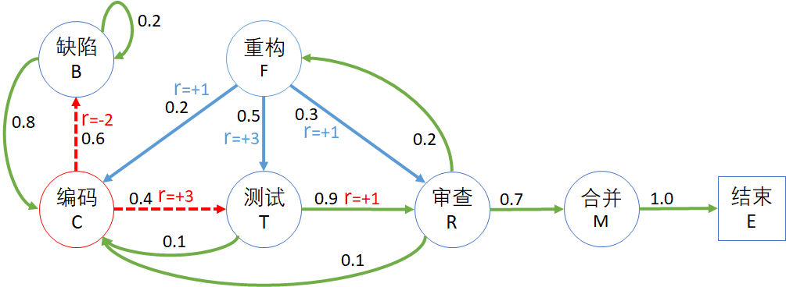

## 7.4 应用贝尔曼方程

### 7.4.1 手工计算状态价值函数

下面我们来一起解决开发流程问题模型中的状态价值函数计算问题。

图 7.4.1 开发流程问题模型

图 7.4.1 中，每个状态下方都用括号表示了该状态的序号，比如“编码(1)”表示状态序号 1，其价值函数值用 $v_1$ 表示。

以状态“测试(2)”为例，根据贝尔曼方程，即式（7.3.13.3），可以得到其价值函数的表达式为：

$$
\begin{aligned}
v_2&=R(s_2)+\gamma[p_{s_2,s_1} \cdot v(s_1)+p_{s_2,s_3} \cdot v(s_3)]
\\
&=1 + \gamma (0.1 v_1 + 0.9 v_3)
\end{aligned}
$$

为简化起见，在下面的计算中我们令 $\gamma=1$，不影响对计算过程的说明。

同理可以得到其它所有状态的价值函数表达式，列出方程组如下：

$$
\begin{cases}
v_0=(-3)+0.2v_0+0.8v_1 & (1)
\\
v_1=(0)+0.6v_0+0.4v_2 & (2)
\\
v_2=(+1)+0.1v_1+0.9v_3 & (3)
\\
v_3=(+3)+0.1v_1+0.2v_4+0.7v_5 & (4)
\\
v_4=(+2)+0.2v_1+0.5v_2+0.3v_3 & (5)
\\
v_5=(-1)+v_6 & (6)
\\
v_6=0 & (7)
\end{cases}
\tag{7.4.1}
$$

注意终止状态价值函数为 0，所以 $v_6=0$。

这是一个七元一次方程组，肯定有解。先简化式 7.4.1 中的各项，得到新的表达式：

$$
\begin{cases}
v_0=v_1-3.75 & (1)
\\
v_1=0.6v_0+0.4v_2 & (2)
\\
v_2=0.1v_1+0.9v_3+1 & (3)
\\
v_3=0.1v_1+0.2v_4+2.3 & (4)
\\
v_4=0.2v_1+0.5v_2+0.3v_3+2 & (5)
\\
v_5=-1 & (6)
\\
v_6=0 & (7)
\end{cases}
\tag{7.4.2}
$$

- 由子式（1）可知：$v_0=v_1-3.75$
- 由子式（2）可知：$v_2=v_1+5.625$
- 由子式（3）可知：$v_3=v_1+5.13888$

将上述三项以及子式（5）都变成 $v_1$ 的表达式，带入子式（4）的两侧，可以得到：

$$
v_1+5.13888=0.1v_1+0.2[0.2v_1+0.5(v_1+5.625)+0.3(v_1+5.13888)+2]+2.3
$$

得到：$v_1 \approx 2.24$，然后再逐一解决其它变量，最终的结果为：

$$
\begin{cases}
v_0 \approx -5.99
\\
v_1 \approx -2.24
\\
v_2 \approx 3.38
\\
v_3 \approx 2.90
\\
v_4 \approx 4.11
\\
v_5=-1
\\
v_6=0
\end{cases}
\tag{7.4.3}
$$

读者可以用式（7.4.3）的结果验证式（7.4.1）中的任意等式。

我们把式（7.4.3）的计算结果都标注在图 7.4.2 中的每个状态下方便于观察。

图 7.4.2 价值函数计算结果

得到结果后，可以验证一下图 7.4.2 中红色线条部分：

$$
2.90 \approx 3 + 1 \times [0.1\times(-2.24)+0.2 \times 4.11  + 0.7 \times (-1) ]
$$

完全符合价值函数的定义式（7.3.13）。

### 7.4.2 给过程定义奖励

在图 7.1.2 中，是通过给状态定义奖励来得到 $R(s)$ 值的，直接使用贝尔曼方程式（7.3.13）的第 3 种形式即可。

前面我们学习过，有的问题是注重状态，有的问题是面向过程。如果遇到的问题是给过程定义奖励，应该如何解决？很简单，使用贝尔曼方程的第 1 种形式即可，即式（7.3.13.1）。

图 7.4.3 过程奖励方式

如图 7.4.3，标出了 6 个过程的奖励，其它过程未标出。其中，与编码状态 $s_C$ 相关的用红色标出：

- 下游状态是 缺陷 $s_B$ 和 测试 $s_T$；
- 转移概率 $p_{ss'}$ 分别是：$p_{s_C,s_T}=0.4, \ p_{s_C,s_B}=0.6$；
- 奖励值 $r_{ss'}$ 分别是：$r_{s_C,s_T}=+3, \ r_{s_C,s_B}=-2$。

则编码状态 $s_C$ 的状态奖励值为：

$$
\begin{aligned}
R(s_C) &= p_{s_C,s_T} \cdot r_{s_C,s_T} + p_{s_C,s_B} \cdot r_{s_C,s_B}
\\
&=0.4 \times 3 + 0.6 \times (-2)
\\
&=0
\end{aligned}
$$

同理，重构状态 $s_F$ 的状态奖励值（用蓝色标出）为：

$$
\begin{aligned}
R(s_F) &= p_{s_F,s_C} \cdot r_{s_F,s_C} + p_{s_F,s_T} \cdot r_{s_F,s_T} + p_{s_F,s_R} \cdot r_{s_F,s_R}
\\
&=0.2 \times 1 + 0.5 \times 3 + 0.3 \times 1
\\
&=2
\end{aligned}
$$

然后再列方程组即可得解。

### 思考与练习

1. 读者可以自行验证图 3 中的“缺陷”状态的价值函数，以获得深刻理解。
2. 读者可以用贝尔曼方程验证醉汉回家简化版中的状态奖励和价值函数的计算结果。
