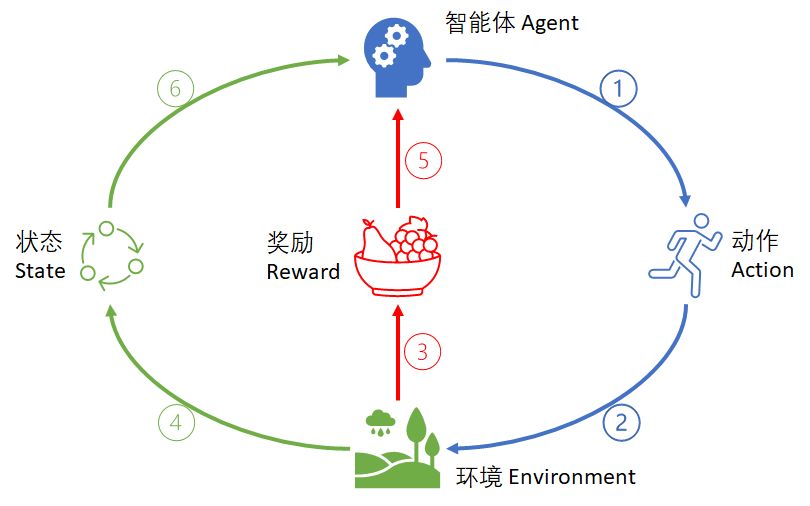
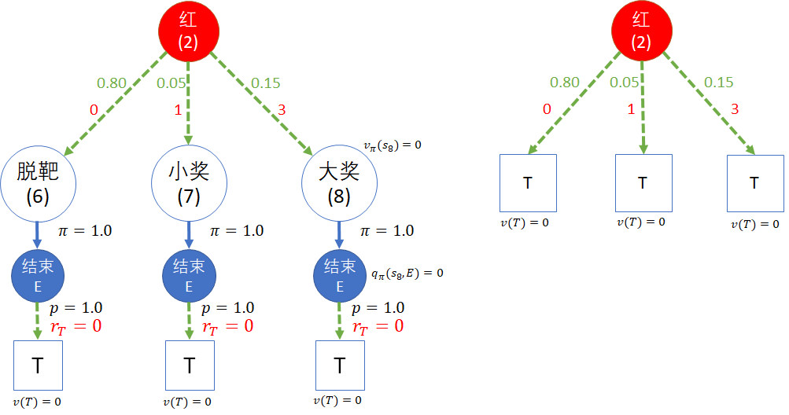

# 第 8 章 从状态价值到动作价值


我们仍然以前面学过的的状态转移问题来开始本章的学习，通过动手实验来发现这种方法的不足，然后引入新的概念，以便可以解决更复杂的问题。


### 8.1.0 温故知新

在前面的章节中，我们利用贝尔曼方程，可以解决比较复杂的马尔科夫奖励过程 MRP 的问题。无论是安全驾驶问题，还是软件工程问题，似乎都是在描述一种状态转移的规律，但是这些状态转移是如何发生的呢，我们并没有仔细考察，也就是说我们只看到了现象，不知道原因，所以只能说是一种统计的结果。

在本章中我们重点学习的是如何

### 本章目录

### 参考资料


## 8.1 射击气球问题

### 8.1.1 提出问题

在游乐场，有一个用玩具枪射击气球中奖的游戏，如图 8.1.1 所示。

<center>


图 8.1.1 射击气球游戏
</center>

游戏规则是这样的：

1. 游客花 4 元钱买 2 颗塑料子弹，得到两次射击机会；
2. 墙上有两个气球，一个蓝色大气球，一个红色小气球，每次射击前，游客可以任意选择目标；
3. 射中蓝色大气球可以得到小奖，价值 1 元；
4. 射中红色小气球可以得到大奖，价值 3 元；
5. 脱靶不得奖。

游乐场老板经过几个月的营业后进行了一些粗略的统计，当然老板的目的不是做人工智能学习，而是要看能否多赚钱。结果如图 8.1.2 所示。

<center>


图 8.1.2 游客中奖情况统计
</center>

统计结果说明：

1. 游客在第一枪射出后：

   - 脱靶的概率是 0.56；
   - 中小奖的概率是 0.38；
   - 中大奖的概率是 0.06；

2. 第二枪根据第一枪的结果而有所不同：

   比如，如果第一次射击中大奖，则第二枪时：

   - 脱靶的概率是 0.40，比初始的 0.56 要低；
   - 中小奖的概率是 0.50，比第一枪的 0.38 要高，因为有了一定的经验而提高了命中率；
   - 继续中大奖的概率会是 0.10，比第一枪的 0.06 提高了一些。

   其它统计数字在图 8.1.2 中显示，不再赘述。

老板设计的这个游戏很精明，因为游客会从数字中得到暗示：如果我中一个大奖和一个小奖，正好得 4 元钱的奖品，抵掉了两支枪的花销。但实际上的中奖概率很低。那么做为一个聪明的游客，你应该如何选择呢？

### 8.1.2 错误的 MRP 模型

在前面的章节中，我们学习过马尔科夫奖励过程（MRP）的知识，是否可以把图 8.1.2 转换成状态转移矩阵与奖励函数，用来计算“脱靶、小奖、大奖” 三个状态的哪一个的状态价值函数值最大，来判断选择哪种方案呢？

有些读者在前面的学习中基础很牢固，于是可以立刻画出如图 8.1.3 的状态转移图和转移概率表。

<center>


图 8.1.3 MRP 模型下的状态转移
</center>

然后在前面的代码的基础上换一下数据（状态、转移、奖励），即可用矩阵法立刻解出结果。

我们可以先检查一下这个状态转移矩阵的收敛情况：

【代码位置】Shoot_0_MPR_Wrong.py

```
折扣 = 1
------------------------------
迭代100次, 检查状态转移矩阵是否趋近于 0:
[[0.    0.524 0.405 0.071]
 [0.    0.524 0.405 0.071]
 [0.    0.524 0.405 0.071]
 [0.    0.524 0.405 0.071]]
------------------------------
价值函数：
Start:  6174930.04
Miss:   6174934.04
Small:  6174935.15
Grand:  6174937.304
```

当折扣值 $\gamma=1$ 时，这个转移矩阵本身收敛到了 [0, 0.524, 0.405, 0.071]，意味着如果游客持续地射击多次，脱靶的可能性最大（0.524），中小奖的可能性为 0.405，中大奖的可能性为 0.071。

从输出的价值函数值看，值都很大。因为可以在多个状态之间不断地循环，获得很多很多奖励。但是却忽略了一个条件：每个游客只能射击两次。如果要多次射击的话，需要停下来买更多的子弹，然后就要重新开始了。从图 8.1.3 左图来看，“开始”状态只经历了一次，所以这个状态转移图画得不对。

另外，矩阵自乘 100 次没有收敛到全 0 状态，说明用迭代法计算状态价值函数是有问题的，会有无限奖励。

下面我们看看 $\gamma=0.9$ 时的情况：

```
折扣 = 0.9
------------------------------
迭代100次, 检查状态转移矩阵是否趋近于 0:
[[0. 0. 0. 0.]
 [0. 0. 0. 0.]
 [0. 0. 0. 0.]
 [0. 0. 0. 0.]]
------------------------------
价值函数：
Start:  1.501
Miss:   5.501
Small:  6.599
Grand:  8.736
```

这次的转移矩阵趋近于 0 了，说明迭代可以收敛。价值函数基本反映出了各个状态的比较结果。但还是存在前面说过的问题：在后面的三个状态转移中，没有包括前面的“开始”状态，相当于可以无限次射击，忘了只有两发子弹的限制。所以图 8.1.3 的模型是错误的。

### 8.1.3 正确的 MRP 模型

这个问题的正确模型应该如图 8.1.4 所示，是一个有向无环图，而不是像图 8.1.3 那样是个有环图。

<center>


图 8.1.4 正确的的状态转移图
</center>

图例说明：

- 蓝色圆圈内的文字是状态描述，括号内的数字是该状态的序号。
- 绿色连线是状态转移方向，黑色数字是状态转移概率。
- 红色的 $R$ 是奖励值。奖励是定义在状态上的，在绘图时故意让字母 $R$ 与状态区域重合，以强调这一点。
- 蓝色方框是终止状态 T。

表 8.1.1 为各个状态的说明。

表 8.1.1 状态说明

| 状态序号      | 描述                                                         | 奖励 | 转移                                               |
| ------------- | ------------------------------------------------------------ | ---- | -------------------------------------------------- |
| (0) 开始      | 一级状态。<br>游客花 4 元钱买两颗塑料子弹，然后选择第一次射击的目标。 | R=-4 | 0.56：脱靶(1)<br>0.38：小奖(2)<br>0.06：大奖(3)    |
| (1) 脱靶      | 二级状态。<br>不知道游客的选择是什么，只看到脱靶的结果       | R=0  | 0.56：脱靶(4)<br>0.38：小奖(5)<br>0.06：大奖(6)    |
| (2) 小奖      | 二级状态。<br>游客射中蓝色气球。                             | R=1  | 0.50：脱靶(7)<br>0.42：小奖(8)<br>0.08：大奖(9)    |
| (3) 大奖      | 二级状态。<br>游客射中红色气球。                             | R=3  | 0.40：脱靶(10)<br>0.50：小奖(11)<br>0.10：大奖(12) |
| (4,7,10) 脱靶 | 三级状态。不知道游客的选择是什么，只看到脱靶的结果。         | R=0  | 1.0：结束                                          |
| (5,8,11) 小奖 | 三级状态。游客射中蓝色气球。                                 | R=1  | 1.0：结束                                          |
| (6,9,12) 大奖 | 三级状态。游客射中红色气球。                                 | R=3  | 1.0：结束                                          |

补充说明：

- 状态分为三级，是为了在后面的章节中容易描述，没有什么特殊的原因。
- 虽然状态中有四个“大奖”，四个“小奖”，四个“脱靶”，但是这四个状态不是同一个状态，只是名字一样而已，在图中特意用序号把它们都区分开了。
- 所有的三级状态（序号4~12），最后都接一个终止状态 T，在第二次射击后，都会以 1 的概率达到该状态。


为什么状态中含有四个“大奖”不能只用一个状态来表示呢？换句话说，为什么图 8.1.3 是错误的呢？

就好比从一楼上 10 级台阶到二楼，台阶可以定义为 $S_{1,1}$ 到 $S_{1,10}$；而二楼到三楼同样有 10 级台阶，定义为 $S_{2,1}$ 到 $S_{2,10}$。但所处的楼层不一样，所以它们也是 20 个不同的状态，不能把 $S_{1,1}$ 和 $S_{2,1}$ 混为一谈。

如果除了楼梯以外，还有一个滑梯，从 $S_{2,1}$ 能直接滑到 $S_{1,1}$，从而造成环，那就是两个状态之间的循环转移，在本例中并不存在。

### 8.1.4 计算 MRP 模型的状态价值函数

因为这个问题中的状态数只有 13 个，所以可以使用矩阵法来轻松解决。

【代码位置】Shoot_1_MPR_Correct.py

```
状态价值函数：
------------------------------
v0 = -2.83
----------
v1=0.56,        v2=1.66,        v3=3.8
----------
v4=0.0,         v5=1.0,         v6=3.0
v7=0.0,         v8=1.0,         v9=3.0
v10=0.0,        v11=1.0,        v12=3.0
```

最终的状态价值函数结果标在图 8.1.5 中，圆圈内的数值是马尔可夫奖励过程的状态价值函数值。

<center>


图 8.1.5 MRP 模型的状态价值函数值
</center>

所以，从统计学的观点看，$s_0$ 的状态函数值 $v_0$ 告诉我们只要游客买了子弹，就已经亏了，老板是稳赚不赔的。当然不排除个别游客（射击能手）连续两次击中大奖。而一般人都会高估自己（哈哈，科学的说法是：不能正确地评估自己），一些游客会因为想到最大值为 3+3=6 的奖励而参与，一些游客只是因为没有打过枪而参与。

那么游客应该怎么选择呢？

- 虽然 $v_{3}=3.8$ 状态价值最高，但是从 $s_0$ 到达 $s_3$ 只有 0.06 的概率，可以理解为游客的预期收益是：$0.06 \times 3.8 = 0.228$ 元。
- $s_1$ 的预期收益是 $0.56 \times 0.56 = 0.3136$ 元。
- $s_2$ 的预期收益是 $0.38 \times 1.66 = 0.6308$ 元。

上面三个状态的预期收入值相加为 0.228+0.3136+0.6308=1.1724 元，正好等于游客开始花的 4 元再加上 $v_0$ 的值，即 $4-2.83\approx1.17$，这也是 $v_0$ 的表达式告诉我们的。


所以游客第一次射击时应该选择 $s_2$，即“小奖”状态，然后第二次射击时继续选择“小奖”状态。这样虽然肯定不能赢回开始花的 4 元钱，但是可以做到损失最小（或者收益最大）。

### 思考与练习

1. 手工计算图 8.1.4 模型中的状态价值函数。提示：可以从后向前计算，比较方便。

## 8.2 策略与动作

### 8.2.1 疑问

在 8.1 节中，我们经过一番分析，纠正了错误的模型图，得到了一个看似合理的结果。但仔细想一想，其实上面的解题过程是有问题的：

1. 原问题是“聪明的游客会如何选择？”，但是整个解题思路是根据游乐场老板的统计结果进行的，是从老板的角度出发，而非游客的角度。
2. 在一级的三个状态中（大奖，小奖，脱靶），它只代表“结果”，而不代表“选择”，较真儿地说，没有游客会选择“脱靶”状态，因为“脱靶”只是个结果。
3. 如果忽略前面两个疑问，最后得到了 $v_1,v_2,v_3$ 的值，游客会看到 $v_3$ 最大，所以会误导其选择大奖而射击小气球，但是忽略了击中的难度。现实生活中人们往往也有类似的经历，想利益最大化，却忽略了风险。

实际上，老板并不知道游客选择的是哪个气球，他只看到了最终的结果。游客自己也不会主动说我要射击哪一个气球，避免“打哪儿指哪儿”的尴尬场面出现。

### 8.2.2 有洞察力的数据

经过对游客的调查与过程观察，以及与老板的访谈，我们得到了一些更细化的统计数据，如图 8.2.1 所示。

<center>


图 8.2.1 细化的第一次射击数据（模型）
</center>

请读者注意，图 8.2.1 中的一些数字看上去很陌生，与图 8.1.2 完全“对不上”。但是这里的数字才是产生后者的根本原因，后者只是统计结果而已。

图例说明：

1. 在开始状态时，游客可以选择的**策略** $\pi$ 有两个：
   - $a_1$ - 选择射击小气球而中大奖，大概有 40% 的人选择，记为 $\pi_1=0.4$。
   - $a_2$ - 选择射击大气球而中小奖，大概有 60% 的人选择，记为 $\pi_2=0.6$。

2. 执行**动作** $a_1$，在射击红色小气球时，有可能的**过程**及**结果**是：
   - 有 0.80 的概率**脱靶**，记为 $p_{11}=0.80$；
   - 还有 0.05 的概率歪打正着地击中大气球而得**小奖**，记为 $p_{12}=0.05$。
   - 因为红色气球比较小，不容易击中，只有 0.15 的概率打中得**大奖**，记为 $p_{13}=0.15$；

3. 选择**动作** $a_2$，在射击大气球时，有可能的**过程**及**结果**是：
   - 有 0.4 的概率**脱靶**，记为 $p_{21}=0.4$；
   - 因为蓝色气球比较大，容易击中，有 0.6 的概率击中得**小奖**，记为 $p_{22}=0.6$；
   - 没有任何运气可以击中小气球，记为 $p_{23}=0.0$。
     - 这种情况在实际解题时可以不必画出来，在这里画出来是为了把细节讲清楚，避免误解。

请读者注意在 $a_2$ 部分下的 [0.4,0.6] 是状态转移概率，与开始状态 $s$ 下的策略选择概率 [0.4,0.6] 只是在数值上恰巧相同，含义完全不同。

现在可以统计一下各种中奖的情况：

- 脱靶的概率是两种情况之和：

  1. 选择射击红色气球，脱靶， $\pi_1 p_{11}= 0.4 \times 0.8 = 0.32$
  2. 选择射击蓝色气球，脱靶， $\pi_2 p_{21}= 0.6 \times 0.4 = 0.24$

  二者之和为 $0.32+0.24=0.56$

- 中小奖的概率是两种情况之和：

  1. 选择射击红色气球，但却误中蓝色气球，$\pi_1 p_{12}= 0.4 \times 0.05 = 0.02$
  2. 选择射击蓝色气球并击中，$\pi_2 p_{22}= 0.6 \times 0.6 = 0.36$

  二者之和为 $0.36+0.02=0.38$

- 中大奖的概率是两种情况之和：

  1. 选择射击红色气球，击中， $\pi_1 p_{13}= 0.4 \times 0.15 = 0.06$
  2. 选择射击蓝色气球，却击中红色气球， $\pi_2 p_{23}= 0.6 \times 0.0 = 0.00$

  二者之和为 $0.06+0.00=0.06$

上面的三种情况的结果 $[0.56, 0.48, 0.06]$ 和图 8.1.2 中老板统计的第一次射击的结果是一致的。但是图 8.2.1 中的数据更具有洞察力，可以让我们做到“知其所以然”。

### 8.2.3 带有动作节点的全新模型

在图 8.2.1 中，我们给一级和二级状态之间增加了动作节点，并且计算出在经过**策略/动作选择**和**状态转移**两个过程后，得到的中奖数据与老板的统计数据相同。

需要注意的是，在图 8.1.2 中的二级状态只有 3 个节点（脱靶、小奖、大奖），而图 8.2.1 中的二级状态有 5 个有效（转移概率不为 0）节点。

- 在**做结果统计**的时候，可以把 $a_1,a_2$ 的下游状态中具有相同名称的结果相加（比如两种情况下脱靶的总概率为 0.32+0.24=0.56），但实际上它们还是不同的状态，各自具备不同的价值函数。

- 在**做过程分析**的时候，这些状态节点中具有相同名称的节点是不能合并在一起的，因为其**来源**不同，必然会造成**去向**也不同。保留来龙去脉的过程，是我们本章要学习的新模型的重要特征。

下面我们需要在二级状态后也增加动作节点，以便可以得到该问题的全模型，如图 8.2.2 所示。

<center>


图 8.2.2 带有动作节点的全新模型
</center>

#### 图例说明

- 空心圆：状态节点，含状态名称和序号（括号内的数字，0~5）。
- 实心圆：动作节点，含动作名称和序号（括号内的数字，0~11）。
- 蓝色连线：动作选择，含策略概率（蓝色数字）。
- 绿色连线：状态转移，含转移概率（绿色数字）。
- 红色数字：奖励值。**注意，是奖励给转移过程的**，即：**过程奖励。**
- 长方框：终止节点。

#### 模型说明

- 状态节点

  - 用状态名称和序号加以区分，比如“小奖(2)”和“小奖(5)”是两个不同的状态。
  - 状态空间的值为 7，即一共有 7 个状态。
    - 状态空间的定义是集合 $S$，一般说到 $s \in S$，意思是某个状态 $s$ 在 $S$ 集合中。
  - 状态节点下都有两个动作选择：红色和蓝色。
  - 最下面的长方形节点是终止状态。

- 动作节点

  - 用动作名称和序号加以区分，比如“红(2)”和“红(4)”，表明它们是不同的两个动作。
  - 动作空间的值为 2，因为每个状态下只有两个动作：选择射击红色气球或蓝色气球。
  - 射击红色气球后，有可能的状态转移有三种：脱靶，小奖，大奖。
  - 射击蓝色气球后，有可能的状态转移有两种：脱靶，小奖。

  读者可能会有疑问：为什么动作空间不是 12？

    - 动作空间的定义是 $A(s)$，$a \in A(s)$，举例来说，在“大奖(3)”状态，即 $s=$“大奖(3)” 时，$A(s)$ 集合中只有两个动作，红色或蓝色，而不是 12 个。

- 策略
  在本例中，策略始终保持不变，在任何状态下（除了终止状态）：0.4 的概率选择红色，0.6 的概率选择蓝色。

- 状态转移
  根据上游状态节点的不同，下游的转移概率也不尽相同。举例来说：

  - “红(0)”下面的转移概率是 [0.80, 0.05, 0.15]，是初始转移概率。
  - “红(6)”下面的转移概率是 [0.70, 0.05, 0.25]，
    - 因为在“红(0)”击中红球后，进入“大奖(3)”状态，游客的经验增加，射中红色气球的概率也会增加，从初始的 0.15 升高到 0.25；
    - 相应地脱靶概率从 0.80 降低为 0.70；
    - 而误中小奖的概率不变，保持在很小的 0.05 的概率。

- 奖励
  奖励是附加在状态转移过程上的：

  - 0：脱靶。
  - 1：中小奖。
  - 3：中大奖。

#### 终止节点的模型设计

在图 8.2.2 中，我们看到了一个比较奇怪的现象：所有的二级动作（序号 2~11）的下游状态，全都归结于同一个终止节点(6)。为什么这样设计呢？

其实在这里有两种设计方法，如图 8.2.3 所示。

<center>


图 8.2.3 不同的终止节点设计方法
（左图：动作节点下接非终止节点；右图：动作节点下接终止节点。）
</center>

- 左侧

  再多设计出 3 个状态 $s_6,s_7,s_8$，用于承载动作“红(1)”的结果。记住动作“蓝(3)”也会有两个状态，命名为 $s_9,s_{10}$，这样的话，一对动作就会有 5 个下游状态，五对动作一共要增加 25 个下游状态。

- 右侧

  像目前这样，用终止节点 T 直接接到动作“红(2)”上。这里画了 3 个终止节点，与图 8.2.2 的共用同一个终止节点没有本质区别。

在这里我们先把问题提出来，等到我们后面学习完动作价值函数的知识后，再给予解答。

### 8.2.4 验正老板的统计数据

下面我们验正一下游乐场老板在图 8.1.2 中关于第一次得“小奖”后第二次也得“小奖”的统计数据是否正确。

在图 8.2.2 中：

- 左侧状态“小奖(2)”下面，看“红(4)”和“蓝(5)”两个动作下的得到 $r=1$ 的转移概率（0.05,0.55）：

$$
p_{left}= 0.4 \times 0.05 + 0.6 \times 0.55 = 0.35
$$

- 右侧“小奖(5)”下面，看“红(10)”和“蓝(11)”两个动作下的得到 $r=1$ 的转移概率（0.04,0.75）：

$$
p_{right}=0.4 \times 0.04 + 0.6 \times 0.75 = 0.466
$$

- 状态“开始(0)”下面，左侧“红(0)”的策略选择概率是 0.4，右侧“蓝(1)”的策略选择概率是 0.6：

$$
p_{all} = \pi_1 \times p_{left} + \pi_2 \times p_{right} = 0.4 \times 0.35 + 0.6 \times 0.566= 0.4196 \approx 0.42
$$

所以最后的结果是 0.42，与图 8.1.2 中老板的统计值一致。只不过老板知其然不知其所以然，只看到了统计结果，没有深入到过程细节中，而这正是我们接下来要学习的问题。

用代码也可以验证所有情况，输出结果如下：

【代码位置】Shoot_2_DataModel.py

```
第一枪脱靶 0.56
        第二枪脱靶 0.56
        第二枪小奖 0.38
        第二枪大奖 0.06
第一枪小奖 0.38
        第二枪脱靶 0.5
        第二枪小奖 0.42
        第二枪大奖 0.08
第一枪大奖 0.06
        第二枪脱靶 0.4
        第二枪小奖 0.5
        第二枪大奖 0.1
```

有读者会问：如果有了老板的统计结果，能不能反推出这个模型呢？答案是不能。因为可能会有很多种组合都可以满足老板的统计结果，模型不是唯一的。


## 8.3 马尔可夫决策过程 MDP

### 8.3.1 强化学习模型

在引入了策略动作后，强化学习的模型就已经很完备了，如图 8.3.1。

<center>



图 8.3.1 强化学习模型
</center>

#### 图例说明

- 智能体：强化学习的行为主体，比如一个机器人，或者一个程序。
- 环境：根据智能体的不同，这个环境的定义也不同。比如智能体是狼，那么环境就是由草原、羊群、其它狼等构成。如果智能体是工业机器人，则环境由生产线、工件、流程等构成。
- 状态：智能体所在的与环境相关的状态，可能有很多状态，比如棋类游戏中的每一个盘面。也可能很少的状态，比如扫地机器人一共只有“充电、扫地”两个状态。
- 动作：智能体在不同状态下根据策略而采取的动作，其目的是从环境处获得奖励。
- 奖励：环境给与智能体的反馈，可能是食物、胜负、荣誉等等虚头八脑的东西，但是一定是可以量化的数值。可以是正数或负数，只与奖励值的相互比较的大小有关，与绝对大小无关。比如在一个环境中，令 $R_1=1,R_2=2$，和令 $R_1=-1,R_2=1$，是没有区别的，只要 $R_2 \gt R_1$ 即可。

#### 序号说明

1. 智能体做策略选择；
2. 执行动作影响环境；
3. 环境给与即时奖励；
4. 环境产生新的状态；
5. 智能体得到奖励；
6. 智能体得到新状态。

#### 环境、状态、决策、动作、过程、奖励、结果

回顾一下人们所了解的所有智能生物的行为，都是根据当前**环境**和自身**状态**情况先做出**决策**，选择**动作**，经历**过程**，然后得到**奖励**与**结果**。

- 这里的**决策**（或**策略**），可以是一个函数，直接输出一个选择好的动作值，如射击问题中得红色的 $a_1$ 或蓝色的 $a_2$。
- 这里的**结果**就是图 8.2.2 中的状态，包括开始、大奖、小奖、脱靶，与**马尔可夫过程**以及**马尔可夫奖励过程**中的状态是一个概念。


先有奖励还是先有结果？

从模型上看，在等待**结果**的**过程**中得到**奖励**，但是**过程**具有不确定性。

那么**过程**如何理解呢？

最简单并且容易理解的说法是：人们做一件事，一般都会有两个结果，即成功和失败，你可以努力争取成功，但是并不能完全避免失败。这就可以叫做**转移概率**。只不过你非常努力的时候，转移到成功状态的概率较大，而转移到失败状态的概率较小。

用本例来说明的话，可以解释为：

- 游客可能第一次射击，没经验，所以打偏；
- 枪得准星可能不准，游乐场老板也不用心维护；
- 气球会在风中有微小摆动；
- 周围的环境嘈杂，游客不能击中精力射击；
  ......

诸如此类的环境因素会造成在选择动作后，却偏离既定目标，得到意想不到的结果。这与**马尔可夫过程**以及**马尔可夫奖励过程**中的状态转移概率不尽相同，而且一般也不用矩阵形式来描述。因为矩阵中的元素所处的行列数值，都代表了状态的序号，而在马尔科夫决策过程部分，没有办法把动作和状态放在一起来形成矩阵。简单地说就是用动作把矩阵分割成了很多小的部分，在每个小部分中没有环状的状态转移存在。


### 8.3.2 马尔可夫决策过程 MDP

在上一节中，我们在上下游的状态之间引入了策略和动作，即，在马尔可夫奖励过程中引入策略和动作的概念，就形成了一个新的概念：**马尔可夫决策过程**。它是图 8.3.1 所示的强化学习模型的具体体现。

用一个文字公式来表示 MDP（Markov Decision Process，马尔可夫决策过程）：

$$
马尔可夫决策过程 = 马尔可夫奖励过程 + 动作策略
$$

#### 过程描述

<center>


图 8.3.2 马尔可夫决策过程
</center>

图 8.3.2 是一个马尔可夫决策过程。可以通过实体与箭头的位置，来准确地理解该过程中各元素产生的地点和顺序。其中的下标表示时间序号。比如：

- 动作 $a$ 是发生在状态 $s$ 的右端点上，有了 $a$ 才会有状态转移。
- 在 $s_1$ 执行了 $a_1$ 后，有可能到实线的 $s_2$，也有可能到另外一个虚线的 $s_2$，这不是 $a_1$ 所能控制的，属于状态转移。
- 在到达 $s_2$ 的过程中产生 $r_2$。这样定义可以保证唯一性，是为了区别从其它状态到达 $s_2$ 时的奖励。

在前面的马尔科夫**奖励**过程中，我们知道组成其过程的是一个四元组数据 $<S,P,R,\gamma>$，分别是状态、转移概率、奖励、折扣。进一步，在马尔可夫**决策**过程中，通过上一小节中引入的新元素“动作”，可以得到一个五元组数据 $ <S,A,P,R,\gamma>$，其中 $A$ 代表动作。

请读者注意上述五元组数据序列的顺序：

1. 必须从一个状态 $S$ 开始；
2. 执行一个动作 $A$；
3. 会以概率 $P$ 转移到下一个状态 $S'$；
4. 在转移过程中得到奖励 $R$；
5. 最后计算整个序列的回报时可以有折扣 $\gamma \in [0,1]$。

表 8.3.1 是三种过程的简单比较。

表 8.3.1 三种过程的简单比较

| 过程名称             | 组成元素           | 数据序列                                         | 计算          |
| -------------------- | ------------------ | ------------------------------------------------ | ------------- |
| 马尔可夫过程 MP      | $<S,P>$            | $S_0,S_1,\cdots,S_t$                             |               |
| 马尔可夫奖励过程 MRP | $<S,P,R,\gamma>$   | $S_0,R_1,S_1,R_2,\cdots,S_t,R_{t+1}$             | $V$           |
| 马尔可夫决策过程 MDP | $<S,A,P,R,\gamma>$ | $S_0,A_0,R_1,S_1,A_1,R_2,\cdots,S_t,A_t,R_{t+1}$ | $V_\pi,Q_\pi$ |

#### 策略选择模型（$S \to \pi \to A$）

如图 8.3.3 所示。

<center>


图 8.3.3 马尔可夫决策过程的策略选择模型
</center>

- 策略 $\pi$

  用 $\pi(a|s)$ 表示在状态 $s$ 下选择动作 $a$。蓝色的弧形虚线表示作用范围。
  特别地，$\pi(a_1|s)$，表示在 $s$ 状态下，根据策略 $\pi$ 执行动作 $a_1$。其通用定义为：

  $$
  \pi(a|s) \doteq \mathbb P [A_t=a|S_t=s] \tag{8.3.1}
  $$

  用文字描述为：在时刻 $t$ 的状态为 $s$ 时选择动作 $a$ 的概率。大写的 $A_t,S_t$ 表示变量或集合，小写的 $a,s$ 表示实例数值。

  在射击气球问题中，动作有两个，射击红色气球和射击蓝色气球。如何选择这两个动作就是策略问题。

  策略可以被描述为一个函数，函数的最终输出是一个确定的动作值，比如 $a_1$ 或 $a_2$。但是函数的内部运算方法可以有两种：

  - **概率选择方法**，具体的说就是用类似下面这个函数：

    ```Python
    a = np.random.choice([a1,a2], p=[0.4,0.6])
    ```

    来得到动作值 $a$，概率大的动作理所当然地有较大的概率被选中。

  - **最佳动作方法**，就是用类似下面这个函数：

    ```Python
    a = np.argmax([p1,p2])
    ```

    来得到动作值 $a$，概率小的那个动作永远没有被选中的机会。

  策略函数不能输出一个概率让调用者做决定，否则就失去了决策的意义。而马尔科夫决策过程中的**决策**两字，实际上就是来学习如何制定策略，输出动作。

#### 状态转移模型（$A \to p \to S'$）

如图 8.3.4 所示。

<center>


图 8.3.4 马尔可夫决策过程的状态转移模型
</center>

- 转移概率 $p$
  每个动作下面都会存在一个转移概率，绿色的弧形虚线表示作用范围。特别地，如果只有一个下游状态存在，则转移概率值为 1。

  - $p^{a}_{ss_1}$，小写的 $p$ 表示在动作 $a$ 发生后，从状态 $s$ 转移到状态 $s_1$ 的概率的实例，上标 $a$ 要保持和动作符号一致，下标 $ss_1$ 要保持和上下游状态符号一致；

  - $P^{a}_{ss'}$，大写的 $P$ 表示 $a$ 动作的所有下游状态的转移概率的集合（用向量表示），在本例中包括两个元素 $P^{a}_{ss'}=[ p^{a}_{s s_1},p^{a}_{s s_2}]$。其通用表达式为：

  $$
  P^a_{ss'}=\mathbb P [S_{t+1}=s'|S_t=s, A_t=a] \tag{8.3.2}
  $$

  用文字描述为：在时刻 $t$ 的状态 $s$ 下采取动作 $a$ 后转移到时刻 $t+1$ 的状态 $s'$ 的概率。大写的符号是变量，小写的符号是实例。

  在实际运算中，转移概率 $p$ 值可以直接作为权重系数与后面的主体（状态价值或奖励）相乘，以表达数学期望。

#### 完整模型（$S \to \pi \to A \to p \to S'$）

把**策略选择模型**和**状态转移模型**组合起来，绘制出图 8.3.5 的马尔可夫决策过程的完整模型。

<center>


图 8.3.5 马尔可夫决策过程的完整模型
</center>


图 8.3.5 实际上是图 8.2.1 的一个抽象，去掉了与应用场景相关的表达，但又不是抽象到无法理解，所以这是一个马尔可夫决策过程的**实例化**模型。为什么叫实例化模型呢？因为图中的各个子元素都带有序号，而不是笼统抽象的符号。比如：

- 状态

  用空心的圆表示，里面标出了状态序号，如 $s_0, s_1$ 等。

  两侧的 $s,s'$ 和 $S_t,S_{t+1}$，是一种概念的两种表达形式，在公式推导中，一般会用 $s,s'$ 表示当前状态和下一个状态的**实例**，用 $S_t,S_{t+1}$ 来强调**时序**关系的和状态**变量**。

  状态一定是源于动作，终于动作，不能两个状态直接连在一起。状态是状态转移的结果。

- 动作

  用实心的圆表示，里面标出了动作序号，如 $a_1,a_2$ 等。
  动作一定是源于状态、终于状态，不可能两个动作直接连接在一起。动作是策略选择的结果。

- 过程

  图 8.3.5 中带有箭头的线都表示过程，有两类：

  - 蓝色实线：表示策略 $\pi$ 的动作选择过程。**这是强化学习的主要学习目标**。

  - 绿色虚线：表示概率 $P$ 的状态转移过程。**这是区别有模型与无模型强化学习问题的主要标志**。有明确的转移概率的，叫做**有模型**（model based），否则叫做**无模型**（model free）。

  这里用绿色虚线可以给色弱的朋友们提供更好的帮助，以便可以轻松地与蓝色实线区分开来。

#### 奖励模型

在奖励模型中，我们使用了面向过程的奖励方法。与在**马尔可夫奖励过程**中学习过的面向过程的奖励方法相似，区别是：

- 在前面的**马尔可夫奖励过程**中，定义的是 $S \times S' \to r$，即状态到状态的转移过程中产生的奖励。
- 在本节的**马尔可夫决策过程**中，定义比较复杂，请看图 8.3.6。

<center>


图 8.3.6 马尔可夫决策过程的奖励模型
</center>

在图 8.3.6 中，简化了一些符号，比如状态转移概率用 $p_1,\cdots,p_5$ 表示（图 8.3.5 中用 $p^a_{ss'}$ 表示，但含义一致），重点突出了**红色**的奖励机制。

共有三层元素来描述整体的奖励模型：

- 底层 $r$
  $r_1,\cdots,r_5$，分别表示从动作发生后，到达下个状态时的即时奖励值。如：射中小气球可以得到 3 分的奖励，脱靶 0 分，射中大气球得 1 分奖励。

  读者在这里可能会有疑问：明明是先射中气球，然后老板才给与奖励，所以红色的 $r$ 应该标注在 $s_1,s_2,\cdots$ 上才对，面向结果。但图中为什么标注在到达 $s_1,s_2,\cdots$ 的过程中呢（面向过程）？

  可以这样解释：

  1. 其实是否能射中气球，在游客扣下扳机后，让子弹飞一会儿，在飞行的过程中接近尾声的时候就已经确定了，而不是在气球爆裂后才确定（假设子弹接触气球后一定会爆裂）。子弹飞行的过程就是状态转移阶段。

  2. 得到老板的奖品，只是老板在履行承诺而已。它是即刻生效的，而不是后期生效的。老板是看到气球爆裂后才决定是否给与奖励（因为人类肉眼无法观察子弹飞行过程），但是这与强化学习问题无关了。当然，如果老板耍赖，你也可以把这种耍赖的概率也计算在状态转移中（比如有 p=0.1 的概率是老板耍赖）。


    同一个动作分支的下游过程奖励值可以写成一个奖励向量（$n$ 为下游状态的数量）：
    
    $$
    R^a_{ss'} = [r_1, r_2, \cdots, r_n] \tag{8.3.3}
    $$
    
    其中的 $r_1,\cdots,r_n$ 也可以抽象地写成 $r^a_{ss'}$，便于后面用公式抽象表达。

- 中层 $R(s,a)$
  $R(s,a)$ 表示在 $s$ 状态时执行动作 $a$ 的奖励函数，简称为**动作奖励函数**，在有的文献中记为 $R^a_s$，其含义一致。笔者认为，如果定义为**函数**，就应该有个形式化的括号来表示。
  这个奖励函数不是凭空产生的，是根据底层的过程奖励计算得到的，它发生在动作节点上。如果在其它学习资料的案例中发现有这种写法，请读者一定要明白其来源。

  如果 $a_1,a_2$ 表示两个不同动作，则这两个动作的奖励函数分别是：

  - $R(s,a_1)=p_1 r_1 + p_2 r_2 + p_3 r_3$
  - $R(s,a_2)=p_4 r_4 + p_5 r_5$

  有通用写法（$n$ 为下游状态的数量）：

  $$
  \begin{aligned}
  R(s,a) &= \mathbb E[R_{t+1}|S_t=s,A_t=a]
  \\
  &=\sum^n_{i=1} p_ir_i = \sum_{s' \in S} p^a_{ss'} r^a_{ss'} = P^a_{ss'}R^a_{ss'}
  \end{aligned}
  \tag{8.3.4}
  $$

  以 $a_1$ 为例，在实际的状态转移过程中，只可能有 $r_1,r_2,r_3$ 三者中的之一发生，要看运气（概率），即游客要么中大奖，要么中小奖，要么不中奖，没有其它的组合。但是在模型描述时，只能用这种数学期望来表示。


- 顶层 $R(s)$
  对于状态 $s_0$ 来说，由于不知道下一步将采取什么动作以及转移到哪一个状态，所以，只能把奖励函数定义为一个期望：
  $$
  \begin{aligned}
  R(s) &= \mathbb E[R_{t+1}|S_t=s]
  \\
  &=\pi_1 R(s,a_1) + \pi_2 R(s,a_2)
  \\
  &=\sum_{a \in A(s)} \pi(a|s)R(s,a)
  \end{aligned}
  \tag{8.3.5}
  $$

  其中 $A$ 是动作集合（或称为动作空间），在本例中只有**射击红色气球**和**射击蓝色气球**两种动作选择。

  注意，这个奖励函数也不是凭空产生的，而是在 $R(s,a)$ 的基础上的定义，相当于是面向状态的奖励。

如果针对图 8.3.6，把式 (8.3.4),(8.3.5) 串起来，

$$
\begin{aligned}
R(s) &= \sum_{a \in A(s)} \pi(a|s) R(s,a) 
\\
&= \sum_{a \in A(s)} \pi(a|s) \sum_{s' \in S} p^a_{ss'} r^a_{ss'} 
\\
&= \pi_1(p_1r_1+p_2r_2+p_3r_3) + \pi_2(p_4r_4+p_5r_5)
\end{aligned}
$$

由于 $r \subset R(s,a) \subset R(s)$，**所以在实际的计算中，只能使用这个奖励模型中的三层的任一层，它们是互斥的，否则就会造成重复计算奖励。**


## 8.4 贝尔曼期望方程

有了模型和奖励，就可以进一步地研究价值问题了。如同马尔可夫奖励过程中的状态价值函数一样，在马尔可夫决策过程过程中，同样会有价值函数，而且概念进一步地深化和扩展了。

### 8.4.1 MRP 和 MDP 的比较

我们首先用图 8.4.1 来比较一下两种过程的模型，避免概念混淆。

<center>


图 8.4.1 马尔可夫奖励过程和马尔可夫决策过程模型的比较
（左侧：马尔可夫奖励过程 MRP 模型；右侧：马尔可夫决策过程 MDP 模型。）
</center>

表 8.4.1 比较图 8.4.1 中的左右两部分

|                  | 左侧                                                 | 右侧                                                         |
| ---------------- | ---------------------------------------------------- | ------------------------------------------------------------ |
| 名称             | 马尔科夫奖励过程 MRP                                 | 马尔可夫决策过程 MDP                                         |
| 模型             | 两层节点，一层过程                                   | 三层节点，两层过程                                           |
| 上层节点         | 源状态                                               | 源状态                                                       |
| 中层节点         | 无                                                   | 动作节点                                                     |
| 下层节点         | 目标状态                                             | 目标状态                                                     |
| 过程             | 实线箭头为状态转移 $P_{ss'}$，以及过程奖励 $R_{ss'}$ | 实线箭头为策略选择$\pi(a \mid s)$，虚线箭头为状态转移$P^a_{ss'}$，<br>以及过程奖励$R^a_{ss'}$ |
| 解法             | 贝尔曼方程                                           | 贝尔曼期望方程                                               |
| 状态价值函数定义 | $ v(s)= \mathbb E [G_t \mid S_t=s]$                  | $v_\pi(s,a)=\mathbb E[G_t \mid S_t=s]$                       |
| 动作价值函数定义 | 无                                                   | $q_\pi(s,a)=\mathbb E[G_t \mid S_t=s,A_t=a]$                 |

- MDP 中状态价值函数 $v_\pi(s)$ 比 MRP 中的 $v(s)$ 多了一个下标 $\pi$，是为了区分二者，没有实际的数学含义。

- 在有的资料中，给贝尔曼期望方程的 $\mathbb E$ 写作 $\mathbb E_\pi$，也是这个意思，没有实际的数学含义。

- 在 MRP 中，每个状态节点都有价值函数，在第 7 章中，我们用**贝尔曼方程**可以计算出这些节点的函数值。

- 在 MDP 中，每个状态节点和每个动作节点都有价值函数，在本章中，我们将学习用**贝尔曼期望方程**来计算它们。


### 8.4.2 动作价值函数 $q_\pi$

MDP 中的动作价值函数，可以简称为 **Q 函数**，用 $q_\pi(s,a)$ 表示在策略 $\pi(a|s)$ 下的动作 $a$ 的价值。它的实际含义，和马尔科夫奖励过程过程中的状态价值函数 MRP-V 是可以类比的，甚至可以说是相等的。以上说法听上去比较奇怪：为什么是 $Q_\pi$ 函数和 MRP-V 函数类比，而不是 8.4.3 节中要讲的 $V_\pi$ 函数和 MRP-V 函数类比呢？这与它们在的模型中的位置以及定义有关。

先回忆一下在马尔可夫奖励过程中学习过的状态价值函数，温故而知新。

$$
\begin{aligned}
v(s) &\doteq \mathbb E [G_t \mid S_t = s]
\\
&=\mathbb E [R_{t+1}\mid S_t=s] + \gamma \mathbb E[G_{t+1}\mid S_t=s] &(0)
\\
&=\sum_{s'} p_{ss'} r_{ss'}+ \gamma \sum_{s'} p_{ss'}v(s') =\sum_{s'} p_{ss'} [r_{ss'}+\gamma v(s')] &(1)
\\
&= P_{ss'} R_{ss'} + \gamma P_{ss'} V(s')=P_{ss'}[R_{ss'} + \gamma V(s')] &(2)
\\
&= R(s)+ \gamma P_{ss'}V(s') &(3)
\end{aligned}
\tag{8.4.1}
$$

式（8.4.1）对应了图 8.4.1 中的左侧部分。再比较图 8.4.1 中左侧和右侧的黄色虚线框内的部分，可以说除了符号定义不同，其它都是相同的，包括位置和含义。

表 8.4.2 比较图 8.4.1 中的左右两部分的黄色虚线框内的部分

|          | 左侧                                               | 右侧                                                     |
| -------- | -------------------------------------------------- | -------------------------------------------------------- |
| 顶端节点 | 源状态 $s_0$，需要计算状态价值函数$v(s_0)$         | 源动作 $a_1$，需要计算动作价值函数$q_{\pi}(s_0,a_1)$     |
| 中间过程 | 状态转移概率$P_{ss'}$，过程奖励向量$R_{ss'}$       | 状态转移概率$P_{ss'}^{a_1}$，过程奖励向量$R_{ss'}^{a_1}$ |
| 底端节点 | 下游状态$s_1,s_2,s_3$，假设已知状态价值函数$v(s')$ | 下游状态$s_1,s_2,s_3$，假设已知状态价值函数$v_{\pi}(s')$ |

观察式（8.4.1）贝尔曼方程的推导，其本质是：在 MRP 中，某个状态的价值函数 $v(s)$ 由三部分组成：

1. 其下游状态的价值 $v(s')$；
2. 转移概率 $p$；
3. 转移过程中的奖励 $r$。

在下面推导 MDP 中的**贝尔曼期望方程**的动作价值函数 $q_\pi$ 的公式时，我们也遇到了和式 8.4.1 同样的表达。所以，可以大胆地预测，计算动作价值函数 $q_\pi(s,a)$ 的**贝尔曼期望方程**与计算状态价值函数 $v(s)$ 的**贝尔曼方程**完全一致。

<center>


图 8.4.2 马尔科夫决策过程的 Q 函数模型
</center>

在图 8.4.2 中，我们绘制出了 Q 函数模型所需要的所有元素（实际上是图 8.3.4 状态转移模型的一个补充），定义如下：

$$
\begin{aligned}
q_\pi(s,a) & \doteq \mathbb E [G_t \mid S_t = s, A_t=a]
\\
&=\mathbb E [R_{t+1}\mid S_t=s, A_t=a] + \gamma \mathbb E[G_{t+1}\mid S_t=s, A_t=a]
\end{aligned}
\tag{8.4.2}
$$

先暂停一下，看看式（8.4.2）和式（8.4.1.0）的区别，除了在条件部分多出来一个 $A_t=a$ 以外，其它的部分完全相同。那么多出来的这个 $A_t=a$ 会造成什么不同吗？答案是不会。因为这个条件相当于在图 8.4.1 中右侧的部分确定了是选择 $a_1$ 还是 $a_2$，正是因为有了这个条件存在，才会让左右两个黄色虚线框部分的模型结构高度相似。

所以，虽然这二者的含义不同，前者是简单的状态价值函数，后者是有策略下的动作价值函数，但是它们的表达式应该相同。所以，我们直接把式（8.4.1）的结果拿来就行了。继续推导式（8.4.2）：

$$
\begin{aligned}
q_\pi(s,a) & \doteq \mathbb E [G_t \mid S_t = s, A_t=a]
\\
&=\mathbb E [R_{t+1}\mid S_t=s, A_t=a] + \gamma \mathbb E[G_{t+1}\mid S_t=s, A_t=a]
\\
&=\sum_{s'} p_{ss'}^a r_{ss'}^a+ \gamma \sum_{s'} p_{ss'}^a v_\pi(s') =\sum_{s'} p_{ss'}^a [r_{ss'}^a+\gamma v_\pi(s')] &(1)
\\
&=P^a_{ss'} R^a_{ss'} + \gamma P^a_{ss'} V_\pi(s')=P^a_{ss'}[R^a_{ss'}+\gamma V_\pi(s')] &(2)
\\
&= R(s,a)+ \gamma P_{ss'}^a V_\pi(s')  &(3)
\end{aligned}
\tag{续8.4.2}
$$

式（8.4.2）中有三个子式：

- 子式（1），求和形式，用于给出了原始数据的计算方法；
- 子式（2），矩阵形式，便于数学描述；
- 子式（3），适用于奖励设置在动作节点上的情况，但是比较少见。

其中，$R(s,a)=P^a_{ss'}R^a_{ss'}=\sum_{s'} p_{ss'}^a r_{ss'}^a$。

最后计算得到的所有状态-动作的 Q 函数是一个表格形式，如表 8.4.3 所示。

表 8.4.3 表格形式的 Q 函数

| 状态 $\to$ 动作 | $a_0$            | $a_1$            | $a_2$            | $\cdots$ |
| :-------------: | ---------------- | ---------------- | ---------------- | -------- |
|      $s_0$      | $q_\pi(s_0,a_0)$ | $q_\pi(s_0,a_1)$ | $q_\pi(s_0,a_2)$ |          |
|      $s_1$      | $q_\pi(s_1,a_0)$ | $q_\pi(s_1,a_1)$ | $q_\pi(s_1,a_2)$ |          |
|      $s_2$      | $q_\pi(s_2,a_0)$ | $q_\pi(s_2,a_1)$ | $q_\pi(s_2,a_2)$ |          |
|      $s_3$      | $q_\pi(s_3,a_0)$ | $q_\pi(s_3,a_1)$ | $q_\pi(s_3,a_2)$ |          |
|    $\vdots$     |                  |                  |                  |          |

该表中会填满数字，从而可以进行横向比较，即在某个状态 $s$ 下的各个动作的价值大小，进而评价策略 $\pi$ 的优略。不同的 $s$ 下的动作是不可比的。


### 8.4.3 状态价值函数 $v_\pi$

状态价值函数，可以简称为 **V 函数**，用 $v_\pi(s)$ 表示在策略 $\pi(a|s)$ 下的状态 $s$ 的价值。

<center>


图 8.4.3 马尔科夫决策过程的 V 函数模型
</center>

在图 8.4.3 中，包含了计算 V 函数所需要的所有元素（实际上是图 8.3.3 策略选择模型的一个补充），定义如下：

$$
\begin{aligned}
v_\pi(s) &\doteq \mathbb E [G_t \mid S_t=s] 
\\
&=\mathbb E [R_{t+1}+\gamma G_{t+1} \mid S_t=s]
\end{aligned}
\tag{8.4.3}
$$

同前面一样，式（8.4.3）仍然是要求回报 $G_t$ 的数学期望。但是状态 $s$ 并不直接接触到奖励机制，而是通过策略 $\pi$ 与下游的两个动作 $a_1,a_2$ 连接，所以想直接得到 $R_{t+1}$ 和 $G_{t+1}$ 是不可能的。

不如我们换一个思路：

- 结合模型 8.4.2 和式（8.4.2）来看，Q 函数是由它的下游 V 函数组成的；
- 再看模型 8.4.3，那么 V 函数当然也是由它的下游 Q 函数组成的。


所以，一旦知道了 $a_1,a_2$ 的动作价值函数 $q_\pi$，那么 $s$ 的状态价值函数就可以表示为 $q_\pi$ 的期望了。

好，继续推导式（8.4.3）：

$$
\begin{aligned}
v_\pi(s) &\doteq \mathbb E [G_t \mid S_t=s] 
\\
&=\mathbb E [R_{t+1}+\gamma G_{t+1} \mid S_t=s]
\\
&=\pi(a_1|s) q_\pi(s,a_1) + \pi(a_2|s) q_\pi(s,a_2)
\\
&=\sum_{a \in A(s)} \pi(a | s) q_\pi(s,a)
\\
&=\pi \cdot Q_\pi(s,a)
\end{aligned}
\tag{续8.4.3}
$$

到此为止，我们在假设已知下游 V 函数的情况下，得到了 Q 函数的表达式（8.4.2），又在假设已知下游 Q 函数的情况下，得到了 V 函数的表达式（8.4.3）。读者不禁会产生疑问，这不是就如同武侠小说中所描述的那样：只见那位大侠原地跳起一丈多高，然后在空中左脚（V 函数）一蹬右脚（Q 函数）面，使了一个梯云纵，又上窜了一丈多高......

这个，可以实现吗？这个问题我们在 8.6 节中解决。


## 8.5 实例演算

下面我们通过对图 8.2.2 的全模型图的实例化计算，来解释贝尔曼期望方程中的动作价值函数 Q 和状态价值函数 V 的具体含义及计算过程。

<center>


来自图 8.2.2 带有动作节点的全新模型
</center>


因为上层节点依赖下层节点，为了简化问题，我们要从下向上反向推演。

有一些特别的说明：

- 在本例中我们设 $\gamma=1$ 以简化计算过程。
- 空心圆状态序号 $s_n, \ n \in [0,6]$。
- 实心圆动作序号 $a_m, \ m \in [0,11]$。

### 8.5.1 处于第五层的状态价值函数

我们要说明 $v_\pi(s_6)=v_T=0$。

在 8.2.3 节中，我们曾经提出了一个疑问，还没有给予解答：即，在第二次射击的动作（如“红(2)”）下面，是要接三个不同的状态呢，还是接一个终止节点？

我们以动作“红(2)”下面的状态转移为例说明这个问题。

如图 8.5.1，给出了左右两种终点设计方法。

<center>



图 8.5.1 两种设计终点状态的方法
（左图：复杂的设计方法；右图：简约的设计方法。）
</center>

#### 第一种方法

图 8.5.1 中的左图，“红(2)”动作下面新增加了 3 个状态。

以 $s_8$ 为例做后续说明：

由于 $s_8$ 在本例中的含义是中大奖，奖励值为 3，所以很容易**误认为** $v_\pi(s_8) = 3$。但正如第二种方法所示，这个奖励是计算在动作“红(2)”的动作价值函数上，而不是计算在 $s_8$ 的状态价值函数上。

如果不认为 $s_8$ 为终止状态，可以在其后增加一个动作，叫做“结束E”，执行此动作的策略为 1，也就是 $s_8$ 只有这一个下游动作，并且这个动作以 1 的概率转移到另外定义的终止状态 T，奖励为 $r_T=0$。

那么反向计算过程为：

1. 终止状态的 $v(T)=0$，这是必须的。
2. 按式（8.4.2），$q_\pi(s_8,E)=P^a_{ss'} R^a_{ss'} + \gamma P^a_{ss'} V_\pi(s')=1 \times r_T + 1\times 1 \times v(T)=0$。
3. 按式（8.4.3），$v_\pi(s_8) = \sum_a \pi(a|s)q_\pi(s,a)=1 \times q_\pi(s_8,E)=0$

所以 $v_\pi(s_8)=0$，相当于是终止状态。同理可得 $v_\pi(s_6),v_\pi(s_7)$ 的值都是 0，因此，单独增加 3 个新状态 $s_6,s_7,s_8$ 并没有多少帮助，和终止节点的作用一样。

#### 第二种方法

图 8.5.1 的右图，动作“红(2)”直接终点状态 T。这样的话，按照定义，终止状态的价值函数值必有 $v(T)=0$。

有的读者可能会有疑问：那么 $[0,1,3]$ 的奖励给了谁？会不会就被丢掉了呢？

按式（8.4.2.1），我们可以计算一下动作“红(2)”的价值函数。

$$
\begin{aligned}
q_\pi(s,a)&=\sum_{s'} p_{ss'}^a [r_{ss'}^a+\gamma v_\pi(s')]
\\
&=0.8\times(0+v(T))+0.05\times(1+v(T))+0.15\times(3+v(T)) 
\\
&=0+0.05+0.45=0.5
\end{aligned}
$$

在从动作“红(2)”到状态 $T$ 的转移过程中，得到了奖励 $[0,1,3]$，这个奖励是计算到“红(2)”的动作价值函数上的，并不会丢掉。

### 8.5.2 处于第四层的动作价值函数

第四层，即“红(2)”（命名为$a_2$）到“蓝(11)”（命名为$a_{11}$）这 10 个动作。

由式 8.4.2 可知：$q_\pi(s,a) = P^a_{ss'} R^a_{ss'} + \gamma P^a_{ss'} V_\pi(s')$，这是矩阵形式，便于书写，节省篇幅，读者可以自行用最原始的子式 1 来佐证。

由于在上面一步中，已知 $v_T=0$，所以式 8.4.2 的后半部分 $ \gamma P^a_{ss'} V_\pi(s')$ 都是 0，因此可以轻易解得这 10 个动作的价值函数为：

$$
\begin{cases}
q_\pi(s_1,a_2) = (0.8,0.05,0.15) \cdot (0,1,3)^T=0.5
\\
q_\pi(s_1,a_3) = (0.4,0.6) \cdot (0,1)^T=0.6
\\
q_\pi(s_2,a_4) = (0.78,0.05,0.17) \cdot (0,1,3)^T=0.56
\\
q_\pi(s_2,a_5) = (0.45,0.55) \cdot (0,1)^T=0.55
\\
q_\pi(s_3,a_6) = (0.70,0.05,0.25) \cdot (0,1,3)^T=0.8
\\
q_\pi(s_3,a_7) = (0.2,0.8) \cdot (0,1)^T=0.8
\\
q_\pi(s_4,a_8) = (0.8,0.05,0.15) \cdot (0,1,3)^T=0.5
\\
q_\pi(s_4,a_{9}) = (0.4,0.6) \cdot (0,1)^T=0.6
\\
q_\pi(s_5,a_{10}) = (0.74,0.04,0.22) \cdot (0,1,3)^T=0.7
\\
q_\pi(s_5,a_{11}) = (0.25,0.75) \cdot (0,1)^T=0.75
\end{cases}
$$

### 8.5.3 处于第三层的状态价值函数

第三层，即 $s_1$ 到 $s_5$ 这五个状态。

由式（8.4.3）知：$v_\pi(s) = \sum_a \pi(a|s)q_\pi(s,a)$，所以有：

$$
\begin{cases}
v_\pi(s_1)=0.4 q_\pi(s_1,a_2)+0.6 q_\pi(s_1,a_3)=0.4\times 0.5+0.6 \times 0.6=0.56
\\
v_\pi(s_2)=0.4 q_\pi(s_2,a_4)+0.6 q_\pi(s_2,a_5)=0.4\times 0.56+0.6 \times 0.55=0.554
\\
v_\pi(s_3)=0.4 q_\pi(s_3,a_6)+0.6 q_\pi(s_3,a_7)=0.4\times 0.8+0.6 \times 0.8=0.8
\\
v_\pi(s_4)=0.4 q_\pi(s_4,a_8)+0.6 q_\pi(s_4,a_{9})=0.4\times 0.5+0.6 \times 0.6=0.56
\\
v_\pi(s_5)=0.4 q_\pi(s_5,a_{10})+0.6 q_\pi(s_5,a_{11})=0.4\times 0.7+0.6 \times 0.75=0.73
\end{cases}
$$

### 8.5.4 处于第二层的动作价值函数

第二层只有 $a_0$ 和 $a_1$ 两个动作，这次与第四层的情况不一样，处于下游的 $v_\pi$ 都不是 0，所以用式（8.4.2.2）比较方便：$q_\pi(s,a)=P^a_{ss'}[R^a_{ss'}+\gamma V_\pi(s')]$。

其中：

- 对于 $q_\pi(s_0,a_0)$ 来说
  - $P^a_{ss'}=[0.8,0.05,0.15]$
  - $R^a_{ss'}=[0,1,3]$
  - $V_\pi(s')=[v_\pi(s_1),v_\pi(s_2),v_\pi(s_3)]$
- 对于 $q_\pi(s_0,a_1)$ 来说
  - $P^a_{ss'}=[0.4,0.6]$
  - $R^a_{ss'}=[0,1]$
  - $V_\pi(s')=[v_\pi(s_4),v_\pi(s_5)]$


$$
\begin{cases}
q_\pi(s_0,a_0)=(0.8,0.05,0.15) \cdot [(0,1,3)+(0.56,0.554,0.8)]^T=1.0957
\\
q_\pi(s_0,a_1)=(0.4,0.6) \cdot [(0,1)+(0.56,0.73)]^T=1.262
\end{cases}
$$

从结果可得，选择射击蓝色气球的动作价值为 1.262，大于射击红色气球的值 1.0957。


### 8.5.5 处于第一层的开始状态价值函数

$$
v_\pi(s_0) = \sum_a \pi(a|s)q_\pi(s,a)=(0.4,0.6) \cdot (1.0957,1.262)^T = 1.19548
$$

计算 $v_\pi$ 时可以用变量相乘再相加，也可以直接变成矩阵运算，原理一样。


到了这里，有些读者可能会产生疑问：为什么在没有引入动作之前，计算的（马尔可夫奖励过程的）开始状态的价值函数为 -2.8276，但是在上面的计算中，马尔可夫决策过程的状态价值函数为 1.19548 呢？不单单是数值不一样，而且是一正一负？

原因是我们在本节中的马尔可夫决策过程中，没有把最开始买子弹的 4 元钱纳入模型中。

<center>


图 8.5.2 设计开始状态
</center>

如果我们像图 8.5.2 这样设计模型：

1. 在开始之后接一个买子弹的动作；
2. 然后接一个子弹上膛的状态
3. 奖励 $R=-4$ 放在上述两者之间。

那么在“上膛”的状态价值是 1.19548，“买子弹”的动作价值就等于 $1.19548-4 \approx -2.8$，开始状态的价值也是 $-2.8$，而且也不会影响后续状态的价值计算。

最终得到所有的价值函数值，标在图 8.5.3 中。

<center>


图 8.5.3 计算结果
</center>

观察图 8.5.3，读者可以做同层节点的值大小的比较，再结合其实际含义找出原因。比如：

从动作节点中可以看到：

- 第一次选择蓝色气球的价值是 1.262，比选择红色气球的动作 1.096 要大，因为从统计上看，蓝色气球更容易打中，且更多的游客选择了它。
- 一旦在第一次选择了蓝色，无论结果如何，则后续的过程中再次选择蓝色的动作价值较大。
- 第四层最中间的红色(6)和蓝色(7)动作节点的值最高（0.8），因为它是在第一枪是射中了红色气球后，第二枪再选择任何气球，中奖的机会都比较大。
- 最低的是第四层中间的红色(2)节点（0.5），因为是第一次脱靶后“贼心不死”，还要继续打红球。

从状态节点中可以看到：

- 第五层的状态值$v_T=0$，因为它们属于终止状态，达到这些节点而得到的奖励都归属于它们的上级节点。
- 第三层中间的大奖的状态值在本层的五个状态中最高（0.80），原因是它下方的两个动作节点的值（0.8）很高。
- 最有趣的是第三层左侧“脱靶”的状态值为 0.56，比“小奖”的状态值 0.55 要大，这是为什么呢？按理说“脱靶”应该更糟糕才对。
  - 因为它们的上游动作是选择红色气球，射击时很容易脱靶，如果在射击红色气球时却打中了蓝色气球中了小奖，那只能说明歪得离谱（哈哈），在实际中不能给这种“运气”以更高的估值。

### 思考与练习

1. 虽然 $v_\pi$ 和 $q_\pi$ 可以相互换算，但是和先有鸡还是先有蛋的问题不一样。那么在一个马尔科夫决策过程中，$v_\pi$ 和 $q_\pi$ 谁先出现呢？谁又是链条的最后一个呢？

## 8.6 迭代法

上一节中利用终止状态价值函数为 $v_T=0$ 的定义，以及该问题是一个有向无环图的特点，我们根据贝尔曼期望方程，手工反向演算出了各个状态的价值函数。但正如贝尔曼方程可以用迭代法来实现一样，贝尔曼期望方程也可以用迭代法来实现。

### 8.6.1 模型部分

【代码位置】Shoot_2_DataModel.py

#### 定义状态

```Python
# 状态空间
class States(Enum):
     Start = 0      # 开始
     S_Red_R0 = 1   # 选择射击红球Red,但是脱靶R=0
     S_Red_R1 = 2   # 选择射击红球Red,但是误中蓝球R=1小奖
     S_Red_R3 = 3   # 选择射击红球Red,击中R=3大奖
     S_Blue_R0 = 4  # 选择射击蓝球Blue,但是脱靶R=0
     S_Blue_R1 = 5  # 选择射击蓝球Blue,击中R=1小奖
     T = 6          # 终止
```

按图 8.2.2，一共 7 个状态，序号和图中一致。

#### 定义动作

```Python
# 动作空间
class Actions(Enum):
    Red = 0     # 射击红色小气球
    Blue = 1    # 射击蓝色大气球
```

在每个状态上有两个动作。

#### 定义奖励

```Python
# 奖励
class Rewards(Enum):
    Zero = 0    # 脱靶，无奖
    Small = 1   # 小奖，价值 1 元
    Grand = 3   # 大奖，价值 3 元
```

#### 定义状态转移字典

```Python
P = {
    # state: {action: [(p, s', r),...]}
    States.Start.value:{        # S0开始状态（第一轮）
        Actions.Red.value:[                                     # 选择射击红球
            (0.80, States.S_Red_R0.value, Rewards.Zero.value ), # 脱靶的概率:0.80,   转移到状态S1, 0分奖励
            (0.05, States.S_Red_R1.value, Rewards.Small.value), # 误中蓝球的概率:0.05,转移到状态S2, 1分奖励
            (0.15, States.S_Red_R3.value, Rewards.Grand.value), # 击中红球的概率:0.15,转移到状态S3, 3分奖励
        ],       
        Actions.Blue.value:[                                    # 选择射击蓝球
            (0.40, States.S_Blue_R0.value, Rewards.Zero.value), # 脱靶的概率:0.40,   转移到状态 S4, 0分奖励
            (0.60, States.S_Blue_R1.value, Rewards.Small.value) # 击中蓝球的概率:0.6, 转移到状态 S5, 1分奖励
        ]                   
    },
    # 以下为第二轮的选择
    States.S_Red_R0.value:{     # S1状态(第一轮打红球脱靶)
        ...                     # 省略以节省篇幅
    },
    States.S_Red_R1.value:{     # S2状态(第一轮打红球误中蓝球,小奖)
        ...                     # 省略以节省篇幅
    }, 
    States.S_Red_R3.value:{     # S3状态(第一轮打红球击中,大奖)
        ...                     # 省略以节省篇幅
    },
    States.S_Blue_R0.value:{    # S4状态(第一轮打蓝脱靶)
        ...                     # 省略以节省篇幅
    },
    States.S_Blue_R1.value:{    # S4状态(第一轮打蓝球击中,小奖)
        ...                     # 省略以节省篇幅
    },
}
```

这是一个两级的字典，数据结构比较复杂，是为了在后面的计算中，可以用 $O(1)$ 的效率查到所需的数据。

- 第一级，以状态为 Key，在 Value 中定义了动作空间（在此状态下都有哪些可以选择的动作）。

  比如在 States.Start.value 状态（即 $s_0$）下面，定义了 Actions.Red.value 和 Actions.Blue.value 两个动作，分别表示射击红球和蓝球。

- 第二级，以动作为 Key，在 Value 中定义了此动作下的转移概率 P、下游状态 S、奖励 R，所以简称为 p_s_r。

  比如在 Actions.Blue.value 动作下面（即图 8.2.2 中的“蓝(1)”），定义了两个下游状态：

  - 以 0.4 的概率，转移到 $s_4$ 状态，奖励值 0。
  - 以 0.6 的概率，转移到 $s_5$ 状态，奖励值 1。

### 8.6.2 迭代算法部分

---

定义误差 $\varepsilon$
输入策略 $\pi(a|s)$
初始化 $V_\pi(s),Q_\pi(s,a) \leftarrow 0$
循环：
　　保存备份以检查收敛性 $V_{old}(s) \leftarrow V_\pi(s)$
　　对每一个非终止状态的 $s \in S$：
　　　　获得动作空间 $A(s)$
　　　　对于每个动作 $a \in A(s)$:
　　　　　　获得转移概率 $p$, 下游状态 $s'$，奖励 $r$
　　　　　　计算 $q_\pi(s,a)=\sum_{s'} p \big [r+\gamma v_\pi(s') \big ]$
　　　　　　存放到数组 $Q_\pi(s,a) \leftarrow q_\pi(s,a)$
　　　　计算 $v_\pi(s) = \sum_{a \in A(s)} \pi(a|s)q_\pi(s,a)$
　　　　存放到数组 $V_\pi(s) \leftarrow v_\pi(s)$
　　检查收敛性, 如果 $\max(|V_{old} - V_\pi|) < \varepsilon$ 则退出循环
返回 $V_\pi(s),Q_\pi(s,a)$

---

几点说明：

- 在算法中，用小写的 $v_\pi,q_\pi$ 表示单个的价值函数，用大写的 $V_\pi,Q_\pi$ 表示数组，存放单个的数值。根据算法特点，可以把计算 $q_\pi$ 的函数独立出来，然后再完成计算 $v_\pi$ 的函数，最后再完成迭代算法函数。
- 误差 $\varepsilon$，可以设置为 1e-4。
- 策略是输入参数，在 8.6.4 节的主控代码中输入，形式为每个状态下的动作的概率。
- 理论上 $V_\pi(s)$ 可以初始化为任何值，因为迭代总会收敛。但是考虑到终止状态必须为 0，所以一般会初始化为全 0 的数组。
- $Q_\pi(s)$ 是直接填充的，不需要参与迭代，所以可以初始化为任何数值，全 0 也可以。

#### 计算单个 $q_\pi$

根据式 8.4.2 实现计算指定 $q_\pi(s,a)$ 的函数：

$$
q_\pi(s,a)=\sum_{s'} p_{ss'}^a \big [r_{ss'}^a+\gamma v_\pi(s') \big ] \tag{由8.4.2}
$$

【代码位置】Algo_PolicyValueFunction.py

```Python
# 式 (8.4.2) 计算 q_pi
def q_pi(p_s_r, gamma, V):
    q = 0
    # 遍历每个转移概率,以计算 q_pi
    for p, s_next, r in p_s_r:  # s_next 即 s'
        # math: \sum_{s'} p_{ss'}^a [ r_{ss'}^a + \gamma *  v_{\pi}(s')]
        q += p * (r + gamma * V[s_next])
    return q
```

代码实现很直接，对照着公式做一个循环加法即可。

需要的输入参数有三个：

- p_s_r：是转移概率 P、下游状态 S、奖励 R 的缩写，是一种数据结构定义，在前面有说明。
- gamma：折扣值。
- V：状态价值函数数组。

返回值：指定状态 s 和动作 a 的动作价值函数 $q_\pi(s,a)$。

有的读者可能有疑问：这个函数里面没有体现出 s 和 a 呀，在哪里指定的呢？答案是在这个函数的调用者中指定的 (s,a)，有上下文关系，而这个函数本身不需要管上下文，只需要用给定的参数计算 q 值即可。


#### 计算单个 $v_\pi$

根据式（8.4.3）从 $q_\pi$ 计算 $v_\pi$：

$$
v_\pi(s) = \sum_{a \in A(s)} \pi(a|s)q_\pi(s,a)
\tag{由8.4.3}
$$

```Python
# 式 (8.4.3) 计算 v_pi
def v_pi(policy, s, actions, gamma, V, Q):
    v = 0
    for a, p_s_r in actions:        # 遍历每个动作以计算q值，进而计算v值
        q = q_pi(p_s_r, gamma, V)
        # math: \sum_a \pi(a|s) q_\pi (s,a)
        v += policy[s][a] * q
        # 顺便记录下q(s,a)值,不需要再单独计算一次
        Q[s,a] = q
    return v
```

输入参数：

- policy：即式 8.4.3 中的 $\pi(a|s)$，指定状态 s 下的采用动作 a 的概率。这是由调用者（智能体）指定的，不是环境本身的特性，初始化环境时代入。
- s：指定状态
- actions：指定状态下的动作空间。
- gamma：折扣。
- V：状态价值函数数组。
- Q：动作价值函数数组。

返回值：指定状态的状态价值函数值 $v_\pi(s)$。

#### 用迭代法计算 $V_\pi,Q_\pi$

实现算法 8.6.2。

```Python
# 迭代法计算 v_pi
def calculate_VQ_pi(env, gamma, iteration):
    V = np.zeros(env.nS)            # 初始化 V(s)
    Q = np.zeros((env.nS, env.nA))  # 初始化 Q(s,a)
    count = 0   # 计数器，用于衡量性能和避免无限循环
    # 迭代
    while (count < iteration):
        V_old = V.copy()    # 保存上一次的值以便检查收敛性
        # 遍历所有状态 s
        for s in range(env.nS):
            if env.is_end(s):   # 终止状态v=0
                continue
            actions = env.get_actions(s)    # 获得当前状态s下的所有可选动作
            V[s] = v_pi(env.Policy, s, actions, gamma, V, Q)
        # 检查收敛性
        if abs(V-V_old).max() < 1e-4:
            break
        count += 1
    # end while
    print("迭代次数 = ",count)
    return V, Q
```

### 8.6.3 主代码

```Python
import numpy as np
import Shoot_2_DataModel as dataModel
import Algo_PolicyValueFunction as algo

if __name__=="__main__":
    max_iteration = 1000# 最大迭代次数
    gamma = 1           # 折扣
    Policy = {          # 策略
        0:[0.4,0.6],    # 在状态 0 时，选择射击红球的概率0.4，选择射击蓝球的概率0.6
        1:[0.4,0.6],    # 在状态 1 时，同上
        2:[0.4,0.6],
        3:[0.4,0.6],
        4:[0.4,0.6],
        5:[0.4,0.6],
        6:[0.4,0.6]     # 可以不定义，因为在终止状态没有动作
    }
    env = dataModel.Env(Policy) # 初始化环境，带入策略
    V, Q = algo.calculate_Vpi_Qpi(env, gamma, max_iteration)    # 迭代计算V,Q
```

策略由字典 Policy 指定，Key 是状态值（0-6），Value 是每个状态下选择两个动作的概率，本例统一为 [0.4,0.6]。可以给每个状态都指定不相同的动作选择概率。

运行结果：

```
迭代次数 =  2
--------------
状态函数：S0(Start):    1.19548
动作函数：Red:1.0957    Blue:1.262
--------------
状态函数：S1(S_Red_R0): 0.56
动作函数：Red:0.5       Blue:0.6
--------------
状态函数：S2(S_Red_R1): 0.554
动作函数：Red:0.56      Blue:0.55
--------------
状态函数：S3(S_Red_R3): 0.8
动作函数：Red:0.8       Blue:0.8
--------------
状态函数：S4(S_Blue_R0):0.56
动作函数：Red:0.5       Blue:0.6
--------------
状态函数：S5(S_Blue_R1):0.73
动作函数：Red:0.7       Blue:0.75
--------------
状态函数：S6(T):        0.0
动作函数：Red:0.0       Blue:0.0
--------------
```

由于问题简单，所以只迭代了 2 次就收敛了。

再对比图 8.5.3，结果与手工计算的完全一致，说明算法和代码是可信的。

<center>


由图 8.5.3 计算结果
</center>

### 8.6.4 二级回溯

如果不想计算 $Q_\pi$，能不能直接计算出来 $V_\pi$ 呢？这一小节解决这个问题。

从前面的推导中，可以在已知 $q_\pi(s,a)$ 时计算出 $v_\pi(s)$，也可以已知 $v_\pi(s)$ 计算出 $q_\pi(s,a)$，这似乎变成了一个鸡生蛋蛋生鸡的死循环问题。能不能像贝尔曼方程那样，从$v_\pi(s')$ 计算出 $v_\pi(s)$ 来，从$q_\pi(s',a')$ 计算出 $q_\pi(s,a)$ 来呢？这样的话，我们就可以继续利用前面学过的迭代法或者矩阵法来方便地解出状态价值函数和动作价值函数了。

先绘制出二级回溯图，方便公式推导。如图 8.6.1 所示。

<center>


图 8.6.1 $v_\pi$ 的二级回溯图
</center>

#### 获得 $v_\pi$ 的迭代表达式

先看左图，我们的目的是想从 $v_\pi(s')$ 得到 $v_\pi(s)$，中间隔着一个 $q_\pi(s,a)$。如果把 $q_\pi(s,a)$ 的表达式带入 $v_\pi(s)$ 的表达式，就可以达到消去 $q_\pi(s,a)$ 的目的了。


于是可以把式（8.4.2）的 $q_\pi(s,a)$ 代入式（8.4.3）：


$$
\begin{aligned}
v_\pi(s) &= \sum_a \pi(a|s)q_\pi(s,a) &(式8.4.3)
\\
(代入式8.4.2替换 q_\pi \to)&=\sum_a \pi(a|s) \Big(\sum_{s'} p_{ss'}^a [r_{ss'}^a+\gamma v_\pi(s')]\Big) &(1)
\\
(矩阵形式\to)&=\sum_a \pi(a|s) \Big(P^a_{ss'}[R^a_{ss'}+\gamma V_\pi(s')]\Big) &(2)
\\
(动作奖励函数形式\to)&=\sum_a \pi(a|s) \Big( R^a(s)+ \gamma P_{ss'}^a V_\pi(s') \Big) &(3)
\end{aligned}
\tag{8.6.1}
$$

式 8.6.1 就是 $v_\pi$ 的迭代表达式。

#### 获得 $q_\pi$ 的迭代表达式

<center>


图 8.6.2 $q_\pi$ 的二级回溯图
</center>


看图 8.6.2，想用 $q_\pi(s',a')$ 来表示 $q_\pi(s,a)$，需要把$v_\pi(s')$ 消掉。

从式（8.4.3）把 $s,a$ 换成 $s',a'$，可以得到式（8.6.2）：

$$
v_\pi(s') = \sum_{a'} \pi(a'|s')q_\pi(s',a')
\tag{8.6.2}
$$

再推导 $q_\pi$ 的表达式：

$$
\begin{aligned}
q_\pi(s,a)&=\sum_{s'} p_{ss'}^a \big [r_{ss'}^a+\gamma v_\pi(s') \big ] &(由式8.4.2)
\\
(代入式8.6.2替换v_\pi\to)&=\sum_{s'} p_{ss'}^a \Big ( r_{ss'}^a+\gamma \sum_{a'} [\pi(a'|s')q_\pi(s',a') ] \Big) &(1)
\\
(动作奖励函数形式 \to)&=R^a(s)+\gamma \sum_{s'} p_{ss'}^a \Big ( \sum_{a'} [\pi(a'|s')q_\pi(s',a')] \Big) &(2)
\end{aligned}
\tag{8.6.3}
$$

式（8.6.3）就是 $q_\pi$ 的迭代的表达形式。

#### 速查表

本节的公式有些多，下面总结一下，便于读者以后速查。

表 8.6.1 $v_\pi, q_\pi$ 的互换速查表

| =       | $v_\pi$                                                      | $q_\pi$                                                      |
| ------- | ------------------------------------------------------------ | ------------------------------------------------------------ |
| $v_\pi$ | $v_\pi(s)=\sum_a \pi(a \mid s) \Big(\sum_{s'} p_{ss'}^a [r_{ss'}^a+\gamma v_\pi(s')]\Big)$ | $v_\pi(s) = \sum_{a} \pi(a \mid s)q_\pi(s,a)$                |
| $q_\pi$ | $q_\pi(s,a)=\sum_{s'} p_{ss'}^a \big [r_{ss'}^a+\gamma v_\pi(s') \big ]$ | $q_\pi(s,a)=\sum_{s'} p_{ss'}^a \Big ( r_{ss'}^a+\gamma \sum_{a'} [\pi(a'\mid s')q_\pi(s',a') ] \Big)$ |

在表 8.6.1 中，我们只给出了公式的原始形式，读者可以在实际用使用矩阵形式或是奖励函数形式。

讲解二级回溯的方法，是为了和贝尔曼方程的迭代形式有个呼应。但是在实际的代码实现中，笔者建议使用独立计算 $q_\pi,v_\pi$ 的形式，以模块化代码，对于理解概念也有帮助，而不是用二级回溯的方法来实现。


