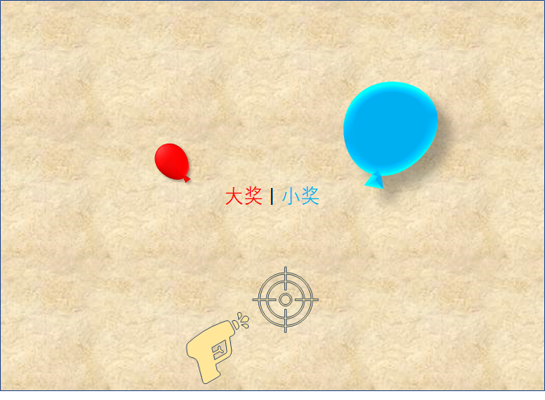
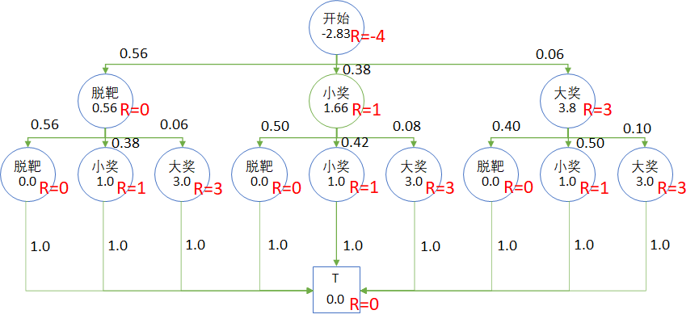

## 8.1 射击气球问题

### 8.1.1 提出问题

在游乐场，有一个用玩具枪射击气球中奖的游戏，如图 8.1.1 所示。

<center>


图 8.1.1 射击气球游戏
</center>

游戏规则是这样的：

1. 游客花 4 元钱买 2 颗塑料子弹，得到两次射击机会；
2. 墙上有两个气球，一个蓝色大气球，一个红色小气球，每次射击前，游客可以任意选择目标；
3. 射中蓝色大气球可以得到小奖，价值 1 元；
4. 射中红色小气球可以得到大奖，价值 3 元；
5. 脱靶不得奖。

游乐场老板经过几个月的营业后进行了一些粗略的统计，当然老板的目的不是做人工智能学习，而是要看能否多赚钱。结果如图 8.1.2 所示。

<center>


图 8.1.2 游客中奖情况统计
</center>

统计结果说明：

1. 游客在第一枪射出后：

    - 脱靶的概率是 0.56；
    - 中小奖的概率是 0.38；
    - 中大奖的概率是 0.06；

2. 第二枪根据第一枪的结果而有所不同：

    比如，如果第一次射击中大奖，则第二枪时：

    - 脱靶的概率是 0.40，比初始的 0.56 要低；
    - 中小奖的概率是 0.50，比第一枪的 0.38 要高，因为有了一定的经验而提高了命中率；
    - 继续中大奖的概率会是 0.10，比第一枪的 0.06 提高了一些。
    
    其它统计数字在图 8.1.2 中显示，不再赘述。

老板设计的这个游戏很精明，因为游客会从数字中得到暗示：如果我中一个大奖和一个小奖，正好得 4 元钱的奖品，抵掉了两支枪的花销。但实际上的中奖概率很低。那么做为一个聪明的游客，你应该如何选择呢？

### 8.1.2 错误的 MRP 模型

在前面的章节中，我们学习过马尔科夫奖励过程（MRP）的知识，是否可以把图 8.1.2 转换成状态转移矩阵与奖励函数，用来计算“脱靶、小奖、大奖” 三个状态的哪一个的状态价值函数值最大，来判断选择哪种方案呢？

有些读者在前面的学习中基础很牢固，于是可以立刻画出如图 8.1.3 的状态转移图和转移概率表。

<center>


图 8.1.3 MRP 模型下的状态转移
</center>

然后在前面的代码的基础上换一下数据（状态、转移、奖励），即可用矩阵法立刻解出结果。

我们可以先检查一下这个状态转移矩阵的收敛情况：

【代码位置】Shoot_0_MPR_Wrong.py

```
折扣 = 1
------------------------------
迭代100次, 检查状态转移矩阵是否趋近于 0:
[[0.    0.524 0.405 0.071]
 [0.    0.524 0.405 0.071]
 [0.    0.524 0.405 0.071]
 [0.    0.524 0.405 0.071]]
------------------------------
价值函数：
Start:  6174930.04
Miss:   6174934.04
Small:  6174935.15
Grand:  6174937.304
```

当折扣值 $\gamma=1$ 时，这个转移矩阵本身收敛到了 [0, 0.524, 0.405, 0.071]，意味着如果游客持续地射击多次，脱靶的可能性最大（0.524），中小奖的可能性为 0.405，中大奖的可能性为 0.071。

从输出的价值函数值看，值都很大。因为可以在多个状态之间不断地循环，获得很多很多奖励。但是却忽略了一个条件：每个游客只能射击两次。如果要多次射击的话，需要停下来买更多的子弹，然后就要重新开始了。从图 8.1.3 左图来看，“开始”状态只经历了一次，所以这个状态转移图画得不对。

另外，矩阵自乘 100 次没有收敛到全 0 状态，说明用迭代法计算状态价值函数是有问题的，会有无限奖励。

下面我们看看 $\gamma=0.9$ 时的情况：

```
折扣 = 0.9
------------------------------
迭代100次, 检查状态转移矩阵是否趋近于 0:
[[0. 0. 0. 0.]
 [0. 0. 0. 0.]
 [0. 0. 0. 0.]
 [0. 0. 0. 0.]]
------------------------------
价值函数：
Start:  1.501
Miss:   5.501
Small:  6.599
Grand:  8.736
```

这次的转移矩阵趋近于 0 了，说明迭代可以收敛。价值函数基本反映出了各个状态的比较结果。但还是存在前面说过的问题：在后面的三个状态转移中，没有包括前面的“开始”状态，相当于可以无限次射击，忘了只有两发子弹的限制。所以图 8.1.3 的模型是错误的。

### 8.1.3 正确的 MRP 模型

这个问题的正确模型应该如图 8.1.4 所示，是一个有向无环图，而不是像图 8.1.3 那样是个有环图。

<center>


图 8.1.4 正确的的状态转移图
</center>

图例说明：

- 蓝色圆圈内的文字是状态描述，括号内的数字是该状态的序号。
- 绿色连线是状态转移方向，黑色数字是状态转移概率。
- 红色的 $R$ 是奖励值。奖励是定义在状态上的，在绘图时故意让字母 $R$ 与状态区域重合，以强调这一点。
- 蓝色方框是终止状态 T。

表 8.1.1 为各个状态的说明。

表 8.1.1 状态说明

|状态序号|描述|奖励|转移|
|-|-|-|-|
|(0) 开始|一级状态。<br>游客花 4 元钱买两颗塑料子弹，然后选择第一次射击的目标。|R=-4|0.56：脱靶(1)<br>0.38：小奖(2)<br>0.06：大奖(3)|
|(1) 脱靶|二级状态。<br>不知道游客的选择是什么，只看到脱靶的结果|R=0|0.56：脱靶(4)<br>0.38：小奖(5)<br>0.06：大奖(6)|
|(2) 小奖|二级状态。<br>游客射中蓝色气球。|R=1|0.50：脱靶(7)<br>0.42：小奖(8)<br>0.08：大奖(9)|
|(3) 大奖|二级状态。<br>游客射中红色气球。|R=3|0.40：脱靶(10)<br>0.50：小奖(11)<br>0.10：大奖(12)|
|(4,7,10) 脱靶|三级状态。不知道游客的选择是什么，只看到脱靶的结果。|R=0|1.0：结束|
|(5,8,11) 小奖|三级状态。游客射中蓝色气球。|R=1|1.0：结束|
|(6,9,12) 大奖|三级状态。游客射中红色气球。|R=3|1.0：结束|

补充说明：

- 状态分为三级，是为了在后面的章节中容易描述，没有什么特殊的原因。
- 虽然状态中有四个“大奖”，四个“小奖”，四个“脱靶”，但是这四个状态不是同一个状态，只是名字一样而已，在图中特意用序号把它们都区分开了。
- 所有的三级状态（序号4~12），最后都接一个终止状态 T，在第二次射击后，都会以 1 的概率达到该状态。


为什么状态中含有四个“大奖”不能只用一个状态来表示呢？换句话说，为什么图 8.1.3 是错误的呢？

就好比从一楼上 10 级台阶到二楼，台阶可以定义为 $S_{1,1}$ 到 $S_{1,10}$；而二楼到三楼同样有 10 级台阶，定义为 $S_{2,1}$ 到 $S_{2,10}$。但所处的楼层不一样，所以它们也是 20 个不同的状态，不能把 $S_{1,1}$ 和 $S_{2,1}$ 混为一谈。

如果除了楼梯以外，还有一个滑梯，从 $S_{2,1}$ 能直接滑到 $S_{1,1}$，从而造成环，那就是两个状态之间的循环转移，在本例中并不存在。

### 8.1.4 计算 MRP 模型的状态价值函数

因为这个问题中的状态数只有 13 个，所以可以使用矩阵法来轻松解决。

【代码位置】Shoot_1_MPR_Correct.py

```
状态价值函数：
------------------------------
v0 = -2.83
----------
v1=0.56,        v2=1.66,        v3=3.8
----------
v4=0.0,         v5=1.0,         v6=3.0
v7=0.0,         v8=1.0,         v9=3.0
v10=0.0,        v11=1.0,        v12=3.0
```

最终的状态价值函数结果标在图 8.1.5 中，圆圈内的数值是马尔可夫奖励过程的状态价值函数值。

<center>


图 8.1.5 MRP 模型的状态价值函数值
</center>

所以，从统计学的观点看，$s_0$ 的状态函数值 $v_0$ 告诉我们只要游客买了子弹，就已经亏了，老板是稳赚不赔的。当然不排除个别游客（射击能手）连续两次击中大奖。而一般人都会高估自己（哈哈，科学的说法是：不能正确地评估自己），一些游客会因为想到最大值为 3+3=6 的奖励而参与，一些游客只是因为没有打过枪而参与。

那么游客应该怎么选择呢？

- 虽然 $v_{3}=3.8$ 状态价值最高，但是从 $s_0$ 到达 $s_3$ 只有 0.06 的概率，可以理解为游客的预期收益是：$0.06 \times 3.8 = 0.228$ 元。
- $s_1$ 的预期收益是 $0.56 \times 0.56 = 0.3136$ 元。
- $s_2$ 的预期收益是 $0.38 \times 1.66 = 0.6308$ 元。

上面三个状态的预期收入值相加为 0.228+0.3136+0.6308=1.1724 元，正好等于游客开始花的 4 元再加上 $v_0$ 的值，即 $4-2.83\approx1.17$，这也是 $v_0$ 的表达式告诉我们的。


所以游客第一次射击时应该选择 $s_2$，即“小奖”状态，然后第二次射击时继续选择“小奖”状态。这样虽然肯定不能赢回开始花的 4 元钱，但是可以做到损失最小（或者收益最大）。

### 思考与练习

1. 手工计算图 8.1.4 模型中的状态价值函数。提示：可以从后向前计算，比较方便。
