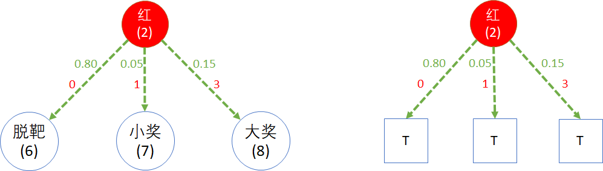

## 8.2 策略与动作

### 8.2.1 游客的策略选择

#### 疑问

在 8.1 节中，我们经过一番分析，纠正了错误的模型图，得到了一个看似合理的结果。但仔细想一想，其实上面的解题过程是有问题的：

1. 原问题是“聪明的游客会如何选择？”，但是整个解题思路是根据游乐场老板的统计结果进行的，是从老板的角度出发，而非游客的角度。
2. 在一级的三个状态中（大奖，小奖，脱靶），它只代表“结果”，而不代表“选择”，较真儿地说，没有游客会选择“脱靶”状态，因为“脱靶”只是个结果。
3. 如果忽略前面两个疑问，最后得到了 $v_1,v_2,v_3$ 的值，游客会看到 $v_3$ 最大，所以会误导其选择大奖而射击小气球，但是忽略了击中的难度。现实生活中人们往往也有类似的经历，想利益最大化，却忽略了风险。

实际上，老板并不知道游客选择的是哪个气球，他只看到了最终的结果。游客自己也不会主动说我要射击哪一个气球，避免“打哪儿指哪儿”的尴尬场面出现。

#### 有洞察力的数据

经过对游客的调查与过程观察，以及与老板的访谈，我们得到了一些更细化的统计数据，如图 8.2.1 所示。

<center>


图 8.2.1 细化的第一次射击数据（模型）
</center>

请读者注意，图 8.2.1 中的一些数字看上去很陌生，与图 8.1.2 完全“对不上”。但是这里的数字才是产生后者的根本原因，后者只是统计结果而已。

图例说明：

1. 在开始状态时，游客可以选择的**策略** $\pi$ 有两个：
    - $a_1$ - 选择射击小气球而中大奖，大概有 40% 的人选择，记为 $\pi_1=0.4$。
    - $a_2$ - 选择射击大气球而中小奖，大概有 60% 的人选择，记为 $\pi_2=0.6$。

2. 执行**动作** $a_1$，在射击红色小气球时，有可能的**过程**及**结果**是：
    - 有 0.80 的概率**脱靶**，记为 $p_{11}=0.80$；
    - 还有 0.05 的概率歪打正着地击中大气球而得**小奖**，记为 $p_{12}=0.05$。
    - 因为红色气球比较小，不容易击中，只有 0.15 的概率打中得**大奖**，记为 $p_{13}=0.15$；

3. 选择**动作** $a_2$，在射击大气球时，有可能的**过程**及**结果**是：
    - 有 0.4 的概率**脱靶**，记为 $p_{21}=0.4$；
    - 因为蓝色气球比较大，容易击中，有 0.6 的概率击中得**小奖**，记为 $p_{22}=0.6$；
    - 没有任何运气可以击中小气球，记为 $p_{23}=0.0$。
        - 这种情况在实际解题时可以不必画出来，在这里画出来是为了把细节讲清楚，避免误解。

请读者注意在 $a_2$ 部分下的 [0.4,0.6] 是状态转移概率，与开始状态 $s$ 下的策略选择概率 [0.4,0.6] 只是在数值上恰巧相同，含义完全不同。

现在可以统计一下各种中奖的情况：

- 脱靶的概率是两种情况之和：
    1. 选择射击红色气球，脱靶， $\pi_1 p_{11}= 0.4 \times 0.8 = 0.32$
    2. 选择射击蓝色气球，脱靶， $\pi_2 p_{21}= 0.6 \times 0.4 = 0.24$
    
    二者之和为 $0.32+0.24=0.56$

- 中小奖的概率是两种情况之和：
    1. 选择射击红色气球，但却误中蓝色气球，$\pi_1 p_{12}= 0.4 \times 0.05 = 0.02$
    2. 选择射击蓝色气球并击中，$\pi_2 p_{22}= 0.6 \times 0.6 = 0.36$
    
    二者之和为 $0.36+0.02=0.38$

- 中大奖的概率是两种情况之和：
    1. 选择射击红色气球，击中， $\pi_1 p_{13}= 0.4 \times 0.15 = 0.06$
    2. 选择射击蓝色气球，却击中红色气球， $\pi_2 p_{23}= 0.6 \times 0.0 = 0.00$
    
    二者之和为 $0.06+0.00=0.06$

上面的三种情况的结果 $[0.56, 0.48, 0.06]$ 和图 8.1.2 中老板统计的第一次射击的结果是一致的。但是图 8.2.1 中的数据更具有洞察力，可以让我们做到“知其所以然”。

### 8.2.2 带有动作节点的全新模型

在图 8.2.1 中，我们给一级和二级状态之间增加了动作节点，并且计算出在经过**策略/动作选择**和**状态转移**两个过程后，得到的中奖数据与老板的统计数据相同。

需要注意的是，在图 8.1.2 中的二级状态只有 3 个节点（脱靶、小奖、大奖），而图 8.2.1 中的二级状态有 5 个有效（转移概率不为 0）节点。

- 在**做结果统计**的时候，可以把 $a_1,a_2$ 的下游状态中具有相同名称的结果相加（比如两种情况下脱靶的总概率为 0.32+0.24=0.56），但实际上它们还是不同的状态，各自具备不同的价值函数。

- 在**做过程分析**的时候，这些状态节点中具有相同名称的节点是不能合并在一起的，因为其**来源**不同，必然会造成**去向**也不同。保留来龙去脉的过程，是我们本章要学习的新模型的重要特征。

下面我们需要在二级状态后也增加动作节点，以便可以得到该问题的全模型，如图 8.2.2 所示。

<center>


图 8.2.2 带有动作节点的全新模型
</center>

#### 图例说明

- 空心圆：状态节点，含状态名称和序号（括号内的数字，0~5）。
- 实心圆：动作节点，含动作名称和序号（括号内的数字，0~11）。
- 蓝色连线：动作选择，含策略概率（蓝色数字）。
- 绿色连线：状态转移，含转移概率（绿色数字）。
- 红色数字：奖励值。**注意，是奖励给转移过程的**，即：**过程奖励。**
- 长方框：终止节点。

#### 模型说明

- 状态节点

  - 用状态名称和序号加以区分，比如“小奖(2)”和“小奖(5)”是两个不同的状态。
  - 状态空间的值为 7，即一共有 7 个状态。
      - 状态空间的定义是集合 $S$，一般说到 $s \in S$，意思是某个状态 $s$ 在 $S$ 集合中。
  - 状态节点下都有两个动作选择：红色和蓝色。
  - 最下面的长方形节点是终止状态。

- 动作节点

  - 用动作名称和序号加以区分，比如“红(2)”和“红(4)”，表明它们是不同的两个动作。
  - 动作空间的值为 2，因为每个状态下只有两个动作：选择射击红色气球或蓝色气球。
  - 射击红色气球后，有可能的状态转移有三种：脱靶，小奖，大奖。
  - 射击蓝色气球后，有可能的状态转移有两种：脱靶，小奖。
  
  读者可能会有疑问：为什么动作空间不是 12？
    - 动作空间的定义是 $A(s)$，$a \in A(s)$，举例来说，在“大奖(3)”状态，即 $s=$“大奖(3)” 时，$A(s)$ 集合中只有两个动作，红色或蓝色，而不是 12 个。

- 策略
   在本例中，策略始终保持不变，在任何状态下（除了终止状态）：0.4 的概率选择红色，0.6 的概率选择蓝色。

- 状态转移
    根据上游状态节点的不同，下游的转移概率也不尽相同。举例来说：
    - “红(0)”下面的转移概率是 [0.80, 0.05, 0.15]，是初始转移概率。
    - “红(6)”下面的转移概率是 [0.70, 0.05, 0.25]，
        - 因为在“红(0)”击中红球后，进入“大奖(3)”状态，游客的经验增加，射中红色气球的概率也会增加，从初始的 0.15 升高到 0.25；
        - 相应地脱靶概率从 0.80 降低为 0.70；
        - 而误中小奖的概率不变，保持在很小的 0.05 的概率。

- 奖励
    奖励是附加在状态转移过程上的：
    - 0：脱靶。
    - 1：中小奖。
    - 3：中大奖。

#### 终止节点的模型设计

在图 8.2.2 中，我们看到了一个比较奇怪的现象：所有的二级动作（序号 2~11）的下游状态，全都归结于同一个终止节点(6)。为什么这样设计呢？

其实在这里有两种设计方法，如图 8.2.3 所示。

<center>


图 8.2.3 不同的终止节点设计方法
（左图：动作节点下接非终止节点；右图：动作节点下接终止节点。）
</center>

- 左侧

    再多设计出 3 个状态 $s_6,s_7,s_8$，用于承载动作“红(1)”的结果。记住动作“蓝(3)”也会有两个状态，命名为 $s_9,s_{10}$，这样的话，一对动作就会有 5 个下游状态，五对动作一共要增加 25 个下游状态。

- 右侧

    像目前这样，用终止节点 T 直接接到动作“红(2)”上。这里画了 3 个终止节点，与图 8.2.2 的共用同一个终止节点没有本质区别。

在这里我们先把问题提出来，等到我们后面学习完动作价值函数的知识后，再给予解答。

### 8.2.3 验正老板的统计数据

下面我们验正一下游乐场老板在图 8.1.2 中关于第一次得“小奖”后第二次也得“小奖”的统计数据是否正确。

在图 8.2.2 中：

- 左侧状态“小奖(2)”下面，看“红(4)”和“蓝(5)”两个动作下的得到 $r=1$（表示得到小奖）的转移概率（0.05,0.55）：
$$
p_{left}= 0.4 \times 0.05 + 0.6 \times 0.55 = 0.35
$$

- 右侧“小奖(5)”下面，看“红(10)”和“蓝(11)”两个动作下的得到 $r=1$ 的转移概率（0.04,0.75）：
$$
p_{right}=0.4 \times 0.04 + 0.6 \times 0.75 = 0.466
$$

- 状态“开始(0)”下面，左侧“红(0)”的策略选择概率是 0.4，右侧“蓝(1)”的策略选择概率是 0.6：
$$
p_{all} = \pi_1 \times p_{left} + \pi_2 \times p_{right} = 0.4 \times 0.35 + 0.6 \times 0.566= 0.4196 \approx 0.42
$$

所以最后的结果是 0.42，与图 8.1.2 中老板的统计值一致。只不过老板知其然不知其所以然，只看到了统计结果，没有深入到过程细节中，而这正是我们接下来要学习的问题。

用代码也可以验证所有情况，输出结果如下：

【代码位置】Shoot_2_DataModel.py
```
第一枪脱靶 0.56
        第二枪脱靶 0.56
        第二枪小奖 0.38
        第二枪大奖 0.06
第一枪小奖 0.38
        第二枪脱靶 0.5
        第二枪小奖 0.42
        第二枪大奖 0.08
第一枪大奖 0.06
        第二枪脱靶 0.4
        第二枪小奖 0.5
        第二枪大奖 0.1
```

有读者会问：如果有了老板的统计结果，能不能反推出这个模型呢？答案是不能。因为可能会有很多种组合都可以满足老板的统计结果，模型不是唯一的。
