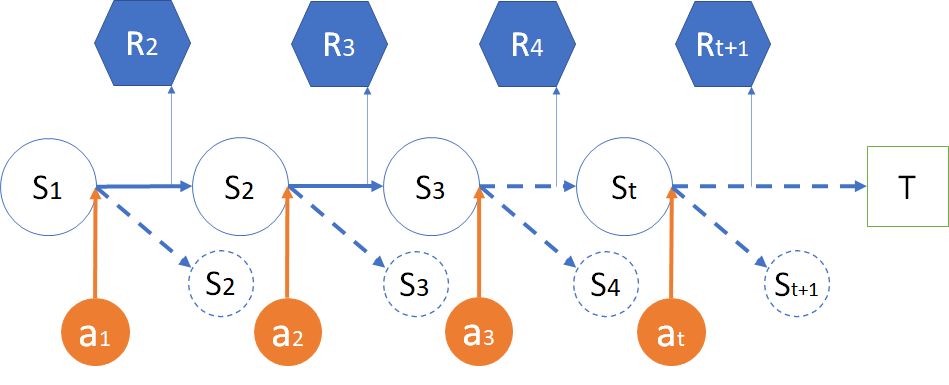
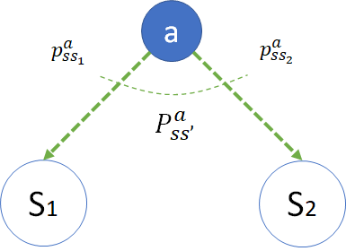
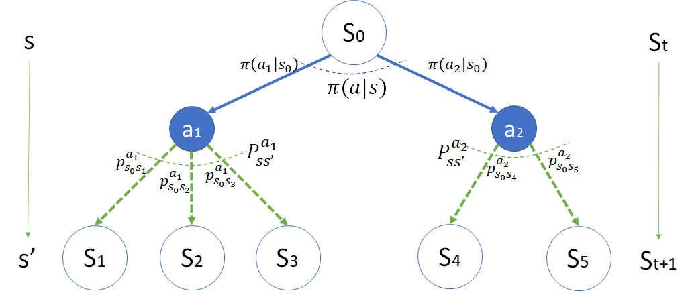
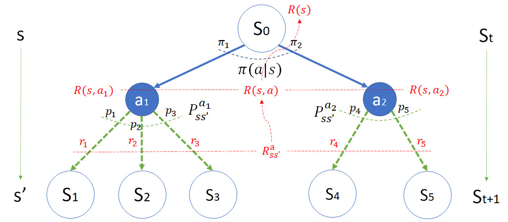

## 8.3 马尔可夫决策过程 MDP

### 8.3.1 强化学习模型

在引入了策略动作后，强化学习的模型就已经很完备了，如图 8.3.1。

<center>


图 8.3.1 强化学习模型
</center>

#### 图例说明

- 智能体：强化学习的行为主体，比如一个机器人，或者一个程序。
- 环境：根据智能体的不同，这个环境的定义也不同。比如智能体是狼，那么环境就是由草原、羊群、其它狼等构成。如果智能体是工业机器人，则环境由生产线、工件、流程等构成。
- 状态：智能体所在的与环境相关的状态，可能有很多状态，比如棋类游戏中的每一个盘面。也可能很少的状态，比如扫地机器人一共只有“充电、扫地”两个状态。
- 动作：智能体在不同状态下根据策略而采取的动作，其目的是从环境处获得奖励。
- 奖励：环境给与智能体的反馈，可能是食物、胜负、荣誉等等虚头八脑的东西，但是一定是可以量化的数值。可以是正数或负数，只与奖励值的相互比较的大小有关，与绝对大小无关。比如在一个环境中，令 $R_1=1,R_2=2$，和令 $R_1=-1,R_2=1$，是没有区别的，只要 $R_2 \gt R_1$ 即可。

#### 序号说明

1. 智能体做策略选择；
2. 执行动作影响环境；
3. 环境给与即时奖励；
4. 环境产生新的状态；
5. 智能体得到奖励；
6. 智能体得到新状态。

#### 环境、状态、决策、动作、过程、奖励、结果

回顾一下人们所了解的所有智能生物的行为，都是根据当前**环境**和自身**状态**情况先做出**决策**，选择**动作**，经历**过程**，然后得到**奖励**与**结果**。
- 这里的**决策**（或**策略**），可以是一个函数，直接输出一个选择好的动作值，如射击问题中得红色的 $a_1$ 或蓝色的 $a_2$。
- 这里的**结果**就是图 8.2.2 中的状态，包括开始、大奖、小奖、脱靶，与**马尔可夫过程**以及**马尔可夫奖励过程**中的状态是一个概念。


先有奖励还是先有结果？

从模型上看，在等待**结果**的**过程**中得到**奖励**，但是**过程**具有不确定性。

那么**过程**如何理解呢？

最简单并且容易理解的说法是：人们做一件事，一般都会有两个结果，即成功和失败，你可以努力争取成功，但是并不能完全避免失败。这就可以叫做**转移概率**。只不过你非常努力的时候，转移到成功状态的概率较大，而转移到失败状态的概率较小。

用本例来说明的话，可以解释为：

- 游客可能第一次射击，没经验，所以打偏；
- 枪得准星可能不准，游乐场老板也不用心维护；
- 气球会在风中有微小摆动；
- 周围的环境嘈杂，游客不能击中精力射击；
......

诸如此类的环境因素会造成在选择动作后，却偏离既定目标，得到意想不到的结果。这与**马尔可夫过程**以及**马尔可夫奖励过程**中的状态转移概率不尽相同，而且一般也不用矩阵形式来描述。因为矩阵中的元素所处的行列数值，都代表了状态的序号，而在马尔科夫决策过程部分，没有办法把动作和状态放在一起来形成矩阵。简单地说就是用动作把矩阵分割成了很多小的部分，在每个小部分中没有环状的状态转移存在。


### 8.3.2 马尔可夫决策过程 MDP

在上一节中，我们在上下游的状态之间引入了策略和动作，即，在马尔可夫奖励过程中引入策略和动作的概念，就形成了一个新的概念：**马尔可夫决策过程**。它是图 8.3.1 所示的强化学习模型的具体体现。

用一个文字公式来表示 MDP（Markov Decision Process，马尔可夫决策过程）：

$$
马尔可夫决策过程 = 马尔可夫奖励过程 + 动作策略
$$

#### 过程描述

<center>


图 8.3.2 马尔可夫决策过程
</center>

图 8.3.2 是一个马尔可夫决策过程。可以通过实体与箭头的位置，来准确地理解该过程中各元素产生的地点和顺序。其中的下标表示时间序号。比如：

- 动作 $a$ 是发生在状态 $s$ 的右端点上，有了 $a$ 才会有状态转移。
- 在 $s_1$ 执行了 $a_1$ 后，有可能到实线的 $s_2$，也有可能到另外一个虚线的 $s_2$，这不是 $a_1$ 所能控制的，属于状态转移。
- 在到达 $s_2$ 的过程中产生 $r_2$。这样定义可以保证唯一性，是为了区别从其它状态到达 $s_2$ 时的奖励。

在前面的马尔科夫**奖励**过程中，我们知道组成其过程的是一个四元组数据 $<S,P,R,\gamma>$，分别是状态、转移概率、奖励、折扣。进一步，在马尔可夫**决策**过程中，通过上一小节中引入的新元素“动作”，可以得到一个五元组数据 $ <S,A,P,R,\gamma>$，其中 $A$ 代表动作。

请读者注意上述五元组数据序列的顺序：
1. 必须从一个状态 $S$ 开始；
2. 执行一个动作 $A$；
3. 会以概率 $P$ 转移到下一个状态 $S'$；
4. 在转移过程中得到奖励 $R$；
5. 最后计算整个序列的回报时可以有折扣 $\gamma \in [0,1]$。

表 8.3.1 是三种过程的简单比较。

表 8.3.1 三种过程的简单比较

|过程名称|组成元素|数据序列|计算|
|-|-|-|-|
|马尔可夫过程 MP|$<S,P>$|$S_0,S_1,\cdots,S_t$||
|马尔可夫奖励过程 MRP|$<S,P,R,\gamma>$|$S_0,R_1,S_1,R_2,\cdots,S_t,R_{t+1}$|$V$|
|马尔可夫决策过程 MDP|$<S,A,P,R,\gamma>$|$S_0,A_0,R_1,S_1,A_1,R_2,\cdots,S_t,A_t,R_{t+1}$|$V_\pi,Q_\pi$|

#### 策略选择模型（$S \to \pi \to A$）

如图 8.3.3 所示。

<center>


图 8.3.3 马尔可夫决策过程的策略选择模型
</center>

- 策略 $\pi$

    用 $\pi(a|s)$ 表示在状态 $s$ 下选择动作 $a$。蓝色的弧形虚线表示作用范围。
    特别地，$\pi(a_1|s)$，表示在 $s$ 状态下，根据策略 $\pi$ 执行动作 $a_1$。其通用定义为：

    $$
    \pi(a|s) \doteq \mathbb P [A_t=a|S_t=s] \tag{8.3.1}
    $$

    用文字描述为：在时刻 $t$ 的状态为 $s$ 时选择动作 $a$ 的概率。大写的 $A_t,S_t$ 表示变量或集合，小写的 $a,s$ 表示实例数值。

    在射击气球问题中，动作有两个，射击红色气球和射击蓝色气球。如何选择这两个动作就是策略问题。

    策略可以被描述为一个函数，函数的最终输出是一个确定的动作值，比如 $a_1$ 或 $a_2$。但是函数的内部运算方法可以有两种：

    - **概率选择方法**，具体的说就是用类似下面这个函数：
        ```Python
        a = np.random.choice([a1,a2], p=[0.4,0.6])
        ```
        来得到动作值 $a$，概率大的动作理所当然地有较大的概率被选中。

    - **最佳动作方法**，就是用类似下面这个函数：
        ```Python
        a = np.argmax([p1,p2])
        ```
        来得到动作值 $a$，概率小的那个动作永远没有被选中的机会。

    策略函数不能输出一个概率让调用者做决定，否则就失去了决策的意义。而马尔科夫决策过程中的**决策**两字，实际上就是来学习如何制定策略，输出动作。

#### 状态转移模型（$A \to p \to S'$）

如图 8.3.4 所示。

<center>


图 8.3.4 马尔可夫决策过程的状态转移模型
</center>

- 转移概率 $p$
    每个动作下面都会存在一个转移概率，绿色的弧形虚线表示作用范围。特别地，如果只有一个下游状态存在，则转移概率值为 1。

    - $p^{a}_{ss_1}$，小写的 $p$ 表示在动作 $a$ 发生后，从状态 $s$ 转移到状态 $s_1$ 的概率的实例，上标 $a$ 要保持和动作符号一致，下标 $ss_1$ 要保持和上下游状态符号一致；

    - $P^{a}_{ss'}$，大写的 $P$ 表示 $a$ 动作的所有下游状态的转移概率的集合（用向量表示），在本例中包括两个元素 $P^{a}_{ss'}=[ p^{a}_{s s_1},p^{a}_{s s_2}]$。其通用表达式为：

    $$
    P^a_{ss'}=\mathbb P [S_{t+1}=s'|S_t=s, A_t=a] \tag{8.3.2}
    $$

    用文字描述为：在时刻 $t$ 的状态 $s$ 下采取动作 $a$ 后转移到时刻 $t+1$ 的状态 $s'$ 的概率。大写的符号是变量，小写的符号是实例。

    在实际运算中，转移概率 $p$ 值可以直接作为权重系数与后面的主体（状态价值或奖励）相乘，以表达数学期望。

#### 完整模型（$S \to \pi \to A \to p \to S'$）

把**策略选择模型**和**状态转移模型**组合起来，绘制出图 8.3.5 的马尔可夫决策过程的完整模型。

<center>


图 8.3.5 马尔可夫决策过程的完整模型
</center>


图 8.3.5 实际上是图 8.2.1 的一个抽象，去掉了与应用场景相关的表达，但又不是抽象到无法理解，所以这是一个马尔可夫决策过程的**实例化**模型。为什么叫实例化模型呢？因为图中的各个子元素都带有序号，而不是笼统抽象的符号。比如：

- 状态

    用空心的圆表示，里面标出了状态序号，如 $s_0, s_1$ 等。

    两侧的 $s,s'$ 和 $S_t,S_{t+1}$，是一种概念的两种表达形式，在公式推导中，一般会用 $s,s'$ 表示当前状态和下一个状态的**实例**，用 $S_t,S_{t+1}$ 来强调**时序**关系的和状态**变量**。

    状态一定是源于动作，终于动作，不能两个状态直接连在一起。状态是状态转移的结果。

- 动作

    用实心的圆表示，里面标出了动作序号，如 $a_1,a_2$ 等。
    动作一定是源于状态、终于状态，不可能两个动作直接连接在一起。动作是策略选择的结果。

- 过程

    图 8.3.5 中带有箭头的线都表示过程，有两类：

    - 蓝色实线：表示策略 $\pi$ 的动作选择过程。**这是强化学习的主要学习目标**。

    - 绿色虚线：表示概率 $P$ 的状态转移过程。**这是区别有模型与无模型强化学习问题的主要标志**。有明确的转移概率的，叫做**有模型**（model based），否则叫做**无模型**（model free）。
    
    这里用绿色虚线可以给色弱的朋友们提供更好的帮助，以便可以轻松地与蓝色实线区分开来。

#### 奖励模型

在奖励模型中，我们使用了面向过程的奖励方法。与在**马尔可夫奖励过程**中学习过的面向过程的奖励方法相似，区别是：

- 在前面的**马尔可夫奖励过程**中，定义的是 $S \times S' \to r$，即状态到状态的转移过程中产生的奖励。
- 在本节的**马尔可夫决策过程**中，定义比较复杂，请看图 8.3.6。

<center>


图 8.3.6 马尔可夫决策过程的奖励模型
</center>

在图 8.3.6 中，简化了一些符号，比如状态转移概率用 $p_1,\cdots,p_5$ 表示（图 8.3.5 中用 $p^a_{ss'}$ 表示，但含义一致），重点突出了**红色**的奖励机制。

共有三层元素来描述整体的奖励模型：

- 底层 $r$
    $r_1,\cdots,r_5$，分别表示从动作发生后，到达下个状态时的即时奖励值。如：射中小气球可以得到 3 分的奖励，脱靶 0 分，射中大气球得 1 分奖励。

    读者在这里可能会有疑问：明明是先射中气球，然后老板才给与奖励，所以红色的 $r$ 应该标注在 $s_1,s_2,\cdots$ 上才对，面向结果。但图中为什么标注在到达 $s_1,s_2,\cdots$ 的过程中呢（面向过程）？

    可以这样解释：
    
    1. 其实是否能射中气球，在游客扣下扳机后，让子弹飞一会儿，在飞行的过程中接近尾声的时候就已经确定了，而不是在气球爆裂后才确定（假设子弹接触气球后一定会爆裂）。子弹飞行的过程就是状态转移阶段。

    2. 得到老板的奖品，只是老板在履行承诺而已。它是即刻生效的，而不是后期生效的。老板是看到气球爆裂后才决定是否给与奖励（因为人类肉眼无法观察子弹飞行过程），但是这与强化学习问题无关了。当然，如果老板耍赖，你也可以把这种耍赖的概率也计算在状态转移中（比如有 p=0.1 的概率是老板耍赖）。


    同一个动作分支的下游过程奖励值可以写成一个奖励向量（$n$ 为下游状态的数量）：

    $$
    R^a_{ss'} = [r_1, r_2, \cdots, r_n] \tag{8.3.3}
    $$

    其中的 $r_1,\cdots,r_n$ 也可以抽象地写成 $r^a_{ss'}$，便于后面用公式抽象表达。

- 中层 $R(s,a)$
    $R(s,a)$ 表示在 $s$ 状态时执行动作 $a$ 的奖励函数，简称为**动作奖励函数**，在有的文献中记为 $R^a_s$，其含义一致。笔者认为，如果定义为**函数**，就应该有个形式化的括号来表示。
    这个奖励函数不是凭空产生的，是根据底层的过程奖励计算得到的，它发生在动作节点上。如果在其它学习资料的案例中发现有这种写法，请读者一定要明白其来源。
    
    如果 $a_1,a_2$ 表示两个不同动作，则这两个动作的奖励函数分别是：
    - $R(s,a_1)=p_1 r_1 + p_2 r_2 + p_3 r_3$
    - $R(s,a_2)=p_4 r_4 + p_5 r_5$
    
    有通用写法（$n$ 为下游状态的数量）：

    $$
    \begin{aligned}
    R(s,a) &= \mathbb E[R_{t+1}|S_t=s,A_t=a]
    \\
    &=\sum^n_{i=1} p_ir_i = \sum_{s' \in S} p^a_{ss'} r^a_{ss'} = P^a_{ss'}R^a_{ss'}
    \end{aligned}
    \tag{8.3.4}
    $$

    以 $a_1$ 为例，在实际的状态转移过程中，只可能有 $r_1,r_2,r_3$ 三者中的之一发生，要看运气（概率），即游客要么中大奖，要么中小奖，要么不中奖，没有其它的组合。但是在模型描述时，只能用这种数学期望来表示。


- 顶层 $R(s)$
    对于状态 $s_0$ 来说，由于不知道下一步将采取什么动作以及转移到哪一个状态，所以，只能把奖励函数定义为一个期望：
    $$
    \begin{aligned}
    R(s) &= \mathbb E[R_{t+1}|S_t=s]
    \\
    &=\pi_1 R(s,a_1) + \pi_2 R(s,a_2)
    \\
    &=\sum_{a \in A(s)} \pi(a|s)R(s,a)
    \end{aligned}
    \tag{8.3.5}
    $$

    其中 $A$ 是动作集合（或称为动作空间），在本例中只有**射击红色气球**和**射击蓝色气球**两种动作选择。

    注意，这个奖励函数也不是凭空产生的，而是在 $R(s,a)$ 的基础上的定义，相当于是面向状态的奖励。

如果针对图 8.3.6，把式 (8.3.4),(8.3.5) 串起来，

$$
\begin{aligned}
R(s) &= \sum_{a \in A(s)} \pi(a|s) R(s,a) 
\\
&= \sum_{a \in A(s)} \pi(a|s) \sum_{s' \in S} p^a_{ss'} r^a_{ss'} 
\\
&= \pi_1(p_1r_1+p_2r_2+p_3r_3) + \pi_2(p_4r_4+p_5r_5)
\end{aligned}
\tag{8.3.6}
$$

由于 $r \subset R(s,a) \subset R(s)$，**所以在实际的计算中，只能使用这个奖励模型中的三层的任一层，它们是互斥的，否则就会造成重复计算奖励。**
