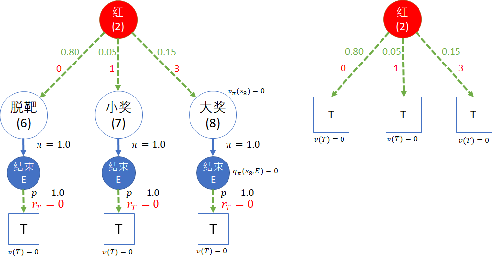
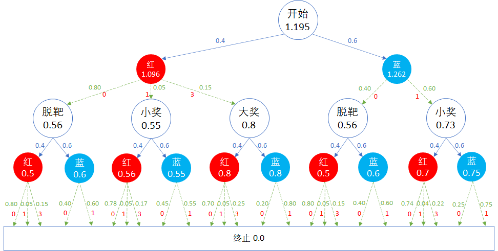

## 8.5 实例演算

下面我们通过对图 8.2.2 的全模型图的实例化计算，来解释贝尔曼期望方程中的动作价值函数 Q 和状态价值函数 V 的具体含义及计算过程。

来自图 8.2.2 带有动作节点的全新模型

因为上层节点依赖下层节点，为了简化问题，我们要从下向上反向推演。

有一些特别的说明：

- 在本例中我们设 $\gamma=1$ 以简化计算过程。
- 空心圆状态序号 $s_n, \ n \in [0,6]$。
- 实心圆动作序号 $a_m, \ m \in [0,11]$。

### 8.5.1 处于第五层的状态价值函数

我们要说明 $v_\pi(s_6)=v_T=0$。

在 8.2.3 节中，我们曾经提出了一个疑问，还没有给予解答：即，在第二次射击的动作（如“红(2)”）下面，是要接三个不同的状态呢，还是接一个终止节点？

我们以动作“红(2)”下面的状态转移为例说明这个问题。

如图 8.5.1，给出了左右两种终点设计方法。

图 8.5.1 两种设计终点状态的方法
（左图：复杂的设计方法；右图：简约的设计方法。）

#### 第一种方法

图 8.5.1 中的左图，“红(2)”动作下面新增加了 3 个状态。

以 $s_8$ 为例做后续说明：

由于 $s_8$ 在本例中的含义是中大奖，奖励值为 3，所以很容易**误认为** $v_\pi(s_8) = 3$。但正如第二种方法所示，这个奖励是计算在动作“红(2)”的动作价值函数上，而不是计算在 $s_8$ 的状态价值函数上。

如果不认为 $s_8$ 为终止状态，可以在其后增加一个动作，叫做“结束E”，执行此动作的策略为 1，也就是 $s_8$ 只有这一个下游动作，并且这个动作以 1 的概率转移到另外定义的终止状态 T，奖励为 $r_T=0$。

那么反向计算过程为：
1. 终止状态的 $v(T)=0$，这是必须的。
2. 按式（8.4.2），$q_\pi(s_8,E)=P^a_{ss'} R^a_{ss'} + \gamma P^a_{ss'} V_\pi(s')=1  \cdot  r_T + 1 \cdot  1  \cdot  v(T)=0$。
3. 按式（8.4.3），$v_\pi(s_8) = \sum_a \pi(a|s)q_\pi(s,a)=1  \cdot  q_\pi(s_8,E)=0$

所以 $v_\pi(s_8)=0$，相当于是终止状态。同理可得 $v_\pi(s_6),v_\pi(s_7)$ 的值都是 0，因此，单独增加 3 个新状态 $s_6,s_7,s_8$ 并没有多少帮助，和终止节点的作用一样。

#### 第二种方法

图 8.5.1 的右图，动作“红(2)”直接终点状态 T。这样的话，按照定义，终止状态的价值函数值必有 $v(T)=0$。

有的读者可能会有疑问：那么 $[0,1,3]$ 的奖励给了谁？会不会就被丢掉了呢？

按式（8.4.2.1），我们可以计算一下动作“红(2)”的价值函数。

$$
\begin{aligned}
q_\pi(s,a)&=\sum_{s'} p_{ss'}^a [r_{ss'}^a+\gamma v_\pi(s')]
\\
&=0.8 \cdot (0+v(T))+0.05 \cdot (1+v(T))+0.15 \cdot (3+v(T)) 
\\
&=0+0.05+0.45=0.5
\end{aligned}
$$

在从动作“红(2)”到状态 $T$ 的转移过程中，得到了奖励 $[0,1,3]$，这个奖励是计算到“红(2)”的动作价值函数上的，并不会丢掉。

### 8.5.2 处于第四层的动作价值函数

第四层，即“红(2)”（命名为$a_2$）到“蓝(11)”（命名为$a_{11}$）这 10 个动作。

由式 8.4.2 可知：$q_\pi(s,a) = P^a_{ss'} R^a_{ss'} + \gamma P^a_{ss'} V_\pi(s')$，这是矩阵形式，便于书写，节省篇幅，读者可以自行用最原始的子式 1 来佐证。

由于在上面一步中，已知 $v_T=0$，所以式 8.4.2 的后半部分 $ \gamma P^a_{ss'} V_\pi(s')$ 都是 0，因此可以轻易解得这 10 个动作的价值函数为：

$$
\begin{cases}
q_\pi(s_1,a_2) = (0.8,0.05,0.15) \cdot (0,1,3)^T=0.5
\\
q_\pi(s_1,a_3) = (0.4,0.6) \cdot (0,1)^T=0.6
\\
q_\pi(s_2,a_4) = (0.78,0.05,0.17) \cdot (0,1,3)^T=0.56
\\
q_\pi(s_2,a_5) = (0.45,0.55) \cdot (0,1)^T=0.55
\\
q_\pi(s_3,a_6) = (0.70,0.05,0.25) \cdot (0,1,3)^T=0.8
\\
q_\pi(s_3,a_7) = (0.2,0.8) \cdot (0,1)^T=0.8
\\
q_\pi(s_4,a_8) = (0.8,0.05,0.15) \cdot (0,1,3)^T=0.5
\\
q_\pi(s_4,a_{9}) = (0.4,0.6) \cdot (0,1)^T=0.6
\\
q_\pi(s_5,a_{10}) = (0.74,0.04,0.22) \cdot (0,1,3)^T=0.7
\\
q_\pi(s_5,a_{11}) = (0.25,0.75) \cdot (0,1)^T=0.75
\end{cases}
$$

### 8.5.3 处于第三层的状态价值函数

第三层，即 $s_1$ 到 $s_5$ 这五个状态。

由式（8.4.3）知：$v_\pi(s) = \sum_a \pi(a|s)q_\pi(s,a)$，所以有：

$$
\begin{cases}
v_\pi(s_1)=0.4 q_\pi(s_1,a_2)+0.6 q_\pi(s_1,a_3)=0.4 \cdot  0.5+0.6  \cdot  0.6=0.56
\\
v_\pi(s_2)=0.4 q_\pi(s_2,a_4)+0.6 q_\pi(s_2,a_5)=0.4 \cdot  0.56+0.6  \cdot  0.55=0.554
\\
v_\pi(s_3)=0.4 q_\pi(s_3,a_6)+0.6 q_\pi(s_3,a_7)=0.4 \cdot  0.8+0.6  \cdot  0.8=0.8
\\
v_\pi(s_4)=0.4 q_\pi(s_4,a_8)+0.6 q_\pi(s_4,a_{9})=0.4 \cdot  0.5+0.6  \cdot  0.6=0.56
\\
v_\pi(s_5)=0.4 q_\pi(s_5,a_{10})+0.6 q_\pi(s_5,a_{11})=0.4 \cdot  0.7+0.6  \cdot  0.75=0.73
\end{cases}
$$

### 8.5.4 处于第二层的动作价值函数

第二层只有 $a_0$ 和 $a_1$ 两个动作，这次与第四层的情况不一样，处于下游的 $v_\pi$ 都不是 0，所以用式（8.4.2.2）比较方便：$q_\pi(s,a)=P^a_{ss'}[R^a_{ss'}+\gamma V_\pi(s')]$。

其中：

- 对于 $q_\pi(s_0,a_0)$ 来说
    - $P^a_{ss'}=[0.8,0.05,0.15]$
    - $R^a_{ss'}=[0,1,3]$
    - $V_\pi(s')=[v_\pi(s_1),v_\pi(s_2),v_\pi(s_3)]$
- 对于 $q_\pi(s_0,a_1)$ 来说
    - $P^a_{ss'}=[0.4,0.6]$
    - $R^a_{ss'}=[0,1]$
    - $V_\pi(s')=[v_\pi(s_4),v_\pi(s_5)]$

$$
\begin{cases}
q_\pi(s_0,a_0)=(0.8,0.05,0.15) \cdot [(0,1,3)+(0.56,0.554,0.8)]^T=1.0957
\\
q_\pi(s_0,a_1)=(0.4,0.6) \cdot [(0,1)+(0.56,0.73)]^T=1.262
\end{cases}
$$

从结果可得，选择射击蓝色气球的动作价值为 1.262，大于射击红色气球的值 1.0957。

### 8.5.5 处于第一层的开始状态价值函数

$$
v_\pi(s_0) = \sum_a \pi(a|s)q_\pi(s,a)=(0.4,0.6) \cdot (1.0957,1.262)^T = 1.19548
$$

计算 $v_\pi$ 时可以用变量相乘再相加，也可以直接变成矩阵运算，原理一样。

到了这里，有些读者可能会产生疑问：为什么在没有引入动作之前，计算的（马尔可夫奖励过程的）开始状态的价值函数为 -2.8276，但是在上面的计算中，马尔可夫决策过程的状态价值函数为 1.19548 呢？不单单是数值不一样，而且是一正一负？

原因是我们在本节中的马尔可夫决策过程中，没有把最开始买子弹的 4 元钱纳入模型中。

图 8.5.2 设计开始状态

如果我们像图 8.5.2 这样设计模型：
1. 在开始之后接一个买子弹的动作；
2. 然后接一个子弹上膛的状态
3. 奖励 $R=-4$ 放在上述两者之间。

那么在“上膛”的状态价值是 1.19548，“买子弹”的动作价值就等于 $1.19548-4 \approx -2.8$，开始状态的价值也是 $-2.8$，而且也不会影响后续状态的价值计算。

最终得到所有的价值函数值，标在图 8.5.3 中。

图 8.5.3 计算结果

观察图 8.5.3，读者可以做同层节点的值大小的比较，再结合其实际含义找出原因。比如：

从动作节点中可以看到：

- 第一次选择蓝色气球的价值是 1.262，比选择红色气球的动作 1.096 要大，因为从统计上看，蓝色气球更容易打中，且更多的游客选择了它。
- 一旦在第一次选择了蓝色，无论结果如何，则后续的过程中再次选择蓝色的动作价值较大。
- 第四层最中间的红色(6)和蓝色(7)动作节点的值最高（0.8），因为它是在第一枪是射中了红色气球后，第二枪再选择任何气球，中奖的机会都比较大。
- 最低的是第四层中间的红色(2)节点（0.5），因为是第一次脱靶后“贼心不死”，还要继续打红球。

从状态节点中可以看到：

- 第五层的状态值$v_T=0$，因为它们属于终止状态，达到这些节点而得到的奖励都归属于它们的上级节点。
- 第三层中间的大奖的状态值在本层的五个状态中最高（0.80），原因是它下方的两个动作节点的值（0.8）很高。
- 最有趣的是第三层左侧“脱靶”的状态值为 0.56，比“小奖”的状态值 0.55 要大，这是为什么呢？按理说“脱靶”应该更糟糕才对。
    - 因为它们的上游动作是选择红色气球，射击时很容易脱靶，如果在射击红色气球时却打中了蓝色气球中了小奖，那只能说明歪得离谱（哈哈），在实际中不能给这种“运气”以更高的估值。

需要强调一点，在以上所有的计算中，都有一个前提条件，就是在每个状态上的策略都是 $\pi=0.4:0.6$，如果这个数值变化的话，那么计算结果也会有不同。在下一章中，我们将会解决关于这个策略的选择问题。

### 思考与练习

1. 虽然 $v_\pi$ 和 $q_\pi$ 可以相互换算，但是和先有鸡还是先有蛋的问题不一样。那么在一个马尔科夫决策过程中，$v_\pi$ 和 $q_\pi$ 谁先出现呢？谁又是链条的最后一个呢？
