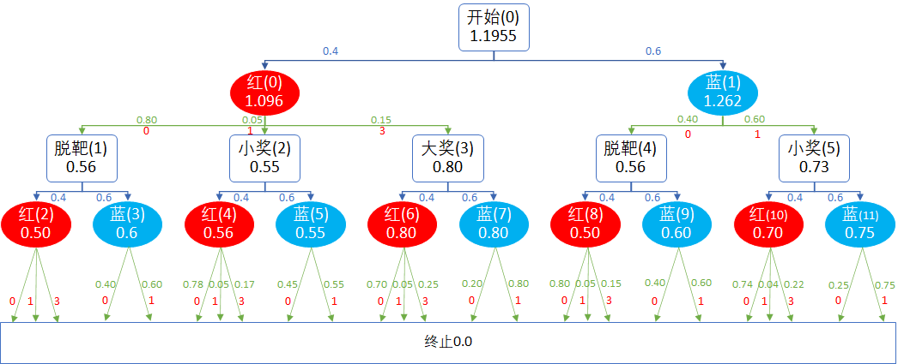
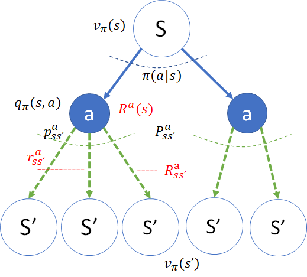
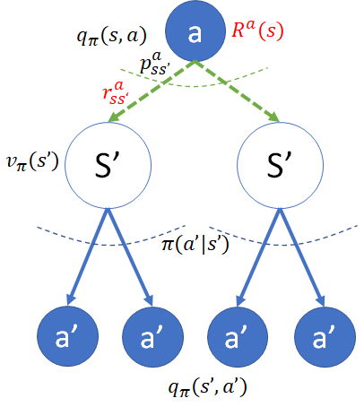

## 8.6 迭代法

上一节中利用终止状态价值函数为 $v_T=0$ 的定义，以及该问题是一个有向无环图的特点，我们根据贝尔曼期望方程，手工反向演算出了各个状态的价值函数。但正如贝尔曼方程可以用迭代法来实现一样，贝尔曼期望方程也可以用迭代法来实现。

### 8.6.1 模型部分

【代码位置】Shoot_2_DataModel.py

#### 定义状态

```Python
# 状态空间
class States(Enum):
     Start = 0      # 开始
     S_Red_R0 = 1   # 选择射击红球Red,但是脱靶R=0
     S_Red_R1 = 2   # 选择射击红球Red,但是误中蓝球R=1小奖
     S_Red_R3 = 3   # 选择射击红球Red,击中R=3大奖
     S_Blue_R0 = 4  # 选择射击蓝球Blue,但是脱靶R=0
     S_Blue_R1 = 5  # 选择射击蓝球Blue,击中R=1小奖
     T = 6          # 终止
```
按图 8.2.2，一共 7 个状态，序号和图中一致。

#### 定义动作
```Python
# 动作空间
class Actions(Enum):
    Red = 0     # 射击红色小气球
    Blue = 1    # 射击蓝色大气球
```
在每个状态上有两个动作。

#### 定义奖励
```Python
# 奖励
class Rewards(Enum):
    Zero = 0    # 脱靶，无奖
    Small = 1   # 小奖，价值 1 元
    Grand = 3   # 大奖，价值 3 元
```

#### 定义状态转移字典

```Python
P = {
    # state: {action: [(p, s', r),...]}
    States.Start.value:{        # S0开始状态（第一轮）
        Actions.Red.value:[                                     # 选择射击红球
            (0.80, States.S_Red_R0.value, Rewards.Zero.value ), # 脱靶的概率:0.80,   转移到状态S1, 0分奖励
            (0.05, States.S_Red_R1.value, Rewards.Small.value), # 误中蓝球的概率:0.05,转移到状态S2, 1分奖励
            (0.15, States.S_Red_R3.value, Rewards.Grand.value), # 击中红球的概率:0.15,转移到状态S3, 3分奖励
        ],       
        Actions.Blue.value:[                                    # 选择射击蓝球
            (0.40, States.S_Blue_R0.value, Rewards.Zero.value), # 脱靶的概率:0.40,   转移到状态 S4, 0分奖励
            (0.60, States.S_Blue_R1.value, Rewards.Small.value) # 击中蓝球的概率:0.6, 转移到状态 S5, 1分奖励
        ]                   
    },
    # 以下为第二轮的选择
    States.S_Red_R0.value:{     # S1状态(第一轮打红球脱靶)
        ...                     # 省略以节省篇幅
    },
    States.S_Red_R1.value:{     # S2状态(第一轮打红球误中蓝球,小奖)
        ...                     # 省略以节省篇幅
    }, 
    States.S_Red_R3.value:{     # S3状态(第一轮打红球击中,大奖)
        ...                     # 省略以节省篇幅
    },
    States.S_Blue_R0.value:{    # S4状态(第一轮打蓝脱靶)
        ...                     # 省略以节省篇幅
    },
    States.S_Blue_R1.value:{    # S4状态(第一轮打蓝球击中,小奖)
        ...                     # 省略以节省篇幅
    },
}
```
这是一个两级的字典，数据结构比较复杂，是为了在后面的计算中，可以用 $O(1)$ 的效率查到所需的数据。

- 第一级，以状态为 Key，在 Value 中定义了动作空间（在此状态下都有哪些可以选择的动作）。
  
  比如在 States.Start.value 状态（即 $s_0$）下面，定义了 Actions.Red.value 和 Actions.Blue.value 两个动作，分别表示射击红球和蓝球。

- 第二级，以动作为 Key，在 Value 中定义了此动作下的转移概率 P、下游状态 S、奖励 R，所以简称为 p_s_r。

    比如在 Actions.Blue.value 动作下面（即图 8.2.2 中的“蓝(1)”），定义了两个下游状态：
    - 以 0.4 的概率，转移到 $s_4$ 状态，奖励值 0。
    - 以 0.6 的概率，转移到 $s_5$ 状态，奖励值 1。

### 8.6.2 迭代算法部分

【算法 8.6】贝尔曼期望方程迭代算法。

---

定义误差 $\varepsilon$
输入策略 $\pi(a|s)$
初始化 $V_\pi(s),Q_\pi(s,a) \leftarrow 0$
循环：
　　保存备份以检查收敛性 $V_{old}(s) \leftarrow V_\pi(s)$
　　对每一个非终止状态的 $s \in S$：
　　　　获得动作空间 $A(s)$
　　　　对于每个动作 $a \in A(s)$:
　　　　　　获得转移概率 $p$, 下游状态 $s'$，奖励 $r$
　　　　　　计算 $q_\pi(s,a)=\sum_{s'} p \big [r+\gamma v_\pi(s') \big ]$
　　　　　　存放到数组 $Q_\pi(s,a) \leftarrow q_\pi(s,a)$
　　　　计算 $v_\pi(s) = \sum_{a \in A(s)} \pi(a|s)q_\pi(s,a)$
　　　　存放到数组 $V_\pi(s) \leftarrow v_\pi(s)$
　　检查收敛性, 如果 $\max(|V_{old} - V_\pi|) < \varepsilon$ 则退出循环
返回 $V_\pi(s),Q_\pi(s,a)$

---

几点说明：

- 在算法中，用小写的 $v_\pi,q_\pi$ 表示单个的价值函数，用大写的 $V_\pi,Q_\pi$ 表示数组，存放单个的数值。根据算法特点，可以把计算 $q_\pi$ 的函数独立出来，然后再完成计算 $v_\pi$ 的函数，最后再完成迭代算法函数。
- 误差 $\varepsilon$，可以设置为 1e-4。
- 策略是输入参数，在 8.6.4 节的主控代码中输入，形式为每个状态下的动作的概率。
- 理论上 $V_\pi(s)$ 可以初始化为任何值，因为迭代总会收敛。但是考虑到终止状态必须为 0，所以一般会初始化为全 0 的数组。
- $Q_\pi(s)$ 是直接填充的，不需要参与迭代，所以可以初始化为任何数值，全 0 也可以。

#### 计算单个 $q_\pi$

根据式 8.4.2 实现计算指定 $q_\pi(s,a)$ 的函数：

$$
q_\pi(s,a)=\sum_{s'} p_{ss'}^a \big [r_{ss'}^a+\gamma v_\pi(s') \big ] \tag{由8.4.2}
$$

【代码位置】Algo_PolicyValueFunction.py

```Python
# 式 (8.4.2) 计算 q_pi
def q_pi(p_s_r, gamma, V):
    q = 0
    # 遍历每个转移概率,以计算 q_pi
    for p, s_next, r in p_s_r:  # s_next 即 s'
        # math: \sum_{s'} p_{ss'}^a [ r_{ss'}^a + \gamma *  v_{\pi}(s')]
        q += p * (r + gamma * V[s_next])
    return q
```
代码实现很直接，对照着公式做一个循环加法即可。

需要的输入参数有三个：

- p_s_r：是转移概率 P、下游状态 S、奖励 R 的缩写，是一种数据结构定义，在前面有说明。
- gamma：折扣值。
- V：状态价值函数数组。

返回值：指定状态 s 和动作 a 的动作价值函数 $q_\pi(s,a)$。

有的读者可能有疑问：这个函数里面没有体现出 s 和 a 呀，在哪里指定的呢？答案是在这个函数的调用者中指定的 (s,a)，有上下文关系，而这个函数本身不需要管上下文，只需要用给定的参数计算 q 值即可。


#### 计算单个 $v_\pi$

根据式（8.4.3）从 $q_\pi$ 计算 $v_\pi$：

$$
v_\pi(s) = \sum_{a \in A(s)} \pi(a|s)q_\pi(s,a)
\tag{由8.4.3}
$$

```Python
# 式 (8.4.3) 计算 v_pi
def v_pi(policy, s, actions, gamma, V, Q):
    v = 0
    for a, p_s_r in actions:        # 遍历每个动作以计算q值，进而计算v值
        q = q_pi(p_s_r, gamma, V)
        # math: \sum_a \pi(a|s) q_\pi (s,a)
        v += policy[s][a] * q
        # 顺便记录下q(s,a)值,不需要再单独计算一次
        Q[s,a] = q
    return v
```

输入参数：

- policy：即式 8.4.3 中的 $\pi(a|s)$，指定状态 s 下的采用动作 a 的概率。这是由调用者（智能体）指定的，不是环境本身的特性，初始化环境时代入。
- s：指定状态
- actions：指定状态下的动作空间。
- gamma：折扣。
- V：状态价值函数数组。
- Q：动作价值函数数组。

返回值：指定状态的状态价值函数值 $v_\pi(s)$。

#### 用迭代法计算 $V_\pi,Q_\pi$

实现算法 8.6.2。

```Python
# 迭代法计算 v_pi
def calculate_VQ_pi(env, gamma, iteration):
    V = np.zeros(env.nS)            # 初始化 V(s)
    Q = np.zeros((env.nS, env.nA))  # 初始化 Q(s,a)
    count = 0   # 计数器，用于衡量性能和避免无限循环
    # 迭代
    while (count < iteration):
        V_old = V.copy()    # 保存上一次的值以便检查收敛性
        # 遍历所有状态 s
        for s in range(env.nS):
            if env.is_end(s):   # 终止状态v=0
                continue
            actions = env.get_actions(s)    # 获得当前状态s下的所有可选动作
            V[s] = v_pi(env.Policy, s, actions, gamma, V, Q)
        # 检查收敛性
        if abs(V-V_old).max() < 1e-4:
            break
        count += 1
    # end while
    print("迭代次数 = ",count)
    return V, Q
```

### 8.6.3 主代码

```Python
import numpy as np
import Shoot_2_DataModel as dataModel
import Algo_PolicyValueFunction as algo

if __name__=="__main__":
    max_iteration = 1000# 最大迭代次数
    gamma = 1           # 折扣
    Policy = {          # 策略
        0:[0.4,0.6],    # 在状态 0 时，选择射击红球的概率0.4，选择射击蓝球的概率0.6
        1:[0.4,0.6],    # 在状态 1 时，同上
        2:[0.4,0.6],
        3:[0.4,0.6],
        4:[0.4,0.6],
        5:[0.4,0.6],
        6:[0.4,0.6]     # 可以不定义，因为在终止状态没有动作
    }
    env = dataModel.Env(Policy) # 初始化环境，带入策略
    V, Q = algo.calculate_Vpi_Qpi(env, gamma, max_iteration)    # 迭代计算V,Q
```
策略由字典 Policy 指定，Key 是状态值（0-6），Value 是每个状态下选择两个动作的概率，本例统一为 [0.4,0.6]。可以给每个状态都指定不相同的动作选择概率。

运行结果：
```
迭代次数 =  2
--------------
状态函数：S0(Start):    1.19548
动作函数：Red:1.0957    Blue:1.262
--------------
状态函数：S1(S_Red_R0): 0.56
动作函数：Red:0.5       Blue:0.6
--------------
状态函数：S2(S_Red_R1): 0.554
动作函数：Red:0.56      Blue:0.55
--------------
状态函数：S3(S_Red_R3): 0.8
动作函数：Red:0.8       Blue:0.8
--------------
状态函数：S4(S_Blue_R0):0.56
动作函数：Red:0.5       Blue:0.6
--------------
状态函数：S5(S_Blue_R1):0.73
动作函数：Red:0.7       Blue:0.75
--------------
状态函数：S6(T):        0.0
动作函数：Red:0.0       Blue:0.0
--------------
```
由于问题简单，所以只迭代了 2 次就收敛了。

再对比图 8.5.3，结果与手工计算的完全一致，说明算法和代码是可信的。
<center>


由图 8.5.3 计算结果
</center>

### 8.6.4 二级回溯

如果不想计算 $Q_\pi$，能不能直接计算出来 $V_\pi$ 呢？这一小节解决这个问题。

从前面的推导中，可以在已知 $q_\pi(s,a)$ 时计算出 $v_\pi(s)$，也可以已知 $v_\pi(s)$ 计算出 $q_\pi(s,a)$，这似乎变成了一个鸡生蛋蛋生鸡的死循环问题。能不能像贝尔曼方程那样，从$v_\pi(s')$ 计算出 $v_\pi(s)$ 来，从$q_\pi(s',a')$ 计算出 $q_\pi(s,a)$ 来呢？这样的话，我们就可以继续利用前面学过的迭代法或者矩阵法来方便地解出状态价值函数和动作价值函数了。

先绘制出二级回溯图，方便公式推导。如图 8.6.1 所示。

<center>


图 8.6.1 $v_\pi$ 的二级回溯图
</center>

#### 获得 $v_\pi$ 的迭代表达式

先看左图，我们的目的是想从 $v_\pi(s')$ 得到 $v_\pi(s)$，中间隔着一个 $q_\pi(s,a)$。如果把 $q_\pi(s,a)$ 的表达式带入 $v_\pi(s)$ 的表达式，就可以达到消去 $q_\pi(s,a)$ 的目的了。


于是可以把式（8.4.2）的 $q_\pi(s,a)$ 代入式（8.4.3）：


$$
\begin{aligned}
v_\pi(s) &= \sum_a \pi(a|s)q_\pi(s,a) &(式8.4.3)
\\
(代入式8.4.2\to)&=\sum_a \pi(a|s) \Big(\sum_{s'} p_{ss'}^a [r_{ss'}^a+\gamma v_\pi(s')]\Big) &(1)
\\
(矩阵形式\to)&=\sum_a \pi(a|s) \Big(P^a_{ss'}[R^a_{ss'}+\gamma V_\pi(s')]\Big) &(2)
\\
(代入式8.3.4\to)&=\sum_a \pi(a|s) \Big( R(s,a)+ \gamma P_{ss'}^a V_\pi(s') \Big) &(3)
\\
(代入式8.3.5 \to)&=R(s)+\sum_a \pi(a|s) \Big( \gamma P_{ss'}^a V_\pi(s') \Big) &(4)
\end{aligned}
\tag{8.6.1}
$$

式 8.6.1 就是 $v_\pi$ 的迭代表达式。

#### 获得 $q_\pi$ 的迭代表达式

<center>


图 8.6.2 $q_\pi$ 的二级回溯图
</center>


看图 8.6.2，想用 $q_\pi(s',a')$ 来表示 $q_\pi(s,a)$，需要把$v_\pi(s')$ 消掉。

从式（8.4.3）把 $s,a$ 换成 $s',a'$，可以得到式（8.6.2）：

$$
v_\pi(s') = \sum_{a'} \pi(a'|s')q_\pi(s',a')
\tag{8.6.2}
$$

再推导 $q_\pi$ 的表达式：

$$
\begin{aligned}
q_\pi(s,a)&=\sum_{s'} p_{ss'}^a \big [r_{ss'}^a+\gamma v_\pi(s') \big ] &(由式8.4.2)
\\
(代入式8.6.2\to)&=\sum_{s'} p_{ss'}^a \Big ( r_{ss'}^a+\gamma \sum_{a'} [\pi(a'|s')q_\pi(s',a') ] \Big) &(1)
\\
(代入式8.3.4 \to)&=R(s,a)+\gamma \sum_{s'} p_{ss'}^a \Big ( \sum_{a'} [\pi(a'|s')q_\pi(s',a')] \Big) &(2)
\end{aligned}
\tag{8.6.3}
$$

式（8.6.3）就是 $q_\pi$ 的迭代的表达形式。

#### 速查表

本节的公式有些多，下面总结一下，便于读者以后速查。

表 8.6.1 $v_\pi, q_\pi$ 的互换速查表

|=|$v_\pi$|$q_\pi$|
|-|-|-|
|$v_\pi$|$v_\pi(s)=\sum_a \pi(a \mid s) \Big(\sum_{s'} p_{ss'}^a [r_{ss'}^a+\gamma v_\pi(s')]\Big)$|$v_\pi(s) = \sum_{a} \pi(a \mid s)q_\pi(s,a)$|
|$q_\pi$|$q_\pi(s,a)=\sum_{s'} p_{ss'}^a \big [r_{ss'}^a+\gamma v_\pi(s') \big ]$|$q_\pi(s,a)=\sum_{s'} p_{ss'}^a \Big ( r_{ss'}^a+\gamma \sum_{a'} [\pi(a'\mid s')q_\pi(s',a') ] \Big)$|

在表 8.6.1 中，我们只给出了公式的原始形式，读者可以在实际用使用矩阵形式或是奖励函数形式。

讲解二级回溯的方法，是为了和贝尔曼方程的迭代形式有个呼应。但是在实际的代码实现中，笔者建议使用独立计算 $q_\pi,v_\pi$ 的形式，以模块化代码，对于理解概念也有帮助，而不是用二级回溯的方法来实现。
