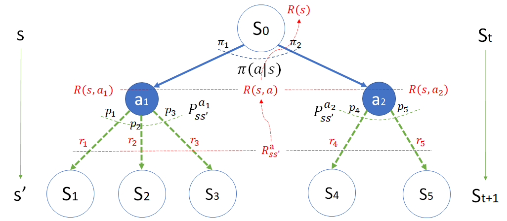
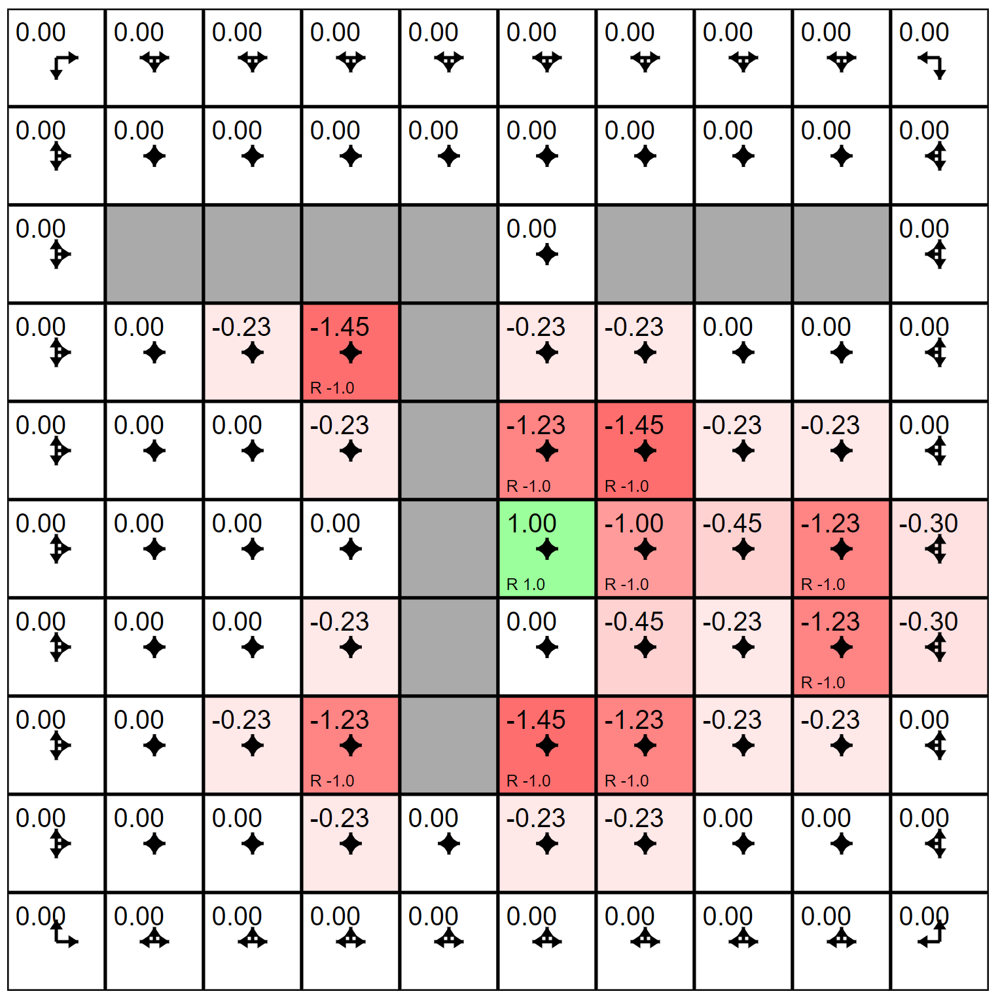

## 8.7 奖励的位置

在第 6 章中，我们研究过**马尔科夫奖励过程**中的**状态奖励方式**和**过程奖励方式**对价值函数的影响以及计算方法。现在进化到了**马尔科夫决策过程**，标准的奖励方式如同射击气球问题中描述的一样，是基于过程的，即，在动作发生后的状态转移阶段给与奖励，这一点在本章 8.3 节和 8.6 节中也有对奖励模型的描述，如图 8.3.6 所示。

由图 8.3.6 马尔可夫决策过程的奖励模型

总结一下图 8.3.6 中关于红色符号的奖励部分的关系，如式（8.7.1）所示：

$$
\begin{aligned}
R(s) &= \sum_{a \in A(s)} \pi(a|s) R(s,a) &(1)
\\
&= \sum_{a \in A(s)} \pi(a|s) \sum_{s' \in S} p^a_{ss'} r^a_{ss'}  &(2)
\\
&= \pi_1(p_1r_1+p_2r_2+p_3r_3) + \pi_2(p_4r_4+p_5r_5) &(3)
\end{aligned}
\tag{8.7.1}
$$

### 8.7.1 过程奖励（结果奖励）

具体到射击气球问题中，我们使用了面向转移过程的奖励方法，如图 8.7.1 中的红色数字所示，奖励总是发生在动作之后的。对应的计算方法是式（8.7.1）中的小写符号 $r$。

这种方式有天然的好处，即，它可以根据具体问题的应用场景给与可以理解的奖励数值，比如，在本例中：

- 脱靶得 0 分；
- 射中大气球得 1 分；
- 射中小气球得 3 分。

图 8.7.1 定义在状态转移上的奖励

再比如一些游戏中，击毙一个小鬼可以得到 10 分，击毙一个大怪可以得 50 分，等等。

### 8.7.2 动作奖励（策略奖励）

动作奖励是直接给到动作上的，比如，在射击气球问题中，选择射击红色气球，得到 0.5 的奖励，选择射击蓝色气球得到 0.6 的奖励，对应到式（8.7.1）中的符号 $R(s,a)$，如图 8.7.2 所示。

图 8.7.2 定义在动作节点上的奖励

我们不得不说这只是一种策略奖励，在本例中并不适合，因为读者可以看到，在图 8.7.2 中，根据不同情况，选择射击红色气球可能的奖励有 0.5,0.6,0.8,0.7 等几种，很难理解。这些值怎么得到的呢？就是根据式（8.7.1）计算得到的：$R(s,a)=\sum p^a_{ss'}r^a_{ss'}$。

比如动作“红(0)”：$R(s,a)=0.8 \cdot 0+0.05\cdot 1+0.15 \cdot 3=0.5$。

读者可以明显地体会到，这个 0.5 无法解释具体应用场景中的事件。但是在有些场景中，它还比较适用。比如图 8.7.3 所示。

图 8.7.3 David Silver 的 Lecture 2中的例子

在这个学生 MDP 案例中，空白圆圈表示状态，黑色线表示转移方向，红色字表示动作名称，黑色字表示奖励。

我们看红色的 Pub 字样，它表示一个动作（可以看到它的下游方向箭头末端有一个黑色圆点表示动作），可以立刻得到 R=+1 的奖励，而不管它后面会转移到哪个状态。这种情况还是很容易理解其实际含义的。

其它红色的字样也都表示动作，但是这张图在那些带箭头的线上少画了一个黑色的圆点，因为除了 Pub 动作以外，其它的动作发生后，都是以概率 1.0 转移到下一个状态，所以作者在这里就偷懒儿了。

### 8.7.3 状态奖励

在马尔可夫决策过程中，最“懒”的奖励方式是针对状态的奖励，如图 8.7.4 所示。

图 8.7.4 定义在状态节点上的奖励

在总共 7 个状态节点（包括终止状态）上，都有一个红色的 $R(s)$ 字样，表示该状态可以得到的奖励值。而图中所标出的那些红色数字，更是匪夷所思。

比如“开始(0)”状态的 $R(s)=0.56$ 是如何计算的呢？这还要看图 8.7.2，动作“红(0)”的 $R(s,a)=0.5$，动作“蓝(1)”的 $R(s,a)=0.6$，再考虑到从“开始(0)”状态出发的策略选择，所以有：$R(s)=\sum_a \pi(a|s) R(s,a)=0.4 \cdot 0.5+0.6 \cdot 0.6=0.56$。

没有人能说出这个 0.56 是什么意思。所以，这种状态奖励的方式，对于本问题来说不适用，因为无法解释其应用含义。

那么，什么样的应用场景适合于状态奖励方式呢？我们借用一下前面章节中的安全驾驶问题的案例，如图 8.7.5 所示。

图 8.7.5 定义在状态节点上的奖励

这本来是一个马尔科夫奖励过程，当然在增加动作节点后，也可以转化成马尔科夫决策过程。图中蓝色节点表示动作，旁边标有动作说明，每个动作都是以 1.0 的概率到达下一个状态，这是可以理解的，因为汽车的安全操控性要求较高，所以采取动作后，除非地面结冰，否则都会以 1.0 的概率达到驾驶员的期望。

在这个例子中，就非常适合于给状态以奖励。比如，“闯灯”状态，是表示车辆目前处于闯灯状态，此时警察就可以来给与罚款扣分处理了，$R=-6$。在此之前，没有人会预计该车辆会闯灯，而且闯灯也就是“说时迟那时快”的事情，无法监控驾驶员“踩油门”的过程，所以也不能给过程以奖励（警察不管该车辆是如何闯灯的，比如你是从快车道上闯的，还是慢车道？你是用向前行驶的方式，还是脑洞大开地用倒车的方式闯灯？或者是司机下车把车推出停车线以外？）。

还有一个例子是斯坦福大学网站上的，如图 8.7.6 所示。

图 8.7.6 迷宫游戏中定义在状态节点上的奖励

在这个例子中，中心绿色方格是智能体要达到的目标状态，给与奖励值 +1；深红色的方格是智能体要避开的状态，给与奖励值 -1。它不管是从哪里到达目标方格的，只要达到了该状态，就给与相应的奖励。因为 100 个方格（状态），每个方格都有 4 种动作，动作发生后的转移概率为 1，那么就有 400 个动作，如果给每个动作或者过程都定义奖励的话，就太麻烦了。而图 8.7.6 中，只需要定义 10 个奖励即可（其它 90 个奖励是 0）。
