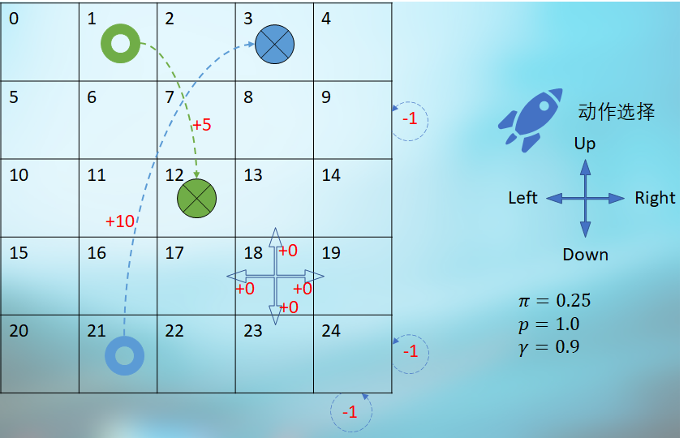
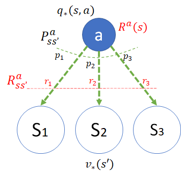
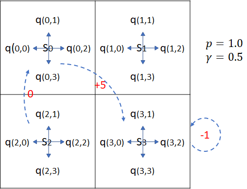
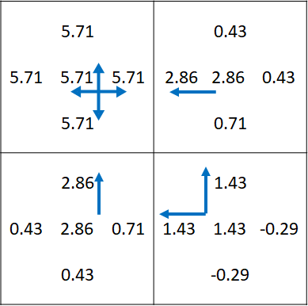

# 第 9 章 从动作价值到最优策略

### 9.1.0 温故知新

在前面的射击问题中，有以下几个缺陷：

- 是一个单向选择和转移的过程，最后形成了一张有向无环图。这就决定了我们可以从后向前一步步**回溯**，自下向上逐层计算状态价值函数 $v_\pi(s)$ 和动作价值函数 $q_\pi(s,a)$，直到开始状态。其计算过程是：$v_T \to q_\pi \to v_\pi \to q_\pi \to v_\pi$，如图 8.5.3 所示。

- 每个分支的细节分析起来比较多，但实际上分支之间的区别只存在于状态转移的过程的具体概率数值上。比如图 8.5.3 中的“红(2)”动作后的状态转移概率是 [0.8,0.05.0.15]，而动作“红(4)”的状态转移概率是 [0.78,0.05,0.17]。这种细节只是导致计算结果不同，但概念是相同的。

- 而另外一个重要的策略选择问题，我们暂时用“红:蓝=0.4:0.6”的固定概率，在两次射击时都是如此。但是在实际问题中，游客各有各的策略，这种统一的设定只是一种统计结果。游乐场老板虽然精明，但是游客们也不是傻子，谁都知道连续两次选择红色气球是有机会得到最高值 6 分的奖励的，只不过是能不能顺利实现的问题。

所以，本章中我们将会提出一个新的问题需要利用新的知识来解决，其特点正好可以弥补上述缺陷。


## 9.1 穿越虫洞问题

### 9.1.1 提出问题

<center>



图 9.1.1 穿越虫洞问题
</center>

问题描述：

- **状态空间、动作空间、随机策略**

  在一个 5x5 的宇宙空间中，一艘探索太空的宇宙飞船可以任意向四个方向行驶，策略 $\pi=1/4=0.25$。

- **角落状态**

  如果在如 $s_{24}$ 所示的角落处向右行驶或向下行驶，将会碰撞能量屏障使飞船受损，飞船位置不发生改变，得到 -1 的“奖励”，但并非终止状态。其它角落处也是如此，一共有 4 个**角落状态**（序号为：0，4，20，24）。

- **边界状态**

  如果在如 $s_9$ 所示的边界处向右行驶，将会碰撞能量屏障使飞船受损，得到 -1 的“奖励”，飞船位置不发生改变，但并非终止状态，还可以进一步行驶。其它边界处也是如此，一共有 12 个**边界状态**（序号为：1，2，3，5，9，10，14，15，19，21，22，23）。

- **虫洞**

  - 在 $s_1$ 处进行下一步行驶时，无论任何方向，将无条件地达到 $s_{12}$ 处，并得到 +5 的奖励，但后者并非终止状态。

  - 在 $s_{21}$ 处进行下一步行驶时，无论任何方向，将无条件地达到 $s_{3}$ 处，并得到 +10 的奖励，但后者并非终止状态。

  所以序号为 1,21 的两个状态可以从边界状态中去掉。

- **中心状态**

  在上述三种特殊状态之外的所有其它状态，比如在 $s_{18}$ 处，如果选择向右行驶，将会以 $p=1.0$ 的转移概率达到 19（不会发生意外偏航），并得到 0 的奖励。


### 9.1.2 问题特点

注意几点：

1. 没有终止状态，也就是说没有分幕，飞船可以一直行驶。

   没有终点状态的话，我们无法确定任意一个状态的价值函数，进而算出其上游的动作价值函数。所幸在 8.6 节中，已经写好了计算 $v_\pi,q_\pi$ 的迭代算法了，直接调用即可，但是需要准备好环境。

2. 在每个状态（方格）下，可以随机选择 4 个方向中的任意一个移动，即动作空间为 4，动作为“上下左右”，策略概率为 0.25。

3. 到达 $s_1,s_3$ 时，不是被立刻吸入虫洞，而是要进行下一步动作时才会时空转移。但是在 $s_1,s_3$ 并没有机会向上行驶而出界。

4. 关于边角位置的状态，如图 9.1.2 所示，以状态 $s_2$ 为例：

   - 如果从该状态以 0.25 的概率选择向上移动，会以概率 1.0 回到 $s_2$，并有 -1 的奖励。所以说，这里面既有策略 $\pi$，又有转移概率 $p$，只不过只有一个下游状态，没有分支。
   - 如果从 $s_2$ 以 0.25 的概率选择向下移动，会以 1.0 的概率转移到 $s_7$，得到 0 的奖励。

<center>


图 9.1.2 边界状态的动作和概率转移
</center>

所以，这个穿越虫洞问题的动作空间是 4，动作发生后的转移概率是 1，即，动作发生后，可以准确地到达目标，不会发生意外。而上一章中的射击气球问题，动作空间是 2，动作发生后的状态转移大于 2（两个动作分别是 2 和 3）。

最主要的是，读者一定要把这一章的问题与前面章节中学习的马尔科夫奖励过程中的没有动作而直接发生状态转移的情况分开。


### 9.1.3 模型数据定义

在强化学习中，经常会用图 9.1.1 这种方格（或长方格）来研究各种算法，因为这种方式可以有效地把一些连续问题转变为离散问题，从而使用马尔科夫链来简化并描述问题。所以有必要建立一个通用的模型，用数据驱动的方式来定义模型的各种行为。

模型定义可以分为四个小部分。

【代码位置】Wormhole_0_Data.py

#### 状态部分

```Python
# 状态空间 = 空间宽度 x 空间高度
GridWidth, GridHeight = 5, 5    # 可以是长方形，宽高不等
# 起点，可以多个
StartStates = []
# 终点，可以多个
EndStates = []
```

- 空间宽度 GridWidth 和高度 GridHeight

  可以不相等，比如 3 X 4。

- 起点 StartStates

  有些场景需要定义起点，比如迷宫游戏。

- 终止状态 EndStates

  有些场景需要定义终止状态，到达此状态后算是分幕结束。

- 关于序号的约定

  - 可以用从 0 开始的序号，方格的左上角序号为 0，然后向右依次加 1，右下角的序号为 GridWidth*GridHeight-1，比如 3x4-1=11。

  - 也可以用 $(x,y)$ 的方式定义每个状态的位置，方格的左上角坐标为 (0,0)，以 3x4 为例，右下角为 (2,3)。

#### 动作部分

```Python
# 动作空间
LEFT, UP, RIGHT, DOWN  = 0, 1, 2, 3
Actions = [LEFT, UP, RIGHT, DOWN]
# 初始策略
Policy = [0.25, 0.25, 0.25, 0.25]
# 状态转移概率: [SlipLeft, MoveFront, SlipRight, SlipBack]
SlipProbs = [0.0, 1.0, 0.0, 0.0]
```

- 按中国人的习惯，定义左（LEFT）、上（UP）、右（RIGHT）、下（DOWN）顺时针顺序的四个方向。

- 动作空间 Actions 

  由这上面四个动作组成。当然，在醉汉回家问题中，只有左、右两个动作。

- 初始策略 Policy

  在 4 个方向上随机选择，概率为 0.25。

- 状态转移概率 SlipProbs

  在动作执行后，是否会出现偏差。举例来说，在冰面向前行走，很有可能冰面太滑而造成向左 0.2、向右 0.1、向前 0.7 的状态转移概率，那么该值就可以写成 [0.2, 0.7, 0.1, 0.0]。注意顺序不能乱。

#### 奖励部分

```Python
# 每走一步的奖励值，可以是0或者-1
StepReward = 0
# 特殊奖励 from s->s' then get r, 其中 s,s' 为状态序号，不是坐标位置
SpecialReward = {
    (0,0):-1,       # s0 -> s0 得到-1奖励
    (2,2):-1,
    ......
    (1,12):+5,
    (21,3):+10
}
```

- 每步奖励 StepReward 

  表示每走一步都可以有 -1 的奖励，或者 0。在本例中为 0，表示每次移动不减分。

- 特殊奖励 SpecialReward

  比如本例中的碰撞边界得 -1，或者穿越虫洞得 +5 或 +10。这个字典不管智能体是如何从 $s$ 到达 $s'$ 的，也就是忽略了中间的动作选择和状态转移两个步骤，只看起始和终止状态。

  以状态 12 为例，在字典中定义了“(1,12):+5”，表示从状态 1 到状态 12 可以得到 +5 的奖励。但是从 7,11,13,17 四个状态也可以到达 12，只能按照 StepReward 的定义获得 0 奖励。

#### 特殊移动

```Python
# 特殊移动，用于处理类似虫洞场景
SpecialMove = {
    (1,LEFT):   12,    # 从状态1执行向左的动作会到达状态12
    (1,UP):     12,
    (1,RIGHT):  12,
    (1,DOWN):   12,
    (21,LEFT):  3,
    (21,UP):    3,
    (21,RIGHT): 3,
    (21,DOWN):  3
}
# 墙
Blocks = []
```

- 特殊移动 SpecialMove

  用于处理本例中的虫洞场景，比如“(1,LEFT):12”，表示“从状态 1 执行向左的动作会到达状态 12”。

- 墙 Blocks

  用于搭建迷宫类场景。撞墙后一般原地不动。


## 9.1 穿越虫洞问题

### 9.1.1 提出问题

<center>


图 9.1.1 穿越虫洞问题
</center>

问题描述：

- **状态空间、动作空间、随机策略**

  在一个 5x5 的宇宙空间中，一艘探索太空的宇宙飞船可以任意向四个方向行驶，策略 $\pi=1/4=0.25$。

- **角落状态**

  如果在如 $s_{24}$ 所示的角落处向右行驶或向下行驶，将会碰撞能量屏障使飞船受损，飞船位置不发生改变，得到 -1 的“奖励”，但并非终止状态。其它角落处也是如此，一共有 4 个**角落状态**（序号为：0，4，20，24）。

- **边界状态**

  如果在如 $s_9$ 所示的边界处向右行驶，将会碰撞能量屏障使飞船受损，得到 -1 的“奖励”，飞船位置不发生改变，但并非终止状态，还可以进一步行驶。其它边界处也是如此，一共有 12 个**边界状态**（序号为：1，2，3，5，9，10，14，15，19，21，22，23）。

- **虫洞**

  - 在 $s_1$ 处进行下一步行驶时，无论任何方向，将无条件地达到 $s_{12}$ 处，并得到 +5 的奖励，但后者并非终止状态。

  - 在 $s_{21}$ 处进行下一步行驶时，无论任何方向，将无条件地达到 $s_{3}$ 处，并得到 +10 的奖励，但后者并非终止状态。

  所以序号为 1,21 的两个状态可以从边界状态中去掉。

- **中心状态**

  在上述三种特殊状态之外的所有其它状态，比如在 $s_{18}$ 处，如果选择向右行驶，将会以 $p=1.0$ 的转移概率达到 19（不会发生意外偏航），并得到 0 的奖励。


### 9.1.2 问题特点

注意几点：

1. 没有终止状态，也就是说没有分幕，飞船可以一直行驶。

   没有终点状态的话，我们无法确定任意一个状态的价值函数，进而算出其上游的动作价值函数。所幸在 8.6 节中，已经写好了计算 $v_\pi,q_\pi$ 的迭代算法了，直接调用即可，但是需要准备好环境。

2. 在每个状态（方格）下，可以随机选择 4 个方向中的任意一个移动，即动作空间为 4，动作为“上下左右”，策略概率为 0.25。

3. 到达 $s_1,s_3$ 时，不是被立刻吸入虫洞，而是要进行下一步动作时才会时空转移。但是在 $s_1,s_3$ 并没有机会向上行驶而出界。

4. 关于边角位置的状态，如图 9.1.2 所示，以状态 $s_2$ 为例：

   - 如果从该状态以 0.25 的概率选择向上移动，会以概率 1.0 回到 $s_2$，并有 -1 的奖励。所以说，这里面既有策略 $\pi$，又有转移概率 $p$，只不过只有一个下游状态，没有分支。
   - 如果从 $s_2$ 以 0.25 的概率选择向下移动，会以 1.0 的概率转移到 $s_7$，得到 0 的奖励。

<center>


图 9.1.2 边界状态的动作和概率转移
</center>

所以，这个穿越虫洞问题的动作空间是 4，动作发生后的转移概率是 1，即，动作发生后，可以准确地到达目标，不会发生意外。而上一章中的射击气球问题，动作空间是 2，动作发生后的状态转移大于 2（两个动作分别是 2 和 3）。

最主要的是，读者一定要把这一章的问题与前面章节中学习的马尔科夫奖励过程中的没有动作而直接发生状态转移的情况分开。


### 9.1.3 模型数据定义

在强化学习中，经常会用图 9.1.1 这种方格（或长方格）来研究各种算法，因为这种方式可以有效地把一些连续问题转变为离散问题，从而使用马尔科夫链来简化并描述问题。所以有必要建立一个通用的模型，用数据驱动的方式来定义模型的各种行为。

模型定义可以分为四个小部分。

【代码位置】Wormhole_0_Data.py

#### 状态部分

```Python
# 状态空间 = 空间宽度 x 空间高度
GridWidth, GridHeight = 5, 5    # 可以是长方形，宽高不等
# 起点，可以多个
StartStates = []
# 终点，可以多个
EndStates = []
```

- 空间宽度 GridWidth 和高度 GridHeight

  可以不相等，比如 3 X 4。

- 起点 StartStates

  有些场景需要定义起点，比如迷宫游戏。

- 终止状态 EndStates

  有些场景需要定义终止状态，到达此状态后算是分幕结束。

- 关于序号的约定

  - 可以用从 0 开始的序号，方格的左上角序号为 0，然后向右依次加 1，右下角的序号为 GridWidth*GridHeight-1，比如 3x4-1=11。

  - 也可以用 $(x,y)$ 的方式定义每个状态的位置，方格的左上角坐标为 (0,0)，以 3x4 为例，右下角为 (2,3)。

#### 动作部分

```Python
# 动作空间
LEFT, UP, RIGHT, DOWN  = 0, 1, 2, 3
Actions = [LEFT, UP, RIGHT, DOWN]
# 初始策略
Policy = [0.25, 0.25, 0.25, 0.25]
# 状态转移概率: [SlipLeft, MoveFront, SlipRight, SlipBack]
SlipProbs = [0.0, 1.0, 0.0, 0.0]
```

- 按中国人的习惯，定义左（LEFT）、上（UP）、右（RIGHT）、下（DOWN）顺时针顺序的四个方向。

- 动作空间 Actions 

  由这上面四个动作组成。当然，在醉汉回家问题中，只有左、右两个动作。

- 初始策略 Policy

  在 4 个方向上随机选择，概率为 0.25。

- 状态转移概率 SlipProbs

  在动作执行后，是否会出现偏差。举例来说，在冰面向前行走，很有可能冰面太滑而造成向左 0.2、向右 0.1、向前 0.7 的状态转移概率，那么该值就可以写成 [0.2, 0.7, 0.1, 0.0]。注意顺序不能乱。

#### 奖励部分

```Python
# 每走一步的奖励值，可以是0或者-1
StepReward = 0
# 特殊奖励 from s->s' then get r, 其中 s,s' 为状态序号，不是坐标位置
SpecialReward = {
    (0,0):-1,       # s0 -> s0 得到-1奖励
    (2,2):-1,
    ......
    (1,12):+5,
    (21,3):+10
}
```

- 每步奖励 StepReward 

  表示每走一步都可以有 -1 的奖励，或者 0。在本例中为 0，表示每次移动不减分。

- 特殊奖励 SpecialReward

  比如本例中的碰撞边界得 -1，或者穿越虫洞得 +5 或 +10。这个字典不管智能体是如何从 $s$ 到达 $s'$ 的，也就是忽略了中间的动作选择和状态转移两个步骤，只看起始和终止状态。

  以状态 12 为例，在字典中定义了“(1,12):+5”，表示从状态 1 到状态 12 可以得到 +5 的奖励。但是从 7,11,13,17 四个状态也可以到达 12，只能按照 StepReward 的定义获得 0 奖励。

#### 特殊移动

```Python
# 特殊移动，用于处理类似虫洞场景
SpecialMove = {
    (1,LEFT):   12,    # 从状态1执行向左的动作会到达状态12
    (1,UP):     12,
    (1,RIGHT):  12,
    (1,DOWN):   12,
    (21,LEFT):  3,
    (21,UP):    3,
    (21,RIGHT): 3,
    (21,DOWN):  3
}
# 墙
Blocks = []
```

- 特殊移动 SpecialMove

  用于处理本例中的虫洞场景，比如“(1,LEFT):12”，表示“从状态 1 执行向左的动作会到达状态 12”。

- 墙 Blocks

  用于搭建迷宫类场景。撞墙后一般原地不动。

## 9.3 策略对价值函数的影响

### 9.3.1 给定策略下的状态函数值

让我们先暂时从穿越虫洞的问题中穿越回到射击气球的问题，因为还有一个疑问没有解决。

射击气球问题的初始化环境指定的策略是这样的：

```python
    Policy = {          # 原始策略
        0:[0.4,0.6],    # 在状态 0 时，选择射击红球的概率0.4，选择射击蓝球的概率0.6
        1:[0.4,0.6],    # 在状态 1 时，同上
        2:[0.4,0.6],
        3:[0.4,0.6],
        4:[0.4,0.6],
        5:[0.4,0.6],
        6:[0.4,0.6]     # 可以不定义，因为在终止状态没有动作
    }
```

前面也提到过，这个策略是通过统计游客的行为而得到的。意味着在100个游客中，有40个游客会选择射击红色气球，另外60个游客会选择射击蓝色气球，两轮射击都是如此。用公式表示为：

$$
\underbrace{\pi(a \mid s)=\mathbb P [A_t=a|S_t=s]}_{式(8.3.1)}=
\begin{cases}
0.4, & a=射击红球
\\
0.6, & a=射击蓝球
\end{cases}
\tag{9.3.1}
$$


所以最终的状态与动作价值函数结果如图 9.3.1 所示。

<center>


图 9.3.1
</center>

但是，这还没有回答在第 8 章最开始提出的问题：**你**做为一个聪明的游客应该如何选择呢？

因为一个不怎么“聪明”的游客也会想到：

1. 应该连续两次选择射击红球才有可能得到 6 元的奖励，大于开始付出的 4 元；
2. 如果射中一次红球、一次蓝球，刚好 4 元；
3. 如果射中两次蓝球，只有 2 元。

所以 0.4:0.6 这个数字，只是游乐场老板统计的结果，对于你来说这是最好的策略吗？

### 9.3.2 尝试不同的策略带来的影响

为了验证策略对最终结果的影响，我们可以尝试修改一下该策略，然后比较“开始(0)”状态的价值函数的值 $v_\pi(s_0)$，看看谁高谁低。因为对于本例来说，对下游状态的所有策略上的修改，最终会反映到开始状态的，所以我们只需要简单地比较开始状态的价值函数值就可以了。

【代码位置】Shoot_0_Try_Policy.py

```python
import numpy as np
import copy
import Shoot_2_DataModel as dataModel
import Algo_PolicyValueFunction as algo

if __name__=="__main__":
    Policy = {          # 原始策略
        0:[0.4,0.6]     # 下同
        ......
    }
    gamma = 1
    max_iteration = 1000
    env = dataModel.Env(Policy)
    V,Q = algo.calculate_Vpi_Qpi(env, gamma, max_iteration)
    print("在原始策略下的状态价值函数值")
    print(np.round(V,5))
    print("在原始策略下的动作价值函数值")
    print(Q)
    ......(未完待续)
```

这一部分的输出结果同图 9.3.1 相同，我们只是为了方便比对。

```
在原始策略下的状态价值函数值 V:
[1.19548 0.56    0.554   0.8     0.56    0.73    0.     ]
在原始策略下的动作价值函数值 Q:
[[1.0957 1.262 ]
 [0.5    0.6   ]
 [0.56   0.55  ]
 [0.8    0.8   ]
 [0.5    0.6   ]
 [0.7    0.75  ]
 [0.     0.    ]]
```

接下来修改策略，再进行价值计算，看看结果如何：

```python
    ......(接上一段代码)
    # 新策略
    test_policy = np.array([
        [0.2,0.8],  # 修改状态 0 的策略
        [0.5,0.5],  # 修改状态 1 的策略
        [0.3,0.7],  # 修改状态 2 的策略
        [0.1,0.9],  # 修改状态 3 的策略
        [0.3,0.7],  # 修改状态 4 的策略
        [0.6,0.4]   # 修改状态 5 的策略
    ])
    # 每次只修改一个策略,保持其它策略不变,以便观察其影响
    for i in range(6):
        print(str.format("修改状态 {0} 的策略:{1}", i, test_policy[i]))
        new_policy = copy.deepcopy(Policy)  # 继承原始策略
        new_policy[i] = test_policy[i]      # 只修改其中一个状态的策略
        env = dataModel.Env(new_policy)     # 输入新策略
        V,Q = algo.calculate_Vpi_Qpi(env, gamma, max_iteration) # 价值计算
        print(np.round(V,5))
```

打印输出结果：

```
修改状态 0 的策略:[0.2 0.8]
[1.22874 0.56    0.554   0.8     0.56    0.73    0.     ]
修改状态 1 的策略:[0.5 0.5]
[1.19228 0.55    0.554   0.8     0.56    0.73    0.     ]
修改状态 2 的策略:[0.3 0.7]
[1.19546 0.56    0.553   0.8     0.56    0.73    0.     ]
修改状态 3 的策略:[0.1 0.9]
[1.19548 0.56    0.554   0.8     0.56    0.73    0.     ]
修改状态 4 的策略:[0.3 0.7]
[1.19788 0.56    0.554   0.8     0.57    0.73    0.     ]
修改状态 5 的策略:[0.6 0.4]
[1.19188 0.56    0.554   0.8     0.56    0.72    0.     ]
```

### 9.3.3 结果分析

上述结果不方便分析，下面把结果列在表 9.3.1 中，便于对照比较。

表 9.3.1 修改策略后的状态价值函数

| 策略 $\to$ 价值                     | $v'_\pi(s_0)$ | $v'_\pi(s_1)$ | $v'_\pi(s_2)$ | $v'_\pi(s_3)$ | $v'_\pi(s_4)$ | $v'_\pi(s_5)$ | $v'_\pi(s_6)$ |
| ----------------------------------- | :-----------: | :-----------: | :-----------: | :-----------: | :-----------: | :-----------: | :-----------: |
| 原始策略[0.4, 0.6]下的$v_\pi(s)$    |    1.19548    |     0.56      |     0.554     |      0.8      |     0.56      |     0.73      |       0       |
| $s_0$的新策略$\pi'(s_0)$=[0.2, 0.8] |  **1.22874**  |     0.56      |     0.554     |      0.8      |     0.56      |     0.73      |       0       |
| $s_1$的新策略$\pi'(s_1)$=[0.7, 0.3] |  **1.19228**  |   **0.55**    |     0.554     |      0.8      |     0.56      |     0.73      |       0       |
| $s_2$的新策略$\pi'(s_2)$=[0.3, 0.7] |  **1.19546**  |     0.56      |   **0.553**   |      0.8      |     0.56      |     0.73      |       0       |
| $s_3$的新策略$\pi'(s_3)$=[0.1, 0.9] |    1.19548    |     0.56      |     0.554     |      0.8      |     0.56      |     0.73      |       0       |
| $s_4$的新策略$\pi'(s_4)$=[0.5, 0.5] |  **1.19788**  |     0.56      |     0.554     |      0.8      |   **0.57**    |     0.73      |       0       |
| $s_5$的新策略$\pi'(s_5)$=[0.6, 0.4] |  **1.19188**  |     0.56      |     0.554     |      0.8      |     0.56      |   **0.72**    |       0       |

表 9.3.1 中，第一行为原始策略的基准值，便于比较。后面每行中，我们把与基准值相比有变化的值都用黑体标了出来，便于读者可以快速发现差异。

从$v'_\pi(s_0)$ 的值看，有的子策略提高了该值，比如 $\pi'(s_0),\pi'(s_4)$；另外一些子策略降低了该值，比如 $\pi'(s_1),\pi'(s_2),\pi'(s_5)$；而 $\pi'(s_3)$ 对改值没有影响。所以，有必要搞清楚每个策略的具体影响，才能获得最大利益。

- 对状态 $s_0$ 的策略修改

把状态(0) 的策略 $\pi(s_0)$ 从 [0.4,0.6] 修改为 [0.2,0.8] 后，对后续状态的价值函数都没有影响，但是 $v_0$ 的价值函数提高到了 1.22874（基准值为 1.19548）。

原因是根据式 8.4.5，策略 $\pi$ 相当于在使用 $q_\pi$ 计算 $v_\pi$ 时的权重：

$$
v_\pi(s) = \sum_{a \in A(s)} \pi(a|s)q_\pi(s,a)
\tag{由8.4.5}
$$

状态“红(0)”的动作价值函数比“蓝(1)”小：$q_\pi(s_0,a_0)=1.0957,q_\pi(s_0,a_1)=1.262$。而在原始策略 $\pi(s_0)$ 中，$q_\pi(s_0,a_1)$ 占比 0.6，新策略 $\pi'(s_0)$ 中 $q_\pi(s_0,a_1)$ 占比 0.8，所以最后会影响到 $v_\pi(s_0)$ 的价值：

$$
\begin{aligned}
v_\pi(s_0) &= \pi_0(a_0|s_0)q_\pi(s_0,a_0)+\pi_0(a_1|s_0)q_\pi(s_0,a_1)
\\
&=0.4\times1.0957+0.6\times1.262 = 1.19548
\\
v'_\pi(s_0) &= \pi'(s_0)(a_0|s_0)q_\pi(s_0,a_0)+ \pi'(s_0)(a_1|s_0)q_\pi(s_0,a_1)
\\
&= 0.2 \times 1.0957 + 0.8 \times 1.262 = 1.22874
\end{aligned}
\tag{9.3.2}
$$

注意，$\pi_0$ 的修改只会影响到状态 $s_0$。

- 对状态 $s_1$ 的策略修改

$\pi_1$ 的修改会影响到状态值 $v_\pi(s_1)$，进而会影响到它的上游的 $q_\pi(s_0,a_0)$ 的值，以及再上游的状态 $v_\pi(s_0)$ 的值。

所以从表 9.3.1 中看，$v_\pi(s_1)=0.55$，低于原始策略的 $0.56$，所以最后 $v'_\pi(s_0)=1.19228$，也低于原始策略的 $1.19548$。

- 对状态 $s_3$ 的策略修改

为什么对状态 $s_3$ 的策略 $\pi_3$ 修改没有影响到任何状态值的变化呢？

因为它的下游动作价值函数 $q_\pi(s_3,a_0)=q_\pi(s_3,a_1)=0.8$，所以无论权重是多少，只要权重之和为 1，结果都是 0.8。

- 其它状态

 新的策略 $\pi'$ 的数值，有些会提高 $v_\pi(s_0)$ 的值，有些会降低 $v_\pi(s_0)$ 的值，完全依赖于具体的策略数值。比如 $\pi'(s_1)=[0.7, 0.3]$ 降低了 $v_\pi(s_0)$ 的值，改成 $\pi'(s_1)=[0.3, 0.7]$ 就会提高 $v_\pi(s_0)$ 的数值。

### 思考与练习


## 9.4 搜索策略

###  9.4.1 策略选择与策略单元

对于射击气球问题来说，如果只有一支箭，则只有一次策略选择；有两支箭的话，一共要做两次策略选择，但是由于第一支箭射出后有多种结果，要牵涉到 6 个策略单元（每个状态一个策略单元）。所以，策略数量与状态数量保持一致，但是与选择策略的次数完全有可能不相等。

- 如射击气球问题，是一个有向无环的图，所以策略选择次数 $\le$ 策略单元数量，因为有些状态可能很少有机会到达。
- 对于有向有环问题，如代码生命周期问题，策略选择次数有可能大于或小于策略单元数量。
- 对于无向有环问题，如穿越虫洞问题，策略选择次数 $\ge$ 策略单元数量，因为一个状态可能被访问多次。


<center>


图 9.4.1 策略选择与策略单元
</center>

在图 9.4.1 中，我们提出了策略单元与策略组的概念，比其它文献更详细地做了全方位描述。

1. 策略单元

   - 每个状态（除了终止状态以外）肯定有一个策略单元。一旦到达该状态，就需要做一次选择。但不是每个状态都必须被访问到。
   - 一个策略单元可以有很多种策略，决定于动作空间的大小。
   - 我们用 $\pi(s_t)$ 来表示状态 $s_t$ 的策略单元。

2. 动作空间

   每个策略单元中的动作空间有可能不同：

   - 比如在射击气球问题中，如果老板规定击中一个气球后，下一箭只能选择另外一只气球，则第一箭的动作空间为 2，第二箭的动作空间为 1。

   - 在迷宫行走问题中，在某个格子内可以向四个方向行走，在另外一些靠墙的格子内，只能向三个方向行走。但是为了简化问题，我们一般会假设仍然可以向四个方向走，只是撞墙后留在原地不动。

   - 对于穿越虫洞问题，其实在虫洞入口处，飞船只有一个选择（就是开始穿越），但是我们还是定义飞船可以向四个方向行驶。

   一般来说，策略单元的可选策略数量等于动作空间的数值。

3. 策略组

   - 所有的策略单元组成一个策略组，把每个策略单元的选择串联起来形成唯一的组合。

   - 比如图 9.4.1 中的四个策略单元，在某个马尔科夫中选择动作序号是 $[0, 2, 1, ..., 0]$，而在另外一次过程中选择动作序号是 $[0, 1, 1, ..., 0]$，有一个单元的差别，算作两个策略组，即两个策略。

   - 我们用 $\pi(S)$ 表示策略组，其中 $s \in S$。


观察表 9.3.1，在 6 个状态上的策略修改，都会影响对应的局部状态价值函数值，进而影响最终的状态价值函数值。

在 9.3 节中，对不同的策略单元的的独立修改会提高或降低 $v_\pi(s_0)$ 的值，那么一共有多少种组合可以帮助游客提高收益呢？其最大值又是多少呢？本节的任务就是给每个状态都找到最好的策略，从而使整体状态值达到最佳。

但是在具体操作中会遇到这样的困难：假设我们知道了一个状态上的策略是 [0.4,0.6]，但是不可能把一支箭分成 0.4:0.6，所以你必须二选一，用公式表示为：

$$
\pi_*(a_i \mid s)=
\begin{cases}
1, & if \ \pi(a_i|s)=\argmax \limits_{a \in A(s)} \pi(a|s)
\\
0, & 其它动作
\end{cases}
\tag{9.4.1}
$$

当 $\pi=[0.4,0.6], A(s)=[a_0,a_1]$ 时，即 $\pi(a_0|s)=0.4, \pi(a_1|s)=0.6$，式 9.4.1 的结果是：$\pi_*(a_0|s)=0,\pi_*(a_1|s)=1$，因为 0.6 > 0.4 且处于数组中第 1 个位置（从 0 开始计算）。

从另一个角度看，以两个动作为例，假设原始策略为 [0.4, 0.6]，如果新策略 [0.2, 0.8] 会提高整体状态函数值的话，那么另一个新策略 [0.1, 0.9] 甚至 [0.0, 1.0] 也一定会更大地提高状态函数值。读者只需要把上一小节的策略改一改就知道了，比如这一行代码：

```python
[0.2,0.8],  # 修改状态 0 的策略，可以尝试 [0.1, 0.9] or [0.0, 1.0]
```

因此，当$\pi'=[0.0,1.0]$时， $\pi(a_0|s)=0,\pi(a_1|s)=1$ 也就自然成立了。

当两个概率值相等时，我们可以选择任意一个，总选第一个的话，可能会失去其它机会。

在图 9.3.1 中，一共有 6 个有效的状态（$s_0,\cdots,s_5$) ，在每个状态上的策略有两种动作选择（红球或蓝球），这样一共有 $2\times2\times2\times2\times2\times2=2^6$ 种组合。推广到一般情况：如果状态空间为 $S$，动作空间为 $A$，则策略组合是 $|A|^{|S|}$ 种。

对于射击气球这个简单的问题来说，计算一次 $v_\pi,q_\pi$ 只需要迭代两次，即使用遍历的方法，也很容易快速得到结果。所以，我们先用最笨但是最准确的遍历法来得到评估的基准。

### 9.4.2 策略遍历搜索

知道了一共有 $2^6=64$ 种组合，用手写出来还是比较累的。作为一个合格的程序员，我们可以用代码生成 64 个组合策略，实际上就是用二进制表示的 [0, 63]：

```
[[0 0 0 0 0 0]  # 红 红 红 红 红 红
 [0 0 0 0 0 1]  # 红 红 红 红 红 蓝
 [0 0 0 0 1 0]  # 红 红 红 红 蓝 红
 ......
 [1 1 1 1 0 1]  # 蓝 蓝 蓝 蓝 红 蓝
 [1 1 1 1 1 0]  # 蓝 蓝 蓝 蓝 蓝 红
 [1 1 1 1 1 1]] # 蓝 蓝 蓝 蓝 蓝 蓝
```

上面的输出中，0 表示在该状态选择红色球，1 表示在该状态选择蓝色球。

下面要根据式 9.4.1，把上述的二进制形式翻译一下，变成模型可以认识的策略数据结构：用 onehot（热独）编码来表示选择红球或者蓝球，比如：[1, 0] 表示选择红球，[0, 1] 表示选择蓝球。

【代码位置】Shoot_3_OptimalSearch.py

```python
# 把二进制形式的的策略变成onehot编码形式的policy，如 [[0,1],[1,0],[1,0]...]
def create_onehot_policy(binary_actions):
    policy = {}
    for s in range(len(binary_actions)):  # onehot
        policy[s] = [1,0] if binary_actions[s]==0 else [0,1]
    return policy
```

以策略组-0为例，输出格式如下：

```
策略组-0：{0: [1, 0], 1: [1, 0], 2: [1, 0], 3: [1, 0], 4: [1, 0], 5: [1, 0]}
```

注意我们用**策略组**这个词，表示在 $[s_0,\cdots,s_5]$ 六个状态下的各自的**策略单元**动作选择，策略组-0中的策略是都选红色球。

好了，准备工作完成，接下来可以把每一种策略组代入环境中，计算价值函数了：

```python
# 遍历所有策略组合,计算V,Q
def caculate_all_V_Q(all_policy_in_binary):
    gamma = 1
    max_iteration = 1000
    V_all_policy = []
    Q_all_policy = []
    helper.print_seperator_line(helper.SeperatorLines.long)
    print("OneHot形式的策略组与 V 函数值 : ")
    helper.print_seperator_line(helper.SeperatorLines.middle)
    for id, binary_actions in enumerate(all_policy_in_binary):
        policy = create_onehot_policy(binary_actions)      # onehot形式
        print(str.format("策略组-{0}:\t{1}", id, policy))
        env = dataModel.Env(policy)     # 创建环境，代入策略组
        V, Q = algo.calculate_Vpi_Qpi(env, gamma, max_iteration)    # 迭代法计算V,Q
        V_all_policy.append(V)              # 保存每个策略组合的 V 函数结果,便于比较
        Q_all_policy.append(Q)
        print(str.format("V 函数值:\t{0}",V))
        helper.print_seperator_line(helper.SeperatorLines.short)
    return V_all_policy, Q_all_policy
```

上述代码将会输出所有策略组合及其状态价值函数：

```python
========================================
OneHot形式的策略组与 V 函数值 :
--------------------
策略组-0:       {0: [1, 0], 1: [1, 0], 2: [1, 0], 3: [1, 0], 4: [1, 0], 5: [1, 0]}
V 函数值:       [1.048 0.5   0.56  0.8   0.5   0.7   0.   ]
----------
策略组-1:       {0: [1, 0], 1: [1, 0], 2: [1, 0], 3: [1, 0], 4: [1, 0], 5: [0, 1]}
V 函数值:       [1.048 0.5   0.56  0.8   0.5   0.75  0.   ]
----------
......
策略组-62:      {0: [0, 1], 1: [0, 1], 2: [0, 1], 3: [0, 1], 4: [0, 1], 5: [1, 0]}
V 函数值:       [1.26 0.6  0.55 0.8  0.6  0.7  0.  ]
----------
策略组-63:      {0: [0, 1], 1: [0, 1], 2: [0, 1], 3: [0, 1], 4: [0, 1], 5: [0, 1]}
V 函数值:       [1.29 0.6  0.55 0.8  0.6  0.75 0.  ]
```

一共 64 组，为了节省篇幅，中间的部分省略，请读者自己运行代码观察全部结果。

接下来，要通过比较 $v_\pi(s_0)$ 的大小，来搜索基于 $v_\pi(s_0)$ 的最优策略组。$v_\pi(s_0)$ 的值就是在上面输出的 V 函数值列表中的第一个单元的值。

```python
# 搜索 best_v0 最优策略组合
def find_best_v0_policy(V_values, all_policy_in_binary):
    v = np.array(V_values)                    # 列表变成数组
    v0_best = np.max(v[:,0])                  # 获得所有策略组合中 v(s0) 的最大值
    helper.print_seperator_line(helper.SeperatorLines.long)
    print("v(s0)的最优价值函数 :", v0_best)
    best_ids = np.argwhere(v[:,0] == v0_best) # 获得所有的最大值的策略组合序号
    return best_ids.ravel()
```

得到 $v_\pi(s_0)$ 的最大值为 1.29，并返回满足此条件的策略组序号 best_ids：

```
========================================
v(s0)的最大 V 函数值 : 1.29
```

接下来根据返回的 best_ids 把满足 $v_\pi(s_0)=1.29$ 的策略组都找到：

```python
# 输出所有满足 best v0 的二进制策略和 V,Q 值
def all_best_v0(all_policy_in_binary, V_all_policy, Q_all_policy, best_ids):
    helper.print_seperator_line(helper.SeperatorLines.long)
    print("二进制形式的最优策略组与最优价值函数 :")
    helper.print_seperator_line(helper.SeperatorLines.middle)
    for id in best_ids:
        print(str.format("最优策略组-{0}:\t{1}", id, all_policy_in_binary[id]))
        print(str.format("V 函数值:\t{0}", V_all_policy[id]))
        print("Q 函数值:")
        print(Q_all_policy[id])
        helper.print_seperator_line(helper.SeperatorLines.short)
```

结果如下：

```
========================================
v(s0)等于最大值（1.29）的二进制形式的策略组与 V 函数值 :
--------------------
最优策略组-35:  [1 0 0 0 1 1]
V 函数值:       [1.29 0.5  0.56 0.8  0.6  0.75 0.  ]
----------
最优策略组-39:  [1 0 0 1 1 1]
V 函数值:       [1.29 0.5  0.56 0.8  0.6  0.75 0.  ]
----------
最优策略组-43:  [1 0 1 0 1 1]
V 函数值:       [1.29 0.5  0.55 0.8  0.6  0.75 0.  ]
----------
最优策略组-47:  [1 0 1 1 1 1]
V 函数值:       [1.29 0.5  0.55 0.8  0.6  0.75 0.  ]
----------
最优策略组-51:  [1 1 0 0 1 1]
V 函数值:       [1.29 0.6  0.56 0.8  0.6  0.75 0.  ]
----------
最优策略组-55:  [1 1 0 1 1 1]
V 函数值:       [1.29 0.6  0.56 0.8  0.6  0.75 0.  ]
----------
最优策略组-59:  [1 1 1 0 1 1]
V 函数值:       [1.29 0.6  0.55 0.8  0.6  0.75 0.  ]
----------
最优策略组-63:  [1 1 1 1 1 1]
V 函数值:       [1.29 0.6  0.55 0.8  0.6  0.75 0.  ]
```

$v_\pi(s_0)$ 的最大值为 1.29，可以达到该值的策略组有 8 个，序号为：[35, 39, 43, 47, 51, 55, 59, 63]。


### 思考与练习


## 9.5 最优价值函数

### 9.5.1 最优状态价值函数 $v_*$ 的定义

最优状态价值函数的定义：

$$
\begin{aligned}
v_*(s) &\doteq \max_\pi v_\pi(s) 
\\
&=\max\big[v_{\pi_1}(s),v_{\pi_2}(s),\cdots,v_{\pi_m}(s)\big]
\end{aligned}
\tag{9.5.1}
$$

对于任意状态 $s \in S$，假设采用了 $m$ 个不同的策略 $\pi_i(s)$ 时，得到了 $m$ 个相同或不同的 $v_{\pi_i}(s)$，其中最大的那个值，定义为状态 $s$ 下的最优状态价值函数 $v_*(s)$，对应的 $\pi_i(s)$ 称为最优策略 $\pi_*(s)$。

请注意，式（9.5.1）定义的是**一个策略单元**的最优策略，而最优策略组 $\pi_*(S)$ 是由所有的最优策略单元组成，即：

$$
\pi_*(S) \doteq \Big [\pi_*(s_0),\pi_*(s_1),\cdots,\pi_*(s_n)\Big ], \quad s_0,s_1,\cdots,s_n \in S
\tag{9.5.2}
$$

一般文献中所说的**最优策略**，实际上是指的式（9.5.2），它包含了所有的最优策略单元。注意，状态空间 $S$ 中有多少个状态，式（9.5.2）的方括号中就必须有多少个最优策略单元，少一个都不行。


举例来说，上一小节中，我们只取出了 $v_\pi(s_0)=1.29$ 的 8 个策略组，列在表 9.5.1 中。

表 9.5.1  $v_\pi(s_0)=1.29$ 的策略组

| 策略组序号 | $v_\pi(s_0)$ | $v_\pi(s_1)$ | $v_\pi(s_2)$ | $v_\pi(s_3)$ | $v_\pi(s_4)$ | $v_\pi(s_5)$ | $v_\pi(s_6)$ |
| :--------: | ------------ | :----------: | :----------: | :----------: | :----------: | :----------: | :----------: |
| $\pi_{35}$ | 1.29         |     0.5      |   **0.56**   |     0.8      |     0.6      |     0.75     |      0       |
| $\pi_{39}$ | 1.29         |     0.5      |   **0.56**   |     0.8      |     0.6      |     0.75     |      0       |
| $\pi_{43}$ | 1.29         |     0.5      |     0.55     |     0.8      |     0.6      |     0.75     |      0       |
| $\pi_{47}$ | 1.29         |     0.5      |     0.55     |     0.8      |     0.6      |     0.75     |      0       |
| $\pi_{51}$ | 1.29         |   **0.6**    |   **0.56**   |     0.8      |     0.6      |     0.75     |      0       |
| $\pi_{55}$ | 1.29         |   **0.6**    |   **0.56**   |     0.8      |     0.6      |     0.75     |      0       |
| $\pi_{59}$ | 1.29         |   **0.6**    |     0.55     |     0.8      |     0.6      |     0.75     |      0       |
| $\pi_{63}$ | 1.29         |   **0.6**    |     0.55     |     0.8      |     0.6      |     0.75     |      0       |
|   最大值   | **1.29**     |   **0.6**    |   **0.56**   |   **0.8**    |   **0.6**    |   **0.75**   |      0       |

按照式（9.5.1）的定义，需要满足所有 $v_\pi(s)$ 都是最大值的条件。

- $v_\pi(s_0),v_\pi(s_3),v_\pi(s_4),v_\pi(s_5)$，所有策略组具有相同的最大值；
- $v_\pi(s_1)$，最大值 0.6，只有策略组 51,55,59,63 满足；
- $v_\pi(s_2)$，最大值 0.56，只有策略组 35,39,51,59 满足。

以上三者求最小子集，从最优状态价值函数来评判，最优策略组为 51,55。

### 9.5.2 最优动作价值函数 $q_*$ 的定义

最优动作价值函数的定义：

$$
\begin{aligned}
q_*(s,a) &\doteq \max_\pi q_\pi(s,a) 
\\
&=\max\big[q_{\pi_1}(s,a),q_{\pi_2}(s,a),\cdots,q_{\pi_m}(s,a)\big]
\end{aligned}
\tag{9.5.3}
$$

对于任意状态 $s \in S$ 和动作 $a \in A(s)$，假设采用了 $m$ 个不同的策略 $\pi_i(s)$ 时，得到了 $m$ 个相同或不同的 $q_{\pi_i}(s,a)$，其中最大的那个值，定义为状态 $s$ 下采用动作 $a$ 的最优动作价值函数 $q_*(s,a)$，对应的 $\pi_i(s)$ 称为最优策略 $\pi_*(s)$。

和 $v_*$ 一样，式（9.5.3）定义的是最优策略单元，它们的组合成为最优策略组。

读者可自行运行以下代码，可以得到上述 8 个策略组的 Q 函数值列表。

【代码位置】 Shoot_4_OptimalSearchQ.py


表 9.5.2 8个策略组的 Q 函数

| 策略组序号$\to$ | $q_\pi(s_0,a_0)$ | $q_\pi(s_0,a_1)$ | $\cdots$ |
| :-------------: | :--------------: | :--------------: | -------- |
|   $\pi_{35}$    |      1.048       |       1.29       | $\cdots$ |
|   $\pi_{39}$    |      1.048       |       1.29       | $\cdots$ |
|   $\pi_{43}$    |      1.0475      |       1.29       | $\cdots$ |
|   $\pi_{47}$    |      1.0475      |       1.29       | $\cdots$ |
|   $\pi_{51}$    |    **1.218**     |       1.29       | $\cdots$ |
|   $\pi_{55}$    |    **1.218**     |       1.29       | $\cdots$ |
|   $\pi_{59}$    |      1.217       |       1.29       | $\cdots$ |
|   $\pi_{63}$    |      1.217       |       1.29       | $\cdots$ |
|     最大值      |    **1.218**     |     **1.29**     | $\cdots$ |

表 9.5.2 只列出了 $q_\pi(s_0,a_0),q_\pi(s_0,a_1)$ 两个值，因为其它值都相等，为了节省篇幅，没有列出。

两列的最大值分别为 1.218,1.29，只有策略组 51,55 等于最大值， 而其它 6 个策略组的 $q_\pi(s_0,a_0)$ 函数值会小于最大值。因此，只有策略组 51,55 满足式（9.5.3），成为最优策略组，这也与用 $v_*$ 做评判标准得到的结果相同。

这说明针对本例，最优策略并不是唯一的。在其它强化学习问题中，也是如此：

1. 可以保证有最优策略；
2. 可以保证找到最优策略；
3. 不能保证找到所有最优策略。

### 9.5.3 结果分析

#### 为什么会有两个最优策略？

把策略组 51,55 的 V 函数和 Q 函数的晦涩数字标注在图 9.5.1 中，一目了然：

<center>


图 9.5.1 搜索最优策略的结果
</center>

策略 51,55 的区别在表 9.5.2 中。

表 9.5.2 策略51,55的区别

| 策略组合序号 | $\pi(s_0)$ | $\pi(s_1)$ | $\pi(s_2)$ | $\pi(s_3)$ | $\pi(s_4)$ | $\pi(s_5)$ |
| :----------: | :--------: | :--------: | :--------: | :--------: | :--------: | :--------: |
|  $\pi_{51}$  |     1      |     1      |     0      |     0      |     1      |     1      |
|  $\pi_{55}$  |     1      |     1      |     0      |     1      |     1      |     1      |

从表中的数据比较，只有 $\pi(s_2),\pi(s_3)$ 不一样，而这两个策略单元对应的是图 9.5.1 的“大奖(3)”状态和“红(6),蓝(6)”两个动作。由于两个动作的 Q 函数值都是 0.8，所以无论选择哪个动作，大奖(3)的 V 函数都是 0.8，因此两种策略没有区别。

在方格世界中也经常有这种情况发生，走两条路会到达同一个目标，并且奖励相同，就会产生两个值相等的策略。

#### 为什么 8 个备选策略中只有 2 个是最优策略？

上一节中得知，在总共 64 个策略组合中，有 8 个可以让 $v_\pi(s_0)$ 达到最大值 1.29。

观察策略组序号的话，对数字敏感的读者可能会发现，它是一个等差数列，相邻数字之间相差 4。这个现象很有趣，一定与二进制的排列相关。进一步，我们可以把策略组的情况（二进制表示形式）做一个异或操作：

表 9.5.3 选出的策略组合中的动作选择（0表示选择红球，1表示选择蓝球）

| 策略组合序号 | $\pi(s_0)$ | $\pi(s_1)$ | $\pi(s_2)$ | $\pi(s_3)$ | $\pi(s_4)$ | $\pi(s_5)$ |
| :----------: | :--------: | :--------: | :--------: | :--------: | :--------: | :--------: |
|  $\pi_{35}$  |     1      |     0      |     0      |     0      |     1      |     1      |
|  $\pi_{39}$  |     1      |     0      |     0      |     1      |     1      |     1      |
|  $\pi_{43}$  |     1      |     0      |     1      |     0      |     1      |     1      |
|  $\pi_{47}$  |     1      |     0      |     1      |     1      |     1      |     1      |
|  $\pi_{51}$  |     1      |     1      |     0      |     0      |     1      |     1      |
|  $\pi_{55}$  |     1      |     1      |     0      |     1      |     1      |     1      |
|  $\pi_{59}$  |     1      |     1      |     1      |     0      |     1      |     1      |
|  $\pi_{63}$  |     1      |     1      |     1      |     1      |     1      |     1      |
|     XOR      |   **0**    |   **1**    |   **1**    |   **1**    |   **0**    |   **0**    |

从表 9.5.3 中的异或结果可以看到，上述 8 个策略组中的共同点是在 $\pi(s_0),\pi(s_4),\pi(s_5)$ 三个策略上都选择 1（蓝色球），而在 $\pi(s_1),\pi(s_2),\pi(s_3)$ 三个策略上选择不同。

其根本原因在于在 $s_0$ 状态，选择射击蓝色气球 $\pi(a|s_0)=1$，在图 9.5.1 中，走了右侧的分支。本例的特点就是左右分支是二选一的，只要在右侧的后续流程中，使用 $\pi(a|s_4)=1,\pi(a|s_5)=1$，那么就能保证 $v_\pi(s_0)=1.29$，而在 $\pi(s_1),\pi(s_2),\pi(s_3)$ 三个策略上选择什么无所谓。

虽然其它 6 个策略也可以让 $v_\pi(s_0)=1.29$，但是根据式（9.5.1,9.5.3）的定义，它们不是最优策略，因为在其它几个 V,Q 函数值上不满足最大值条件。

### 思考与练习


## 9.6 贝尔曼最优方程

### 9.6.1 最优动作价值函数 $q_*$

最优动作价值函数 $q_*$ 的表达式，其实与 $q_\pi$ 函数相同（式（8.4.2）），因为都是从下游的状态价值函数 $v(s')$ 再加上状态转移概率及奖励计算而来，并没有取最大值的操作，只不过下游状态前者是 $v_*$，后者是 $v_\pi$，只要我们先假设它们是已知的，对 Q 函数的计算就没有区别。

$q_*$ 函数的模型如图 9.6.1 所示。

<center>



图 9.6.1 $q_*$ 函数模型
</center>

根据图 9.6.1 可以做实例化推导：

$$
\begin{aligned}
q_*(s,a) & = p_1[r_1+\gamma v_*(s_1)]+p_2[r_2+\gamma v_*(s_2)]+p_3[r_3+\gamma v_*(s_3)]
\\
&=\sum_{s'} p_{ss'}^a [r_{ss'}^a+\gamma v_*(s')] &(1)
\\
&=P^a_{ss'}[R^a_{ss'}+\gamma V_\pi(s')] &(2)
\\
&= R^a(s)+ \gamma P_{ss'}^a V_\pi(s')  &(3)
\end{aligned}
\tag{9.6.1}
$$

这与式（9.5.3）并不矛盾，前者是用 $q_\pi$ 来表示 $q_*$，这里是用 $v_*$ 来表示 $q_*$。

### 9.6.2 最优状态价值函数 $v_*$

最优状态价值函数 $v_*$ 与 $v_\pi$ 的计算是不同的，由于需要在 $\pi_*$ 处取下游状态 $q_*(s,a)$ 中的最大值，所以不再是加权求和的运算，而是最大值运算。

$v_*$ 函数的模型如图 9.6.2 所示。

<center>


图 9.6.2 $v_*$ 函数模型
</center>

策略单元选择时，总是取下游的动作 Q 函数中最大的那一个，即：

$$
\pi_*(a|s)=
\begin{cases}
1 & a=\argmax\limits_{a \in A(s)}  q_*(s,a)
\\
0 & 其它
\end{cases}
\tag{9.6.2}
$$

根据图 9.6.2 可以做实例化推导：

$$
\begin{aligned}
v_*(s) &=\pi_*(a_1|s)q_*(s,a_1) + \pi_*(a_2|s)q_*(s,a_2)
\\
&=\sum \pi_*(a|s)q_*(s,a)   &(1)
\\
&= \max_{a \in A(s)} q_*(s,a) &(2)
\end{aligned}
\tag{9.6.3}
$$

根据式（9.6.2）可知，在众多的 $\pi_*(a_i|s)q_*(s,a_i)$ 中，只有一个 $\pi_*(a_i|s)=1$，其它都是 0，所以相当于对 $\pi_*(a_i|s)=1$ 对应的 $q_*(s,a_i)$ 取最大值。这样的话，式（9.5.6）的子式（1）就与 $v_\pi$ 函数的形式（式（8.4.4））保持一致了。


### 9.6.3 手撕简化版穿越虫洞

下面我们就来一起看一下式（9.6.1）和式（9.6.3）在实际应用中是如何使用。

在 9.1 节中，我们提出了一个穿越虫洞的问题，是一个 5x5 的方格世界，没有终止状态。因为在本节中要进行手算，所以我们简化一下这个问题，把 5x5 变成 2x2 的方格世界，只有一个从 $s_0$ 到 $s_3$ 的穿越可以得到 +5 的奖励，折扣为 0.5，其它设置都是前面的问题一样。如图 9.6.3。

<center>



图 9.6.3 简化的穿越虫洞问题
</center>

问题简述：

- 状态集为 $S=[s_0,s_1,s_2,s_3]$；
- 每个状态下都有 4 个动作，动作集合为 $A=[0,1,2,3]$，代表左上右下；
- 转移概率为 1.0，即，可以准确到达动作方向所在的区域；
- 折扣为 0.5；
- 出界得到 -1 奖励并回到原状态；
- 从 $s_0$ 的四个动作都到 $s_3$，+5 奖励；
- 其它状态转移奖励为 0；
- 没有定义策略，需要求解。

下面利用式（9.6.1）和式（9.6.3）来求这个问题的最优价值函数 $V_*$ 和最优动作函数 $Q_*$。

为了简化符号，我们会用：

- $q_*$ 动作价值函数表示为 $q_{sa}, s=[0,1,2,3], a=[0,1,2,3]$；
- $v_*$ 状态价值函数表示为 $v_s, s=[0,1,2,3]$。

根据式（9.6.3），列出 $V_*$ 的方程组（9.6.4）：

$$
V_*=
\begin{cases}
v_0=\max [q_{00},q_{01},q_{02},q_{03}]
\\
v_1=\max [q_{10},q_{11},q_{12},q_{13}]
\\
v_2=\max [q_{20},q_{21},q_{22},q_{23}]
\\
v_3=\max [q_{30},q_{31},q_{32},q_{33}]
\end{cases}
\tag{9.6.4}
$$

式（9.6.4）中，$q$ 值列在 $Q_*$ 方程组（9.6.5）中，根据式（9.6.1）得到：

$$
Q_*=
\begin{cases}
q_{00}=q_{01}=q_{02}=q_{03}=1\times(5+0.5v_3)=5+0.5v_3
\\
q_{10}=1\times(0+0.5v_0)=0.5v_0
\\
q_{11}=q_{12}=1\times(-1+0.5v_2)=0.5v_1-1
\\
q_{13}=1\times(0+0.5v_3)=0.5v_3
\\
q_{20}=q_{23}=1\times(-1+0.5v_2)=0.5v_2-1
\\
q_{21}=1\times(0+0.5v_0)=0.5v_0
\\
q_{22}=1\times(0+0.5v_3)=0.5v_3
\\
q_{30}=1\times(0+0.5v_2)=0.5v_2
\\
q_{31}=1\times(0+0.5v_1)=0.5v_1
\\
q_{32}=q_{33}=1\times(-1+0.5v_3)=0.5v_3-1
\end{cases}
\tag{9.6.5}
$$

把式（9.6.5）代入到式（9.6.4）中，并去掉重复项，得到方程组（9.6.6）。所谓重复项，就是 $\max[a,a,b]=\max[a,b]$，$a$ 为重复项，去掉一个。

$$
V_*=
\begin{cases}
v_0=\max [5+0.5v_3] &(1)
\\
v_1=\max [0.5v_0,0.5v_1-1,0.5v_3] &(2)
\\
v_2=\max [0.5v_2-1,0.5v_0,0.5v_3] &(3)
\\
v_3=\max [0.5v_2,0.5v_1,0.5v_3-1] &(4)
\end{cases}
\tag{9.6.6}
$$

简化方程组（9.6.6）：

1. 由式（9.6.6）的子式(1)，得到：$v_0=5+0.5v_3$，因为只有一项，肯定相等。

2. 由式（9.6.6）的子式(2)，我们先假设 $v_1 \ge 0$，则 $v_1>0.5v_1-1$，所以有：$v_1=\max [0.5v_0,0.5v_1-1,0.5v_3]=\max [0.5v_0,0.5v_3]$。

3. 同理，假设 $v_2 \ge 0$，则式（9.6.6）的子式(3)变成：$v_2=\max [0.5v_0,0.5v_3]$。

4. 同理，假设 $v_3 \ge 0$，则式（9.6.6）的子式(4)变成：$v_3=\max [0.5v_2,0.5v_1]$。

整理为式（9.6.7）：

$$
V_*=
\begin{cases}
v_0=5+0.5v_3    &(1)
\\
v_1= \max[0.5v_0,0.5v_3]    &(2)
\\
v_2= \max [0.5v_0,0.5v_3]   &(3)
\\
v_3= \max [0.5v_2,0.5v_1]   &(4)
\end{cases}
\tag{9.6.7}
$$

进一步简化：

1. 由式（9.6.7）子式(2)(3)可知，$v_1=v_2$，所以，子式(4)改为：$v_3=\max[0.5v_1,0.5v_2]=\max[0.5v_1,0.5v_1]=\max[0.5v_1]=0.5v_1$。

2. 将$v_3=0.5v_1$代入式（9.6.7）子式(2)：$v_1= \max[0.5v_0,0.5v_3]=\max[0.5v_0,0.25v_1]=\max[0.5v_0]=0.5v_0$，是因为前面已经假设 $v_1 \ge 0$，所以可以从 $\max$ 运算中去掉 $0.25v_1$。

再整理一下：

$$
V_*=
\begin{cases}
v_0=5+0.5v_3
\\
v_1=0.5v_0
\\
v_1=v_2
\\
v_3=0.5v_1
\end{cases}
\tag{9.6.8}
$$
解方程组（9.6.8）得：
$$
V_*=
\begin{cases}
v_0=\frac{40}{7} \approx 5.71
\\
v_1=\frac{20}{7} \approx 2.86
\\
v_2=\frac{20}{7} \approx 2.86
\\
v_3=\frac{10}{7} \approx 1.43
\end{cases}
\tag{9.6.9}
$$
进而可以根据式（9.6.5）解得 $Q_*$：
$$
Q_*=
\begin{cases}
q_{00}=q_{01}=q_{02}=q_{03} \approx 5.71
\\
q_{10}=1\times(0+0.5v_0) \approx 2.86
\\
q_{11}=q_{12} \approx 0.43
\\
q_{13}=1\times(0+0.5v_3) \approx 0.71
\\
q_{20}=q_{23} \approx 0.43
\\
q_{21} \approx 2.86
\\
q_{22} \approx 0.71
\\
q_{30}=q_{31} \approx 1.43
\\
q_{32}=q_{33} \approx -0.29
\end{cases}
\tag{9.6.10}
$$

我们把 $V_*,Q_*$ 的结果绘制在图 9.6.4 中。每个方格内，处于中间位置的是 $v_*$，处于四边的是 $q_*$。可以验证：

1. $v_*=\max(q_*)$，即中间的数字等于四边的数字中的最大值。
2. $q_*=p(r+\gamma v_*)$，即每一边上的数字等于奖励值（0,-1,+5等）加目标方格中心的数字乘以折扣0.5。

<center>



图 9.6.4 最优价值函数 $V_*, Q_*$
</center>

在图 9.6.4 中同时画出了 $\max(q_*)$ 所代表的动作方向，都和预想的一致。

### 思考与练习


## 9.7 价值迭代

- 在 9.2 节中，计算了在随机策略下穿越虫洞问题的 $V_\pi, Q_\pi$；
- 在 9.5 节中，手工计算了简化版穿越虫洞问题的 $V_*,Q_*$；
- 在 9.6 节中，有了在最优策略下计算 $V_*,Q_*$ 的贝尔曼最优方程；
- 所以，在本节中，可以尝试解决寻找穿越虫洞问题的最优策略了。

但是，手工计算太复杂了，遇到求最大值的问题，还需要做很多假设，所以，本节中我们学习一下是否可以通过动态规划的方式来解决问题。

### 9.7.1 迭代算法

#### 算法描述

把 8.6.2 节中的算法拿过来，稍微改动一下。

---

定义误差 $\varepsilon$
初始化 $V_*(s),Q_*(s,a) \leftarrow 0$
循环：
　　保存备份以检查收敛性 $V_{old}(s) \leftarrow V_*(s)$
　　对每一个非终止状态的 $s \in S$：
　　　　获得动作空间 $A(s)$
　　　　对于每个动作 $a \in A(s)$:
　　　　　　获得转移概率 $p$, 下游状态 $s'$，奖励 $r$
　　　　　　计算 $q_*(s,a)=\sum\limits_{s'} p \big [r+\gamma v_*(s') \big ]$
　　　　　　存放到数组 $Q_*(s,a) \leftarrow q_*(s,a)$
　　　　$v_*(s) \leftarrow \max\limits_a[Q_*(s,a)]$，即指定状态下所有 $a$ 的最大 $Q$ 值
　　　　存放到数组 $V_*(s) \leftarrow v_*(s)$
　　检查收敛性, 如果 $\max(|V_{old} - V_*|) < \varepsilon$ 则退出循环
返回 $V_*(s),Q_*(s,a)$

---

#### 计算单个 $q_*$

计算 $q_*$ 的公式与计算 $q_\pi$ 的一样，所以代码也一样。

```python
# 式 (9.6.1) 计算 q，假设已知 v*(s')
def q_star(p_s_r, gamma, V):
    q = 0
    # 遍历每个转移概率,以计算 q
    for p, s_next, r in p_s_r:
        # math: \sum_{s'} p_{ss'}^a [ r_{ss'}^a + \gamma *  v_{\pi}(s')]
        q += p * (r + gamma * V[s_next])
    return q
```

输入参数：

- p_s_r：是转移概率 P、下游状态 S、奖励 R 的缩写，是一种数据结构定义，在前面有说明。
- gamma：折扣值。
- V：最优状态价值函数数组 $V_*$。

返回值：指定状态 s 和动作 a 的动作价值函数 $q_*(s,a)$。

#### 计算单个 $v_*$

计算 $v_*$ 的公式与计算 $v_\pi$ 的不一样，最大的区别有两点：

1. 输入参数中不需要 policy 策略参数，因为我们可以从这个算法中直接得到最优策略。
2. 不需要累积 q 值来计算 v 值，而是直接返回 q 值中的最大者。

代码如下：

```python
# 式 (9.6.3) 计算 v*
def v_star(s, actions, gamma, V, Q):
    list_q = []                     # 准备列表记录所有下游的 q*
    for a, p_s_r in actions:        # 遍历每个动作以计算q值，进而计算v值
        q = q_star(p_s_r, gamma, V) # 计算 q*
        list_q.append(q)            # 加入列表
        Q[s,a] = q                  # 记录下每一个q(s,a)值,不需要再单独计算一次
    return max(list_q)              # 返回几个q*中的最大值,即 v=max(q)
```

输入参数：

- s：指定状态。
- actions：指定状态下的动作空间。
- gamma：折扣。
- V：最优状态价值函数数组 $V_*$。
- Q：最优动作价值函数数组 $Q_*$。

返回值：几个最优动作价值函数值中的最大值 $v_*(s)=\max[q_*(s,a)]$。

#### 用迭代法计算 $V_*,Q_*$

实现算法 9.7.1。

【代码位置】Algo_OptimalValueFunction.py

```python
def calculate_VQ_star(env, gamma, max_iteration):
    V = np.zeros(env.nS)            # 0初始化V*(s)
    Q = np.zeros((env.nS, env.nA))  # 0初始化Q*(s,a)
    count = 0                       # 记录迭代次数
    # 迭代
    while (count < max_iteration):
        V_old = V.copy()                            # 保存备份便于检查收敛性
        for s in range(env.nS):                     # 遍历所有状态s
            if env.is_end(s):                       # 终止状态v=0
                continue            
            actions = env.get_actions(s)            # 获得动作空间
            V[s] = v_star(s, actions, gamma, V, Q)  # 计算V*,Q*
        if abs(V-V_old).max() < 1e-4:               # 检查收敛性
            break
        count += 1
    # end while
    print("迭代次数 = ",count)
    return V, Q
```

### 9.7.2 

#### 数据与模型

数据定义与模型逻辑仍然使用和计算 $V_\pi,Q_\pi$ 时同样的代码，在 9.2.2 节也说过了，这种设计可以高度复用，这时就能看出它的好处了。

【代码位置】Wormhole_0_Data.py, GridWorld_Model.py

#### 主过程

【代码位置】Wormhole_2_VQ_star.py

```python
import numpy as np
import Wormhole_0_Data as data              # 数据定义
import GridWorld_Model as model             # 模型逻辑
import Algo_OptimalValueFunction as algo    # 算法实现
import DrawQpi as drawQ                     # 结果输出

if __name__=="__main__":
    env = model.GridWorld(
        # 关于状态的参数
        data.GridWidth, data.GridHeight, data.StartStates, data.EndStates,  
        # 关于动作的参数
        data.Actions, data.Policy, data.SlipProbs,                     
        # 关于奖励的参数
        data.StepReward, data.SpecialReward,                     
        # 关于移动的限制 
        data.SpecialMove, data.Blocks)                        
    model.print_P(env.P_S_R)
    gamma = 0.9 # 折扣，在本例中用1.0可以收敛，但是用0.9比较保险
    iteration = 1000    # 算法最大迭代次数
    V_star, Q_star = algo.calculate_VQ_star(env, gamma, iteration)  # 原地更新的迭代算法
    print("V*")
    V = np.reshape(np.round(V_star,2), (data.GridWidth, data.GridHeight))
    print(V)
    print("Q*")
    print(np.round(Q_star,2))
    # 字符图形化显示
    drawQ.draw(Q_star, (data.GridWidth, data.GridHeight))
```

#### 运行结果

$V_*$ 的结果如图 9.7.1 所示。

<center>


图 9.7.1 穿越虫洞问题的最优状态价值函数值
</center>

以 $s_{17}$ 为例，它本身的 $v_*$ 值为 21.2，“人往高处走”，下一步，智能体会从 $s_{17}$ 走到相邻方格的 $v_*$ 比较高的方向，也就是 $s_{16},s_{22}$。

笔者特意给具有相同值的方格画了连线，整体上看，这些连线形成了一种类似梯度的形状，表示最优状态价值函数的一种变化趋势。


$Q_*$ 的结果如图 9.7.1 所示。


<center>


图 9.7.2 穿越虫洞问题的最优动作价值函数值
（左图：$Q_*$函数值；右图：最佳动作方向）
</center>

- 仍以 $s_{17}$ 为例，其“左上右下”四个方向的最优动作价值为 21.2, 17.2, 17.2, 21.2，所以它会引导智能体向下或者向左移动。
- 靠近边界的方格都会有向内部移动的趋势。
- $s_1,s_{21}$ 向任意方向移动都会导致穿越，所以无所谓。
- $s_{10},s_{11},s_{12},s_{13},s_{14}$ 这一行处于中间地带，最佳动作都是向 $s_{21}$ 移动，而不是向奖励相对较小的 $s_1$ 移动。

### 9.7.3 二级回溯

同 $V_\pi,Q_\pi$ 一样（见 8.6.4 节），$V_*,Q_*$ 也有二级回溯，即，可以用 $V_*(s')$ 来表示 $V_*(s)$，也可以用 $Q_*(s',a')$ 来表示 $Q_*(s,a)$。


#### $v_*(s)$ 的迭代表达式

<center>


图 9.7.3 最优状态价值函数 $V*$ 的二级回溯图
</center>

如图 9.7.3，$v_*(s)$ 会取左右两侧较大的那个 $q_*(s,a)$ 来作为自己的值，读者不妨假设是左侧的 $q_*$ 较大，然后将式（9.6.1）代入式（9.6.3），从而消去 $q_*(s,a)$，推导出式（9.7.1）：

$$
\begin{aligned}
v_*(s) &= \max_{a \in A(s)}\Big[ q_*(s,a) \Big]
\\
&=\max_{a \in A(s)} \Big[ \sum_{s'} p_{ss'}^a [r_{ss'}^a+\gamma v_*(s')] \Big] &(1)
\\
&=\max_{a \in A(s)} \Big[  R^a(s)+ \gamma \sum_{s'} p_{ss'}^a  v_*(s') \Big] &(2)
\end{aligned}
\tag{9.7.1}
$$

子式（1）和子式（2）两种形式，都可以使用，取决于问题中的奖励函数的设定。

#### $q_*(s,a)$ 的迭代表达式

<center>


图 9.7.4 最优动作价值函数 $Q*$ 的二级回溯图
</center>

如图 9.7.4，$q_*(s)$ 会取左右两侧 $v_*(s')$ 的加权平均值，将式（9.6.3）代入式（9.6.1），从而消去 $v_*(s)$，推导出式（9.7.2）：


$$
\begin{aligned}
q_*(s,a) 
&=\sum_{s'} p_{ss'}^a [r_{ss'}^a+\gamma v_*(s')]
\\
&=\sum_{s'} p_{ss'}^a [r_{ss'}^a+\gamma \max q_*(s',a')] &(1)
\\
&=\sum_{s'} p^a_{ss'} r^a_{ss'} + \gamma \sum_{s'} p^a_{ss'} [\max_{a'} q_*(s',a')] &(2)
\\
&=R^a(s) + \gamma \sum_{s'} p_{ss'}^a [\max q_*(s',a')] &(3)
\end{aligned}
\tag{9.7.2}
$$

式（9.7.2）实际上是在每个状态 $s'$ 的下游动作上，都取了一次 $\max$ 操作，作为对应的 $s'$ 的 $v_*(s')$ 值，然后再做加权平均。

子式（1,2,3）三种形式都可以使用，取决于问题中的奖励函数的设定。

### 思考与练习


