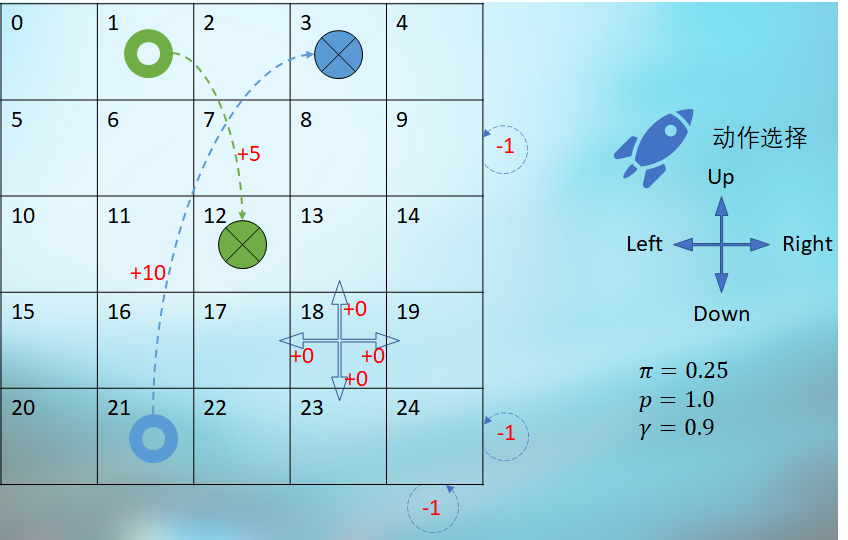

## 9.1 穿越虫洞问题

### 9.1.1 提出问题

在一个 5x5 的宇宙空间中，一艘探索太空的宇宙飞船可以任意向四个方向行驶，但是该空间中具有四种不同的类型的区域，如图 9.1.1 所示。

<center>


图 9.1.1 穿越虫洞问题
</center>

表 9.1.1 状态描述

|状态序号|动作选择|奖励|转移|
|-|-|-|-|
|角落状态*|如果在角落处向远离中心的方向行驶，将会碰撞能量屏障使飞船受损，比如 $s_{24}$ 所示的角落处向右或向下行驶|-1|原地不动|
|边界状态**|如果在边界处向远离中心的方向行驶，将会碰撞能量屏障使飞船受损，比如 $s_{9}$ 所示的边界处向右行驶|-1|原地不动|
|角落和边界状态|向靠近中心的方向行驶，|0|1.0：动作方向|
|虫洞状态 $s_{1}$|在 $s_1$ 处进行下一步行驶时，无论任何方向，将无条件地达到 $s_{12}$ 处，但后者并非终止状态。| +5 |1.0：到 $s_{12}$|
|虫洞状态 $s_{21}$|在 $s_{21}$ 处进行下一步行驶时，无论任何方向，将无条件地达到 $s_{3}$ 处，但后者并非终止状态。| +10 |1.0：到 $s_{3}$|
|中心状态|在上述三种特殊状态之外的所有其它状态，比如在 $s_{18}$ 处，如果选择向右行驶，将会达到 $s_{19}$，不会发生意外偏航。|0|1.0：动作方向|

表 9.1.1 描述了这些空间区域的基本特征，补充说明如下：

- 状态空间：5 x 5
- 动作空间：4
- 策略：随机，$\pi=1/4=0.25$
- *：角落状态包括状态序号 {0，4，20，24}。
- **：边界状态包括状态序号 {1，2，3，5，9，10，14，15，19，21，22，23}。
- 所以序号为 1,21 的两个状态可以从边界状态中去掉。

### 9.1.2 问题特点

注意穿越虫洞问题中的几个特点：

1. 没有终止状态，也就是说没有分幕，飞船可以一直行驶。
    
    没有终点状态的话，我们无法像 8.5 节中那样，线确定终止状态的价值函数，进而算出其上游的动作价值函数。所幸在 8.6 节中，已经写好了计算 $v_\pi,q_\pi$ 的迭代算法了，直接调用即可，但是需要准备好环境。

2. 在每个状态（方格）下，可以随机选择 4 个方向中的任意一个移动，即动作空间为 4，动作为“上下左右”，策略概率为 0.25。
3. 到达 $s_1,s_{21}$ 时，不是被立刻吸入虫洞，而是要进行下一步动作时才会时空转移。但是在 $s_1,s_{21}$ 并没有机会向其它方向行驶。
4. 关于边角位置的状态，如图 9.1.2 所示，以状态 $s_2$ 为例：
    - 如果从该状态以 0.25 的概率选择向上移动（蓝色的实心圆旁标有 Up 字样）出界后，会以概率 1.0 回到 $s_2$，并有 -1 的奖励。所以说，这里面既有策略 $\pi$，又有转移概率 $p$，只不过动作发生后只有一个下游状态，没有分支。
    - 如果从 $s_2$ 以 0.25 的概率选择向下移动（蓝色的实心圆旁标有 Down 字样），会以 1.0 的概率转移到 $s_7$，得到 0 的奖励。
<center>


图 9.1.2 边界状态的动作和概率转移
</center>

所以，这个穿越虫洞问题的动作空间是 4，动作发生后的转移概率是 1，即，动作发生后，可以准确地到达目标，不会发生意外。而上一章中的射击气球问题，动作空间是 2，动作发生后的状态转移大于 2（两个动作分别是 2 和 3）。

最主要的是，读者一定要把这一章的问题与前面章节中学习的马尔科夫奖励过程中的没有动作而直接发生状态转移的情况分开。


### 9.1.3 模型数据定义

在强化学习中，经常会用图 9.1.1 这种方格（或长方格）来研究各种算法，因为这种方式可以有效地把一些连续问题转变为离散问题，从而使用马尔科夫链来简化并描述问题。所以有必要建立一个通用的模型，用数据驱动的方式来定义模型的各种行为。

模型定义可以分为四个小部分。

【代码位置】Wormhole_0_Data.py

#### 状态部分

```Python
# 状态空间 = 空间宽度 x 空间高度
GridWidth, GridHeight = 5, 5    # 可以是长方形，宽高不等
# 起点，可以多个
StartStates = []
# 终点，可以多个
EndStates = []
```
- 空间宽度 GridWidth 和高度 GridHeight
    
    可以不相等，比如 3 X 4。

- 起点 StartStates

    有些场景需要定义起点，比如迷宫游戏。

- 终止状态 EndStates

    有些场景需要定义终止状态，到达此状态后算是分幕结束。

- 关于序号的约定

    - 可以用从 0 开始的序号，方格的左上角序号为 0，然后向右依次加 1，到最右侧边界后换行。右下角的序号为 GridWidth*GridHeight-1，比如 3x4-1=11。

    - 也可以用 $(x,y)$ 的方式定义每个状态的位置，方格的左上角坐标为 (0,0)，以 3x4 为例，右下角为 (2,3)。

#### 动作部分
```Python
# 动作空间
LEFT, UP, RIGHT, DOWN  = 0, 1, 2, 3
Actions = [LEFT, UP, RIGHT, DOWN]
# 初始策略
Policy = [0.25, 0.25, 0.25, 0.25]
# 状态转移概率: [SlipLeft, MoveFront, SlipRight, SlipBack]
SlipProbs = [0.0, 1.0, 0.0, 0.0]
```
- 按中国人的习惯，定义左（LEFT）、上（UP）、右（RIGHT）、下（DOWN）顺时针顺序的四个方向。
- 动作空间 Actions 

    由这上面四个动作组成。当然，在醉汉回家问题中，只有左、右两个动作。

- 初始策略 Policy

    在 4 个方向上随机选择，概率为 0.25。

- 状态转移概率 SlipProbs

    在动作执行后，是否会出现偏差。举例来说，在冰面向前行走，很有可能冰面太滑而造成向左 0.2、向右 0.1、向前 0.7 的状态转移概率，那么该值就可以写成 [0.2, 0.7, 0.1, 0.0]。注意顺序不能乱，一定是“左上右下”。

#### 奖励部分

```Python
# 每走一步的奖励值，可以是0或者-1
StepReward = 0
# 特殊奖励 from s->s' then get r, 其中 s,s' 为状态序号，不是坐标位置
SpecialReward = {
    (0,0):-1,       # s0 -> s0 得到-1奖励
    (2,2):-1,
    ......
    (1,12):+5,
    (21,3):+10
}
```
- 每步奖励 StepReward 
    
    表示每走一步都可以有 -1 的奖励，或者 0。在本例中为 0，表示每次移动不减分。

- 特殊奖励 SpecialReward

    比如本例中的碰撞边界得 -1，或者穿越虫洞得 +5 或 +10。这个字典不管智能体是如何从 $s$ 到达 $s'$ 的，也就是忽略了中间的动作选择和状态转移两个步骤，只看起始和终止状态。

    以状态 12 为例，在字典中定义了“(1,12):+5”，表示从状态 1 到状态 12 可以得到 +5 的奖励。但是从 7,11,13,17 四个状态也可以到达 12，只能按照 StepReward 的定义获得 0 奖励。

#### 特殊移动

```Python
# 特殊移动，用于处理类似虫洞场景
SpecialMove = {
    (1,LEFT):   12,    # 从状态1执行向左的动作会到达状态12
    (1,UP):     12,
    (1,RIGHT):  12,
    (1,DOWN):   12,
    (21,LEFT):  3,
    (21,UP):    3,
    (21,RIGHT): 3,
    (21,DOWN):  3
}
# 墙
Blocks = []
```

- 特殊移动 SpecialMove

    用于处理本例中的虫洞场景，比如“(1,LEFT):12”，表示“从状态 1 执行向左的动作会到达状态 12”。
- 墙 Blocks

    用于搭建迷宫类场景。撞墙后一般原地不动。

