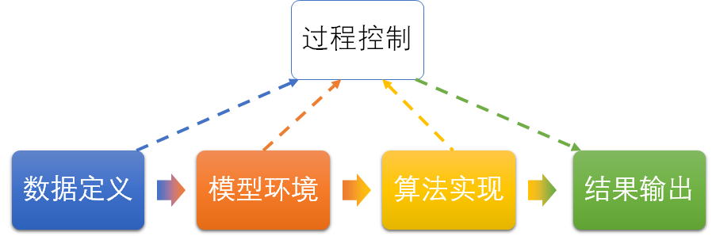

## 9.2 随机策略下的结果

### 9.2.1 通用的模型逻辑

有了模型的数据定义后，需要把它转换成模型的代码逻辑。为此创建一个 GridWorld 类来读取 9.1.3 中的模型数据定义。需要保证这个类可以处理所有 GridWorld 形式的数据。

【代码位置】GridWorld_Model.py

```Python
class GridWorld(object):
    # 生成环境
    def __init__(self, ...):
        ...
    # 用于生成“状态->动作->转移->奖励”字典
    def __init_states(self, Probs, StepReward):
        ...
    # 用于计算移动后的下一个状态
    # 左上角为 [0,0], 横向为 x, 纵向为 y
    def __get_next_state(self, s, x, y, action):
        ...
```

这个类是可以应用到任何 GridWorld（方格世界）类型的强化学习场景中，读者如果希望自己构建更有趣的方格世界，可以只定义数据部分即可。

此时可以运行 Wormhole_0_Data.py，打印输出“状态->动作->转移->奖励字典”，用于观察我们在该模型中的数据设置是否正确。
【代码位置】 Wormhole_0_Data.py
```python
if __name__=="__main__":
    env = model.GridWorld(
        GridWidth, GridHeight, StartStates, EndStates,  # 关于状态的参数
        Actions, Policy, SlipProbs,                     # 关于动作的参数
        StepReward, SpecialReward,                      # 关于奖励的参数
        SpecialMove, Blocks)                            # 关于移动的限制
    model.print_P(env.P_S_R)
```

最后一行代码打印输出“状态->动作->转移->奖励字典”：

```
state = 0                   # 状态 s0
        action = LEFT       # 向左
         [(1.0, 0, -1)]     # 以 1.0 的概率转移到 s0，获得 -1 奖励
        action = UP         # 下同
         [(1.0, 0, -1)]
        action = RIGHT
         [(1.0, 1, 0)]
        action = DOWN
         [(1.0, 5, 0)]
state = 1
        action = LEFT
         [(1.0, 12, 5)]
        action = UP
         [(1.0, 12, 5)]
        action = RIGHT
         [(1.0, 12, 5)]
        action = DOWN
         [(1.0, 12, 5)]
...
state = 24
    ...
```
为了节省篇幅，我们只截取了其中的一部分输出内容。

- state = 0

    在状态 $s_0$ 时，向左和向上的移动都会出界（然后返回 $s_0$），得 -1 奖励。向右和向下的移动可以以概率 1.0 到达 $s_1,s_5$，0 分奖励。
- state = 1

    在状态 $s_1$ 时，任何一个动作都会以 1.0 的概率移动到 $s_{12}$，并得到 5 分奖励。

- state = 24
    一共有 $[s_0,\cdots,s_{24}]$ 25 个状态，数据形式上一样，内容不尽相同。


有了这个模型，我们下一步可以继续解决穿越虫洞问题了。


### 9.2.2 过程控制

在第 8 章的末尾，我们已经利用贝尔曼期望方程实现了迭代算法，**算法实现**代码单独存放在 Algo_PolicyValueFunction.py 中，就是为了可以在任何地方复用。

在本章中，我们又在前面创建了模型的**数据定义**和通用的**模型逻辑**，再加上上面的**算法实现**，万事俱备了。但是先捋清楚它们之间的调用关系。

<center>


图 9.2.1 模块关系
</center>

如图 9.2.1 所示。

- 数据定义：Wormhole_0_Data.py，定义穿越虫洞问题的模型。
- 模型逻辑：GridWorld_Model.py，接收数据定义，用通用逻辑生成模型。
- 算法实现：Algo_PolicyValueFunction.py，接收模型，运行算法。
- 过程控制与结果输出：Wormhole_1_VQ_pi.py，控制以上过程，输出结果。

这种设计的好处就是可以高度复用，比如：

- 更换数据定义，就可以把穿越虫洞问题变成悬崖行走问题或迷宫问题，但是模型逻辑部分和算法部分不需要改动。

- 更换算法实现，就可以把计算贝尔曼价值函数问题变成后面要学习的计算贝尔曼最有价值函数问题。

过程控制代码如下：

```Python
import numpy as np
import Wormhole_0_Data as data              # 数据定义
import GridWorld_Model as model             # 模型逻辑
import Algo_PolicyValueFunction as algo     # 算法实现
import DrawQpi as drawQ                     # 结果输出

if __name__=="__main__":
    env = model.GridWorld(
        # 关于状态的参数
        data.GridWidth, data.GridHeight, data.StartStates, data.EndStates,  
        # 关于动作的参数
        data.Actions, data.Policy, data.SlipProbs,                     
        # 关于奖励的参数
        data.StepReward, data.SpecialReward,                     
        # 关于移动的限制 
        data.SpecialMove, data.Blocks)                        

    gamma = 0.9 # 折扣，在本例中用1.0可以收敛，但是用0.9比较保险
    iteration = 1000    # 算法最大迭代次数
    V_pi, Q_pi = algo.V_in_place_update(env, gamma, iteration)  # 原地更新的迭代算法
    print("V_pi")
    V = np.reshape(np.round(V_pi,2), (data.GridWidth, data.GridHeight))
    print(V)
    print("Q_pi")
    print(np.round(Q_pi,2))
    # 字符图形化显示
    drawQ.draw(Q_pi, (data.GridWidth, data.GridHeight))
```

在最开始的 import 部分，会把前面所述的“数据定义、模型逻辑、算法实现”三个模块都引入，然后在 main 下面先把数据“喂到”模型中（env=model.GridWorld(data...)），然后再把模型“喂到”算法中（algo.V_in_place_update(env...)），最后格式化输出模型的返回值 $V_\pi,Q_\pi$ 两个数组。

### 9.2.3 结果输出与分析

#### 状态价值函数 $v_\pi(s)$ 的结果

$V_\pi$ 其实是一个一维数组，按状态的顺序 [0,24] 存放着 $v_\pi(s)$ 的值。但是为了和方格世界对应，特地做了 5x5 的 reshape()。

```
迭代次数 =  36
V_pi
[[ 2.1  6.   1.7 -0.2 -1.4]
 [ 1.3  2.3  1.2  0.1 -0.9]
 [ 1.3  1.9  1.1  0.2 -0.7]
 [ 2.2  3.6  1.9  0.4 -0.7]
 [ 4.   9.8  3.2  0.4 -1. ]]
```
迭代了 36 次收敛，比起在射击问题中只迭代了 2 次即收敛，本例中的情况要复杂很多。

<center>


图 9.2.2 状态价值函数 $v_\pi(s)$ 的结果
</center>

图 9.2.2 就是手绘的图形化结果，其中有几个相互有关系的格子被标上了不同的颜色，方便我们来验算一下 $v_\pi$ 的计算是否正确。

根据式 8.6.1：$v_\pi(s)=\sum_a \pi(a \mid s) \Big(\sum_{s'} p_{ss'}^a [r_{ss'}^a+\gamma v_\pi(s')]\Big)$，其中：

- $\pi=0.25$
- $p=1.0$
- 而 $r$ 根据情况有所不同，可能是 0, -1, 5, 10 中的一个值。

下面以蓝色格子为例进行验算：$s=s_{21},s'=s_{3},\pi(a|s_{21})=0.25,p^a_{21,3}=1,r^a_{21,3}=10,\gamma=0.9$，代入式 8.6.1：

$$
\begin{aligned}
v_\pi(s_{3})&=\sum_{a \in \{L,U,R,D\}} \pi(a|s_{21}) \Big(\sum_{s'=S_{21}} p^a_{21,3} [r^a_{21,3}+0.9 v(s_{3})] \Big)
\\
&=4 \cdot 0.25 \cdot \Big(1 \cdot [10+0.9 \cdot (-0.2)]\Big)
\\
& \approx 9.8
\end{aligned}
$$

与$v_\pi(s_{21})$的值吻合。读者可以修改代码保留2位小数以上，会得到更准确的结果。

- 上式中外部的求和运算由 $4\times0.25$ 完成，是因为 4 个方向上的策略概率相等，所以简单地乘以 4 即可。
- 内部的求和运算，因为转移概率 $p^a_{21,3}=1$，所以只有一项状态转移，不需要求和。

橙色和绿色的部分的验证由读者在思考与练习中完成。

再分析一下两个虫洞入口 $s_1,s_3$ 的状态价值函数值：

$v_\pi(s_{21})=9.8$，小于离开此状态的即时奖励（$r=10$），而 $v_\pi(s_1)=6$，大于离开此状态时的即时奖励（$r=5$）。这是为什么呢？

- 因为 $s_{21}$ 的状态价值函数由其下游状态 $s_{3}$ 决定，而飞船在 $s_{3}$ 有 0.25 的可能出界而得到负的奖励。如果目标状态是处于角落位置的 $s_20$，那么 $v_\pi(s_{21})$ 的值将会更小。

- 而 $s_1$ 的下游状态 $s_{12}$ 在中心区域，很不容易出界，状态价值为正数，所以 $v_\pi(s_1)$ 的值要大于即时奖励值。

整个方格世界的状态值分布，上半部分为正数，是因为有个两个虫洞入口的状态值很高；向下逐渐变成负数，是因为靠近边界的地方因为容易出界而得到负的奖励。

#### 动作价值函数 $q_\pi(s,a)$ 的结果


$Q_\pi$ 是一个二维数组，行序号等于状态的顺序[0,24]，列序号代表 4 个动作，每个单元存放的就是在策略 $\pi$ 下（本例中为四个方向随机的 0.25）的 4 个动作的价值函数值，顺序是“左上右下”。

```
Q_pi
[[ 0.9  0.9  5.4  1.2]
 [ 6.   6.   6.   6. ]
 [ 5.4  0.5 -0.2  1.1]
 ......
 [ 8.8  1.7  0.4  1.9]
 [ 2.9  0.4 -0.9 -0.6]
 [ 0.4 -0.7 -1.9 -1.9]]
```
上面的输出为了节省篇幅，省略了中间的一些行。

以第一行数据（状态 0）为例：[0.9  0.9  5.4  1.2]，可以看到最大值是 5.4，对应的动作是“右”，也就是说智能体（飞船）在这个状态下，最佳动作应该向右侧移动。而两个相等的 0.9 表示向左侧或者上方移动，都是出界，会有相等的低价值。

针对第二行数据，如果使用 np.argmax([6, 6, 6, 6]) 函数，只会返回第一个最大值，这不是我们想要的，应该使用下面的代码来获得所有的最佳动作：
```python
best_actions = np.argwhere(self.policy == np.max(self.policy))  #应该返回 [0,1,2,3]
```

为了方便地看到图形化的输出，笔者特地写了一个简陋的类，用图形化字符展示最大动作值方向，输出如下：

```
+-----+-----+-----+-----+-----+
|     |  ▲  |     |     |     |
|  ┼─►|◄─┼─►|◄─┼  |◄─┼  |◄─┼  |
|     |  ▼  |     |     |     |
+-----+-----+-----+-----+-----+
|     |  ▲  |     |     |     |
|  ┼─►|  ┼  |◄─┼  |◄─┼  |◄─┼  |
|     |     |     |     |     |
+-----+-----+-----+-----+-----+
|     |     |     |     |     |
|  ┼  |  ┼  |◄─┼  |◄─┼  |◄─┼  |
|  ▼  |  ▼  |  ▼  |     |     |
+-----+-----+-----+-----+-----+
|     |     |     |     |     |
|  ┼  |  ┼  |◄─┼  |◄─┼  |◄─┼  |
|  ▼  |  ▼  |     |     |     |
+-----+-----+-----+-----+-----+
|     |  ▲  |     |     |     |
|  ┼─►|◄─┼─►|◄─┼  |◄─┼  |◄─┼  |
|     |  ▼  |     |     |     |
+-----+-----+-----+-----+-----
```
比如状态 0，最大值是代表“右”的 5.4，所以就在 (0,0) 的格子中显示一个向右的箭头。而状态 1 四个方向的值相等，都是 6，就显示 4 个方向的箭头。

欢迎读者发挥自己的聪明才智来修改这个类，展示更优美的字符图形化界面。

图 9.2.3 是笔者手绘的动作价值函数结果图，方便读者阅读。

<center>


图 9.2.3 动作价值函数 $q_\pi(s,a)$ 的结果
（左图：四个方向上的数值；右图：最大值代表的动作方向）
</center>

左图显示了每个状态内 4 个方向的动作价值。在一个方格内，4 个数据是有可比性的，不同方格内的数据没有可比性。正负符号也不表示其它意思，只看大小。

上半部分的动作价值函数值普遍为正数，下半部分普遍为负数，主要是和状态价值函数的分布有关。

绘制完全部 25 个状态的最佳动作后，我们来一起分析一下。

先看图 9.2.4。

<center>


图 9.2.4 有趣的相邻四角对称现象
</center>

我们以红色虚线所示的菱形为例，菱形内部四个角的四个数值相同，都是 0.2，但是它们属于四个不同的状态的动作，这是为什么呢？

其实这正是动作价值函数的公式所带来的效果。

$q_\pi$ 值是由其下游状态的 $v_\pi$ 所决定的，对于红色菱形区来说，其中心状态是 $s_{13}$，保留一位小数的 $v_\pi(s_{13})=0.2$，所以 $s_8$ 的向下的动作的价值函数为：

$$
\begin{aligned}
q_\pi(s_8,a_{Down})&=\sum_{s'} p_{ss'}^a \big [r_{ss'}^a+\gamma v_\pi(s') \big ]
\\
&=1.0 \times [0 + 0.9\times0.2]
\\
&\approx 0.2
\end{aligned}
$$

同理，$q_\pi(s_{12},a_{Right}),q_\pi(s_{14},a_{Left}),q_\pi(s_{18},a_{Up})$ 都是相同的结果。

黄色菱形也是如此。

蓝色菱形因为位置靠边，只有三个顶点。在 $s_5$ 向左移动出界会得到 -1 的奖励，因此 $1.2-1=0.2$，正好是 $q_\pi(s_5,a_{Left})$ 的值。

下面我们根据图 9.2.3，再看看哪些动作是合理的，哪些是有疑问的。

合理的动作：

- 在状态 1 和 21，任意向四个方向移动，都会无条件穿过虫洞，这个没有问题；
- 在状态 11 向下走，因为 $v_{21}$ 的价值大于 $v_1$ 的价值；

不合理的动作：

- 在状态 6，是不是可以向下走以便最终到达状态 21 更好呢？
- 在状态 17，如果想用最短路径到达状态 21，应该可以选择向下和向左两个方向，但是在图 9.2.3 中只有一个向左的选择。

分析至此，虽然图 9.2.3 中的动作选择大方向没错，但是有些细节值得推敲，也许这个策略组合还不是最佳的。


### 思考与练习

1. 验证图 x 中 橙色 $v_\pi(s_{5})$ 和 绿色 $v_\pi(s_{18})$ 的 $v_\pi$ 值
2. 读者可以呼唤两个虫洞中的任意一个的入口和出口位置，看看方格世界的价值函数值的分布会有何变化。
3. 如果方格世界中没有虫洞，哪个状态的值会是最高？
