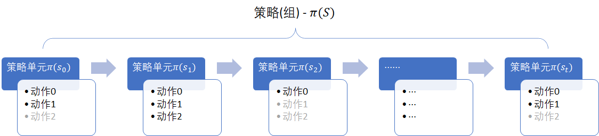

## 9.4 搜索策略

###  9.4.1 策略选择与策略单元

对于射击气球问题来说，如果只有一支箭，则只有一次策略选择；有两支箭的话，一共要做两次策略选择，但是由于第一支箭射出后有多种结果，要牵涉到 6 个策略单元（每个状态一个策略单元）。所以，策略数量与状态数量保持一致，但是与选择策略的次数完全有可能不相等。

- 如射击气球问题，是一个有向无环的图，所以策略选择次数 $\le$ 策略单元数量，因为有些状态可能很少有机会到达。
- 对于有向有环问题，如代码生命周期问题，策略选择次数有可能大于或小于策略单元数量。
- 对于无向有环问题，如穿越虫洞问题，策略选择次数 $\ge$ 策略单元数量，因为一个状态可能被访问多次。


<center>


图 9.4.1 策略选择与策略单元
</center>

在图 9.4.1 中，我们提出了策略单元与策略组的概念，比其它文献更详细地做了全方位描述。

1. 策略单元

    - 每个状态（除了终止状态以外）肯定有一个策略单元。一旦到达该状态，就需要做一次选择。但不是每个状态都必须被访问到。
    - 一个策略单元可以有很多种策略，决定于动作空间的大小。
    - 我们用 $\pi(s_t)$ 来表示状态 $s_t$ 的策略单元。

2. 动作空间

    每个策略单元中的动作空间有可能不同：

    - 比如在射击气球问题中，如果老板规定击中一个气球后，下一箭只能选择另外一只气球，则第一箭的动作空间为 2，第二箭的动作空间为 1。

    - 在迷宫行走问题中，在某个格子内可以向四个方向行走，在另外一些靠墙的格子内，只能向三个方向行走。但是为了简化问题，我们一般会假设仍然可以向四个方向走，只是撞墙后留在原地不动。
    
    - 对于穿越虫洞问题，其实在虫洞入口处，飞船只有一个选择（就是开始穿越），但是我们还是定义飞船可以向四个方向行驶。

    一般来说，策略单元的可选策略数量等于动作空间的数值。

3. 策略组

    - 所有的策略单元组成一个策略组，把每个策略单元的选择串联起来形成唯一的组合。

    - 比如图 9.4.1 中的四个策略单元，在某个马尔科夫中选择动作序号是 $[0, 2, 1, ..., 0]$，而在另外一次过程中选择动作序号是 $[0, 1, 1, ..., 0]$，有一个单元的差别，算作两个策略组，即两个策略。

    - 我们用 $\pi(S)$ 表示策略组，其中 $s \in S$。


观察表 9.3.1，在 6 个状态上的策略修改，都会影响对应的局部状态价值函数值，进而影响最终的状态价值函数值。

在 9.3 节中，对不同的策略单元的的独立修改会提高或降低 $v_\pi(s_0)$ 的值，那么一共有多少种组合可以帮助游客提高收益呢？其最大值又是多少呢？本节的任务就是给每个状态都找到最好的策略，从而使整体状态值达到最佳。

但是在具体操作中会遇到这样的困难：假设我们知道了一个状态上的策略是 [0.4,0.6]，但是不可能把一支箭分成 0.4:0.6，所以你必须二选一，用公式表示为：

$$
\pi_*(a_i \mid s)=
\begin{cases}
1, & if \ \pi(a_i|s)=\argmax \limits_{a \in A(s)} \pi(a|s)
\\
0, & 其它动作
\end{cases}
\tag{9.4.1}
$$

当 $\pi=[0.4,0.6], A(s)=[a_0,a_1]$ 时，即 $\pi(a_0|s)=0.4, \pi(a_1|s)=0.6$，式 9.4.1 的结果是：$\pi_*(a_0|s)=0,\pi_*(a_1|s)=1$，因为 0.6 > 0.4 且处于数组中第 1 个位置（从 0 开始计算）。

从另一个角度看，以两个动作为例，假设原始策略为 [0.4, 0.6]，如果新策略 [0.2, 0.8] 会提高整体状态函数值的话，那么另一个新策略 [0.1, 0.9] 甚至 [0.0, 1.0] 也一定会更大地提高状态函数值。读者只需要把上一小节的策略改一改就知道了，比如这一行代码：
```python
[0.2,0.8],  # 修改状态 0 的策略，可以尝试 [0.1, 0.9] or [0.0, 1.0]
```
因此，当$\pi'=[0.0,1.0]$时， $\pi(a_0|s)=0,\pi(a_1|s)=1$ 也就自然成立了。

当两个概率值相等时，我们可以选择任意一个，总选第一个的话，可能会失去其它机会。

在图 9.3.1 中，一共有 6 个有效的状态（$s_0,\cdots,s_5$) ，在每个状态上的策略有两种动作选择（红球或蓝球），这样一共有 $2\times2\times2\times2\times2\times2=2^6$ 种组合。推广到一般情况：如果状态空间为 $S$，动作空间为 $A$，则策略组合是 $|A|^{|S|}$ 种。

对于射击气球这个简单的问题来说，计算一次 $v_\pi,q_\pi$ 只需要迭代两次，即使用遍历的方法，也很容易快速得到结果。所以，我们先用最笨但是最准确的遍历法来得到评估的基准。

### 9.4.2 策略遍历搜索

知道了一共有 $2^6=64$ 种组合，用手写出来还是比较累的。作为一个合格的程序员，我们可以用代码生成 64 个组合策略，实际上就是用二进制表示的 [0, 63]：
```
[[0 0 0 0 0 0]  # 红 红 红 红 红 红
 [0 0 0 0 0 1]  # 红 红 红 红 红 蓝
 [0 0 0 0 1 0]  # 红 红 红 红 蓝 红
 ......
 [1 1 1 1 0 1]  # 蓝 蓝 蓝 蓝 红 蓝
 [1 1 1 1 1 0]  # 蓝 蓝 蓝 蓝 蓝 红
 [1 1 1 1 1 1]] # 蓝 蓝 蓝 蓝 蓝 蓝
```
上面的输出中，0 表示在该状态选择红色球，1 表示在该状态选择蓝色球。

下面要根据式 9.4.1，把上述的二进制形式翻译一下，变成模型可以认识的策略数据结构：用 onehot（热独）编码来表示选择红球或者蓝球，比如：[1, 0] 表示选择红球，[0, 1] 表示选择蓝球。

【代码位置】Shoot_3_OptimalSearch.py

```python
# 把二进制形式的的策略变成onehot编码形式的policy，如 [[0,1],[1,0],[1,0]...]
def create_onehot_policy(binary_actions):
    policy = {}
    for s in range(len(binary_actions)):  # onehot
        policy[s] = [1,0] if binary_actions[s]==0 else [0,1]
    return policy
```
以策略组-0为例，输出格式如下：

```
策略组-0：{0: [1, 0], 1: [1, 0], 2: [1, 0], 3: [1, 0], 4: [1, 0], 5: [1, 0]}
```

注意我们用**策略组**这个词，表示在 $[s_0,\cdots,s_5]$ 六个状态下的各自的**策略单元**动作选择，策略组-0中的策略是都选红色球。

好了，准备工作完成，接下来可以把每一种策略组代入环境中，计算价值函数了：

```python
# 遍历所有策略组合,计算V,Q
def caculate_all_V_Q(all_policy_in_binary):
    gamma = 1
    max_iteration = 1000
    V_all_policy = []
    Q_all_policy = []
    helper.print_seperator_line(helper.SeperatorLines.long)
    print("OneHot形式的策略组与 V 函数值 : ")
    helper.print_seperator_line(helper.SeperatorLines.middle)
    for id, binary_actions in enumerate(all_policy_in_binary):
        policy = create_onehot_policy(binary_actions)      # onehot形式
        print(str.format("策略组-{0}:\t{1}", id, policy))
        env = dataModel.Env(policy)     # 创建环境，代入策略组
        V, Q = algo.calculate_Vpi_Qpi(env, gamma, max_iteration)    # 迭代法计算V,Q
        V_all_policy.append(V)              # 保存每个策略组合的 V 函数结果,便于比较
        Q_all_policy.append(Q)
        print(str.format("V 函数值:\t{0}",V))
        helper.print_seperator_line(helper.SeperatorLines.short)
    return V_all_policy, Q_all_policy
```

上述代码将会输出所有策略组合及其状态价值函数：

```
========================================
OneHot形式的策略组与 V 函数值 :
--------------------
策略组-0:       {0: [1, 0], 1: [1, 0], 2: [1, 0], 3: [1, 0], 4: [1, 0], 5: [1, 0]}
V 函数值:       [1.048 0.5   0.56  0.8   0.5   0.7   0.   ]
----------
策略组-1:       {0: [1, 0], 1: [1, 0], 2: [1, 0], 3: [1, 0], 4: [1, 0], 5: [0, 1]}
V 函数值:       [1.048 0.5   0.56  0.8   0.5   0.75  0.   ]
----------
......
策略组-62:      {0: [0, 1], 1: [0, 1], 2: [0, 1], 3: [0, 1], 4: [0, 1], 5: [1, 0]}
V 函数值:       [1.26 0.6  0.55 0.8  0.6  0.7  0.  ]
----------
策略组-63:      {0: [0, 1], 1: [0, 1], 2: [0, 1], 3: [0, 1], 4: [0, 1], 5: [0, 1]}
V 函数值:       [1.29 0.6  0.55 0.8  0.6  0.75 0.  ]
```

一共 64 组，为了节省篇幅，中间的部分省略，请读者自己运行代码观察全部结果。

接下来，要通过比较 $v_\pi(s_0)$ 的大小，来搜索基于 $v_\pi(s_0)$ 的最优策略组。$v_\pi(s_0)$ 的值就是在上面输出的 V 函数值列表中的第一个单元的值。

```python
# 搜索 best_v0 最优策略组合
def find_best_v0_policy(V_values, all_policy_in_binary):
    v = np.array(V_values)                    # 列表变成数组
    v0_best = np.max(v[:,0])                  # 获得所有策略组合中 v(s0) 的最大值
    helper.print_seperator_line(helper.SeperatorLines.long)
    print("v(s0)的最优价值函数 :", v0_best)
    best_ids = np.argwhere(v[:,0] == v0_best) # 获得所有的最大值的策略组合序号
    return best_ids.ravel()
```
得到 $v_\pi(s_0)$ 的最大值为 1.29，并返回满足此条件的策略组序号 best_ids：
```
========================================
v(s0)的最大 V 函数值 : 1.29
```

接下来根据返回的 best_ids 把满足 $v_\pi(s_0)=1.29$ 的策略组都找到：

```python
# 输出所有满足 best v0 的二进制策略和 V,Q 值
def all_best_v0(all_policy_in_binary, V_all_policy, Q_all_policy, best_ids):
    helper.print_seperator_line(helper.SeperatorLines.long)
    print("二进制形式的最优策略组与最优价值函数 :")
    helper.print_seperator_line(helper.SeperatorLines.middle)
    for id in best_ids:
        print(str.format("最优策略组-{0}:\t{1}", id, all_policy_in_binary[id]))
        print(str.format("V 函数值:\t{0}", V_all_policy[id]))
        print("Q 函数值:")
        print(Q_all_policy[id])
        helper.print_seperator_line(helper.SeperatorLines.short)
```

结果如下：

```
========================================
v(s0)等于最大值（1.29）的二进制形式的策略组与 V 函数值 :
--------------------
最优策略组-35:  [1 0 0 0 1 1]
V 函数值:       [1.29 0.5  0.56 0.8  0.6  0.75 0.  ]
----------
最优策略组-39:  [1 0 0 1 1 1]
V 函数值:       [1.29 0.5  0.56 0.8  0.6  0.75 0.  ]
----------
最优策略组-43:  [1 0 1 0 1 1]
V 函数值:       [1.29 0.5  0.55 0.8  0.6  0.75 0.  ]
----------
最优策略组-47:  [1 0 1 1 1 1]
V 函数值:       [1.29 0.5  0.55 0.8  0.6  0.75 0.  ]
----------
最优策略组-51:  [1 1 0 0 1 1]
V 函数值:       [1.29 0.6  0.56 0.8  0.6  0.75 0.  ]
----------
最优策略组-55:  [1 1 0 1 1 1]
V 函数值:       [1.29 0.6  0.56 0.8  0.6  0.75 0.  ]
----------
最优策略组-59:  [1 1 1 0 1 1]
V 函数值:       [1.29 0.6  0.55 0.8  0.6  0.75 0.  ]
----------
最优策略组-63:  [1 1 1 1 1 1]
V 函数值:       [1.29 0.6  0.55 0.8  0.6  0.75 0.  ]
```

$v_\pi(s_0)$ 的最大值为 1.29，可以达到该值的策略组有 8 个，序号为：[35, 39, 43, 47, 51, 55, 59, 63]。


### 思考与练习


