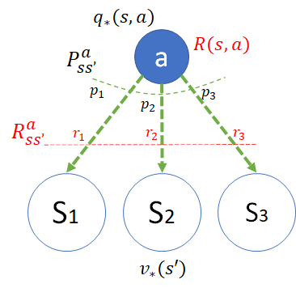
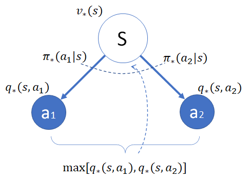
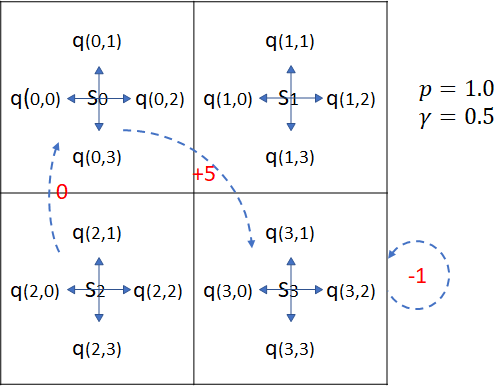
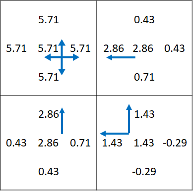

## 9.6 贝尔曼最优方程

### 9.6.1 最优动作价值函数 $q_*$

最优动作价值函数 $q_*$ 的表达式，其实与 $q_\pi$ 函数相同（式（8.4.2）），因为都是从下游的状态价值函数 $v(s')$ 再加上状态转移概率及奖励计算而来，并没有取最大值的操作，只不过下游状态前者是 $v_*$，后者是 $v_\pi$，只要我们先假设它们是已知的，对 Q 函数的计算就没有区别。

$q_*$ 函数的模型如图 9.6.1 所示。

图 9.6.1 $q_*$ 函数模型

根据图 9.6.1 可以做实例化推导：

$$
\begin{aligned}
q_*(s,a) & = p_1[r_1+\gamma v_*(s_1)]+p_2[r_2+\gamma v_*(s_2)]+p_3[r_3+\gamma v_*(s_3)]
\\
&=\sum_{s'} p_{ss'}^a [r_{ss'}^a+\gamma v_*(s')] &(1)
\\
&=P^a_{ss'}[R^a_{ss'}+\gamma V_\pi(s')] &(2)
\\
&= R(s,a)+ \gamma P_{ss'}^a V_\pi(s')  &(3)
\end{aligned}
\tag{9.6.1}
$$

这与式（9.5.3）并不矛盾，前者是用 $q_\pi$ 来表示 $q_*$，这里是用 $v_*$ 来表示 $q_*$。

为什么式（9.6.1）没有取最大值的操作呢？因为状态转移是环境决定的，对于智能体来说不可控，所以只能“听天由命”，没有机会去做选择。

### 9.6.2 最优状态价值函数 $v_*$

最优状态价值函数 $v_*$ 与 $v_\pi$ 的计算是不同的，由于需要在 $\pi_*$ 处取下游状态 $q_*(s,a)$ 中的最大值，所以不再是加权求和的运算，而是最大值运算。

$v_*$ 函数的模型如图 9.6.2 所示。

图 9.6.2 $v_*$ 函数模型

策略单元选择时，总是取下游的动作 Q 函数中最大的那一个，即：

$$
\pi_*(a|s)=
\begin{cases}
1 & a=\argmax\limits_{a \in A(s)}  q_*(s,a)
\\
0 & 其它
\end{cases}
\tag{9.6.2}
$$

根据图 9.6.2 可以做实例化推导：

$$
\begin{aligned}
v_*(s) &=\pi_*(a_1|s)q_*(s,a_1) + \pi_*(a_2|s)q_*(s,a_2)
\\
&=\sum \pi_*(a|s)q_*(s,a)   &(1)
\\
&= \max_{a \in A(s)} q_*(s,a) &(2)
\end{aligned}
\tag{9.6.3}
$$

根据式（9.6.2）可知，在众多的 $\pi_*(a_i|s)q_*(s,a_i)$ 中，只有一个 $\pi_*(a_i|s)=1$，其它都是 0，所以相当于对 $\pi_*(a_i|s)=1$ 对应的 $q_*(s,a_i)$ 取最大值。这样的话，式（9.6.3）的子式（1）就与 $v_\pi$ 函数的形式（式（8.4.4））保持一致了。

### 9.6.3 手撕简化版穿越虫洞

下面我们就来一起看一下式（9.6.1）和式（9.6.3）在实际的计算中是如何使用。

在 9.1 节中，我们提出了一个穿越虫洞的问题，是一个 5x5 的方格世界，没有终止状态。因为在本节中要进行手算，所以我们简化一下这个问题，把 5x5 变成 2x2 的方格世界，只有一个从 $s_0$ 到 $s_3$ 的穿越可以得到 +5 的奖励，折扣为 0.5，其它设置都是前面的问题一样。如图 9.6.3。

图 9.6.3 简化的穿越虫洞问题

问题简述：

- 状态集为 $S=[s_0,s_1,s_2,s_3]$；
- 每个状态下都有 4 个动作，动作集合为 $A=[0,1,2,3]$，代表左上右下；
- 转移概率为 1.0，即，可以准确到达动作方向所在的区域；
- 折扣为 0.5；
- 出界得到 -1 奖励并回到原状态；
- 从 $s_0$ 的四个动作都到 $s_3$，+5 奖励；
- 其它状态转移奖励为 0；
- 没有定义策略，需要求解。

下面利用式（9.6.1）和式（9.6.3）来求这个问题的最优价值函数 $V_*$ 和最优动作函数 $Q_*$。

为了简化符号，我们会用：

- $q_*$ 动作价值函数表示为 $q_{sa}, s=[0,1,2,3], a=[0,1,2,3]$；
- $v_*$ 状态价值函数表示为 $v_s, s=[0,1,2,3]$。

根据式（9.6.3），列出 $V_*$ 的方程组（9.6.4）：

$$
V_*=
\begin{cases}
v_0=\max [q_{00},q_{01},q_{02},q_{03}]
\\
v_1=\max [q_{10},q_{11},q_{12},q_{13}]
\\
v_2=\max [q_{20},q_{21},q_{22},q_{23}]
\\
v_3=\max [q_{30},q_{31},q_{32},q_{33}]
\end{cases}
\tag{9.6.4}
$$

式（9.6.4）中，$q$ 值列在 $Q_*$ 方程组（9.6.5）中，根据式（9.6.1）得到：

$$
Q_*=
\begin{cases}
q_{00}=q_{01}=q_{02}=q_{03}=1 \cdot (5+0.5v_3)=5+0.5v_3
\\
q_{10}=1 \cdot (0+0.5v_0)=0.5v_0
\\
q_{11}=q_{12}=1 \cdot (-1+0.5v_2)=0.5v_1-1
\\
q_{13}=1 \cdot (0+0.5v_3)=0.5v_3
\\
q_{20}=q_{23}=1 \cdot (-1+0.5v_2)=0.5v_2-1
\\
q_{21}=1 \cdot (0+0.5v_0)=0.5v_0
\\
q_{22}=1 \cdot (0+0.5v_3)=0.5v_3
\\
q_{30}=1 \cdot (0+0.5v_2)=0.5v_2
\\
q_{31}=1 \cdot (0+0.5v_1)=0.5v_1
\\
q_{32}=q_{33}=1 \cdot (-1+0.5v_3)=0.5v_3-1
\end{cases}
\tag{9.6.5}
$$

把式（9.6.5）代入到式（9.6.4）中，并去掉重复项，得到方程组（9.6.6）。所谓重复项，就是 $\max[a,a,b]=\max[a,b]$，$a$ 为重复项，去掉一个。

$$
V_*=
\begin{cases}
v_0=\max [5+0.5v_3] &(1)
\\
v_1=\max [0.5v_0,0.5v_1-1,0.5v_3] &(2)
\\
v_2=\max [0.5v_2-1,0.5v_0,0.5v_3] &(3)
\\
v_3=\max [0.5v_2,0.5v_1,0.5v_3-1] &(4)
\end{cases}
\tag{9.6.6}
$$

简化方程组（9.6.6）：

1. 由式（9.6.6.1）得到：$v_0=5+0.5v_3$，因为取最大值时只有一个备选，肯定相等。

2. 由式（9.6.6.2），我们先假设 $v_1 \ge 0$，则 $v_1>0.5v_1-1$，所以有：$v_1=\max [0.5v_0,0.5v_1-1,0.5v_3]=\max [0.5v_0,0.5v_3]$。

3. 同理，假设 $v_2 \ge 0$，则式（9.6.6.3）变成：$v_2=\max [0.5v_0,0.5v_3]$。

4. 同理，假设 $v_3 \ge 0$，则式（9.6.6.4）变成：$v_3=\max [0.5v_2,0.5v_1]$。

整理为式（9.6.7）：

$$
V_*=
\begin{cases}
v_0=5+0.5v_3    &(1)
\\
v_1= \max[0.5v_0,0.5v_3]    &(2)
\\
v_2= \max [0.5v_0,0.5v_3]   &(3)
\\
v_3= \max [0.5v_2,0.5v_1]   &(4)
\end{cases}
\tag{9.6.7}
$$

进一步简化：

1. 由式（9.6.7）子式（2,3）可知，$v_1=v_2$，所以，子式（4）改为：$v_3=\max[0.5v_1,0.5v_2]=\max[0.5v_1,0.5v_1]=\max[0.5v_1]=0.5v_1$。

2. 将$v_3=0.5v_1$代入式（9.6.7.2)：$v_1= \max[0.5v_0,0.5v_3]=\max[0.5v_0,0.25v_1]=\max[0.5v_0]=0.5v_0$，是因为前面已经假设 $v_1 \ge 0$，则 $v_1\ge 0.25v_1$，所以可以从 $\max$ 运算中去掉 $0.25v_1$。

再整理一下：

$$
V_*=
\begin{cases}
v_0=5+0.5v_3
\\
v_1=0.5v_0
\\
v_1=v_2
\\
v_3=0.5v_1
\end{cases}
\tag{9.6.8}
$$
解方程组（9.6.8）得：
$$
V_*=
\begin{cases}
v_0=\frac{40}{7} \approx 5.71
\\
v_1=\frac{20}{7} \approx 2.86
\\
v_2=\frac{20}{7} \approx 2.86
\\
v_3=\frac{10}{7} \approx 1.43
\end{cases}
\tag{9.6.9}
$$
进而可以根据式（9.6.5）解得 $Q_*$：
$$
Q_*=
\begin{cases}
q_{00}=q_{01}=q_{02}=q_{03} \approx 5.71
\\
q_{10}=1 \cdot (0+0.5v_0) \approx 2.86
\\
q_{11}=q_{12} \approx 0.43
\\
q_{13}=1 \cdot (0+0.5v_3) \approx 0.71
\\
q_{20}=q_{23} \approx 0.43
\\
q_{21} \approx 2.86
\\
q_{22} \approx 0.71
\\
q_{30}=q_{31} \approx 1.43
\\
q_{32}=q_{33} \approx -0.29
\end{cases}
\tag{9.6.10}
$$

我们把 $V_*,Q_*$ 的结果绘制在图 9.6.4 中。每个方格内，处于中间位置的是 $v_*$，处于四边的是 $q_*$。可以验证：
1. $v_*=\max(q_*)$，即中间的数字等于四边的数字中的最大值。
2. $q_*=p(r+\gamma v_*)$，即每一边上的数字等于奖励值（0,-1,+5等）加目标方格中心的数字乘以折扣0.5。

图 9.6.4 最优价值函数 $V_*, Q_*$

在图 9.6.4 中同时画出了 $\max(q_*)$ 所代表的动作方向，都和预想的一致。

### 思考与练习
