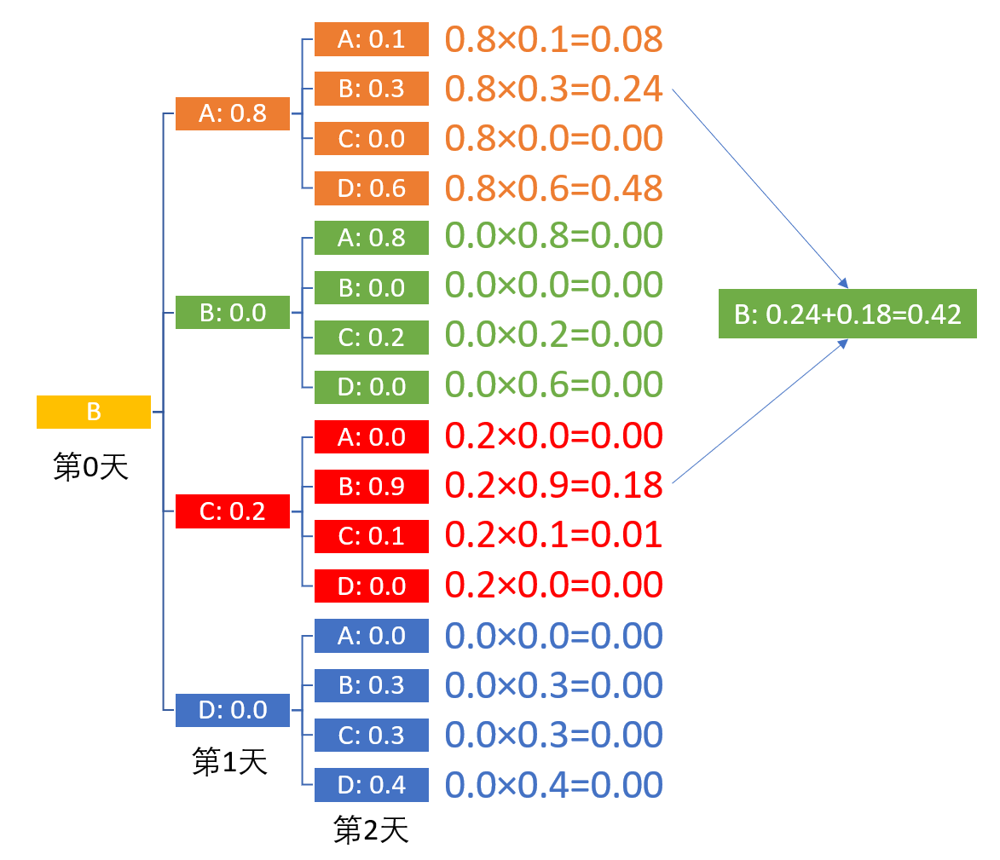

## 3.2 转移概率

### 3.2.1 转移概率

【代码位置：RentCar_2_OneByOne.py】

转移概率是马尔可夫链中的重要概念，我们后面再讲马尔科夫链，本节先把转移概率的问题搞清楚。

在本问题中，有 4 个门店，所以对于某辆车来说，它第二天早晨出现在哪个门店就有 4 种可能，我们称之为 4 个状态：$[A, B, C, D]$。

如何根据历史数据计算出转移概率呢？其实就是条件概率：
$$
P(X|Y)=\frac{P(X,Y)}{P(Y)} \tag{1}
$$

具体到本问题中，公式如下：

$$
P_{i,j}=\mathbb P \{X_{t+1}=a_j|X_t = a_i\}=\frac{\Pr\{X_{t+1}=a_j,X_t=a_i\}}{\Pr\{X_t=a_i\}}=\frac{a_j在a_i后出现的次数}{a_i出现的总次数}  \tag{2}
$$

公式 2 中各元素的含义是：

- $P_{i,j}$：第 $i$ 个状态转移到第 $j$ 个状态的概率。
- $X_t, X_{t+1}$：t 时刻和 t+1 时刻的状态。
- $a_i, a_j$：第 $i$ 个状态和第 $j$ 个状态，$\in [A,B,C,D]$。

当在某一时刻 $t$，处于 $a_i$ 状态时，下一个时刻 $t+1$ 转移到 $a_j$ 状态的概率。

比较公式 2 和 1，形式上是完全相同的，只是里面的变量更具体化一些。

用上面的具体数据举例说明，如果想统计第一天从 A 店租车，并且第二天在 B 店还车的概率，应该这样做：

1. 设置两个计数器，一个 $nA = 0$，一个 $nB = 0$；
1. 在上述序列数据中先找到所有的 A，出现一次就记录 $nA = nA+1$，假设一共出现 1000 次；
2. 再找到紧接着 A 后面出现的 B，如果有，则计数器 $nB=nB+1$，假设一共 110 次；
    - 如果是 [A, B, C] 的顺序，则 $nA$ 计数，$nB$ 也计数。
    - 如果是 [A, C, B] 的顺序，中间有个'C'，则 $nA$ 计数，$nB$ 不计数。
3. 所有数据都统计完后计算：$P_{A,B} = \frac{nB}{nA}=\frac{110}{1000}=0.11$

统计部分的代码与 RentCar_1_FromB.py 完全相同，只是做了一次遍历调用（双重循环），并指定 t=1：

```Python
if __name__ == "__main__":
    # 读取文件
    data_array = carData.read_data()
    for rent_from in car_1.RentalStore:
        print(str.format("从 {0} 店租出：", rent_from.name))
        for return_to in car_1.RentalStore:
            num_from, num_to = car_1.Statistic(data_array, rent_from, return_to, t=1)
            print(str.format("还到 {0} 店：租出次数={1}, \t归还次数={2}, \t比例={3}", 
                return_to.name, num_from, num_to, num_to/num_from))
```
运行上述代码 RentCar_2_OneByOne.py，统计出 A 店一共出现 2677 次，B 紧接在 A 后出现 813 次，所以 $P_{A,B}=\frac{813}{2677}\approx 0.3$。输出如下：
```
[Out]
从 A 店租出：
还到 A 店：租出次数=2677,       归还次数=267,   比例=0.09973851326111319
还到 B 店：租出次数=2677,       归还次数=813,   比例=0.3036981695928278
还到 C 店：租出次数=2677,       归还次数=0,     比例=0.0
还到 D 店：租出次数=2677,       归还次数=1597,  比例=0.596563317146059
从 B 店租出：
还到 A 店：租出次数=3013,       归还次数=2412,  比例=0.8005310321938267
还到 B 店：租出次数=3013,       归还次数=0,     比例=0.0
还到 C 店：租出次数=3013,       归还次数=601,   比例=0.19946896780617324
还到 D 店：租出次数=3013,       归还次数=0,     比例=0.0
从 C 店租出：
还到 A 店：租出次数=1555,       归还次数=0,     比例=0.0
还到 B 店：租出次数=1555,       归还次数=1385,  比例=0.8906752411575563
还到 C 店：租出次数=1555,       归还次数=170,   比例=0.10932475884244373
还到 D 店：租出次数=1555,       归还次数=0,     比例=0.0
从 D 店租出：
还到 A 店：租出次数=2655,       归还次数=0,     比例=0.0
还到 B 店：租出次数=2655,       归还次数=811,   比例=0.3054613935969868
还到 C 店：租出次数=2655,       归还次数=780,   比例=0.2937853107344633
还到 D 店：租出次数=2655,       归还次数=1064,  比例=0.4007532956685499
```

同理可以统计出所有的转移概率（精确到小数点后面一位），以 A 店为例：

- 从A号店租车后
    - 还到A号店的概率是0.1
    - 还到B号店的概率是0.3
    - 还到C号店的概率是0.0
    - 还到D号店的概率是0.6

把上述数据绘制在图 1 中，避免赘述。

<center>


图 1 状态转移概率图
</center>

图 1 中的左图展示了从 A 店租车，到 A,B,D 店还车的情况，其中，$s=A$ 表示当天早晨租车，而 $s'=A$ 表示晚上还车（或者是第二天该车在哪里出现）；右图展示了综合情况。

### 3.2.2 解决经理的问题

重复一下需求：公司经理想知道如果有一天（命名为第 0 天）这辆车从 B 号店出租了，2 天后的早晨最有可能在哪个店出现？5 天后又会如何？

一般情况下，读者会根据图 1 从 B 店出发，再根据概率顺藤摸瓜地计算出第 1 天的情况，再计算出第 2 天的情况。

- 第 1 天早晨出现在各门店的概率是：$[0.8,\ 0.0,\ 0.2,\ 0.0]$。
- 第 2 天早晨出现在各门店的概率是......有点儿复杂，我们绘制出图 2 来帮助整理思路。

<center>


图 2 第一天和第二天的出现概率
</center>

从图2一眼就可以看出来，第 2 天早晨该车出现在各门店的概率就是两个连续的概率之乘积，比如：
- 第 1 天
    - 出现在A店（橙色）的概率是 0.8；
    - 出现在C店（红色）的概率是 0.2；
    - 但是不可能出现在B,D店；
    
- 第 2 天
    - 由于A店有0.3的概率还到B店，所以出现在B店的概率是$0.8 \times 0.3=0.24$；
    - 由于C店有0.9的概率还到B店，所以出现在B店的概率是$0.2 \times 0.9=0.18$；

所以，该车第3天早晨出现在B店的概率是 $0.24+0.18=0.42$。出现在其它店的数字也可以同理得到。

我们再把图 2 的所有情况列在表 1 中，便于统计，数字的颜色和图 2 是一一对应的，表示是哪个门店，方便读者对照理解。

表 1 第一天和第二天的概率计算统计表

|从$\rightarrow$到|A店|B店|C店|D店|第1天|
|:-:|-|-|-|-|-|
|**A店**|$\color{orange}{0.8\times0.1=0.08}$|$\color{orange}{0.8\times0.3=0.24}$|$\color{orange}{0.8\times0.0=0.00}$|$\color{orange}{0.8\times0.6=0.48}$|$\color{orange}{0.8}$|
|**B店**|$\color{green}{0.0\times0.8=0.0}$|$\color{green}{0.0\times0.0=0.0}$|$\color{green}{0.0\times0.2=0.0}$|$\color{green}{0.0\times0.0=0.0}$|$\color{green}{0.0}$|
|**C店**|$\color{red}{0.2\times0.0=0.00}$|$\color{red}{0.2\times0.9=0.18}$|$\color{red}{0.2\times0.1=0.02}$|$\color{red}{0.2\times0.0=0.00}$|$\color{red}{0.2}$|
|**D店**|$\color{blue}{0.0\times0.0=0.0}$|$\color{blue}{0.0\times0.3=0.0}$|$\color{blue}{0.0\times0.3=0.0}$|$\color{blue}{0.0\times0.4=0.0}$|$\color{blue}{0.0}$|
|**第2天**|$\color{orange}{0.08}$|$\color{green}{0.24+0.18=0.42}$|$\color{red}{0.02}$|$\color{blue}{0.48}$|$1.0$|

数据解读：

- 表 1 除去表头，中间部分的 4x4 区域，和图 2 的数据是一致的。
- 最后一列是中间 4 列的和，所以正好是第 1 天该车的出现概率。
- 最后一行是中间 4 行的和，所以是第 2 天该车的出现概率。

OK! 2 天后的问题解决了，那么 5 天后呢？这么计算太麻烦了，我们引入转移概率矩阵的概念来帮助解决问题。

