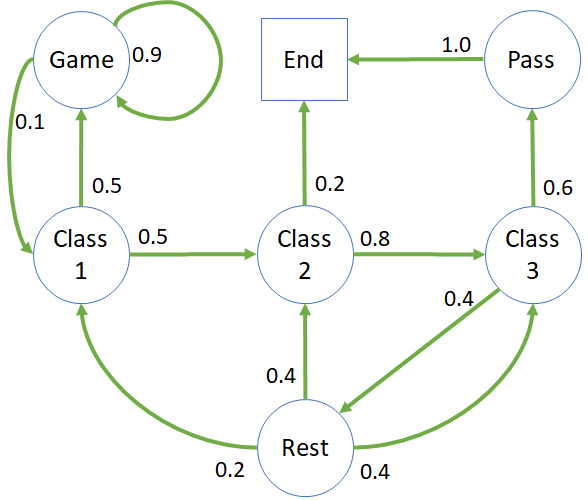
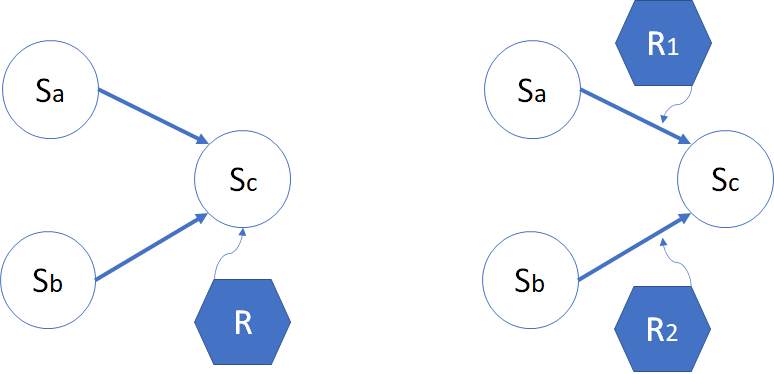
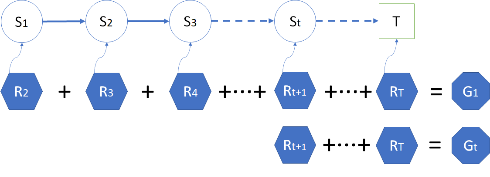
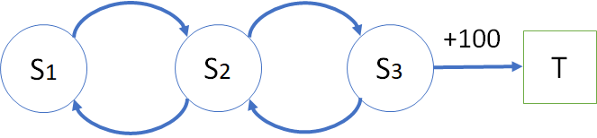
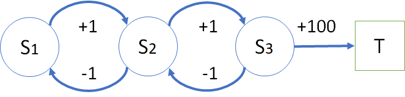

## 学生学习问题

### 1 提出问题

前面学习了马尔可夫链。如何用这种形式来表现、研究在校学生在一门课程中的学习、考试等一些列状态呢？

首先我们提出一个概念：有终止状态的马尔可夫链。

- 在租车问题中，车辆不断地在四个门店中按一定概率随机出现，状态虽然不太少，但实际没有尽头（除非车辆损坏更换或者公司倒闭）。
- 在醉汉回家问题中，只有左右两个状态可以选择（当然也可原地发呆），所以醉汉最终是可以到家的，并且到家后不再出来（到达吸收状态），是一个有结束条件的过程。

下面我们要结合上面两个问题的特点，来学习更复杂的情况：
1. 状态更多
2. 转移更复杂
3. 有终止状态

当然，真实世界的马尔科夫链的状态空间很可能是成千上万个，转移路径也更复杂。

### 2 建立模型

以在校大学生为例，假设一门课只需要上三次课就可以结束，然后就可以通过考试而结课拿学分。当然，这其中也不是那么顺利的，学生可能会遇到各种挑战：

- 上课不专心听讲而去打手机游戏；
- 学到一半的时候觉得这门课索然无味，中途退课；
- 觉得离考试还远，不着急复习巩固知识，而是去休息；
......

图 1 是一个有关学生的学习、考试等一些列状态的马尔可夫链，也可以叫做状态转移图。

图 1 学习问题的状态转移概率图

- Class 1,2,3
  上课/学习/复习状态，假设一门课是需要三次课的学习就可以结束。
  - 在上课 1 中，有 0.5 的概率跑到 Game 状态，在课堂上用手机偷偷摸摸打游戏，另外 0.5 的概率到上课 2 状态。
  - 在上课 2 中，有 0.2 的概率直接退课，另外 0.8 的概率到上课 3 状态。
  - 在上课 3 中，有 0.6 的概率去考试，另外 0.4 的概率以为考试还远，不着急准备呢，就去休息了。
- Pass
  考试通过状态。考试结束后，以 100% 概率到结课状态。
- Rest
  休息状态。休息结束后，发现学的内容都忘得差不多了，遂分别以不同的概率回到三次课的上课/学习/复习状态。
  在这里我们不区分上课和复习，如果是第一次到达 C1 状态，就认为是上课，否则就认为是复习。
- Game
  娱乐/打游戏状态。在游戏状态中很大可能不能自拔，以 0.9 概率继续打游戏，只有 0.1 的概率幡然悔悟回到学习状态。
- End
  结课/退课状态。进入此状态后将不再进行转移，或者是说以 100% 的概率转移到自己，叫做结束状态或者吸收状态。

表 1 中列出了状态转移矩阵，与租车问题中的矩阵形式相同。

表 1 状态转移矩阵

|P: 从$\rightarrow$到|Game|Class1|Class2|Class3|Pass|Rest|End|
|:-:|:-:|:-:|:-:|:-:|:-:|:-:|:-:|:-:|
|**Game**|0.9|0.1||||||
|**Class1**|0.5||0.5|||||
|**Class2**||||0.8|||0.2|
|**Class3**|||||0.6|0.4||
|**Pass**|||||||1.0|
|**Rest**||0.2|0.4|0.4||||
|**End**|||||||1.0|

有的读者可能有个疑问：打游戏上瘾，从 Game 到 Game 有 0.9 的高概率，那么当该学生打游戏 2 小时后良心发现，转到学习状态的概率会不会大于 0.1 呢？

这是一个简单的平稳环境的马尔科夫链，如果考虑更复杂的情况，可以在 Game 状态下增加一个计数器：
- 如果打游戏超过 1 小时了，则有 0.5 的概率回到学习状态；
- 如果没超过 1 小时，则有 0.1 的概率回到学习状态。

对于这种有终止状态的状态转移概率图（矩阵），是没有平稳、收敛的概念的，感兴趣的读者可以运行 Studnet.py 来验证结果。

### 3 分幕和采样

由于终止状态的存在（图 1 中的 End 状态），可以引入一个新的强化学习中的重要概念：**分幕**（Episode）。比如：

- 在醉汉回家问题中，醉汉到家了，整个过程叫做一幕；第二天该醉汉又喝醉了，再次到家后，又叫做一幕。
- 在学生学习问题中，学生经过一系列折腾，最终到达 End 状态，叫做一幕。
- 一盘棋中，最终双方分出输赢或者打平，叫做一幕。
- 打桥牌中，每个人出完手中的最后一张牌，桌面上有 13 墩牌，叫做一幕。
- 一个扫地机器人，完成当天任务回到充电状态，叫做一幕；如果在打扫过程中电量过低，不得不暂时回到充电状态，不叫作完成一幕。

在图 1 中，可以根据不同的学生在本门课中的经历，获得不同的到达终点路径，其中，用 C1,C2,C3 表示 Class 1,Class 2,Class 3。比如：
- C1 - C2 - C3 - Pass - End
- C1 - Game - Game - Game - C1 - C2 - End
- C1 - C2 - C3 - Rest - C2 - C3 - Pass - End
- C1 - C2 - C3 - Rest - C1 - Game - Game - C1 - C2 - End
......

上述的过程叫做**采样**（Sample）。对于大多数学生来说，经历的都是第一个路径，而有极少数学生走的第四个路径。

根据转移概率，经过采样后到达终点，得到一幕状态序列。没有到达终点的状态序列不叫作完整的状态序列，也不叫做一幕，但是这些序列片段仍然有研究价值。

另外，读者可能注意到在上述采样的例子中，都是从 C1 开始的，似乎有一个隐含的开始状态。在某些问题中，我们指定一些状态为开始状态，原因是：

- 一是为了符合实际问题的逻辑需要，比如学生学习问题，一般都是从第一节课开始的。
- 二是为了不过分简化问题的难度。比如一个迷宫，如果不指定开始状态，而是从快到出口的一个位置作为起始位置，将会大大降低问题的难度。

### 4 奖励和收益

从图 1 中，读者可以体会到，在 C3 状态时，会比在 C1 状态有更多的可能性到达考试通过并结课的状态的（不考虑退课的情况），那么 C3 状态应该比 C1 状态要“好”。如何定义这个“好”呢？这就要引入强化学习的两个重要概念：**奖励**（Reward），以及**回报**（Return 或 Gain）。

#### 奖励

有的文献中叫做**收益**，在本书中我们混用这两种称呼。

在强化学习中，智能体的目标被形式化表征为一种特殊信号，称为奖励/收益，它通过环境传递给智能体。在每个时刻，收益都是一个单一标量数值。使用奖励信号来形式化目标是强化学习最显著的特征之一。

奖励有两种定义方式，如图 2 所示。

图 2 奖励的两种定义方式

- 给状态定义奖励
  图 2 左图中，从状态 $S_a$ 或 $S_b$ 到达状态 $S_c$ 时，获得同样的奖励 $R$，没有差别。
  比如，走一个迷宫，别人找到了最佳路径用了 1 分钟完成任务，而你走了弯路，3 分钟才完成任务，但是裁判并不会因为你花费了更多的力气而给你更多的奖励，**注重结果**。

- 给过程定义奖励
  图 2 右图中，从状态 $S_a$ 到达状态 $S_c$ 时，获得奖励 $R_1$；从状态 $S_b$ 到达状态 $S_c$ 时，获得奖励 $R_2$。
  比如，同样是考上清华大学，一个城市里的学生和一个大山里的学生所经历的历程不一样，受教育的环境也不同，应该获得不同的奖励值，**注重过程**。

更正式的定义是图 2 右图中的方法，即**注重过程**，用数学语言表述就是 $S \times S' \to R$，意为奖励 $R$ 由 $S,S'$ 共同决定，不同的过程会有不同的奖励。但是有时候为了研究问题方便，我们会使用图 2 左图中的定义。这两种方式很容易区分，读者只需要看 $R$ 在图中标注的位置就可以了。

一个完整的奖励过程如图 3 所示。就是在状态转移图中，给每个状态都定义一个奖励值，当到达这个状态时，强化学习过程就会获得相应的奖励值，使得整个过程向着获得最大收益的方向优化和运行。

图 3 状态与奖励

很明显，这是用**注重结果**的方式来定义奖励。如果是**注重过程**的话，图 3 的 $S_1$ 状态应该没有奖励值，因为看上去它似乎是起始状态，没有任何**过程**可以定义它的奖励。

在图 3 中：
- 到达$S_1$状态时，会得到$R_2$的奖励；
- 到达$S_2$状态时，会得到$R_3$的奖励；
......
- 到达$S_t$状态时，会得到$R_{t+1}$的奖励；
......
- 到达终点 $T$ 时，会得到$R_{T}$的奖励。

这些状态的下标值，只表示前后发生的顺序，即**时刻**，而与状态的序号无关。比如一个状态集中有 4 个状态 $[S_a,S_b,S_c,S_T]$，它们发生的顺序有可能是 $S_a,S_b,S_a,S_c,S_T$，那么有：$S_1=S_a,\ S_2=S_b,\ S_3=S_a,\ S_4=S_c,\ S_5=S_T$。

*注：在本书中使用这种定义方式：整个序列是 $S_1,R_2,S_2,R_3,\cdots,S_t,R_{t+1},\cdots$ 的过程。而在有些资料中，用这种定义方式：$S_1,R_1,S_2,R_2,\cdots,S_t,R_{t},\cdots$，需要读者事先注意。*

#### 回报

如何定义“长期的累积收益”呢？那就是**回报**。

在英文中用 Return （收获）来表示，但是在公式中一般用 G 来表示，所以我们不妨理解为 Gain 这个单词。而且 Return 的首字母与奖励（Reward）的首字母相同，容易混淆。

式 1 就是回报的定义：

$$
G_t = R_{t+1}+R_{t+2}+R_{t+3}+ \cdots +R_{T} \tag{1}
$$

智能体的目标是最大化其收到的总收益，即回报。这意味着需要最大化的**不是当前收益，而是长期的累积收益**。我们所有的“目标”或“目的”都可以归结为：最大化智能体接收到的标量信号累积和的概率期望值。

图 4 奖励与回报

图 4 中展示了 $G_1$ 和 $G_t$ 的计算方式，表示了 $S_1$ 和 $S_t$ 的回报，同时也告诉读者，在一个完整的序列中，我们可以从任意时刻 $t$ 开始计算 $S_t$ 状态的回报，而忽略前面的数据。

有的读者可能会有疑问：我目前处于 $S_t$ 的位置，根本得不到将来的状态和奖励，我如何计算总的回报呢？

请注意，强化学习和其它机器学习都是一样的，不能预测没有见过的事件。在图 4 中，虽然你目前处于 $S_t$ 位置，但是由于训练样本是完整的，也就是有前人经历过这些过程，已经获得了经验，所以我们才能够把这些经验（完整的一幕数据序列）拿来做训练。这里的“将来”对你来说是未知的，对于有些人来说已经是“过去”。

智能体总是学习如何最大化回报。如果我们想要它为我们做某件事，我们提供奖励的方式必须要使得智能体在最大化回报的同时也实现我们的目标。因此，至关重要的一点就是，我们设立奖励的方式要能真正表明我们的目标。

### 5 马尔可夫奖励过程（Markov Reward Process）

根据上面学习的知识，再结合上面学生学习的状态转移图 1，我们给每个状态定义一个奖励，如图 5 所示。

图 5 学生学习问题马尔可夫奖励过程

显然，我们使用了图 2 中的第一种方式（**注重结果**）来定义奖励，举例来说，无论状态 Class 2 是通过什么路径到达的（可以通过 Class 1 到达，也可以通过 Rest 到达），都可以得到 -2 的奖励。

根据状态转移可以得到一些完整的分幕采样，从而可以计算出每个采样的回报值，列在表 1 中。

表 1 分幕采样和回报计算

||分幕采样序列|回报值计算|
|-|-|-|
|1|C1-C2-C3-Pass-End|$G_{C1}=-2-2-3+10+0=3$|
|2|C1-Game-Game-Game-C1-C2-End|$G_{C1}=-2-1-1-1-2-2+0=-9$|
|3|C2-End|$G_{C2}=-2+0=-2$|
|4|C1-C2-C3-Rest-C2-C3-Pass-End|$G_{C1}=-2-2-3+1-2-2+10+0=0$|
|5|C1-C2-C3-Rest-C1-Game-Game-C1-C2-End|$G_{C1}=-2-2-2+1-2-1-1-2-2+0=-13$|
|6|C3-Rest-C1-Game-Game-C1-C2-End|$G_{C3}=-2+1-2-1-1-2-2+0=-9$|
|7|Game-Game-C1-C2-End|$G_{Game}=-1-1-2-2+0=-6$|

读者可能会产生怀疑：为什么表 1 中的第 1,2,4,5 行都是同样计算 $G_{C1}$ 的回报值，但是有不同的累积结果？这是因为采样不同，路径不同，造成的回报值不同，这种情况是正常的。

到目前可以总结出，马尔可夫奖励过程是一个元组的数据序列：$<S,P,R>$，分别表示状态 $S$、转移概率 $P$、奖励 $R$。

### 6 奖励函数的设计

我们学习了什么是奖励，但是奖励函数是什么？

函数这个词可以很宽泛，不一定非得用数学表达式才能表达出来，也可以不是连续的。比如，我们可以给状态 $[S_1, S_2, S3]$ 定义奖励为 $[0, -1, 5]$，这也可以称为“函数”，所以它只是一种“定义”方法。

比如图 5，可以给状态 $[Class1,Class2,Class3,Pass,Rest,Game,End]$ 定义一个向量作为奖励函数：$[-2,-2,-2,\ 10,\ 1,-1,\ 0]$。

而在一些复杂的问题中，确实需要奖励函数，而非简单的奖励值，最常见的有：
- 稀疏奖励
- 形式化奖励
- 分布奖励
- 系数变化奖励
- 中间难度起点奖励

在此不再引申，有兴趣的读者请自行学习相关概念。

但在实际工程中，奖励设计是一个深不见底的大坑，里面埋葬了很多工程师的大量时间。在大部分情况下，我们都要小心翼翼地不断调整参数，还要防止智能体投机取巧找到刷分技巧。听说的一些比较有意思的案例有：
- 用强化学习模仿作画，结果智能体学会了白色大笔一挥，然后用小黑笔不断在画布上戳，以此刷分；
- 还有用强化学习让机器人学习叠积木，把奖励设计在积木的底面高度上，结果机器人学会了把积木直接打翻成底面向上，就拿到了奖励。

而在实际工程中，即使没有出现智能体刷分这样糟糕的情形，为了算法的效果，我们也需要对环境的奖励不断调优。特别是有关战斗AI，或者某种游戏的胜负，这样的场景中如果只用最终的结果作为奖励很可能太过于稀疏，导致最终训练效果不佳。而如果你为了解决这个问题开始针对具体问题设计奖励函数了，那么你接下来的很长一段时间都将在“训练-微调奖励函数-训练-微调奖励函数”这样的循环中度过。

举一个简单的例子来初步理解奖励函数设计的概念。

图 5 奖励函数的设计

如图 5 中所示，状态 $S_1,S_2,S_3$ 在相互转移时都没有奖励，或者奖励同为 0，只有到状态 $T$ 时才有 +100 的奖励。为了加快学习进度，把奖励函数做如图 6 的修改。

图 6 奖励函数的修改

图 6 的学习难度降低了，速度也加快了，但是学习过程很可能陷入 $S_1,S_2,S_1,S_2,\cdots$的循环中（如红色箭头所示），循环了 100+ 次以后，可以得到比 +100 更高的回报，根本不用到达目标状态 $S_T$，这就违背了我们的初衷。

特别地，奖励信号并不是传授智能体如何实现目标的先验知识。例如：
- 国际象棋智能体只有当最终获胜时才能获得奖励，而并非达到某个子目标，比如吃掉对方的子或者控制中心区域。如果实现这些子目标也能得到奖励，那么智能体可能会找到某种即使绕开最终目的也能实现这些子目标的方式。例如它可能会找到一种以输掉比赛为代价的方式来吃对方的子。奖励信号只能用来传达什么是你想要实现的目标，而不是如何实现这个目标。
- 在狼吃羊的强化学习训练中，如果给狼的每一步移动的奖励设置为 -1，吃到羊的奖励为 +100，那么狼需要在 100 步之内吃到羊才会有正的回报，而在大多数情况下是负值。所以狼可能会选择一开始就一头撞死在障碍物上，以获得 0 分的回报。

如何避免上述情况呢？我们可以做如图 7 的修改，使得智能体在两个状态间循环时只能得到回报为 0 的过程。

图 7 最终的奖励函数

### 7 折扣因子 $\gamma$

如果把**回报**定义为**奖励**的简单相加的话，整个学习框架就会失去一些“灵动”，没有可以调节收益信号大小的“开关”，甚至带来如图 6 所示的灾难。

如何避免这个问题呢？

这里要引入一个**折扣因子**（简称**折扣**，discount factor）的概念，通常用 $\gamma$ 符号来表示，其取值范围是 [0,1]。具体定义是：

$$
\begin{aligned}
G_t &= R_{t+1}+\gamma R_{t+2}+\gamma^2 R_{t+3}+ \cdots +\gamma^{T-t-1} R_{T} 
\\
&= \sum_{k=0}^{T-t-1} \gamma^k R_{t+1+k}
\\
&=R_{t+1}+\gamma (R_{t+2}+\gamma R_{t+3}+ \cdots +\gamma^{T-t-2} R_{T})
\\
&=R_{t+1}+ \gamma G_{t+1}, \qquad (0 \le \gamma \le 1)
\end{aligned}
\tag{2}
$$

式 2 有一个有趣的现象，可以递归地用下一个时刻的回报来定义当前时刻的回报，这一点在我们后面的算法研究上非常有帮助。

引入折扣因子的原因如下：

- 有些马尔可夫过程是带环的，需要避免这种无穷的奖励。当过程很长时，$\gamma^t$ 的值越来越小，那么后面的奖励乘以 $\gamma^t$ 的值就可以忽略不计了。
- 因为模型不完备的原因，对未来的评估不一定是准确的。因为这种不确定性，所以对未来的预估增加一个折扣。
- 对于某些行业问题，如金融领域，希望尽可能快地得到奖励，而不是在未来得到奖励。可以想象为通货膨胀的例子，现在是10块钱和十年后的10块钱，是会相差好几倍的。
- 人们总是希望得到即时的奖励，比如一个孩子在成长过程中，对于任何行为随时给与奖励或者惩罚，可以给出强烈的学习信号，智能体也是如此。
- 当关注即时奖励时，可以设置系数 $\gamma=0$。
- 当想要未来获得的奖励跟当前获得的奖励是一样的，可以设为 $\gamma=1$。

折扣作为一种超参存在于强化学习系统中，不同的折扣值会带来智能体的不同的学习效果。

表 2 带折扣的分幕采样和回报计算

||分幕采样序列|回报值计算（$\gamma=0.9$）|
|-|-|-|
|1|C1-C2-C3-Pass-End|$G_{C1}=(-2)+0.9*(-2)+0.9^2*(-2)+0.9^3*10+0.9^4*0=1.87$|
|2|C1-Game-Game-Game-C1-C2-End|$G_{C1}=(-2)+0.9*(-1)+0.9^2*(-1)+0.9^3*(-1)+0.9^4*(-2)+0.9^5*(-2)+0.9^6*0=-6.93$|
|3|C2-End|$G_{C2}=-2+0.9*0=-2$|
|...|...|...|
|7|Game-Game-C1-C2-End|$G_{Game}=(-1)+0.9*(-1)+0.9^2*(-2)+0.9^3*(-2)+0.9^4*0=-4.98$|

表 3 折扣为 0 的分幕采样和回报计算

||分幕采样序列|回报值计算（$\gamma=0$）|
|-|-|-|
|1|C1-C2-C3-Pass-End|$G_{C1}=-2$|
|2|C1-Game-Game-Game-C1-C2-End|$G_{C1}=-2$|
|3|C2-End|$G_{C2}=-2$|
|...|...|...|
|7|Game-Game-C1-C2-End|$G_{Game}=-1$|

表 3 中，如果折扣为 0，则回报值 $G$ 就等于当前状态的奖励值 $R$，即$G_t = R_{t+1}$。

在式 2 中，如果 $T$ 很大的话，似乎 $G$ 就会变得很大，从而无法计算。但由于限定 $\gamma \le 1$，所以回报值还是不会大得离谱的。特别低，如果奖励值为常数 +1，则回报是：

$$
G_t = \sum_k^{\infty} \gamma^k = \frac{1}{1-\gamma} \tag{3}
$$

所以，马尔可夫奖励过程的元组的数据序列中增加了折扣因子：$<S,P,R,\gamma>$。

### 参考资料

- David Silver RL course
- Sutton 强化学习
- 奖励函数设计 https://cloud.tencent.com/developer/article/1693899