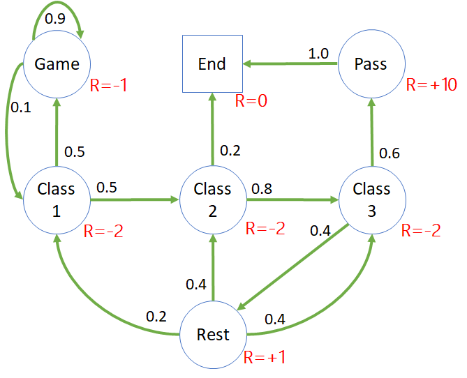

## 学生问题

### 1 提出问题

在学生学习的模型中有很多状态，如何确定某个状态比另一个状态好呢？或者说如何比较两个状态的好坏呢？因为从直觉上讲，学生在 C1,C2,C3 的状态明显要比 Game 状态好，但是如何能用数值的大小来体现这种好坏关系呢？

<center>


图 1 学生学习模型
</center>

在上一节中，已经有了分幕、奖励、回报的概念，这一节中，将会利用这些基础概念来定义每个**状态价值函数**，从而可以比较状态之间的好坏。

需要再次说明的是，在图 1 中，我们使用了**注重结果**的奖励定义方式，直接给每个状态赋值一个奖励，意味只要达到这个状态，就可以立刻获得标注出的奖励值，而不管是从哪条路径达到的。

### 2 状态价值函数（State Value Function）

在上一节通过对 $G$ 的计算，以及对状态图的分析理解，我们似乎已经得到了一些启示：距离终点越近的状态，越接近于成功，它的状态价值就越高，似乎用 $G$ 值就可以表示该时刻的状态价值。

但是，会有一个麻烦出现：每个学生走的路径都不完全一样，状态图虽然是有向的，但是由于环状转移的原因，一个状态在一个序列中可能会出现多次。比如 C1 状态，有三种情况可以到达：

1. 最开始上第一次课时；
2. 从游戏状态返回时；
3. 从休息状态返回时。

而以 C1 开始的路径又可以有很多种，如表 1 所示。

表 1 以 C1 开始的 $G$ 值的计算

||分幕采样序列|回报值计算（$\gamma=1$）|
|-|-|-|
|1|C1-C2-C3-Pass-End|$G_{C1}=-2-2-3+10+0=3$|
|2|C1-Game-Game-C1-C2-End|$G_{C1}=-2-1-1-1-2-2+0=-9$|
|3|C1-C2-C3-Rest-C2-C3-Pass-End|$G_{C1}=-2-2-3+1-2-2+10+0=0$|
|4|C1-C2-C3-Rest-C1-Game-Game-C1-C2-End|$G_{C1}=-2-2-2+1-2-1-1-2-2+0=-13$|

这样的话，一个状态 C1 就可能有 4 个 $G$ 值，我们用哪个当作其价值函数呢？另外，仔细观察 $G$ 的表达式，它只与时刻及奖励有关，没有体现出状态来。

考虑到以上两点，定义状态价值函数如下：

$$
\begin{aligned}
V_t(s) &= \mathbb E [G_t | S_t = s]
\\\\
&=\mathbb E [ R_{t+1}+\gamma R_{t+2}+\gamma^2 R_{t+3}+ \gamma^3 R_{t+4}+ \cdots]
\end{aligned}
\tag{1}
$$

### 3 数学期望

简单地回忆一下**数学期望**的概念。

一个正常的六面的骰子，投出去后可以得到 [1,2,3,4,5,6] 六种结果，而且概率相等，那么这个骰子的期望值是 $(1+2+3+4+5+6)/6=3.5$。哈哈，读者可能会发现 3.5 这个数子，骰子无法投出来，所以它只是一种定义。

但是，一个不正常的骰子，比如 [4,5,6] 出现的概率 $p$ 都是 $\frac{1}{5}$，而 [1,2,3] 出现的概率 $p$ 都是 $\frac{2}{15}$，那么它的数学期望是：

$$
\begin{aligned}
\mathbb E[骰子]&=\sum_{i=1}^6 p_i V_i
\\\\
&= \frac{2}{15} \times 1+\frac{2}{15} \times 2+\frac{2}{15} \times 3+\frac{1}{5} \times 4+\frac{1}{5} \times 5+\frac{1}{5} \times 6
\\\\
&=3.8
\end{aligned}
$$

观察式 1，在定义状态价值函数时，数学期望对于 $G_t$ 没有定义权重或概率，所以每一幕的 $G_t$ 值都是同等价值的，因此，状态价值函数就是很多幕的 $G_t$ 的算术平均值。

以表 1 中的数据为例：$V(C1)=[3 +(-9)+0+(-13)]/4=-4.75$

但是，只有 4 幕采样并不能准确计算出真正的期望值，因此，我们需要更多的采样。一般情况下，采样的数量级应该是成千上万的，才会得到一个比较稳定的数学期望值。

### 4 搭建模型环境

本部分的代码在 StudentDataModel.py 中。

#### 定义状态集

```Python
# 状态
class States(Enum):
    Game = 0
    Class1 = 1
    Class2 = 2
    Class3 = 3
    Pass = 4
    Rest = 5
    End = 6
```
由于本问题中状态比较少，所以可以用枚举方式来定义状态集。

#### 定义奖励函数

```Python
# 奖励向量
# [Game, Class1, Class2, Class3, Pass, Rest, End]
Rewards = [-1, -2, -2, -2, 10, 1, 0]
```

#### 定义状态转移矩阵

```Python
# 状态转移概率 from->to
P = np.array(
    [  #Game  C1   C2   C3   Pass Rest End
        [0.9, 0.1, 0.0, 0.0, 0.0, 0.0, 0.0], 
        [0.5, 0.0, 0.5, 0.0, 0.0, 0.0, 0.0],
        [0.0, 0.0, 0.0, 0.8, 0.0, 0.0, 0.2],
        [0.0, 0.0, 0.0, 0.0, 0.6, 0.4, 0.0],
        [0.0, 0.0, 0.0, 0.0, 0.0, 0.0, 1.0],
        [0.0, 0.2, 0.4, 0.4, 0.0, 0.0, 0.0],
        [0.0, 0.0, 0.0, 0.0, 0.0, 0.0, 1.0] 
    ]
)
```
这是完全按照图 1 中的标记来定义的，请读者自己核对一下。首先要确定每行的数值的和为 1.0，其次要确定 "from->to" 坐标位置是否正确。万一搞错的话，会给后面写代码时 debug 带来困难。

在此使用一个简单的向量来定义奖励值，按顺序对应到状态上。


#### 定义模型

按理说有了上面的状态集、奖励、转移矩阵，就可以开始计算 G 值了，但是定义一个统一的模型，会让代码可读性好，出错概率低，并帮助读者加深对概念的理解。

```Python
class DataModel(object):
    def __init__(self):
        self.P = P                          # 状态转移矩阵
        self.R = Rewards                    # 奖励
        self.S = States                     # 状态集
        self.num_states = len(self.S)       # 状态数量
        self.end_states = [self.S.End]      # 终止状态集
    
    # 判断给定状态是否为终止状态
    def is_end(self, s):
        if (s in self.end_states):
            return True
        return False

    # 获得即时奖励，保留此函数可以为将来更复杂的奖励函数做准备
    def get_reward(self, s):
        return self.R[s.value]

    # 根据转移概率前进一步，返回（下一个状态、即时奖励、是否为终止）
    def step(self, curr_s):
        next_s = np.random.choice(self.S, p=self.P[curr_s.value])
        return next_s, self.get_reward(next_s), self.is_end(next_s)
```

上面的代码中的注释已经足够丰富了，不再赘述。唯一要提醒的是，我们使用了枚举定义状态，在函数之间传值时都用枚举变量而非具体数值。在函数内部要注意使用 s.value 来做具体索引值。

当然，如果把奖励函数定义为一个字典，可以直接使用 Reward[State] 的方式来获得当前奖励值，更具可读性。

### 5 计算状态价值函数

本部分的代码在 Sampling.py 中。

OK! 在上一小节，我们的模型已经建立好了，现在可以开始根据式 1 来计算学生学习模型的状态价值函数了。

#### 算法伪代码

----
输入：起始状态 $S, Episodes, \gamma$
多幕 $Episodes$ 循环：
　　$G_{sum} \leftarrow 0$
　　获得状态 $S$ 的奖励值，看作是 $R_{t+1}$
　　$G \leftarrow R_{t+1} $
　　计数器 $t=1$
　　幕内循环直到终止状态：
　　　　从 $S$ 根据状态转移概率得到 $S', R'$ 以及终止标志
　　　　$G \leftarrow G + \gamma^t R'$
　　　　$t \leftarrow t+1$
　　　　$S \leftarrow S'$
　　$G_{sum} \leftarrow G_{sum}+G$
$V \leftarrow G_{sum} / Episodes$
输出：$V$

---

#### 算法说明

<center>


图 2 采样算法说明
</center>

图 2 中展示了以5个状态组成的序列为例的 $G$ 的计算过程：

1. 起始状态为 C1，得到奖励 $R_1$，保存到 G 中，其中的下标 $[1]$ 表示第一步；
2. 转移到 C2，得到奖励 $R_2$，乘以 $\gamma$ 后与第一步的 $G$ 相加，仍然保存到 $G$ 中，原来的 $G$ 值就被替换掉了；
3. 以此类推，一直到最后的 End 状态，得到 $R_T$，与第 $[4]$ 步的 $G$ 相加，终止幕内循环，得到状态 C1 的一个采样序列的回报值 $G_{C1}$；
4. 多次重复上述过程，得到不同的采样序列的 $G$ 值，累计；
5. 最后的累计值除以幕数，就可以认为是 $G$ 的数学期望，因而得到状态值 $V$。


#### 算法实现

```Python
# 多次采样获得回报 G 的数学期望，即状态价值函数 V
def Sampling(dataModel, start_state, episodes, gamma):
    G_sum = 0  # 定义最终的返回值，G 的平均数
    # 循环多幕
    for episode in tqdm.trange(episodes):
        # 由于使用了注重结果奖励方式，所以起始状态也有奖励，做为 G 的初始值
        G = dataModel.get_reward(curr_s)   
        curr_s = start_state        # 把给定的起始状态作为当前状态
        t = 1                       # 折扣因子
        done = False                # 分幕结束标志
        while (done is False):      # 本幕循环
            # 根据当前状态和转移概率获得:下一个状态,奖励,是否到达终止状态
            next_s, r, done = dataModel.step(curr_s)   
            G += math.pow(gamma, t) * r
            t += 1
            curr_s = next_s
        # end while
        G_sum += G # 先暂时不计算平均值，而是简单地累加
    # end for
    V = G_sum / episodes   # 最后再一次性计算平均值，避免增加计算开销
    return V
```

上述代码可以通过多次循环（由 Episodes）指定，计算指定状态 start_state 的多个回报值 $G$ 的平均值，作为理论上的数学期望值。

那么 Episodes 的具体数值是多少合适呢？

#### 多进程并发计算

在本问题的状态集中一共有 7 个状态。根据上面的算法，首先要指定起始状态，可以遍历状态集中的每个状态作为起始状态。在计算两个状态的状态函数值时互相不干扰，所以，可以考虑使用多进程来并发计算每个指定的起始状态。

```Python
def Sampling_MultiProcess(dataModel, episodes, gamma):
    pool = mp.Pool(processes=4) # 指定合适的进程数量
    V = np.zeros((dataModel.num_states))
    results = []
    for start_state in dataModel.S:    # 遍历状态集中的每个状态作为起始状态
        results.append(pool.apply_async(Sampling, 
                args=(dataModel, start_state, episodes, gamma,)
            )
        )
    pool.close()
    pool.join()
    for s in range(dataModel.num_states):
        v = results[s].get()
        V[s] = v

    return V
```
读者可以根据自己的计算机的 CPU 数量修改 processes=4 的值，但是一定要注意，这个值如果大于你的计算机的 CPU 数量，程序运行速度反而会变慢，因为要在进程间不断切换。

#### 主过程调用

```Python
if __name__=="__main__":
    episodes = 10000        # 计算 10000 次的试验的均值作为数学期望值
    gammas = [0, 0.9, 1]    # 指定多个折扣因子做试验
    dataModel = data.Model()
    for gamma in gammas:
        V = Sampling_MultiProcess(dataModel, episodes, gamma)
        print("gamma =", gamma)
        for s in dataModel.S:
            print(str.format("{0}:\t{1}", s.name, V[s.value]))
```
#### 计算结果
```
gamma = 0
Game:   -1.0
Class1: -2.0
Class2: -2.0
Class3: -2.0
Pass:   10.0
Rest:   1.0
End:    0.0
---------------
gamma = 0.9
Game:   -7.619960436758965
Class1: -5.012940670268943
Class2: 0.9443617132189657
Class3: 4.020495688121447
Pass:   10.0
Rest:   1.908911196549832
End:    0.0
---------------
gamma = 1
Game:   -22.1306
Class1: -12.638
Class2: 1.3951
Class3: 4.4477
Pass:   10.0
Rest:   0.8086
End:    0.0
```

数据解读：

- $\gamma=0$ 时
  
  价值函数值就等于当前状态的奖励值，这和价值函数以及回报值的定义相符。

- $\gamma=1$ 时

  距离终点越远的状态（比如 Game 和 Class1），其价值函数越小，甚至都不在一个数量级上了。

- $\gamma=0.9$ 时

  由于折扣的存在，使得各个状态的价值函数值之间有些许的平衡。

### 6 如何确定采样的次数

具体地说就是如何确定算法中的幕数 Episodes 的数值。

根据问题的复杂程度不同，幕数必然会不同。但到目前为止，没有人从理论层面研究过这个问题，所以有一些偏实践的方法，供大家参考。

#### 试探

先用比较小的数值，比如 100，去做几次尝试，如果发现几次尝试的结果之间有很大的方差，就增加到 1000 再试试 ...... 以此类推，也许到 10 万时才能相对稳定。

方差公式为：

$$
\sigma^2=\frac{1}{n}\sum_{i=1}^n (V_i-\mu)^2 \tag{2}
$$

比如，我们只关注 Rest 状态的价值函数值，运行 3 次得到 $V_1,V_2,V_3$ 的值，而 $\mu=\frac{1}{3}(V_1+V_2+V_3)$ 是均值：

1. 当 episodes=100 时，运行 3 次，结果分别是 [1.2, 2.8, 2.0]，相差非常大，$\sigma^2=0.427$；
2. 设置 episodes=1000，运行 3 次，结果分别是 [0.5, 1.2, 0.9]，方差减小了，$\sigma^2=0.082$，但还不够好；
3. 设置 episodes=10000，运行 3 次，结果分别是 [0.86, 0.75, 0.82]，$\sigma^2=0.002$，如果这个方差到了你的心理预期，就可以结束了，否则可以再增加 episodes 的次数。

#### 比较

先看一个增量计算平均值的公式：

$$
\begin{aligned}
V_{n+1} &= \frac{1}{n+1} \sum_{i=1}^{n+1} G_i=\frac{1}{n+1}(\sum_{i=1}^{n} G_i+G_{n+1})
\\\\
&= \frac{1}{n+1}(G_{n+1}+nV_n)= \frac{1}{n+1}(G_{n+1}+n V_n+ V_n-V_n)
\\\\
&=V_n + \frac{1}{n+1}(G_{n+1}-V_n)
\end{aligned}
\tag{3}
$$

式 3 表达的意思是，n+1 幕时 $G_{n+1}$ 的期望值 $V_{n+1}$，等于 $n$ 幕时的 $G_n$ 期望值 $V_{n}$，再加上 n+1 幕时的 $G_{n+1}$ 与 $V_n$ 的差值除以 (n+1)。

把式 2 变形得到：

$$
V_{n+1} - V_{n} = \frac{1}{n+1}(G_{n+1}-V_n)
\tag{4}
$$


在第 n+1 幕时，先计算出式 4 的等号后面的部分，检查这个值是否足够小（比如小于 1e-2），就可以认为已经收敛了。

当然，这里的步长可以不是 1 幕，而是 10 幕或者 100 幕。

### 问题与讨论

1. 为什么在不同的折扣因子情况下，Pass 状态的值永远是 10.0，而 End 状态的值永远是 0.0 ？
2. 请使用试探法来找到比较理想的分幕次数。
3. 请使用比较法来找到比较理想的分幕次数。
4. 假设 $Episodes=10000,\gamma=0.9$，多次计算状态值，哪个状态的方差最大？为什么？

