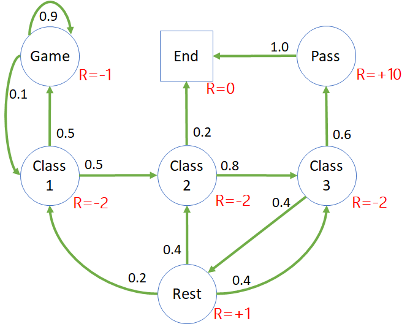

## 马尔可夫奖励过程

### 2 建立模型

以在校大学生为例，假设一门课只需要上三次课就可以结束，然后就可以通过考试而结课拿学分。当然，这其中也不是那么顺利的，学生可能会遇到各种挑战：

- 上课不专心听讲而去打手机游戏；
- 学到一半的时候觉得这门课索然无味，中途退课；
- 觉得离考试还远，不着急复习巩固知识，而是去休息；
......

图 1 是一个有关学生的学习、考试等一些列状态的马尔可夫链，也可以叫做状态转移图。

图 1 学习问题的状态转移概率图

- Class 1,2,3
  上课/学习/复习状态，假设一门课是需要三次课的学习就可以结束。
  - 在上课 1 中，有 0.5 的概率跑到 Game 状态，在课堂上用手机偷偷摸摸打游戏，另外 0.5 的概率到上课 2 状态。
  - 在上课 2 中，有 0.2 的概率直接退课，另外 0.8 的概率到上课 3 状态。
  - 在上课 3 中，有 0.6 的概率去考试，另外 0.4 的概率以为考试还远，不着急准备呢，就去休息了。
- Pass
  考试通过状态。考试结束后，以 100% 概率到结课状态。
- Rest
  休息状态。休息结束后，发现学的内容都忘得差不多了，遂分别以不同的概率回到三次课的上课/学习/复习状态。
  在这里我们不区分上课和复习，如果是第一次到达 C1 状态，就认为是上课，否则就认为是复习。
- Game
  娱乐/打游戏状态。在游戏状态中很大可能不能自拔，以 0.9 概率继续打游戏，只有 0.1 的概率幡然悔悟回到学习状态。
- End
  结课/退课状态。进入此状态后将不再进行转移，或者是说以 100% 的概率转移到自己，叫做结束状态或者吸收状态。

表 1 中列出了状态转移矩阵，与租车问题中的矩阵形式相同。

表 1 状态转移矩阵

|P: 从$\rightarrow$到|Game|Class1|Class2|Class3|Pass|Rest|End|
|:-:|:-:|:-:|:-:|:-:|:-:|:-:|:-:|:-:|
|**Game**|0.9|0.1||||||
|**Class1**|0.5||0.5|||||
|**Class2**||||0.8|||0.2|
|**Class3**|||||0.6|0.4||
|**Pass**|||||||1.0|
|**Rest**||0.2|0.4|0.4||||
|**End**|||||||1.0|

有的读者可能有个疑问：打游戏上瘾，从 Game 到 Game 有 0.9 的高概率，那么当该学生打游戏 2 小时后良心发现，转到学习状态的概率会不会大于 0.1 呢？

这是一个简单的平稳环境的马尔科夫链，如果考虑更复杂的情况，可以在 Game 状态下增加一个计数器：
- 如果打游戏超过 1 小时了，则有 0.5 的概率回到学习状态；
- 如果没超过 1 小时，则有 0.1 的概率回到学习状态。

对于这种有终止状态的状态转移概率图（矩阵），是没有平稳、收敛的概念的，感兴趣的读者可以运行 Studnet.py 来验证结果。

### 5 马尔可夫奖励过程（Markov Reward Process）

用一个示意性的公式来表示 MRP（Markov Reward Process，马尔可夫奖励过程）：

$$
马尔可夫奖励过程 = 马尔可夫链 + 奖励函数
$$

根据上面学习的知识，再结合上面学生学习的状态转移图 1，我们给每个状态定义一个奖励，如图 5 所示。

图 5 学生学习问题马尔可夫奖励过程

显然，我们使用了图 2 中的第一种方式（**注重结果**）来定义奖励，举例来说，无论状态 Class 2 是通过什么路径到达的（可以通过 Class 1 到达，也可以通过 Rest 到达），都可以得到 -2 的奖励。

奖励函数（值）的设计一般是人工设定的，是通过分析目标问题的实际科学意义或者人文意义来决定的。比如，在图 5 中，通过针对学生学习模型的实际意义，给出制定奖励的过程如下：

1. 这门课需要上三次课（或者复习三次），每次上课都应该给与正的奖励，而且上课越多奖励越高，所以，$R_{C1} = +1, \ R_{C2} = +1, \ R_{C3} = +2$；
2. 在没有考试之前，不鼓励休息，否则会前功尽弃，所以 Rest 状态肯定应该是负的奖励。从另一方面想，如果该状态是正的奖励，学生（智能体）就会在 C1,C2,C3,Rest 之间来回循环以得到累积的高分。所以 $R_{Rest}=-4$，正好抵消 C1,C2,C3 的奖励之和；
3. 在课堂上打游戏是非常不好的状态，需要严惩，所以 $R_{Game}=-5$；
4. 鼓励学生进入考试并通过的状态，所以 $R_{Pass}=+10$；
5. 终止状态的应该设置为 0 奖励，$R_{End}=0$。

根据状态转移可以得到一些完整的分幕采样，从而可以计算出每个采样的回报值，列在表 1 中。

表 1 分幕采样和回报计算

||分幕采样序列|回报值计算|
|-|-|-|
|1|C1-C2-C3-Pass-End|$G_{C1}=-2-2-3+10+0=3$|
|2|C1-Game-Game-Game-C1-C2-End|$G_{C1}=-2-1-1-1-2-2+0=-9$|
|3|C2-End|$G_{C2}=-2+0=-2$|
|4|C1-C2-C3-Rest-C2-C3-Pass-End|$G_{C1}=-2-2-3+1-2-2+10+0=0$|
|5|C1-C2-C3-Rest-C1-Game-Game-C1-C2-End|$G_{C1}=-2-2-2+1-2-1-1-2-2+0=-13$|
|6|C3-Rest-C1-Game-Game-C1-C2-End|$G_{C3}=-2+1-2-1-1-2-2+0=-9$|
|7|Game-Game-C1-C2-End|$G_{Game}=-1-1-2-2+0=-6$|

读者可能会产生怀疑：为什么表 1 中的第 1,2,4,5 行都是同样计算 $G_{C1}$ 的回报值，但是有不同的累积结果？这是因为采样不同，路径不同，造成的回报值不同，这种情况是正常的。

到目前可以总结出，马尔可夫奖励过程是一个元组的数据序列：$<S,P,R>$，分别表示状态 $S$、转移概率 $P$、奖励 $R$。

表 2 带折扣的分幕采样和回报计算

||分幕采样序列|回报值计算（$\gamma=0.9$）|
|-|-|-|
|1|C1-C2-C3-Pass-End|$G_{C1}=(-2)+0.9*(-2)+0.9^2*(-2)+0.9^3*10+0.9^4*0=1.87$|
|2|C1-Game-Game-Game-C1-C2-End|$G_{C1}=(-2)+0.9*(-1)+0.9^2*(-1)+0.9^3*(-1)+0.9^4*(-2)+0.9^5*(-2)+0.9^6*0=-6.93$|
|3|C2-End|$G_{C2}=-2+0.9*0=-2$|
|...|...|...|
|7|Game-Game-C1-C2-End|$G_{Game}=(-1)+0.9*(-1)+0.9^2*(-2)+0.9^3*(-2)+0.9^4*0=-4.98$|

表 3 折扣为 0 的分幕采样和回报计算

||分幕采样序列|回报值计算（$\gamma=0$）|
|-|-|-|
|1|C1-C2-C3-Pass-End|$G_{C1}=-2$|
|2|C1-Game-Game-Game-C1-C2-End|$G_{C1}=-2$|
|3|C2-End|$G_{C2}=-2$|
|...|...|...|
|7|Game-Game-C1-C2-End|$G_{Game}=-1$|

表 3 中，如果折扣为 0，则回报值 $G$ 就等于当前状态的奖励值 $R$，即$G_t = R_{t+1}$。

