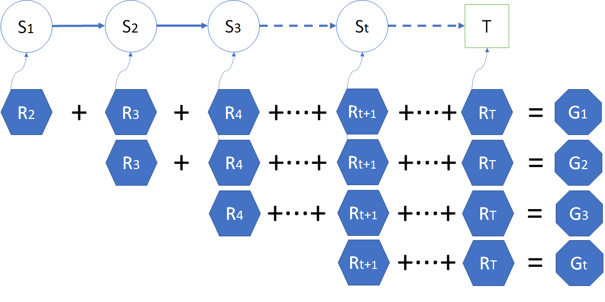

## 蒙特卡洛预测

### 1 提出问题

在上一节中，我们借助回报 $G$ 的定义

$$
G_t = R_{t+1}+\gamma R_{t+2}+\gamma^2 R_{t+3}+ \cdots +\gamma^{T-t-1} R_{T}  \tag{1}
$$

以及价值函数 $V$ 的定义

$$
V_t(s) = \mathbb E [G_t | S_t = s]
\tag{2}
$$

初步计算出了学生学习问题的各个状态的价值函数。其过程如下：

1. 每次采样都需要指定一个初始状态，然后在幕内循环，直到终止状态。
2. 然后根据式 1 开始“从头”计算这个初始状态的回报 $G$ 值。
3. 进行下一次采样，再计算 $G$ 值。
4. 最后求平均（数学期望）得到 $V$。

聪明的读者可能会发现一个问题：如果不“从头”开始，而是从第二个、第三个状态开始计算，是不是就能在一次采样中就可以得到很多状态的 G 值呢？

图 1 

如图 1 所示，从 $S_1$ 开始一幕的采样，到 $S_T$ 为止结束，得到 $R$ 的序列后，固然可以从 $R_2$ 开始计算出 $G_1$，但是如果从 $R_3$ 开始，不就能计算出 $G_2$ 了吗？同理，还可以计算出 $G_t$ 来。这样，利用一次采样结果可以计算出很多状态的 $G$ 值，会大幅提高算法的效率。

