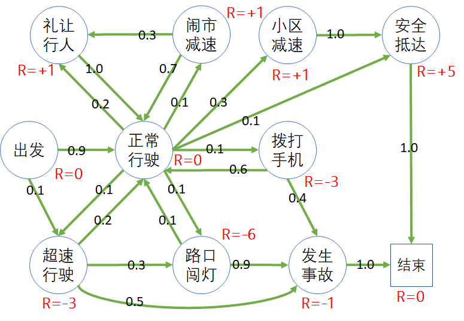
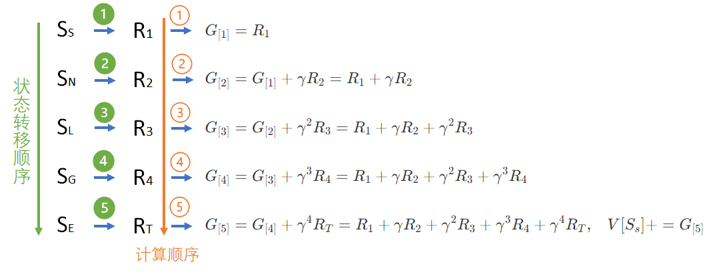

## 状态价值函数

### 1 提出问题

在安全驾驶问题中，我们学习了马尔可夫奖励过程，给其中的各个状态以奖励值，或正或负。比如：

- 礼让行人、闹市减速、小区减速等状态都可以得到 +1 的奖励。
- 开车打电话、闯红灯、超速行驶等状态可以得到 -3 或 -6 的扣分。

读者不禁会产生几个问题：

1. 这个奖励值可以真正表示这个状态的好坏吗？
2. 具有相同奖励值的状态，哪个更好？
3. 虽然有回报值 $G$ 的定义，但是由于分幕数据序列的不同，对某个状态来说，每次采样得到的 $G$ 值都不一样，以哪一个为准呢？

### 2 建立模型

在学习马尔可夫奖励过程时，已经建立好了这个问题的状态转移模型和奖励模型，可以直接拿过来用。

图 1 是该问题的马尔可夫奖励模型，每个状态都有一个即时奖励值。

<center>


图 1 学习问题的状态转移概率图
</center>

需要再次说明的是，在图 1 中，我们使用了**注重结果**的奖励定义方式，直接给每个状态赋值一个奖励，意味只要达到这个状态，就可以立刻获得标注出的奖励值，而不管是从哪条路径达到的。

表 1 中列出了状态转移矩阵，与租车问题中的矩阵形式相同。

表 1 状态转移矩阵

|P: 从$\rightarrow$到|出发|正常<br>行驶|礼让<br>行人|闹市<br>减速|超速<br>行驶|路口<br>闯灯|小区<br>减速|拨打<br>手机|发生<br>事故|安全<br>抵达|结束|
|-|:-:|:-:|:-:|:-:|:-:|:-:|:-:|:-:|:-:|:-:|:-:|
|S：出发|-|0.9|-|-|0.1|-|-|-|-|-|-|
|N：正常行驶|-|-|0.2|0.1|0.1|0.1|0.3|0.1|-|0.1|-|
|P：礼让行人|-|1.0|-|-|-|-|-|-|-|-|-|
|D：闹市减速|-|0.7|0.3|-|-|-|-|-|-|-|-|
|X：超速行驶|-|0.2|-|-|-|0.3|-|-|0.5|-|-|
|R：路口闯灯|-|0.1|-|-|-|-|-|-|0.9|-|-|
|L：小区减速|-|-|-|-|-|-|-|-|-|1.0|-|
|M：拨打手机|-|0.6|-|-|-|-|-|-|0.4|-|-|
|C：发生事故|-|-|-|-|-|-|-|-|-|-|1.0|
|G：安全抵达|-|-|-|-|-|-|-|-|-|-|1.0|
|E：结束|-|-|-|-|-|-|-|-|-|-|1.0|


有的读者可能会较真儿：进入小区减速状态后，就一定可以安全抵达吗？当然，在小区里可能会有很多突发情况，比如老人儿童突然横穿道路等等。在此我们就不再细化这个模型了。

在上一节中，已经有了分幕、奖励、回报的概念，这一节中，将会利用这些基础概念来定义每个**状态价值函数**，从而可以比较状态之间的好坏。

### 3 状态价值函数（State Value Function）

在上一节通过对 $G$ 的计算，以及对状态图的分析理解，我们似乎已经得到了一些启示：距离终点越近的状态，越接近于成功，它的状态价值就越高，似乎用 $G$ 值就可以表示该时刻的状态价值。

但是，会有两个麻烦出现：

1. 每个司机经过的路径都不完全一样，状态图虽然是有向的，但是由于环状转移的原因，一个状态在一个序列中可能会出现多次。比如 *正常行驶* 状态，有 6 种情况可以到达；
2. 从 *出发* 开始的路径又可以有很多种，如表 2 所示。

表 2 以 *出发* 开始的 $G$ 值的计算

||分幕采样序列|回报值计算（$\gamma=1$）|
|-|-|-|
|1|Start - N - L - G - End|$G_{S}=0+0+1+5+0=6$|
|2|Start - N - P - N - L - G - End|$G_{S}=0+0+1+0+1+5+0=7$|
|3|Start - N - R - C - End|$G_{S}=0+0-6-1+0=-7$|
|4|Start - X - R - N - R - C - End|$G_{S}=0-3-6+0-6-1+0=-16$|


这样的话，一个状态就可能有 4 个不同的 $G$ 值，我们用哪个当作其价值函数呢？另外，仔细观察 $G$ 的表达式，它只与时刻及奖励有关，没有体现出状态来。

考虑到以上两点，定义状态价值函数如下：

$$
\begin{aligned}
V(s) &= \mathbb E [G_t | S_t = s]
\\\\
&=\mathbb E [ R_{t+1}+\gamma R_{t+2}+\gamma^2 R_{t+3}+ \gamma^3 R_{t+4}+ \cdots]
\end{aligned}
\tag{1}
$$

式 1 的含义是，定义状态价值函数 $V$ 是回报 $G$ 的**数学期望**。时刻 $t$ 在这里只起到一个按顺序串联状态 $S$，从而得到奖励 $R$ 的作用。

### 4 数学期望

简单地回忆一下**数学期望**的概念。

一个正常的六面的骰子，投出去后可以得到 $[1,2,3,4,5,6]$ 六种结果，而且概率相等，那么这个骰子的期望值是 $(1+2+3+4+5+6)/6=3.5$。哈哈，读者可能会发现 3.5 这个数子，骰子无法投出来，所以它只是一种定义。

但是，一个不正常的骰子，比如 $[4,5,6]$ 出现的概率 $p$ 都是 $\frac{1}{5}$，而 $[1,2,3]$ 出现的概率 $p$ 都是 $\frac{2}{15}$，那么它的数学期望是：

$$
\begin{aligned}
\mathbb E[骰子]&=\sum_{i=1}^6 p_i V_i
\\\\
&= \frac{2}{15} \times 1+\frac{2}{15} \times 2+\frac{2}{15} \times 3+\frac{1}{5} \times 4+\frac{1}{5} \times 5+\frac{1}{5} \times 6
\\\\
&=3.8
\end{aligned}
$$

观察式 2，在定义状态价值函数时，数学期望对于 $G_t$ 没有定义权重或概率，所以每一幕的 $G_t$ 值都是同等价值的，因此，状态价值函数就是很多幕的 $G_t$ 的算术平均值。

以表 1 中的数据为例：$V(Start)=[6+7+(-7)+(-16)]/4=-2.5$

但是，只有 4 幕采样并不能准确计算出真正的期望值，因此，我们需要更多的采样。一般情况下，采样的数量级应该是成千上万的，才会得到一个比较稳定的数学期望值。

### 5 搭建模型环境

【代码位置：DriveDataModel.py】

#### 定义状态集

```Python
# 状态
class States(Enum):
    Start = 0           # 出发
    Normal = 1          # 正常行驶
    Pedestrians = 2     # 礼让行人
    DownSpeed = 3       # 闹市减速
    ExceedSpeed = 4     # 超速行驶
    RedLight = 5        # 路口闯灯
    LowSpeed = 6        # 小区减速
    MobilePhone = 7     # 拨打手机
    Crash = 8           # 发生事故
    Goal = 9            # 安全抵达
    End = 10            # 结束
```
由于本问题中状态比较少，所以可以用枚举方式来定义状态集。

#### 定义奖励函数

```Python
# 奖励向量
# |出发|正常行驶|礼让行人|闹市减速|超速行驶|路口闯灯|小区减速|拨打手机|发生事故|安全抵达|结束|
R = [0,  0,      +1,       +1,     -3,      -6,     +1,     -3,      -1,   +5,    0]
```

#### 定义状态转移矩阵

```Python
# 状态转移概率 from->to
P = np.array(
    [
        [0.0, 0.9, 0.0, 0.0, 0.1, 0.0, 0.0, 0.0, 0.0, 0.0, 0.0],
        [0.0, 0.0, 0.2, 0.1, 0.1, 0.1, 0.3, 0.1, 0.0, 0.1, 0.0],
        [0.0, 1.0, 0.0, 0.0, 0.0, 0.0, 0.0, 0.0, 0.0, 0.0, 0.0],
        [0.0, 0.7, 0.3, 0.0, 0.0, 0.0, 0.0, 0.0, 0.0, 0.0, 0.0],
        [0.0, 0.2, 0.0, 0.0, 0.0, 0.3, 0.0, 0.0, 0.5, 0.0, 0.0],
        [0.0, 0.1, 0.0, 0.0, 0.0, 0.0, 0.0, 0.0, 0.9, 0.0, 0.0],
        [0.0, 0.0, 0.0, 0.0, 0.0, 0.0, 0.0, 0.0, 0.0, 1.0, 0.0],
        [0.0, 0.6, 0.0, 0.0, 0.0, 0.0, 0.0, 0.0, 0.4, 0.0, 0.0],
        [0.0, 0.0, 0.0, 0.0, 0.0, 0.0, 0.0, 0.0, 0.0, 0.0, 1.0],
        [0.0, 0.0, 0.0, 0.0, 0.0, 0.0, 0.0, 0.0, 0.0, 0.0, 1.0],
        [0.0, 0.0, 0.0, 0.0, 0.0, 0.0, 0.0, 0.0, 0.0, 0.0, 1.0]
    ]
)
```
这是完全按照图 1 中的标记来定义的，请读者自己核对一下。首先要确定每行的数值的和为 1.0，其次要确定 "from->to" 坐标位置是否正确。万一搞错的话，会给后面写代码时 debug 带来困难。

在此使用一个简单的向量来定义奖励值，按顺序对应到状态上。


#### 定义模型

按理说有了上面的状态集、奖励、转移矩阵，就可以开始计算 G 值了。但是定义一个统一的模型，把细节封装成一些标准的交互函数，会让代码可读性好，出错概率低，并帮助读者加深对概念的理解。

```Python
class DataModel(object):
    def __init__(self):
        self.P = P                          # 状态转移矩阵
        self.R = R                          # 奖励
        self.S = States                     # 状态集
        self.num_states = len(self.S)       # 状态数量
        self.end_states = [self.S.End]      # 终止状态集
    
    # 判断给定状态是否为终止状态
    def is_end(self, s):
        if (s in self.end_states):
            return True
        return False

    # 获得即时奖励，保留此函数可以为将来更复杂的奖励函数做准备
    def get_reward(self, s):
        return self.R[s.value]

    # 根据转移概率前进一步，返回（下一个状态、即时奖励、是否为终止）
    def step(self, curr_s):
        next_s = np.random.choice(self.S, p=self.P[curr_s.value])
        return next_s, self.get_reward(next_s), self.is_end(next_s)
```

上面的代码中的注释已经足够丰富了，不再赘述。唯一要提醒的是，我们使用了枚举定义状态，在函数之间传值时都用枚举变量而非具体数值。在函数内部要注意使用 s.value 来做具体索引值。

当然，如果把奖励函数定义为一个字典，可以直接使用 Reward[State] 的方式来获得当前奖励值，更具可读性。

### 6 计算状态价值函数

【代码位置：DriveSampling.py】

OK! 模型已经建立好了，现在可以开始根据式 1 来计算学生学习模型的状态价值函数了。

#### 算法描述

----
输入：起始状态 $S, Episodes, \gamma$
初始化：$G_{sum} \leftarrow 0$  # 累计多幕的G值以便求平均
多幕 $Episodes$ 循环：
　　获得状态 $S$ 的奖励值，看作是 $R_{t+1}$
　　$G \leftarrow R_{t+1} $
　　计数器 $t=1$
　　幕内循环直到终止状态：
　　　　从 $S$ 根据状态转移概率得到 $S',R'$ 以及终止标志
　　　　$G \leftarrow G + \gamma^t R'$
　　　　$t \leftarrow t+1$
　　　　$S \leftarrow S'$
　　$G_{sum} \leftarrow G_{sum}+G$
$V_S \leftarrow G_{sum} / Episodes$
输出：$V_S$

---

#### 算法说明

以表 2 中的第 1 个采样序列为例，说明算法的执行过程。

<center>


图 2 采样算法说明
</center>

图 2 中展示了以5个状态组成的序列为例的 $G$ 的计算过程：

1. 起始状态为 S，得到奖励 $R_1$，保存到 $G$ 中，其中的下标 $G_{[1]}$ 表示第一步；
2. 转移到状态 N，得到奖励 $R_2$，乘以 $\gamma$ 后与第一步的 $G$ 相加，仍然保存到 $G$ 中，原来的 $G$ 值就被替换掉了；
3. 以此类推，一直到最后的 E 状态，得到 $R_T$，与第 $[4]$ 步的 $G$ 相加，终止幕内循环，得到状态 S 的一个采样序列的回报值 $G_{S}$；
4. 多次重复上述过程，得到不同的采样序列的 $G$ 值，累计；
5. 最后的累计值除以幕数，就可以认为是 $G$ 的数学期望，因而得到状态值 $V_S$。

这个算法的特点是使用了最少的变量，在算法过程中，一共只用了 $G_{sum},G,R,t,S,S'$ 等几个变量，没有使用任何列表或数组，而且完全是按照回报的定义以及状态价值函数的定义来实现的，便于读者理解。

#### 算法实现

```Python
# 多次采样获得回报 G 的数学期望，即状态价值函数 V
def Sampling(dataModel, start_state, episodes, gamma):
    G_sum = 0  # 定义最终的返回值，G 的平均数
    # 循环多幕
    for episode in tqdm.trange(episodes):
        # 由于使用了注重结果奖励方式，所以起始状态也有奖励，做为 G 的初始值
        G = dataModel.get_reward(start_state)   
        curr_s = start_state        # 把给定的起始状态作为当前状态
        t = 1                       # 折扣因子
        done = False                # 分幕结束标志
        while (done is False):      # 本幕循环
            # 根据当前状态和转移概率获得:下一个状态,奖励,是否到达终止状态
            next_s, r, done = dataModel.step(curr_s)   
            G += math.pow(gamma, t) * r
            t += 1
            curr_s = next_s
        # end while
        G_sum += G # 先暂时不计算平均值，而是简单地累加
    # end for
    Vs = G_sum / episodes   # 最后再一次性计算平均值，避免增加计算开销
    return Vs
```

上述代码可以通过多次循环（由 Episodes）指定，计算指定状态 start_state 的多个回报值 $G$ 的平均值，作为理论上的数学期望值。

那么 Episodes 的具体数值是多少合适呢？后面再解释。

#### 多进程并发计算

在本问题的状态集中一共有 11 个状态。根据上面的算法，首先要指定起始状态，可以遍历状态集中的每个状态作为起始状态。在计算两个状态的状态函数值时互相不干扰，所以，可以考虑使用多进程来并发计算每个指定的起始状态。

读者可以根据自己的计算机的 CPU 数量修改 processes=4 的值，但是一定要注意，这个值如果大于你的计算机的 CPU 数量，程序运行速度反而会变慢，因为要在进程间不断切换。

#### 主过程调用

```Python
if __name__=="__main__":
    episodes = 10000        # 计算 10000 次的试验的均值作为数学期望值
    gammas = [0, 0.9, 1]    # 指定多个折扣因子做试验
    dataModel = data.Model()
    for gamma in gammas:
        V = Sampling_MultiProcess(dataModel, episodes, gamma)   # 多进程调用
        print("gamma =", gamma)
        for s in dataModel.S:
            print(str.format("{0}:\t{1}", s.name, V[s.value]))
```
#### 计算结果

表 各个状态的奖励值和价值函数

|状态|R|$\gamma = 0$|$\gamma = 0.9$|$\gamma = 1$|
|-|-:|:-:|:-:|:-:|
|出发 Start|        0|  0.0 |0.47|1.09|
|正常行驶 Normal|       0|  0.0 |1.25|1.64|
|礼让行人 Pedestrians| +1|  1.0 |2.11|2.74|
|闹市减速 DownSpeed|   +1|  1.0 |2.39|2.99|
|超速行驶 ExceedSpeed| -3| -3.0 |-5.03|-5.18|
|路口闯灯 RedLight|    -6|  -6.0|-6.73|-6.72|
|小区减速 LowSpeed|    +1|  1.0 |5.5|6.0|
|拨打电话 MobilePhone| -3|  -3.0|-2.69|-2.32|
|发生事故 Crash|       -1|  -1.0|-1.0|-1.0|
|安全抵达 Goal|        +5|  5.0 |5.0|5.0|
|终止 End|          0|  0.0 |0.0|0.0|

数据解读：

- $\gamma=0$ 时，价值函数值就等于当前状态的奖励值，这和价值函数以及回报值的定义相符。
- $\gamma \ne 0$ 时，
- 正常行驶状态的奖励值虽然为 0，但是其状态价值是大于 0 的。
- 有正的奖励的状态，价值函数值都会比奖励值大，除了 *安全抵达* 之外。
- 有负的奖励的状态，价值函数值都会比奖励值小，除了 *发生事故* 之外。
- $\gamma = 1$ 的值要比 $\gamma = 0.9$ 的值大一些，因为折扣系数的原因。

一个有趣的问题，可以帮助读者更好地理解状态价值函数：比较 *闹市减速* 和 *小区减速* 两个状态，同样是 *减速* ，为什么后者的状态价值函数值比前者高呢？

可以从驾驶的过程中这样理解：

- 在 *闹市减速* 状态时，虽然司机此时做了正确的选择，使车辆处于合理的行驶状态，但并不一定保证在后续的驾驶过程中，司机同样会做出正确的选择，仍然有可能超速、闯灯等等，以至于发生交通事故。
- 在 *小区减速* 状态时，从状态图上看，因为后续会以 100% 的概率进入 *安全抵达* 状态，没有变数，可以得到很高的奖励。所以状态价值函数值会比 *闹市减速* 状态要高。


### 问题与讨论

1. 为什么在不同的折扣因子情况下，*安全抵达* 的状态的值永远是 10.0，而 *终止* 状态的值永远是 0.0 ？
2. 假设 $Episodes=10000,\gamma=0.9$，多次计算状态值，哪个状态的方差最大？为什么？
3. 为什么 *安全抵达* 的状态值和奖励值相等，而其它的具有正奖励值的状态值都比奖励值大？

