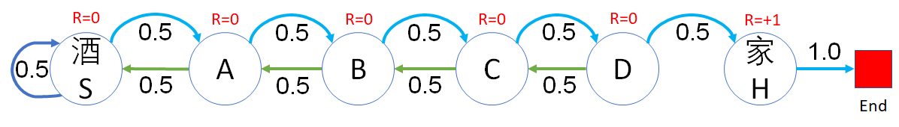
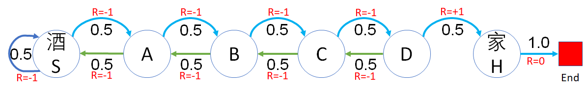

## 状态价值函数的理解

有了价值函数后，可以对一个强化学习问题模型中的状态有了可以衡量的标准，更深刻地理解算法原理。但是读者可以明显地感觉到，奖励函数的设计对状态价值函数有着根本性的影响，一个合理的奖励函数设计可以让问题尽快收敛得到答案。在本节中，我们一起做一些比较简单的试验，来深刻体会奖励函数与状态价值函数的关系。

安全驾驶问题有些复杂，状态转移太多，所以我们用前面的醉汉回家再简化一下来做研究。

在醉汉回家的例子中，奖励函数可以有两种设计方式：

- 对状态奖励
- 对过程奖励

通过对这两种方式的比较，读者可以得到一些基本的概念，为后面的贝尔曼方程的学习做好准备。

除了方式的不同外，在一种方式中，如果奖励值不同，对状态价值函数也会有影响，所以在每种方式中，我们会设计两种不同的奖励值来做比较。

```Python
# 状态定义
class States(Enum):
    Start = 0
    A = 1
    B = 2
    C = 3
    D = 4
    Home = 5    # 终止状态

# 状态转移矩阵
P = np.array(
    [  # S    A    B    C    D    Home     
        [0.5, 0.5, 0,   0,   0,   0,  ], # S
        [0.5, 0,   0.5, 0,   0,   0,  ], # A
        [0,   0.5, 0,   0.5, 0,   0,  ], # B
        [0,   0,   0.5, 0,   0.5, 0,  ], # C
        [0,   0,   0,   0.5, 0,   0.5,], # D
        [0,   0,   0,   0,   0,   1.0,]  # Home(End)
])
```

### 基于状态的奖励方法

#### 第一种情况

**只有到达家的状态奖励设置为 +1，其它状态的奖励都是 0。**

如图 1 所示。

<center>


图 1 醉汉回家
</center>

所以状态奖励值定义如下：

```Python
# 状态奖励值
#     S, A, B, C, D, H
R1 = [0, 0, 0, 0, 0, 1]
```

获得奖励的代码也很直接：

```Python
    def get_reward(self, s):
        return self.R[s.value]
```


这种方式试图达到的效果是：一旦智能体跌跌撞撞地达到了一次家的状态，可以得到 +1 的奖励，它就会尝到甜头并牢记，在后面的学习中会不断强化这种记忆和过程。

下面仍然使用“采样求平均”的办法来计算每个状态的价值函数，即：

- 从 Start 状态开始，做 1000 次采样，得到每次采样的 G 值，然后求平均值；
- 从 A 出发（假设醉汉目前在 A 的位置），做 1000 次采样，得到每次采样的 G 值，然后求平均值；
......
- Home 状态属于终止状态，按照定义，**终止状态的价值为 0**，因为没有状态转移发生，也就没有奖励发生。

表 1

|状态$\to$|Start|A|B|C|D|Home|
|-|-|-|-|-|-|-|
|$\gamma=1$|1.0|1.0|1.0|1.0|1.0|1.0|
|$\gamma=0.9$|0.15|0.20|0.27|0.40|0.62|1.0|

结果解读：

1. 关于折扣

    从结果可以看到，当折扣因子 $\gamma=1$ 时，无折扣，根据公式
$$
V(s)=\mathbb E [G_t|S_t=s]
=\mathbb E [ R_{t+1}+\gamma R_{t+2}+\gamma^2 R_{t+3}+ \cdots + \gamma^{T-t-1} R_T]
\tag{1}
$$

    所有的状态函数值都会是最后到家的奖励值 $R_T=1$，也就无法区分各个状态的好坏了。但是当 $\gamma=0.9$ 时，由于折扣的存在，距离终止状态越近的状态，具有的状态函数值越大，这也是理所当然的。

    所以，折扣值的存在对于奖励机制很有用，当不能确定奖励值是否合理时，一定要令折扣值小于 1，否则没有研究价值。

2. 关于终止状态

    我们在前面强调过，**终止状态的价值为 0**。但是为什么在表 1 中的计算结果，显示 Home 状态的价值函数值为 1 呢？

    首先可以检查一下代码是如何实现的，是否有 bug 呢？

    ```Python
    # 多次采样获得回报 G 的数学期望，即状态价值函数 V
    def Sampling(dataModel, start_state, episodes, gamma):
        G_sum = 0  # 多幕 G 的和, 最后求平均值
        # 循环多幕
        for episode in tqdm.trange(episodes):
            s = start_state # 把给定的起始状态作为当前状态
            G = 0           # 设置本幕的初始值 G=0
            t = 0           # 步数计数器
            while True:
                r = dataModel.get_reward(s) # 到达当前状态, 获得奖励值
                G += math.pow(gamma, t) * r # 当t=0时, G += r
                t += 1                      # 时间步+1
                s = dataModel.get_next(s)   # 得到下一个转移状态
                if (s is None):             # 如果是终止状态则结束本幕
                    break
            # end while
            G_sum += G # 先暂时不计算平均值，而是简单地累加
        # end for
        V = G_sum / episodes   # 最后再一次性计算平均值，避免增加计算开销
        return V
    ```
    
    笔者反复阅读了上述代码，认为自己写的没有问题，完全符合基本概念的定义。所以，当输入参数的 start_state == States.Home 时，由于 Home 为终止状态，所以 s = dataModel.get_next(s) 将会返回 None，导致 while 循环只运行一次就退出了，最终得到 G = r，即本幕的回报值等于 Home 状态的奖励值 1，因此，最后会得到状态价值 V_home = 1。

    如果我们修改代码，令在终止状态时返回 r = 0，将会带来灾难性的后果：所有状态的价值函数值都会为 0。那么整个模型将会变得没有意义。

    所以，在下面的试验中，尝试修改一下奖励函数的设计，看看是否可以避免上述问题。

#### 第二种情况

既然第一种奖励值设计有缺陷，我们把所有的奖励值都减 1，会不会是同样的效果呢？如图 2 所示。

<center>


图 2 醉汉回家
</center>

在代码中设置奖励值如下：

```
# 状态奖励值
#     S,   A,  B,  C,  D, H
#R1 = [0,  0,  0,  0,  0, 1]
R2 = [-1, -1, -1, -1, -1, 0]
```
有的读者可能会问：D 状态距离终点最近，为什么它的奖励值不会比别的状态高呢？

- 首先，到了 D 状态后，也不是一定可以到家，虽然概率较其它状态要大。智能体（醉汉）到达 D 后，只直到得到了 -1 的奖励，并不知道下一步向右走就可以到家，读者也不要做这种假设，因为那是强化学习要达到的结果，而不是条件。

- 其次，不要把状态奖励值和状态价值混为一谈。奖励值没有累加效应，但是状态价值具有全局观察能力。


同样是运行 1000 幕，得到结果如表 2。

表 2

|状态$\to$|Start|A|B|C|D|Home|
|-|-|-|-|-|-|-|
|$\gamma=1$|-30|-28|-24|-18|-10|0.0|
|$\gamma=0.9$|-8.4|-8.1|-7.3|-5.9|-3.7|0.0|

结果解读：

1. 终止状态函数值为 0

    这是我们希望看到的，也符合定义。

2. 其它的状态函数值

    情况发生了变化，状态价值并不是在第一种情况的基础上普遍减 1，而是发生了显著的变化，这是因为 $R=-1$ 的不断累加使得远离终止状态的值变得非常小。

    起始状态 S 的的状态值为什么不是 -1-1-1-1-1=-5 而是 -30 ？因为根据式 1，状态函数值是 $G$ 的期望，$G$ 代表了状态变化序列，由于在每个状态上都有 0.5 的概率返回上一个状态，所以状态变化序列（即马尔科夫链）会变得非常曲折，就会让 -1 这个值累加得越来越大。

3. 折扣的作用

    当有折扣存在时，这种负值累加效果会减弱很多，所以当 $\gamma=0.9$ 时，各个状态的函数值的差别会变得比较平缓。

4. 正负数

    表 1 中的状态值都是正数，表 2 中都是负数，这合理吗？作为一个价值体系来说，正值和负值其实没有绝对意义，相互之间的差值才能够真正体现状态价值。所以只要越靠近终点的状态价值越高，就可以了。

所以，大家在阅读强化学习的资料时，通常会看到如情况二这种奖励方式。这也是笔者开始学习时感到不解的地方，经过试验后，想必大家应该明白了。

另外，还有一个方法可以避免终止状态不为 0 的问题，就是像安全驾驶问题中那样建模：虽然*安全到家*和*发生事故*已经可以看作是终止状态了，但是可以人为地定义一个独立的*终止*状态，令*安全到家*和*发生事故*都以 100% 的概率转移到该终止状态。

### 基于过程的奖励方法

下面我们研究一下过程奖励方法对状态函数值的影响。

#### 第一种情况

假设每走一步都有 0 的“奖励”，相当于没有任何奖励或惩罚，只有最后一步到家的过程才给 1 的奖励，其含义和图 1 差不多。如图 3 所示。

<center>


图 3 醉汉回家
</center>

这次我们要面向过程给与奖励了，所以用了双重字典如下：

```Python
# 过程奖励值
R1 = {
    States.Start: {States.Start: 0,    States.A:0},
    States.A:     {States.Start:0,     States.B:0},
    States.B:     {States.A:0,         States.C:0},
    States.C:     {States.B:0,         States.D:0},
    States.D:     {States.C:0,         States.Home:1},
    States.Home:  {States.End:0},
    States.End:   {States.End:0}
}
```
用第一行数据举例，含义是：从 Start 状态开始，到 Start 状态的奖励为 0，到 A 状态的奖励为 0。这样设计的好处是可以用 $O(1)$ 的效率，根据前后两个状态获得奖励值。当然用表格的方法可以达到同样的效果，只不过是一个稀疏表格，维护不方便。

数据结构变化了，代码逻辑当然需要变化。获得奖励的代码需要两个参数：
```Python
    def get_reward(self, s_curr, s_next):
        return self.R[s_curr][s_next]
```

分幕采样的代码逻辑也要改动，以适应两个状态作为输入的要求。主要改动是把 get_next() 函数的调用提前了，以便得到两个好处：
1. 得到下一个状态以便调用 get_reward() 方法获得过程奖励值。
2. 如果下一个状态是 None，说明已经到达终点，即时终止本幕循环。

另外还增加了一个新变量 s_next，以便同时保持当前状态 s_curr 和下一个状态。

```Python
# 多次采样获得回报 G 的数学期望，即状态价值函数 V
def Sampling(dataModel, start_state, episodes, gamma):
    G_sum = 0  # 多幕 G 的和, 最后求平均值
    # 循环多幕
    for episode in tqdm.trange(episodes):
        s_curr = start_state # 把给定的起始状态作为当前状态
        G = 0           # 设置本幕的初始值 G=0
        t = 0           # 步数计数器
        while True:
            s_next = dataModel.get_next(s_curr)   # 得到下一个转移状态
            if (s_next is None):
                break
            r = dataModel.get_reward(s_curr, s_next) # 获得过程奖励值
            G += math.pow(gamma, t) * r # 当t=0时, G += r
            t += 1                      # 时间步+1
            s_curr = s_next
        # end while
        G_sum += G # 先暂时不计算平均值，而是简单地累加
    # end for
    V = G_sum / episodes   # 最后再一次性计算平均值，避免增加计算开销
    return V
``` 

同样是运行 1000 幕后得到结果如表 3

表 3

|状态$\to$|S|A|B|C|D|H|
|-|-|-|-|-|-|-|-|
|$\gamma=1$|1|1|1|1|1|0|
|$\gamma=0.9$|0.17|0.21|0.30|0.47|0.70|0.0|

结果解读：

1. 当 $\gamma=1$ 时
    虽然 Home 状态是 0，符合规定了，但是前面的状态值都是 1，无法区分状态价值好坏。
2. 当 $\gamma=0.9$ 时
    与基于状态的奖励方法一样，在这种奖励函数设计的条件下，令折扣值小于 1，仍然是一个好的办法，可以区分状态价值的好坏。

#### 第二种情况

换一种思路，假设每走一步都有 -1 的“奖励”，实际上是惩罚（相当于是很多游戏设计中的体力值降低），意在鼓励智能体（一个还没有接受强化训练的智能体和醉汉没什么区别）尽快找到回家的路，最后累计的负值越小越好。如图 4 所示。

<center>


图 4 醉汉回家
</center>

过程奖励值定义如下：

```Python
# 过程奖励值
R2 = {
    States.Start: {States.Start:-1,    States.A:-1},
    States.A:     {States.Start:-1,    States.B:-1},
    States.B:     {States.A:-1,        States.C:-1},
    States.C:     {States.B:-1,        States.D:-1},
    States.D:     {States.C:-1,        States.Home:0},
    States.Home:  {States.End:0},
}
```
运行结果如表 4

表 4

|状态$\to$|S|A|B|C|D|H|
|-|-|-|-|-|-|-|
|$\gamma=1$|-29|-27|-23|-17|-9|0.0|
|$\gamma=0.9$|-8.2|-7.8|-7.0|-5.4|-3.0|0.0|

结果解读：

1. 即使在折扣为 1 （无折扣）的情况下，也可以区分出状态值的好坏了。
2. 使用折扣会使得数据比较平滑。
3. 经过试验可知，无论最后从 D 到 Home 的过程奖励是多少，都可以保持 Home 的状态价值为 0，符合规范。所以，这种奖励方式比较合理，但是面向状态的奖励方式比较简单易操作，但是要注意合理的奖励设置。

### 思考与练习

1. 在面向过程的奖励中，第二种情况，如果把最后的 R=0 换成 R=5 或者更大的数，会对结果有影响吗？
