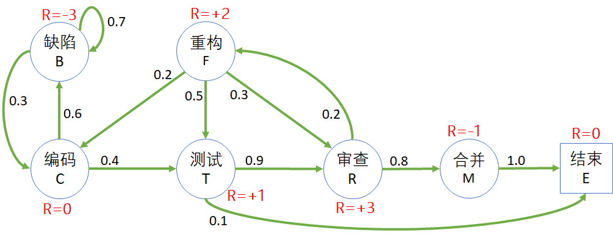

## 代码生命周期问题 - 贝尔曼方程

### 1 提出问题

在解决安全驾驶问题的过程中，我们学习了马尔可夫奖励过程、状态价值函数、蒙特卡洛采样法等强化学习的重要概念。蒙特卡洛法虽然是一种科学的方法，但是需要大量的采样才能得到**比较理想的结果**，并不能说是**准确的结果**。

蒙特卡洛法是针对**无模型**强化学习问题的，对于**有模型**的问题，我们有什么更好的方法可以解决吗？

在本节中，我们以代码的生命周期问题为例，通过描述开发过程（编码、测试、审查、合并等）的状态/过程，来寻找用于分析解决有模型问题的**更好的办法**，而不是一味地使用蒙特卡洛方法依靠大数定理来计算状态价值函数。

### 2 建立模型

图 1 是一个有关代码生命周期的马尔可夫链，也可以叫做状态转移图，并且给每个状态都赋予了一个即时奖励值。在这里使用了**注重结果**的奖励方式，即只给状态定义奖励，在图 1 中用红色文字表示。

奖励值的确定方案有很多，在此我们采用了面向代码质量的指导思想给各个状态定义不同的值，对代码质量有损害的为负值，反之为正值。

图 1 代码生命周期问题的状态转移概率图

状态的说明已经奖励函数的定义：

- C：编码 Coding

  开发人员写代码的状态，全神贯注，废寝忘食。在此状态下无法确定代码质量，所以 $R=0$。

  - 有 0.6 的概率产生 bug，需要修复。
  - 另外 0.4 的概率进入审查状态。

- B：缺陷 Bug

  在单元测试过程中发现 Bug，如果不妥善解决会对代码质量有很大影响，所以 $R=-3$。

  - 有 0.7 的概率越改越糟糕。
  - 有 0.3 的概率很快就改好了。

- T：测试 Testing

  这里的测试是指 CI pipeline 测试，代码 check in 后自动执行，通过后方可进入下一阶段，严格把关，所以 $R=+1$。

  - 有 0.9 的概率进入代码复审状态。
  - 有 0.1 的概率，写了100行代码，测试出200多个错误，代码质量根本不行，直接扔掉，进入结束状态。

- R：审查 Review

  由小组中其他人做代码审查，可以帮助提高代码质量，所以 $R=+3$。

  - 有 0.8 的概率通过了审查，进入签入状态。
  - 有 0.2 的概率决定重构代码。

- F：重构 Refactor
  
  在审查过程中发现代码设计上的一些缺陷，所以需要在现有的基础上重构代码，对将来的可维护性、可扩展性等等有很大帮助，所以 $R=+2$。

  - 有 0.2 的概率需要补充新代码。
  - 有 0.5 的概率进入测试状态。
  - 有 0.3 的概率进入代码复审状态。

- M：合并 Merge
  
  代码合并到 main branch，然后结束。合并的过程实际上是有风险的，它有可能给集成测试带来新的问题，所以 $R=-1$。

- E：结束 End
  
  结束本次代码的生命周期。进入此状态后将不再进行转移，或者是说以 100% 的概率转移到自己，叫做结束状态或者吸收状态，$R=0$，吸收状态总是把奖励值设置为 0。

表 1 中列出了状态转移矩阵，与租车问题中的矩阵形式相同。

表 1 状态转移矩阵

|P: 从$\rightarrow$到|缺陷|编码|测试|审查|重构|合并|结束|
|:-:|:-:|:-:|:-:|:-:|:-:|:-:|:-:|:-:|
|**缺陷**|0.7|0.3|-|-|-|-|-|
|**编码**|0.6|-|0.4|-|-|-|-|
|**测试**|-|-|-|0.9|-|-|0.1|
|**审查**|-|-|-|-|0.2|0.8|-|
|**重构**|-|0.2|0.5|0.3|-|-|-|
|**合并**|-|-|-|-|-|-|1.0|
|**结束**|-|-|-|-|-|-|1.0|

有的读者可能有个疑问：在修复代码缺陷的状态，刚开始时有可能是越改越遭，有 0.7 的概率转回到自身，但是后来应该会大概率向好的方向转移，不应该只有 0.3 的概率。

这是一个简单的平稳环境的马尔科夫链，如果考虑更复杂的情况，可以在该状态下增加一个计数器：
- 如果在缺陷状态超过 1 天，则有 0.5 的概率回到正常编码状态；
- 如果没超过 1 天，则有 0.7 的概率回到自身。

需要再次说明的是，在图 1 中，我们使用了**注重结果**的奖励定义方式，直接给每个状态赋值一个奖励，意味只要达到这个状态，就可以立刻获得标注出的奖励值，而不管是从哪条路径达到的。

