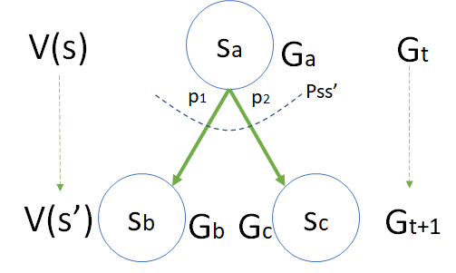

## 贝尔曼方程 Bellman Equation

### 对状态价值函数的进一步分解

前面已经学习了状态价值函数的定义，其公式为：

$$
\begin{aligned}
V(s) &= \mathbb E [G_t | S_t = s]
\\
&=\mathbb E [ R_{t+1}+\gamma R_{t+2}+\gamma^2 R_{t+3}+ \gamma^3 R_{t+4}+ \cdots]
\end{aligned}
\tag{1}
$$

由于

$$
\begin{aligned}
G_t &= R_{t+1}+\gamma R_{t+2}+ \gamma^2 R_{t+3} + \gamma^3 R_{t+4} + \cdots
\\
G_{t+1} &= R_{t+2}+ \gamma R_{t+3}+ \gamma^2 R_{t+4} + \cdots
\end{aligned}
\tag{2}
$$

结合式 1,2，可以做进一步的分解和推导：

$$
\begin{aligned}
V(s)&=\mathbb E [G_t|S_t=s]
\\
&=\mathbb E[R_{t+1}+\gamma R_{t+2}+\gamma^2 R_{t+3}+ \gamma^3 R_{t+4}+\cdots|S_t=s]
\\
&=\mathbb E[R_{t+1}+\gamma (R_{t+2}+\gamma R_{t+3}+ \gamma^2 R_{t+4}+\cdots)|S_t=s]
\\
&=\mathbb E[(R_{t+1}+\gamma G_{t+1})|S_t=s]
\\
&= \underbrace{ \mathbb E[R_{t+1}|S_t=s]}_A + \gamma \underbrace{\mathbb E[G_{t+1}|S_t=s]}_B
\end{aligned}
\tag{3}
$$

到了这一步，把 $V(s)$ 分成了 $A,B$ 两部分，下面分析一下这两部分如何分别得到。

### $A$ 部分：关于 $R_{t+1}$ 的数学期望

图 2 关于 $R_{t+1}$ 的数学期望

#### 状态集定义

大写的 $S_t,S_{t+1}$，表示当前状态 $t$ 和下一个状态 $t+1$ 的**状态变量**，在不同的马尔可夫过程中会有不同的实例，所以只是一种通用表达方式，并不知道具体是哪个状态。

小写的 $s,s'$，表示具体的**状态实例**，具体到图 2 中：

$$
s = [s_a], \quad s' = [s_b,s_c]
$$

#### 转移概率定义

$P_{ss'}$ 是状态转移概率的集合，即转移矩阵。在图 2 中从 $s_a$ 出发有两个转移方向，分别是 $s_b,s_c$，对应的概率是 $p_1,p_2$，并且 $p_1+p_2=1$。

$$P_{ss'}=[p_1,p_2]$$

#### 奖励函数定义

在图 2 中，$R_{t+1}$ 指的是到达状态 $s_a$ 后可以得到的奖励 $R(s_a)$，可以看作是 $s_a$ 的函数。

在使用**注重过程**的奖励函数定义方式时，从$s_a$ 转移到 $s_b$ **或** $s_c$，分别可以得到 $r_1,r_2$ 的奖励，但不能同时得到。

$$
R_{ss'}=[r_1,r_2]
$$

图 2 中从 $s_a$ 出发并不能确定具体转移到哪个状态，所以也无法确定得到的奖励 $R_{t+1}$ 是 $r_1$ 还是 $r_2$。但是幸好有转移概率 $P_{ss'}$ 存在，给了我们一个机会，可以通过数学期望（带权重的平均值）来定义 $R(s_a)$：

$$R(s_a)=\mathbb E[R_{t+1}|S_t=s_a] = \underbrace {p_1 \cdot r_1}_{S_{t+1}=s_b} + \underbrace{p_2 \cdot r_2}_{S_{t+1}=s_c} = \sum P_{ss'} R_{ss'} \tag{4}$$

*注：式 4 实际上统一了**注重过程**的奖励方式和**注重结果**的奖励方式，把过程的期望看作是结果。这一点很重要，希望读者牢记，避免在以后的学习中遇到概念上的疑问。*

#### 结论

式 3 的 $A$ 部分可以定义为 $R(s)$：

$$
\begin{aligned}
R(s) & = \mathbb E[R_{t+1}|S_t=s]
\\
({\footnotesize 根据图2实例化}\ s \to s_a) &= \mathbb E[R_{t+1}|S_t=s_a]
\\
({\footnotesize 式4})&= p_1 \cdot  r_1+p_2 \cdot r_2 
\\
({\footnotesize 抽象化\ p,r}) &=\sum_{s'} P_{ss'} \cdot R_{ss'}
\end{aligned}
\tag{5}
$$

### $B$ 部分：关于 $G_{t+1}$ 的数学期望

图 3 关于 $G_{t+1}$ 的数学期望

#### 回报的定义

具体到图 3 中，回报 $G$ 在不同时刻的取值为：

$$
G_t=[G_a],\quad G_{t+1}=[G_b,G_c]
$$

和 $A$ 部分中遇到的问题一样：当 $S_t=s$ 时，即在 $s_a$ 状态下，只能确定 $G_{t}=G_a$，不能确定$G_{t+1}$ 是 $G_b,G_c$ 的哪一个，因为不知道下一步会转移到哪个状态，是 $s_b$ 还是 $s_c$？

但是，由于 $P_{ss'}$ 的存在，我们仍然可以用数学期望的方式

$$
G_{t+1}=\mathbb E\big[[G_b,G_c]|S_{t+1}=[s_b,s_c]\big]= \underbrace{p_1 \cdot G_b}_{S_{t+1}=s_b} + \underbrace {p_2 \cdot G_c}_{S_{t+1}=s_c} \tag{6}
$$

#### 价值函数定义

首先要注意的一个问题是，$B$ 部分不等于 $V(s')$，因为按式 1 的定义：

$$
V(s) = \mathbb E [G_t | S_t = s]
$$

则有：

$$
V(s') = \mathbb E [G_{t+1} | S_t = s']\ne \mathbb E[G_{t+1}|S_t=s]
$$

具体到图 3 中，状态 $s_a, s_b, s_c$ 的价值函数的实例化表示：

$$
\begin{aligned}
V(s_a)&=\mathbb E [G_a|S_t=s_a] 
\\
V(s_b)&=\mathbb E [G_b|S_{t+1}=s_b] 
\\
V(s_c)&=\mathbb E [G_c|S_{t+1}=s_c]
\end{aligned}
\tag{7}
$$

不同时刻状态的价值函数的取值范围是：

$$
V(s)=[V(s_a)], \quad V(s')=[V(s_b),V(s_c)]
$$

#### 结论

$$
\begin{aligned}
B&=\mathbb E\big[G_{t+1}|S_t=s \big ] 
\\
({\footnotesize 实例化})&=\mathbb E\big[G_{t+1}|S_t=s_a \big ] 
\\
({\footnotesize 带入式\ 6})&= \mathbb E\big[(p_1 \cdot G_{b}|S_{t+1}=s_b) + (p_2\cdot G_{c}|S_{t+1}=s_c)\big|S_t=s_a]
\\
({\footnotesize 期望加法变换})&=\mathbb E\big[p_1\cdot G_{b}|S_{t+1}=s_b,S_t=s_a]+\mathbb E[p_2\cdot G_{c}|S_{t+1}=s_c,S_t=s_a\big]
\\
({\footnotesize 马尔可夫性质})&=\mathbb E\big[p_1\cdot G_{b}|S_{t+1}=s_b]+\mathbb E[p_2\cdot G_{c}|S_{t+1}=s_c\big]
\\
({\footnotesize 提出常数}\ p_1,p_2)&=p_1 \cdot \mathbb E[G_{b}|S_{t+1}=s_b]+ p_2 \cdot \mathbb E[G_{c}|S_{t+1}=s_c]
\\
({\footnotesize 带入式\ 7})&= p_1 \cdot V(s_b) + p_2 \cdot V(s_c)
\\
({\footnotesize 抽象化\ p,V})&= \sum_{s'} P_{ss'}V(s')
\end{aligned}
\tag{8}
$$

### 价值函数

所以式 3 最终为：

$$
\begin{aligned}
V(s) &= \mathbb E[R_{t+1}|S_t=s] + \gamma \mathbb E[G_{t+1}|S_t=s]
\\
{\footnotesize (带入式\ 4,8)}&=\sum_{s'} P_{ss'} R_{ss}+ \gamma \sum_{s'} P_{ss'}V(s') & (9.1)
\\
&= R(s)+ \gamma \sum_{s'} P_{ss'}V(s') &(9.2)
\\
&=\sum_{s'} P_{ss'} [R_{ss'}+\gamma V(s')] &(9.3)
\end{aligned}
\tag{9}
$$

- 在**针对状态定义奖励函数**的问题中，使用式 9.2 比较方便，因为 $R(s)$ 是直接定义在状态 $s$ 上。这是 David Silver 课件中的写法。

- 在**针对过程定义奖励函数**的问题中，使用式 9.3 比较方便，因为 $R(s,s')$ 是定义在从 $s\to s'$ 的转移过程上。这是 Richard S. Sutton and Andrew G. Barto 书中的写法，但不完全相同，我们后面再讲。

如果针对图 1，状态 $s_a$ 的价值函数实例计算公式为：

$$
\begin{aligned}
V(s_a)&=(p_1 \cdot r_1 + p_2 \cdot r_2) + \gamma[p_1 \cdot V(s_b) + p_2 \cdot V(s_c)]
\\
&=R(s)+\gamma[p_1 \cdot V(s_b) + p_2 \cdot V(s_c)]
\end{aligned}
$$

也就是说，一个状态 $s$ 的价值函数 $V(s)$ 由它的下游状态（可能不止一个）$s'$ 的价值函数 $V(s')$ 和转移概率 $P_{ss'}$ 以及转移过程中的奖励 $R_{ss'}$ 构成。
