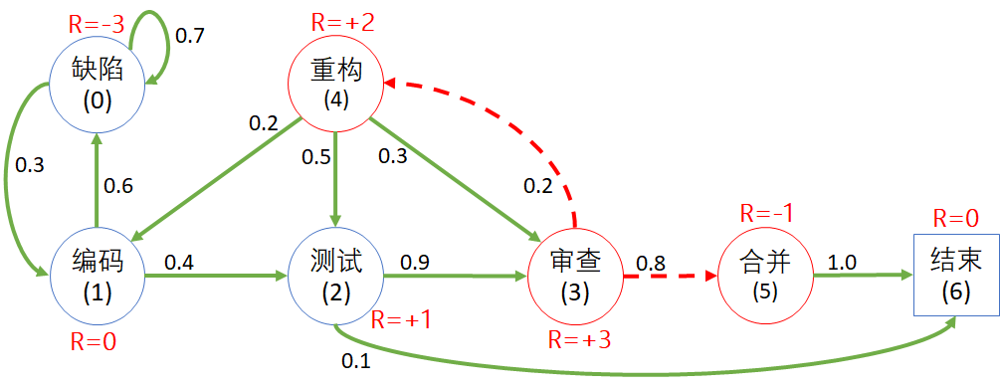
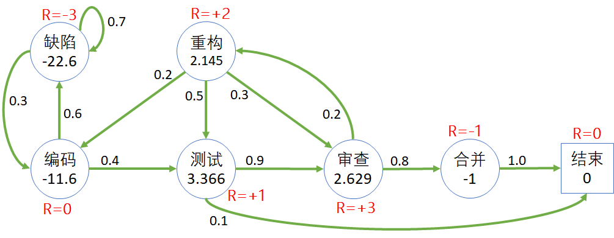
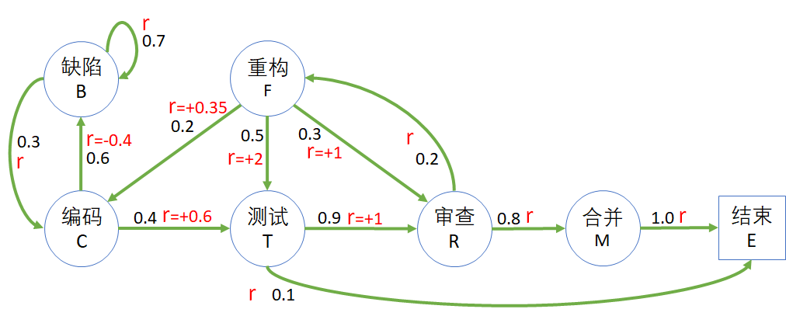

## 手工验算

下面我们来一起解决一下代码生命周期问题。

图 2

图 2 中，每个状态下方都用括号表示了该状态的序号，比如 编码 (1) 表示状态 1，价值函数值用 $v_1$ 表示。

以状态 复审状态 (3) 为例，根据式 9.3，可以得到其价值函数为：

$$
\begin{aligned}
v_3&=R(s_3)+\gamma[P_{s_3,s_4} \cdot V(s_4) + P_{s_3,s_5} \cdot V(s_5)]
\\
&=3+ (0.2 v_4 + 0.8 v_5), 
\end{aligned}
$$

为简化起见，令 $\gamma=1$，不影响对计算过程的说明。

同理可以得到其它所有状态的价值函数表达式，列出方程组如下：

$$
\begin{cases}
v_0=(-3)+0.7v_0+0.3v_1 & (10.1)
\\
v_1=(0)+0.6v_0+0.4v_2 & (10.2)
\\
v_2=(+1)+0.9v_3+0.1v_6 & (10.3)
\\
v_3=(+3)+0.2v_4+0.8v_5 & (10.4)
\\
v_4=(+2)+0.2v_1+0.5v_2+0.3v_3 & (10.6)
\\
v_5=(-1)+v_6 & (10.5)
\\
v_6=0 & (10.7)
\end{cases}
\tag{10}
$$

这是一个七元一次方程组，肯定有解。先简化式 10 中的各项，得到新的表达式：

$$
\begin{cases}
v_0=v_1-10 & (11.1)
\\
v_1=0.6v_0+0.4v_2 & (11.2)
\\
v_2=0.9v_3+1 & (11.3)
\\
v_3=0.2v_4+2.2 & (11.4)
\\
v_4=0.2v_1+0.5v_2+0.3v_3+2 & (11.6)
\\
v_5=-1 & (11.5)
\\
v_6=0 & (11.7)
\end{cases}
\tag{11}
$$

将 $(11.1)(11.2)(11.3)(11.4)$ 都变成 $v_3$ 的表达式，带入$(11.6)$ 的两侧，可以得到：

$$
5v_3-11=0.2(0.9v_3-14)+0.5(0.9v_3+1)+0.3v_3+2
$$

得到：$v_3 \approx 2.629$

所以，最终的结果为：

$$
\begin{cases}
v_0 \approx -22.634
\\
v_1 \approx -11.634
\\
v_2 \approx 3.366
\\
v_3 \approx 2.629
\\
v_4 \approx 2.145
\\
v_5=-1
\\
v_6=0
\end{cases}
\tag{12}
$$

读者可以用式 12 的结果验证式 10 中的任意等式。

图 3 价值函数计算结果

### 给过程定义奖励

在图 x 中，是通过给状态定义奖励来得到 $R(s)$ 值的，直接使用贝尔曼方程的第 2 种形式即可。

前面我们学习过，有的问题是注重状态，有的问题是注重过程。如果遇到的问题是给过程定义奖励，应该如何解决？很简单，使用贝尔曼方程的第 1 种形式即可。

如图 3 所示

图 2

举例，编码状态 C 的下游状态是 缺陷 B 和 测试 T，转移概率 $p_{ss'}$ 分别是 0.6, 0.4，

$$
\begin{aligned}
R(C) &= p_{C,T} r_{C,T} + p_{C,B} r_{C,B}
\\
&=0.4 \times 0.6 + 0.6 \times (-0.4)
\\
&=0
\end{aligned}
$$

$$
\begin{aligned}
R(F) &= p_{F,C} r_{F,C} + p_{F,T} r_{F,T} + p_{F,R} r_{F,R}
\\
&=0.2 \times 0.35 + 0.5 \times 2 + 0.3 \times 1
\\
&=2
\end{aligned}
$$

然后再列方程组即可的解。
