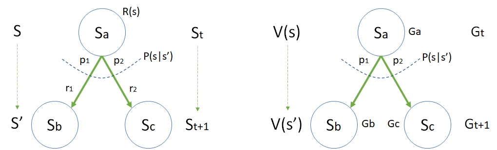

贝尔曼方程

图 5 贝尔曼公式推导
（左图：在从 $sp_a$ 状态得到 $R(s)$ 的表达式。右图：在$s_a$状态得到 $\mathbb E [G_{t+1}|s_t=s_a]$ 的表达式。）

由
$$
V(s)=\mathbb E [G_t|s_t=s]
$$
的定义，可以得到实例化的表示
$$
V(s_a)=\mathbb E [G_a|s=s_a]
\\
V(s_b)=\mathbb E [G_b|s=s_b]
\\
V(s_c)=\mathbb E [G_c|s=s_c]
$$

$$
p_1 = p(s_b|s_a)=P(s'|s), \ (s=s_a,s'=s_b)
\\
p_2 = p(s_c|s_a)=P(s'|s), \ (s=s_a,s'=s_c)
\\
r_1 = r(s_a,s_b)=R(s,s')
\\
r_2 = r(s_a,s_c)=R(s,s')
\\
s_a \in s, \ (s_b,s_c) \in s'
$$

推导

$$
\begin{aligned}
V(s)&=\mathbb E [G_t|s_t=s]
\\
&=\mathbb E[R_{t+1}+\gamma R_{t+2}+\gamma^2 R_{t+3}+\cdots|s_t=s]
\\
&=\mathbb E[R_{t+1}+\gamma (R_{t+2}+\gamma R_{t+3}+\cdots)|s_t=s]
\\
&=\mathbb E[R_{t+1}+\gamma G_{t+1}|s_t=s]
\\
&= \mathbb E[R_{t+1}|s_t=s] + \mathbb E[\gamma G_{t+1}|s_t=s]
\\
&= R(s) + \mathbb \gamma E[G_{t+1}|s_t=s]
\end{aligned}
$$

$$
\begin{aligned}
R(s) & = \mathbb E[R_{t+1}|s_t=s]
\\
&= p_1 r_1+p_2 r_2=p(s_b|s_a)r(s_a,s_b)+p(s_c|s_a)r(s_a,s_c)
\\
&=\sum_{s'} P(s'|s)R(s,s')
\end{aligned}
$$

在 $s_a$状态下，只能确定 $G_{t}=G_a$，不能确定$G_{t+1}$，因为不知道会下一步会转移到哪个状态，是 $s_b$ 还是 $s_c$？所以，在 $s_a$ 状态时，$G_{t+1}$ 只能用转移概率（即 $p_1,p_2$）与目标状态的 $G$（即 $G_a,G_b$）的乘积来表示：

$$
G_{t+1} = (p_1 G_b|s=s_b) + (p_2 G_c|s=s_c), \quad s=s_a
$$

而且一旦从 $s_a$ 转移到 $s_b,s_c$，由马尔可夫性质，条件 $s=s_a$ 就可以替换成 $s=s_b$ 或 $s=s_c$。

$$
\begin{aligned}
\mathbb E[G_{t+1}|s_a] &= \mathbb E[[(p_1 G_{b}|s=s_b) + (p_2 G_{c}|s=s_c)]]
\\
&=\mathbb E[(p_1 G_{b}|s=s_b)]+\mathbb E[(p_2 G_{c}|s=s_c)]
\\
&=p_1 \mathbb E[G_{b}|s=s_b]+ p_2 \mathbb E[G_{c}|s=s_c]
\\
&= p(s_b|s_a) V(s_b) + p(s_c|s_a) V(s_c)
\\
&= \sum_{s'} P(s'|s)V(s')
\end{aligned}
$$

Bellman Equation for MRP

图 5

$$
\begin{cases}
v_0=-1+0.9v_0+0.1v_1 & (1.1)
\\
v_1=-2+0.5v_0+0.5v_2 & (1.2)
\\
v_2=-2+0.8v_3+0.2v_6 & (1.3)
\\
v_3=-2+0.6v_4+0.4v_5 & (1.4)
\\
v_4=10+v_6 & (1.5)
\\
v_5=1+0.2v_1+0.4v_2+0.4v_3 & (1.6)
\\
v_6=0 & (1.7)
\end{cases}
\tag{1}
$$

这是一个七元一次方程组，肯定有解。先简化式 1 中的各项，得到新的表达式：

$$
\begin{cases}
v_0=v_1-10 & (2.1)
\\
v_1=-2+0.5v_0+0.5v_2 & (2.2)
\\
v_2=0.8v_3-2 & (2.3)
\\
v_3=0.4v_5+4 & (2.4)
\\
v_4=10 & (2.5)
\\
v_5=1+0.2v_1+0.4v_2+0.4v_3 & (2.6)
\\
v_6=0 & (2.7)
\end{cases}
\tag{2}
$$

将 $(2.1)(2.2)(2.3)(2.4)$ 都变成 $v_3$ 的表达式，带入$(2.6)$ 的两侧，可以得到：

$$
2.5v_3-10=1+0.2(0.8v_3-16)+0.4(0.8v_3-2)+0.4v_3
$$

得到：$v_3=4.321$

所以，最终的结果为：

$$
\begin{cases}
v_0=-22.543 \approx -22.5
\\
v_1=-12.543 \approx -12.5
\\
v_2=1.457 \approx 1.5
\\
v_3=4.321 \approx 4.3
\\
v_4=10
\\
v_5=0.803 \approx 0.8
\\
v_6=0
\end{cases}
$$

