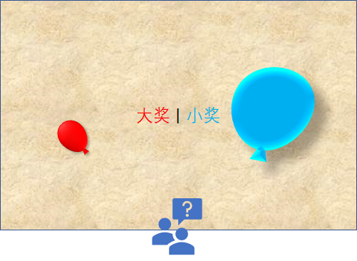
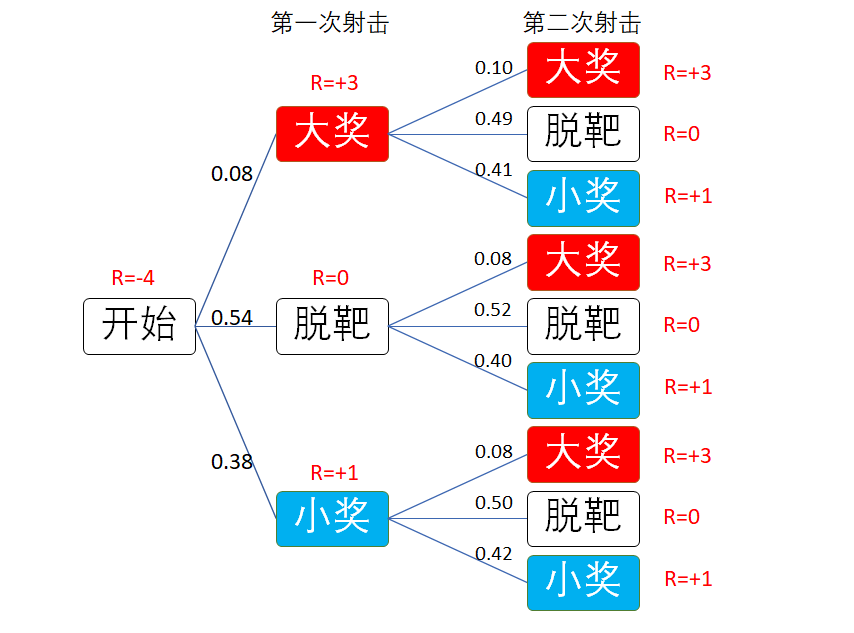
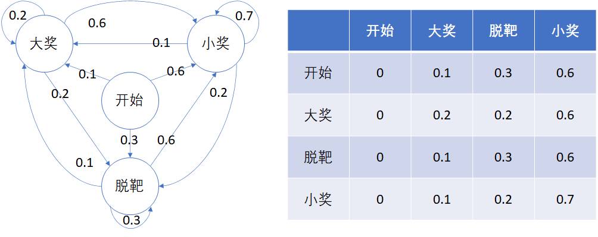
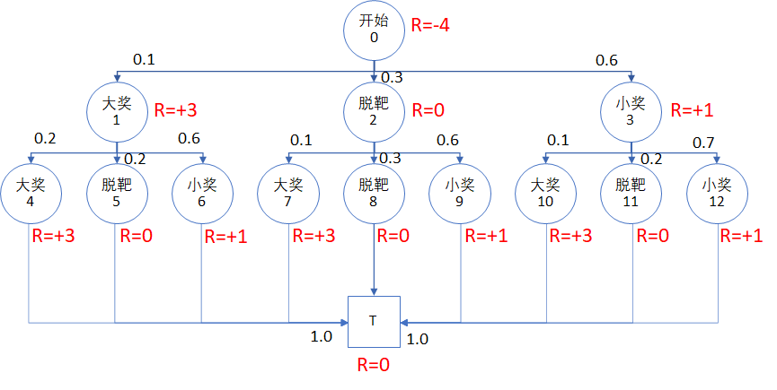
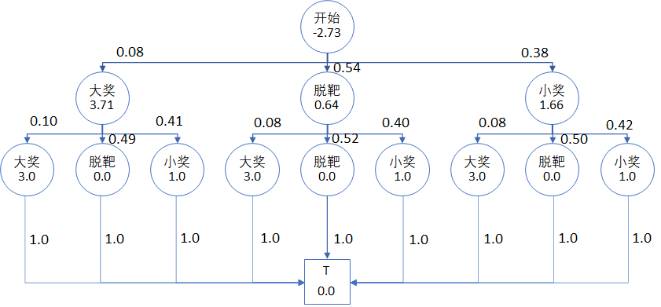
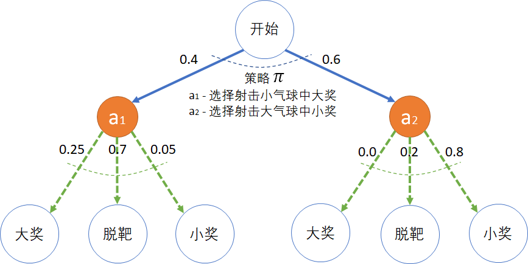
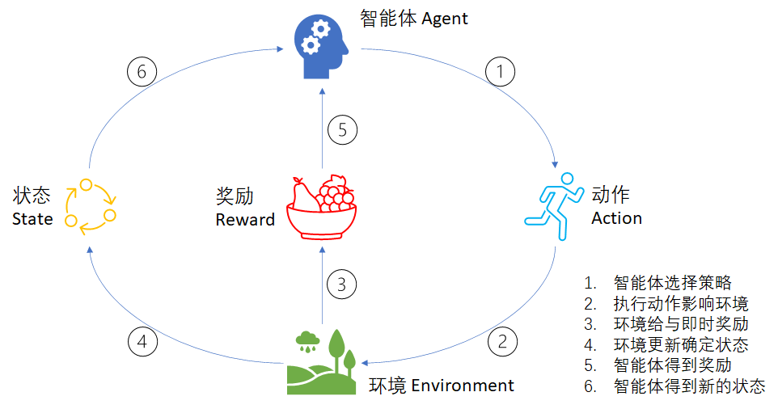
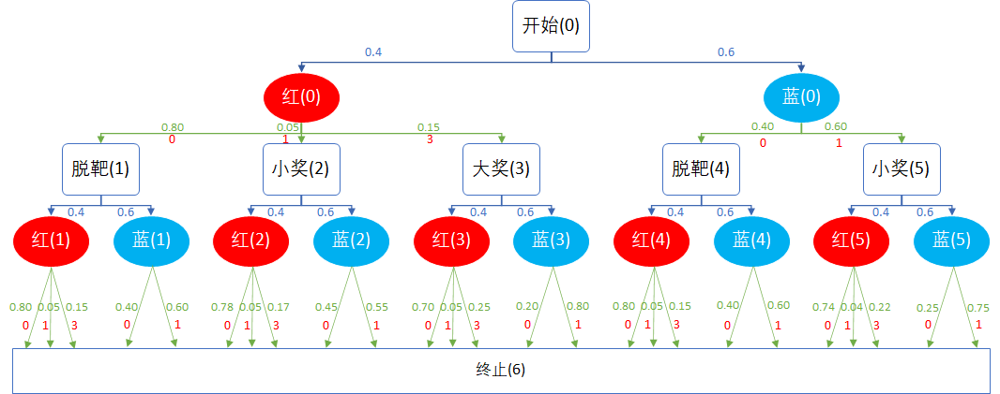

## 马尔可夫决策过程

### 射击气球问题

我们仍然以前面学过的、熟悉的状态转移问题来开始本章的学习。

在游乐场，有一个射击中奖的游戏规则是这样的：

图 1

1. 游客花 4 元钱买 2 颗橡皮子弹，得到两次射击机会；
2. 墙上有两个气球，一个蓝色大气球，一个红色小气球，每次射击游客可以任意选择目标；
3. 击中蓝色大气球可以得到小奖，价值 1 元；
4. 击中红色小气球可以得到大奖，价值 3 元。

游乐场老板的经过几个月的营业后进行了统计，结果如图 1 所示。

图 1 游客中奖情况统计

1. 游客在第一次射击时：

    - 中大奖的概率是 0.08
    - 脱靶的概率是 0.54
    - 中小奖的概率是 0.38

2. 第二次射击根据第一次射击的结果而有所不同：

    比如，如果第一次射击中大奖，则：
    - 第二次射击继续中大奖的概率是 0.10，比初始的 0.08 提高了一些，因为游客有经验了；
    - 第二次射击脱靶的概率是 0.49，比初始的 0.54 要低；
    - 第二次射击中小奖的概率是 0.41，比第一次的 0.38 要高，也是因为有了一定的经验而提高了命中率。
    
    其它统计数字在图 1 中显示，不再赘述。

那么一个聪明的游客该如何选择呢？

利用前面学到过的知识，可以计算第一次射击时的三个状态，哪一个的状态价值函数值最大。于是有些读者前面的学习基础很牢靠，可以立刻画出如图 2 的状态转移图和转移概率表。

图 2 错误的状态转移图

其实这个问题的状态转移图应该如图 3 所示，是一个有向无环图。图中：
- 圆圈内的数值是该状态的序号。
- 连线上的数值是状态转移概率。
- 红色的 $R$ 是面向结果的奖励值。

图 3 正确的的状态转移图

说明

1. 虽然状态中有四个“大奖”，四个“小奖”，四个“脱靶”，但是这四个状态不是同一个状态，只是名字一样而已，在图 3 中特意用序号把它们都区分开了。其中：
    - 0 号为开始状态；
    - 1~3 号为二级状态；
    - 4~12 号为三级状态。
2. 开始状态需要有个 -4 的奖励，因为一开始游客是花 4 元钱买了两颗橡皮子弹。
3. 所有的三级状态（序号4~12），最后都接一个终止状态 T。
4. 奖励是定义在状态上的，在绘图时故意让字母 $R$ 与状态区域重合，以强调这一点。

为什么四个“大奖”不是一个状态呢？

从“开始”状态看，第一次射击有 0.1 的概率到达 1 号“大奖”状态；而第二次射击有 0.2 的概率到达 4 号“大奖”状态。如果游客还有第三发子弹，那么中大奖的概率在第三轮还会提高。就好比从一楼上 10 级台阶到二楼，台阶可以定义为 1 到 10；而二楼到三楼同样有 10 级台阶，也定义为 1 到 10，但所处的楼层不一样。

我们从后向前计算一下各个状态的价值函数，由于是个有向无环的图，所以根据式 xxx 很简单就可以得到（本例中折扣应该为 1）：

首先，终止状态 $v_T = 0$。

然后 $v_4$ 为例：$v_4 = R_4 + \gamma 1.0 \times V_T = 3+1\times0=3$。其它三级状态的计算方法相同，得到三级状态的值后，就可以向上继续计算二级状态的价值函数，最后得到开始状态的价值函数。

$$
\begin{cases}
v_T=0
\\
v_4=3, v_5 = 0, v_6 = 1, 
\\
v_7=3, v_8=0, v_9=1,
\\
v_{10}=3, v_{11}=0, v_{12}=1,
\\
v_1 = 3 + 0.10v_4+0.49v_5+0.41v_6=3.71
\\
v_2 = 0 + 0.08v_7+0.52v_8+0.40v_9=0.64
\\
v_3 = 1 + 0.08v_{10}+0.50v_{11}+0.42v_{12}=1.66
\\
v_0 = -4 + 0.08v_1+0.54v_2+0.38v_3 = -2.7268
\end{cases}
$$

最终的状态价值函数结果标在图 5 中。图中：
- 圆圈内的数值是马尔可夫奖励过程的状态价值函数。
- 连线上的数值是状态转移概率。

图 4 正确的的状态转移图

所以，从统计学的观点看，$s_0$ 的状态函数值 $v_0$ 告诉我们只要游客买了子弹，就已经亏了，老板是稳赚不赔的。当然不排除个别游客（射击能手）连续两次击中大奖。一般人都会高估自己（哈哈，科学的说法是：不能正确地评估自己），一些游客会因为想到最大值为 3+3=6 的奖励而参与，一些游客只是因为没有打过枪而参与。

那么游客应该怎么选择呢？

- 虽然 $v_{1}=3.71$ 状态价值最高，但是到达 $s_1$ 只有 0.08 的概率，可以理解为游客的预期收益是：$0.08 \times 3.71 = 0.2968$ 元。
- $s_2$ 的预期收益是 $0.54 \times 0.64 = 0.3456$ 元。
- $s_3$ 的预期收益是 $0.38 \times 1.66 = 0.6308$ 元。

所以游客第一次射击时应该选择 $s_3$，即“小奖”状态，然后第二次射击时继续选择“小奖”状态。这样虽然肯定不能赢回开始花的 4 元钱，但是可以做到损失最小（或者收益最大）。

上面三个预期收入值相加为 1.2732 元，正好等于游客开始花的 4 元再加上 $v_0$ 的值，即 4-2.7268=1.2732，这也是 $v_0$ 的表达式告诉我们的。

### 改进 引入动作/策略

仔细想一想，其实上面的解题过程是有问题的：

1. 原问题是“聪明的游客会如何选择？”，但是整个解题思路是根据游乐场老板的统计结果进行的，是从老板的角度出发，而非游客的角度。
2. 在一级的三个状态中（大奖，小奖，脱靶），它只代表“结果”，而不代表“选择”，较真儿地说，没有游客会选择“脱靶”状态，因为“脱靶”只是个结果。
3. 忽略前面两个疑问，最后得到了 $v_1,v_2,v_3$ 的值，游客会看到 $v_1$ 最大，所以会误导其选择大奖而射击小气球，但是忽略了击中的难度。现实生活中人们往往也有类似的经历，想利益最大化，却忽略了风险。

实际上，老板并不知道游客选择的是哪个气球，他只看到了最终的结果。游客自己也不会主动说我要射击哪一个气球，只不过心里有数罢了。

经过对游客的调查与过程观察，以及与老板的访谈，我们得到了一些更细化的统计数据，如图 4 所示。

图 4 正确的的状态转移图

1. 在开始状态时，游客的**策略**选择可以有两个：
    - $a_1$ - 选择射击小气球而中大奖，大概有 40% 的人选择，记为 $\pi_1=0.4$。
    - $a_2$ - 选择射击大气球而中小奖，大概有 60% 的人选择，记为 $\pi_2=0.6$。

2. 执行**动作** $a_1$，在射击红色小气球时，有可能的**过程**及**结果**是：
    - 因为气球比较小，不容易击中，只有 0.20 的概率打中，得**大奖**，记为 $p_{11}=0.20$；
    - 却有 0.75 的概率**脱靶**，记为 $p_{12}=0.75$；
    - 还有 0.05 的概率歪打正着地击中大气球而得**小奖**，记为 $p_{13}=0.05$。

3. 选择**动作** $a_2$，在射击大气球时，有可能的**过程**及**结果**是：
    - 因为气球比较大，容易击中，有 0.6 的概率击中，得**小奖**，记为 $p_{23}=0.6$；
    - 有 0.4 的概率**脱靶**，记为 $p_{22}=0.4$；
    - 没有任何运气可以击中小气球，记为 $p_{21}=0.0$。
        - 这种情况在实际解题时可以不必画出来，在这里画出来是为了把细节讲清楚，避免误解。

请读者注意在 $a_2$ 部分下的 [0.4,0.6] 是状态转移概率，与开始状态 $s$ 下的策略选择概率 [0.4,0.6] 只是在数值上恰巧相同，含义完全不同。

现在可以统计一下各种中奖的情况：

- 中大奖的概率是两种情况之和：
    1. 选择射击红色小气球，击中， $\pi_1 p_{11}= 0.4 \times 0.2 = 0.08$
    2. 选择射击蓝色大气球，击中， $\pi_2 p_{21}= 0.6 \times 0.0 = 0.00$
    
    和为 $0.08+0.00=0.08$

- 脱靶的概率是两种情况之和：
    1. 选择射击小气球，脱靶， $\pi_1 p_{12}= 0.4 \times 0.75 = 0.30$
    2. 选择射击大气球，脱靶， $\pi_2 p_{22}= 0.6 \times 0.4 = 0.24$
    
    和为 $0.30+0.24=0.54$

- 中小奖的概率是两种情况之和：
    1. 选择射击蓝色大气球，击中，$\pi_2 p_{23}= 0.6 \times 0.6 = 0.36$
    2. 选择射击红色小气球，但却误中蓝色大气球，$\pi_1 p_{13}= 0.4 \times 0.05 = 0.02$
    
    和为 $0.36+0.02=0.38$

所以这个结果 [0.08, 0.54, 0.38] 和老板在图 shoot-1 中统计的第一次射击的结果是一致的。

### 强化学习

图 4 正确的的状态转移图

回顾一下人们所了解的所有智能生物的行为，都是根据当前环境情况先做出决策，选择动作，然后得到结果与奖励。
- 这里的决策就是图 4 中的 $\pi$，可以是一个函数，直接输出一个选择好的动作值，红色的 $a_1$ 或蓝色的 $a_2$。
- 这里的结果就是图 4 中的状态，包括开始、中大奖、中小奖、脱靶，与**马尔可夫过程**以及**马尔可夫奖励过程**中的状态是一个概念。

**过程**如何理解呢？

最简单并且容易理解的说法是：人们做一件事，一般都会有两个结果，即成功和失败，你可以努力争取成功，但是并不能完全避免失败。这就可以叫做**转移概率**。只不过你非常努力的时候，转移到成功状态的概率较大，而转移到失败状态的概率较小。

用本例来说明的话，可以解释为：

- 游客可能第一次射击，没经验，也不懂得三点一线的瞄准方法，所以打偏；
- 枪可能准星不准，游乐场老板也不用心维护；
- 气球会在风中有微小摆动；
- 周围的环境嘈杂，游客不能击中精力射击；
......

诸如此类的环境因素会造成在选择动作后，却偏离既定目标，得到意想不到的结果。这与**马尔可夫过程以及马尔可夫奖励过程**中的状态转移概率不尽相同，而且一般也不用矩阵形式来描述。因为矩阵中的元素所处的行列数值，都代表了状态的序号，而在马尔科夫决策过程部分，没有办法把动作和状态放在一起来形成矩阵。简单地说就是动作把矩阵割裂成了很多小的部分，在每个小部分中没有环状的状态转移存在。

### 全模型

在图 4 中，我们给图 3 中的一级和二级状态之间增加了动作节点，以说明马尔可夫决策过程，并且计算出在经过策略选择和状态转移两个过程后，得到的中奖数据与老板的统计数据相同。

下面我们需要在图 3 的二级状态和三级状态之间也增加动作节点，以便可以得到该问题的全模型。

需要注意的是，在图 3 中的二级状态只有 3 个节点，而图 4 中的二级状态有 5 个有效（转移概率不为 0）节点。在统计的时候，可以把 $a_1,a_2$ 的下游状态中具有相同名称的结果相加（比如脱靶的总概率为 0.30+0.24=0.54），但实际上它们还是不同的状态，各自具备不同的价值函数，不能像图 3 那样混在一起。

经过增加新的动作节点后，形成图 5 的全模型

图 5 全模型

- 状态节点

  - 用状态名称和序号加以区分，比如“大1”和“大6”，表明它们是不同的两个状态。
  - 状态空间的值为 31，因为一共有 31 个状态。
      - 状态空间的定义是 $S$，一般说到 $s \in S$，意思是某个状态 $s$ 在 $S$ 集合中。
  - 前两级状态节点下都有两个动作选择：红色和蓝色。
  - 第三级状态节点相当于终止状态。

- 动作节点

  - 用动作名称和序号加以区分，比如“红1”和“红3”，表明它们是不同的两个动作。
  - 动作空间的值为 2，因为一共只有两个动作：选择射击红色气球或蓝色气球。
  - 射击红色气球后，有可能的状态转移有三种：大（大奖），无（脱靶），小（小奖）。
  - 射击蓝色气球后，有可能的状态转移有两种：无（脱靶），小（小奖）。
  - 读者可能会有疑问：为什么动作空间不是 12？
    - 动作空间的定义是 $A(s)$，$a \in A(s)$，举例来说，在“大1”状态，即 $s=$“大1” 时，$A$(大1) 集合中只有两个动作，红色或蓝色，而不是 12 个。

- 策略
   策略始终保持不变：0.4 的概率选择红色，0.6 的概率选择蓝色。

- 状态转移
    根据上游状态节点的不同，下游的转移概率也不尽相同。举例来说：
    - “红1”下面的转移概率是 [0.20, 0.75, 0.05]，是一个初始转移概率。
    - “红3”下面的转移概率是 [0.25, 0.70, 0.05]，因为在“红1”击中大奖后（“大1”状态），游客的经验增加，射中红色气球的概率也会增加（从初始的 0.20 到后来的 0.25），相应地脱靶概率从 0.75 降低为 0.70，而误中小奖的概率不变，保持在很小的 0.05 的概率。

下面我们验算一下老板在图 1 中关于第一次“脱靶”后第二次也“脱靶”的统计数据是否正确。
在图 5 中：
- 左侧状态“无2”下面：
$$
0.4 \times 0.75 + 0.6 \times 0.4 = 0.54
$$

- 右侧状态“无4”下面：
$$
0.4 \times 0.75 + 0.6 \times 0.35 = 0.51
$$

- “开始状态0”下面，左侧“红1”的策略选择概率是 0.4，右侧“蓝2”的策略选择概率是 0.6：
$$
0.4 \times 0.54 + 0.6 \times 0.51 = 0.522 \approx 0.52
$$

所以最后的结果是 0.52，与老板的统计值一致。只不过老板知其然不知其所以然，只看到了统计结果，没有深入到过程细节中，而这正是我们接下来要学习的问题。
