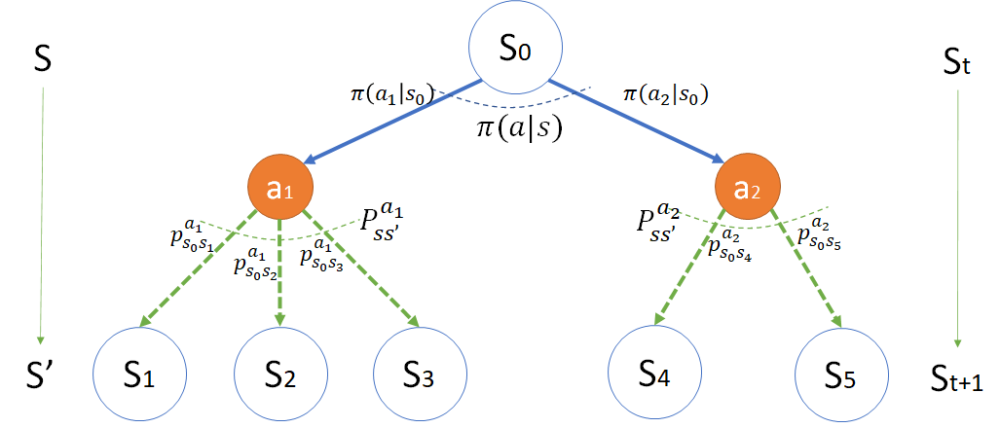
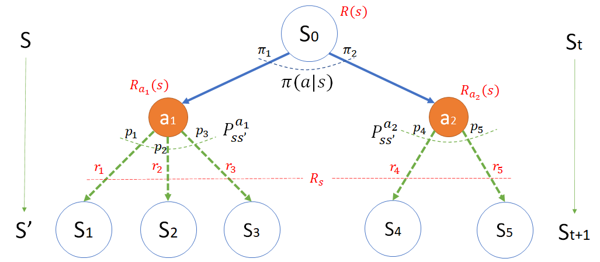

## 马尔可夫决策过程

### 射击气球问题

我们仍然以前面学过的、熟悉的状态转移问题来开始本章的学习。

在游乐场，有一个射击中奖的游戏规则是这样的：

1. 游客花 4 元钱买 2 颗橡皮子弹，得到两次射击机会；
2. 墙上有两个气球，一个蓝色大气球，一个红色小气球，游客可以任意选择目标；
3. 击中蓝色大气球可以得到小奖，价值 1 元；
4. 击中红色小气球可以得到大奖，价值 3 元。

游乐场老板的经过几个月的营业后进行了统计，结果如图 1 所示。

图 1 游客中奖情况统计

1. 游客在第一次射击时：

    - 中大奖的概率是 0.08
    - 脱靶的概率是 0.54
    - 中小奖的概率是 0.38

2. 第二次射击根据第一次射击的结果而有所不同：

    比如，如果第一次射击中大奖，则：
    - 第二次射击继续中大奖的概率是 0.10，比初始的 0.08 提高了一些，因为游客有经验了；
    - 第二次射击脱靶的概率是 0.49，比初始的 0.54 要低；
    - 第二次射击中小奖的概率是 0.41，比第一次的 0.38 要高，也是因为有了一定的经验而提高了命中率。
    
    其它统计数字在图 1 中显示，不再赘述。

那么一个聪明的游客该如何选择呢？

利用前面学到过的知识，可以计算第一次射击时的三个状态，哪一个的状态价值函数值最大。于是有些读者前面的学习基础很牢靠，可以立刻画出如图 2 的状态转移图和转移概率表。

图 2 错误的状态转移图

其实这个问题的状态转移图应该如图 3 所示，是一个有向无环图。

图 3 正确的的状态转移图

说明

1. 虽然状态中有四个“大奖”，四个“小奖”，四个“脱靶”，但是这四个状态不是同一个状态，只是名字一样而已，在图 3 中特意用序号把它们都区分开了。其中：
    - 0 号为开始状态；
    - 1~3 号为二级状态；
    - 4~12 号为三级状态。
2. 开始状态需要有个 -4 的奖励，因为一开始游客是花 4 元钱买了两颗橡皮子弹。
3. 所有的三级状态（序号4~12），最后都接一个终止状态 T。

为什么四个“大奖”不是一个状态呢？

从“开始”状态看，第一次射击有 0.1 的概率到达 1 号“大奖”状态；而第二次射击有 0.2 的概率到达 4 号“大奖”状态。如果游客还有第三发子弹，那么中大奖的概率在第三轮还会提高。就好比从一楼上 10 级台阶到二楼，台阶可以定义为 1 到 10；而二楼到三楼同样有 10 级台阶，也定义为 1 到 10，但所处的楼层不一样。

我们从后向前计算一下各个状态的价值函数，由于是个有向无环的图，所以根据式 xxx 很简单就可以得到（本例中折扣应该为 1）：

首先，终止状态 $v_T = 0$。

然后 $v_4$ 为例：$v_4 = R_4 + \gamma 1.0 \times V_T = 3+1\times0=3$。其它三级状态的计算方法相同。

$$
\begin{cases}
v_T=0
\\
v_4=3, v_5 = 0, v_6 = 1, 
\\
v_7=3, v_8=0, v_9=1,
\\
v_{10}=3, v_{11}=0, v_{12}=1,
\\
v_1 = 3 + 0.10v_4+0.49v_5+0.41v_6=3.71
\\
v_2 = 0 + 0.08v_7+0.52v_8+0.40v_9=0.64
\\
v_3 = 1 + 0.08v_{10}+0.50v_{11}+0.42v_{12}=1.66
\\
v_0 = -4 + 0.08v_1+0.54v_2+0.38v_3 \approx -2.72
\end{cases}
$$

所以，从统计学的观点看，$s_0$ 的状态函数值 $v_0$ 告诉我们只要游客买了子弹，就已经亏了，老板是稳赚不赔的。当然不排除个别游客（射击能手）连续两次击中大奖。一般人都会高估自己（哈哈，科学的说法是：不能正确地评估自己），一些游客会因为想到最大值为 3+3=6 的奖励而参与，一些游客只是因为没有打过枪而参与。

那么游客应该怎么选择呢？

- 虽然 $v_{1}=3.71$ 状态价值最高，但是到达 $s_1$ 只有 0.08 的概率，可以理解为游客的预期收益是：$0.08 \times 3.71 \approx 0.30$ 元。
- $s_2$ 的预期收益是 $0.54 \approx 0.64=0.35$ 元。
- $s_3$ 的预期收益是 $0.38 \approx 1.66=0.63$ 元。

所以游客第一次射击时应该选择 $s_3$，即“小奖”状态，然后第二次射击时继续选择“小奖”状态。这样虽然肯定不能赢回开始花的 4 元钱，但是可以做到损失最小（或者收益最大）。

上面三个预期收入值相加为 1.28 元，正好等于游客开始花的 4 元再加上 $v_0$ 的值，即 $4-2.72=1.28$。

### 改进 引入动作/策略

仔细想一想，其实上面的解题过程是有问题的：

1. 原问题是“聪明的游客会如何选择？”，但是整个解题思路是根据游乐场老板的统计结果进行的，是从老板的角度出发，而非游客的角度。
2. 在一级的三个状态中（大奖，小奖，脱靶），它只代表“结果”，而不代表“选择”，较真儿地说的话，没有游客会选择“脱靶”状态，因为“脱靶”只是个结果。
3. 忽略前面两个疑问，最后得到了 $v_1,v_2,v_3$ 的值，游客会看到 $v_1$ 最大，所以会误导其选择大奖而射击小气球，但是忽略了击中的难度。现实生活中人们往往也有类似的经历，想利益最大化，却忽略了风险。

实际上，老板并不知道游客选择的是哪个气球，他只看到了最终的结果。游客自己也不会主动说我要射击哪一个气球，只不过心里有数罢了。

经过对游客的调查与过程观察，以及与老板的访谈，我们得到了一些数据，如图 4 所示。

图 4 正确的的状态转移图

1. 在开始状态时，游客的策略（称之为 $\pi$）可以有两个：
    - $a_1$ - 选择射击小气球而中大奖，大概有 40% 的人选择。
    - $a_2$ - 选择射击大气球而中小奖，大概有 60% 的人选择。

2. 选择 $a_1$（记为 $\pi(a_1|s)$），在射击红色小气球时：
    - 只有 0.20 的概率打中，因为气球比较小，不容易击中，记为 $p_{11}=0.20$；
    - 却有 0.75 的概率脱靶，记为 $p_{12}=0.75$；
    - 还有 0.05 的概率很离谱地击中大气球而中小奖，记为 $p_{13}=0.05$。

3. 选择 $a_2$（记为 $\pi(a_2|s)$），在射击大气球时：
    - 有 0.6 的概率击中，因为气球比较大，容易击中，记为 $p_{23}=0.6$；
    - 有 0.4 的概率脱靶，记为 $p_{22}=0.4$；
    - 没有任何运气可以击中小气球，记为 $p_{21}=0.0$。
        - 这种情况在实际解题时可以不必画出来，在这里画出来是为了把细节讲清楚，避免误解。

现在可以统计一下各种情况：

- 中大奖的概率是两种情况之和：
    1. 选择射击红色小气球，击中， $\pi(a_1|s) p_{11}= 0.4 \times 0.2 = 0.08$
    2. 选择射击蓝色大气球，击中， $\pi(a_2|s) p_{21}= 0.6 \times 0.0 = 0.00$
    - 和为 $0.08+0.00=0.08$

- 脱靶的概率是两种情况之和：
    1. 选择射击小气球，脱靶， $\pi(a_1|s) p_{12}= 0.4 \times 0.75 = 0.30$
    2. 选择射击大气球，脱靶， $\pi(a_2|s) p_{22}= 0.6 \times 0.4 = 0.24$
    - 和为 $0.30+0.24=0.54$

- 中小奖的概率是两种情况之和：
    1. 选择射击蓝色大气球，击中，$\pi(a_2|s) p_{23}= 0.6 \times 0.6 = 0.36$
    2. 选择射击红色小气球，但却误伤蓝色大气球，$\pi(a_1|s) p_{13}= 0.4 \times 0.05 = 0.02$
    - 和为 $0.36+0.02=0.38$

所以这个结果和老板统计的第一次射击的结果是一致的。

仔细地想一下所有智能生物的行为，都是根据当前环境情况先做出决策，选择动作，然后得到结果与奖励。
- 这里的决策就是图 4 中的 $\pi$，可以是一个函数，直接输出一个选择好的动作值，红色的 $a_1$ 或蓝色的 $a_2$。
- 这里的结果就是图 4 中的状态，包括开始、中大奖、中小奖、脱靶，与**马尔可夫过程**以及**马尔可夫奖励过程**中的状态是一个概念。

转移概率如何理解呢？

用本例来说明的话，可以解释为：

- 游客可能第一次射击，没经验，也不懂得三点一线的瞄准方法，所以打偏；
- 枪可能准星不准，游乐场老板也不用心维护；
- 气球会在风中有微小摆动；
- 周围的环境嘈杂，游客不能击中精力射击；
......

诸如此类的环境因素会造成在选择动作后，却偏离既定目标，得到意想不到的结果。这与**马尔可夫过程以及马尔可夫奖励过程**中的状态转移概率不尽相同，而且一般也不用矩阵形式来描述。因为矩阵中的元素所处的行列数值，都代表了状态的序号，没有办法把动作和状态放在一起来形成矩阵。简单地说就是动作把矩阵割裂成了很多小的部分，在每个小部分中没有环状的状态转移存在。

### 马尔可夫决策过程 MDP

MDP - Markov Decision Process

在马尔可夫奖励过程中引入动作的概念，就形成了一个新的概念：马尔可夫决策过程。

在前面的马尔科夫**奖励**过程中，我们学习过组成其过程的是一个四元组数据 $<S,P,R,\gamma>$，分别是状态、转移概率、奖励、折扣。进一步，在马尔可夫**决策**过程中，通过上一小节中引入的新元素“动作”，可以得到一个五元组数据 $ <S,A,P,R,\gamma>$，其中 $A$ 代表动作。

请读者注意上述五元组数据序列的顺序：
1. 必须从一个状态 $S$ 开始；
2. 执行一个动作 $A$；
3. 会以概率 $P$ 转移到下一个状态 $S'$；
4. 在转移过程中得到奖励 $R$；
5. 最后计算整个序列的奖励时有折扣 $\gamma$。

#### 状态/动作模型

根据这个概念定义，绘制出图 5 的马尔可夫决策过程的模型。

图 5 马尔可夫决策过程模型

图 5 实际上是图 4 的一个抽象，去掉了与应用场景相关的表达，但又不是抽象到无法理解，所以这是一个马尔可夫决策过程的**实例化**模型。为什么叫实例化模型呢？因为图中的各个子元素都带有序号。比如：

- 状态

    用空心的圆表示，里面标出了状态序号，如 $s_0, s_1$ 等。

    两侧的 $S,S'$ 和 $S_t,S_{t+1}$，是一种概念的两种表达形式，在公式推导中，有时候会用 $S,S'$，表示当前状态和下一个状态，有时候会用 $S_t,S_{t+1}$ 来强调时序关系，本质上没有区别。

- 动作

    用实心的圆表示，里面标出了动作序号，如 $a_1,a_2$ 等。
    动作一定是源于状态、终于状态，不可能两个动作直接连接在一起。

- 策略

    用 $\pi(a|s)$ 表示在状态 $s$ 下选择动作 $a$。
    特别地，$\pi(a_1|s_1)$，表示在 $s_1$ 状态下，根据策略 $\pi$ 执行动作 $a_1$。其通用表达式为：

    $$
    \pi(a|s) = \mathbb P [A_t=a|S_t=s]
    $$

    用文字描述为：在时刻 $t$ 的状态为 $s$ 时，选择动作 $a$ 的概率，大写的 $A_t,S_t$ 表示变量，小写的 $a,s$ 表示实例数值。

- 转移概率
    每个动作下面都会存在一个转移概率，如果只有一个下游状态存在，则转移概率值为 1。

    - $p^{a_1}_{s_0s_1}$，表示在动作 $a_1$ 发生后，从状态 $s_0$ 转移到状态 $s_1$ 的概率；
    - $P^{a_1}_{ss'}$，表示 $a_1$ 动作下游的状态转移概率向量，在本例中包括三个元素。其通用表达式为：

    $$
    P^a_{ss'}=\mathbb P [S_{t+1}=s'|S_t=s, A_t=a]
    $$

    用文字描述为：在时刻 $t$ 的状态 $s$ 下，采取动作 $a$ 后，转移到时刻 $t+1$ 的状态 $s'$ 的概率。大写的符号是变量，小写的符号是实例。

#### 奖励模型

图 5 马尔可夫决策过程模型

在图 5 中，简化了一些符号，比如状态转移概率用 $p_1,\cdots,p_5$ 表示，含义与图 4 一致。但重点突出了红色的奖励机制。

在图 5 中，共有三层元素来描述整体的奖励模型：

- 底层
    $r_1,\cdots,r_5$，分别表示从动作发生后，到达下个状态时的即时奖励值。如：射中小气球可以得到 3 分的奖励，脱靶 0 分，射中大气球得 1 分奖励。
    同一个动作分支的下游状态奖励值可以写成一个奖励向量（$n$ 为下游状态的数量）：

$$
R_s = [r_1, r_2, \cdots, r_n]
$$

- 中层
    $R_a(s)$ 表示执行动作 $a$ 的奖励函数，在有的文献中记为 $R^a_s$，其含义一致。笔者认为，如果定义为奖励**函数**，就应该有个形式化的括号来表示。
    
    $a_1,a_2$ 表示两个不同动作，奖励函数分别是：
    - $R_{a_1}(s)=p_1 r_1 + p_2 r_2 + p_3 r_3$
    - $R_{a_2}(s)=p_4 r_4 + p_5 r_5$
    - 所以有通用写法（$n$ 为下游状态的数量）：

    $$
    \begin{aligned}
    R_a(s) &= \mathbb E[R_{t+1}|S_t=s,A_t=a]
    \\
    &=\sum^n_{i=1} p_ir_i = P^a_{ss'}R_s
    \end{aligned}
    $$

    以 $a_1$ 为例，在实际的状态转移过程中，只可能有 $r_1,r_2,r_3$ 三者中的之一发生，要看运气（概率），即游客要么中大奖，要么中小奖，要么不中奖，没有其它的组合。但是在数学模型描述上，只能用这种数学期望来表示。

- 顶层
    对于状态 $s_0$ 来说，由于不知道下一步将采取什么动作以及转移到哪一个状态，所以，只能把奖励函数定义为一个期望：
    $$
    \begin{aligned}
    R(s) &= \mathbb E[R_{t+1}|S_t=s]
    \\
    &=\pi_1 R_{a_1}(s) + \pi_2 R_{a_2}(s)
    \\
    &=\sum_{a \in A} \pi(a|s)R_a(s)
    \end{aligned}
    $$

    $A$ 是动作集合。