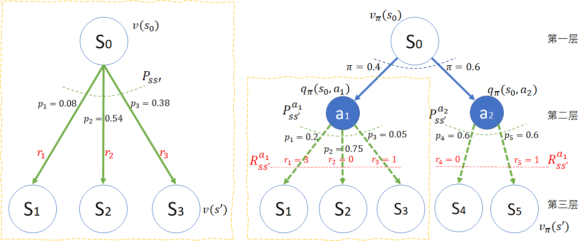
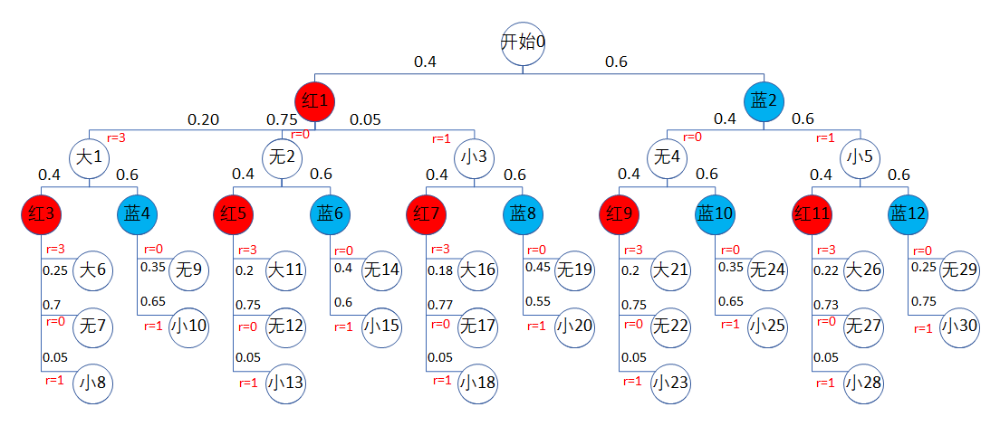
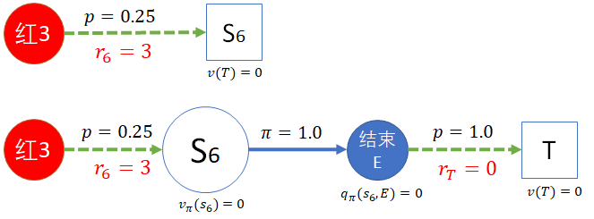
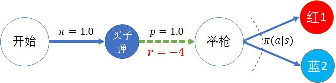
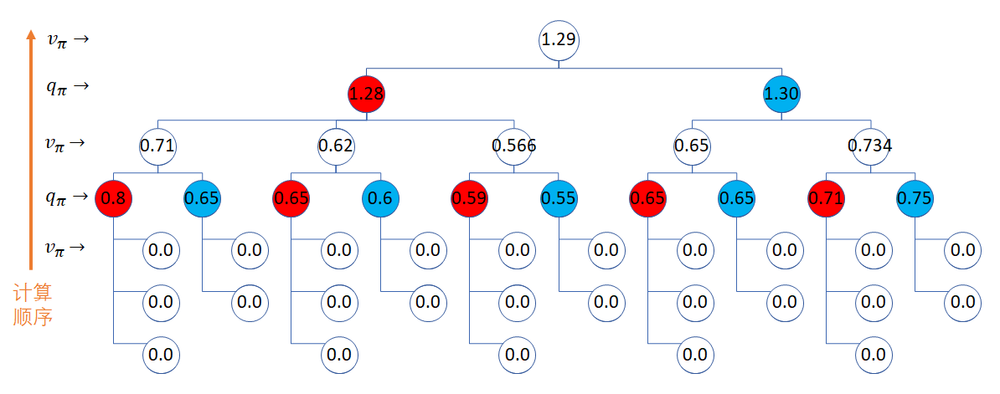

### 贝尔曼期望方程

有了模型和奖励，就可以进一步地研究价值问题了。如同马尔可夫奖励过程中的状态价值函数一样，在马尔可夫奖励过程过程中，同样会有价值函数，而且概念进一步地深化和扩展了。

#### 比较奖励过程和决策过程

我们首先用图 1 来比较一下两种过程，避免概念混淆。

图 1 左侧：马尔可夫奖励过程模型；右侧：马尔可夫决策过程模型。

表 1 比较图 1 中的左右两部分

||左侧|右侧|
|-|-|-|
|名称|马尔科夫奖励过程 MRP|马尔可夫决策过程 MDP
|模型|两层节点，一层过程|三层节点，两层过程|
|上层节点|源状态|源状态|
|中层节点|无|动作节点|
|下层节点|目标状态|目标状态|
|过程|实线箭头为状态转移 $P_{ss'}$ 以及过程奖励 $R_{ss'}$|实线箭头为策略选择$\pi(a \mid s)$，虚线箭头为状态转移$P^a_{ss'}$以及过程奖励$R^a_{ss'}$|
|解法|贝尔曼方程|贝尔曼期望方程|
|状态价值函数定义| $ v(s)= \mathbb E [G_t \mid S_t=s]$ | $v_\pi(s,a)=\mathbb E[G_t \mid S_t=s]$|
|动作价值函数定义|无|$q_\pi(s,a)=\mathbb E[G_t \mid S_t=s,A_t=a]$|

$v_\pi(s)$ 比 $v(s)$ 多了一个下标 $\pi$，是为了区分二者，没有实际的数学含义。

在有的资料中，给贝尔曼期望方程的 $\mathbb E$ 写作 $\mathbb E_\pi$，也是这个意思，没有实际的数学含义。

表 2 虚线框内的部分的局部比较

||左侧|右侧|
|-|-|-|
|顶端节点|源状态 $s_0$，需要计算状态价值函数$v(s_0)$|源动作 $a_1$，需要计算动作价值函数$q_{\pi}(s_0,a_1)$|
|中间过程|状态转移概率$P_{ss'}$，过程奖励向量$R_{ss'}$|状态转移概率$P_{ss'}^{a_1}$，过程奖励向量$R_{ss'}^{a_1}$|
|底端节点|下游状态$s_1,s_2,s_3$，假设已知状态价值函数$v(s')$|下游状态$s_1,s_2,s_3$，假设已知状态价值函数$v_{\pi}(s')$|

比较图 1 中左侧和右侧虚线框内的部分，可以说除了符号不同，其它都是相同的，包括位置和含义。

#### 动作价值函数 $q_\pi$

先回忆一下在马尔可夫奖励过程中学习过的状态价值函数，温故而知新。

$$
\begin{aligned}
v(s) &= \mathbb E [G_t \mid S_t = s]
\\
&=\mathbb E [R_{t+1}\mid S_t=s] + \gamma \mathbb E[G_{t+1}\mid S_t=s]
\\
&=\sum_{s'} p_{ss'} r_{ss'}+ \gamma \sum_{s'} p_{ss'}v(s') =\sum_{s'} p_{ss'} [r_{ss'}+\gamma v(s')] 
\\
&= P_{ss'} R_{ss'} + \gamma P_{ss'} V(s')
\\
&= R(s)+ \gamma P_{ss'}V(s') 
\end{aligned}
\tag{1}
$$

观察贝尔曼方程的推导，其本质是：某个状态的价值函数 $v(s)$ 由三部分组成：
1. 其下游状态的价值 $v(s')$；
2. 转移概率 $p$；
2. 转移过程中的奖励 $r$。

无巧不成书，在下面推导动作价值函数 $q_\pi$ 的公式时，我们也遇到了和式 1 同样的表达。所以，我们可以大胆地预测，计算动作价值函数 $q_\pi(s,a)$ 的公式与计算状态价值函数的贝尔曼方程完全一致。

$$
\begin{aligned}
q_\pi(s,a) &= \mathbb E [G_t \mid S_t = s, A_t=a]
\\
&=\mathbb E [R_{t+1}\mid S_t=s, A_t=a] + \gamma \mathbb E[G_{t+1}\mid S_t=s, A_t=a]
\\
&=\sum_{s'} p_{ss'}^a r_{ss'}^a+ \gamma \sum_{s'} p_{ss'}^a v_\pi(s') =\sum_{s'} p_{ss'}^a [r_{ss'}^a+\gamma v_\pi(s')] &(2.1)
\\
&=P^a_{ss'} R^a_{ss'} + \gamma P^a_{ss'} V_\pi(s')=P^a_{ss'}[R^a_{ss'}+\gamma V_\pi(s')] &(2.2)
\\
&= R^a(s)+ \gamma P_{ss'}^a V_\pi(s')  &(2.3)
\end{aligned}
\tag{2}
$$

比较式 1 和式 2，对于本章的动作价值函数来说，除了在条件部分多出来一个 $A_t=a$ 以外，其它的部分完全相同，所以式 2 的 $q$ 等同于式 1 的 $v$。

那么多出来的这个 $A_t=a$ 会造成什么不同吗？答案是不会。因为这个条件相当于在图 1 中右侧的部分确定了是选择 $a_1$ 还是 $a_2$，正是因为有了这个条件存在，才会让黄色虚线框部分的模型结构高度相似。

#### 状态价值函数 $v_\pi$

函数名称定义为 $v_\pi$ 的原因是为了和马尔可夫过程的状态价值函数 $v$ 区分开来，其定义是：

$$
v_\pi(s) = \mathbb E [G_t \mid S_t=s] \tag{3}
$$

同式 1,2 一样，式 3 仍然是要求回报 $G_t$ 的数学期望。在图 1 的右侧，我们考虑以 $v_\pi(s_0)$ 为例推出通用的价值函数公式。

状态 $s_0$ 并不直接接触到奖励机制，而是通过策略 $\pi$ 与下游的两个动作 $a_1,a_2$ 连接，所以，一旦知道了 $a_1,a_2$ 的动作价值函数 $q_\pi$，那么 $s_0$ 的状态价值函数就可以表示为 $q_\pi$ 的期望了，即：

$$
\begin{aligned}
v_\pi(s_0) &=\pi_1 q_\pi(s_0,a_1) + \pi_2 q_\pi(s_0,a_2)
\\
&=\sum_{a \in A(s)} \pi(a \mid s_0) q_\pi(s_0,a)
\end{aligned}
\tag{4}
$$

所以，式 3 可以引申为：

$$
v_\pi(s) = \mathbb E [G_t \mid S_t=s] = \sum_{a \in A(s)} \pi(a|s)q_\pi(s,a)
\tag{5}
$$

### 实例演算

下面我们通过对图 5 全模型图的实例化计算，来解释贝尔曼期望方程中的动作价值函数即状态价值函数的含义。

图 3 全模型

因为上层节点依赖下层节点，为了简化问题，我们要从下向上反向推演。

在本例中我们设 $\gamma=1$ 以简化计算过程。

### 处于第五层的状态价值函数

我们以“大6”状态为例，命名为 $s_6$，来解释第三层的状态价值函数的计算方法。

由于 $s_6$ 在本例中的含义是中大奖，奖励值为 3，所以很容易**误认为** $v(s_6) = 3$。可以通过下面两种方法来澄清这个问题。如图 4 所示。

图 4

#### 第一种方法

图 4 中的上子图。

可以认为 $s_6$ 为终止状态，这样按照定义，终止状态的价值函数值必须为 0。

有的读者可能会有疑问：那么 $r_6=3$ 的奖励给了谁？难道不是给了 $s_6$ 吗？

虽然在从动作“红3”到状态 $s_6$ 的转移过程中，得到了奖励 $r_6=3$，但是按照式 2，这个奖励是计算到“红3”的动作价值函数上的，并不是计算到下游的 $s_3$ 状态上的，否则就会重复计算了。

#### 第二种方法

图 4 中的下子图。

如果不认为 $s_6$ 为终止状态，可以在其后增加一个动作，叫做“结束E”，执行此动作的策略为 1，也就是 $s_6$ 只有这一个下游动作，并且这个动作以 1 的概率转移到另外定义的终止状态 T，奖励为 $r_T=0$。

那么反向计算过程为：
1. 终止状态的 $v(T)=0$，这是必须的。
2. 按式 2，$q_\pi(s_6,E)=P^a_{ss'} R^a_{ss'} + \gamma P^a_{ss'} V_\pi(s')=1 \times r_T + 1\times 1 \times v(T)=0$。
3. 按式 5，$v_\pi(s_6) = \sum_a \pi(a|s)q_\pi(s,a)=1 \times q_\pi(s_6,E)=0$

所以，这两种方法都可以解释清楚 $v_\pi(s_6) = 0$ 这个事实。依此类推，状态 6 到状态 30 的价值函数都是 0。

### 处于第四层的动作价值函数

即“红3”（命名为$a_3$）到“蓝12”（命名为$a_{12}$）这 10 个动作。

由式 2.2 可知：$q_\pi(s,a) = P^a_{ss'} R^a_{ss'} + \gamma P^a_{ss'} V_\pi(s')$，这是矩阵形式，便于书写，节省篇幅，读者可以自行用最原始的式 2.1 来佐证。

由于在上面一步中，已经解得 $v(s_n)=0, n \in [6,30]$，所以式 2.2 的后半部分 $V(s')$ 都是 0，因此可以轻易解得这 10 个动作的价值函数为：

$$
\begin{cases}
q_\pi(s_1,a_3) = (0.25,0.7,0.05) \cdot (3,0,1)^T=0.8
\\
q_\pi(s_1,a_4) = (0.35,0.65) \cdot (0,1)^T=0.65
\\
q_\pi(s_2,a_5) = (0.2,0.75,0.05) \cdot (3,0,1)^T=0.65
\\
q_\pi(s_2,a_6) = (0.4,0.6) \cdot (0,1)^T=0.6
\\
q_\pi(s_3,a_7) = (0.18,0.77,0.05) \cdot (3,0,1)^T=0.59
\\
q_\pi(s_3,a_8) = (0.45,0.55) \cdot (0,1)^T=0.55
\\
q_\pi(s_4,a_9) = (0.2,0.75,0.05) \cdot (3,0,1)^T=0.65
\\
q_\pi(s_4,a_{10}) = (0.35,0.65) \cdot (0,1)^T=0.65
\\
q_\pi(s_5,a_{11}) = (0.22,0.73,0.05) \cdot (3,0,1)^T=0.71
\\
q_\pi(s_5,a_{12}) = (0.25,0.75) \cdot (0,1)^T=0.75
\end{cases}
\tag{6}
$$

### 处于第三层的状态价值函数

即 $s_1$ 到 $s_5$ 这五个状态。

由式 5 知：$v_\pi(s) = \sum_a \pi(a|s)q_\pi(s,a)$，所以有：

$$
\begin{cases}
v_\pi(s_1)=0.4 q_\pi(s_1,a_3)+0.6 q_\pi(s_1,a_4)=0.4\times 0.8+0.6 \times 0.65=0.71
\\
v_\pi(s_2)=0.4 q_\pi(s_2,a_5)+0.6 q_\pi(s_2,a_6)=0.4\times 0.65+0.6 \times 0.6=0.62
\\
v_\pi(s_3)=0.4 q_\pi(s_3,a_7)+0.6 q_\pi(s_3,a_8)=0.4\times 0.59+0.6 \times 0.55=0.566
\\
v_\pi(s_4)=0.4 q_\pi(s_4,a_9)+0.6 q_\pi(s_4,a_{10})=0.4\times 0.65+0.6 \times 0.65=0.65
\\
v_\pi(s_5)=0.4 q_\pi(s_5,a_{11})+0.6 q_\pi(s_5,a_{12})=0.4\times 0.71+0.6 \times 0.75=0.734
\end{cases}
\tag{7}
$$

### 处于第二层的动作价值函数

只有 $a_1$ 和 $a_2$ 两个动作，这次与第四层的情况不一样，处于下游的 $v_\pi$ 都不是 0，所以用式 2.2 比较方便：$q_\pi(s,a)=P^a_{ss'}[R^a_{ss'}+\gamma V_\pi(s')]$。

其中：

- 对于 $q_\pi(s_0,a_1)$ 来说
    - $P^a_{ss'}=[0.2,0.75,0.05]$
    - $R^a_{ss'}=[3,0,1]$
    - $V_\pi(s')=[v_\pi(s_1),v_\pi(s_2),v_\pi(s_3)]$
- 对于 $q_\pi(s_0,a_2)$ 来说
    - $P^a_{ss'}=[0.4,0.6]$
    - $R^a_{ss'}=[0,1]$
    - $V_\pi(s')=[v_\pi(s_4),v_\pi(s_5)]$

$$
\begin{cases}
q_\pi(s_0,a_1)=(0.2,0.75,0.05) \cdot [(3,0,1)+(0.71,0.62,0.566)]^T=1.2853
\\
q_\pi(s_0,a_2)=(0.4,0.6) \cdot [(0,1)+(0.65,0.734)]^T=1.3004
\end{cases}
\tag{8}
$$

从式 8 的结果可得，选择射击蓝色大气球的动作价值为 1.3004，大于射击红色小气球的值。

#### 处于第一层的开始状态价值函数

$$
v_\pi(s_0) = \sum_a \pi(a|s)q_\pi(s,a)=(0.4,0.6) \cdot (1.2853,1.3004)^T = 1.2944
\tag{9}
$$

计算 $v_\pi$ 时可以用变量相乘再相加，也可以直接变成矩阵运算，原理一样。

到了这里，有些读者可能会产生疑问：为什么在没有引入动作之前，计算的（马尔可夫奖励过程的）开始状态的价值函数为 -2.7268，但是在上面的计算中，马尔可夫奖励过程的状态价值函数为 1.2944 呢？不是说值不一样，而是一正一负！

原因是我们在本节中的马尔可夫奖励过程中，没有把最开始买子弹的 4 元钱纳入模型中。

图 6

如果我们像图 6 这样设计模型，那么在“选择”的状态价值是 1.2944，“买子弹”的动作价值就等于 1.2944-4=-2.7056，开始状态的价值也是 -2.7056，而且也不会影响后续状态的价值计算。

最终得到所有的价值函数值，标在图 7 中。

图 7

从图 7 中可以看到：
- 第一次选择蓝色气球的价值是 1.30，比选择红色气球的动作 1.28 要大。
- 一旦在第一次选择了红色，无论结果如何，则后续的过程中再次选择红色的动作价值较大。
- 一旦在第一次选择了蓝色，无论结果如何，则后续的过程中再次选择蓝色的动作价值较大。
- 最有趣的是第三层左侧状态节点，中间的“脱靶”状态值为 0.62，竟然比右侧的“中小奖”的状态值 0.566 要大，这是为什么呢？
    - 因为它们的上游动作是选择红色气球，很容易脱靶，如果在射击红色气球时却打中了蓝色气球中了小奖，那只能说明歪得离谱（哈哈），在实际中不能给这种“运气”以更高的估值。

### 思考与练习

1. 虽然 $v_\pi$ 和 $q_\pi$ 可以相互换算，但是和先有鸡还是先有蛋的问题不一样。那么在一个马尔科夫决策过程中，$v_\pi$ 和 $q_\pi$ 谁先出现呢？谁又是链条的最后一个呢？
