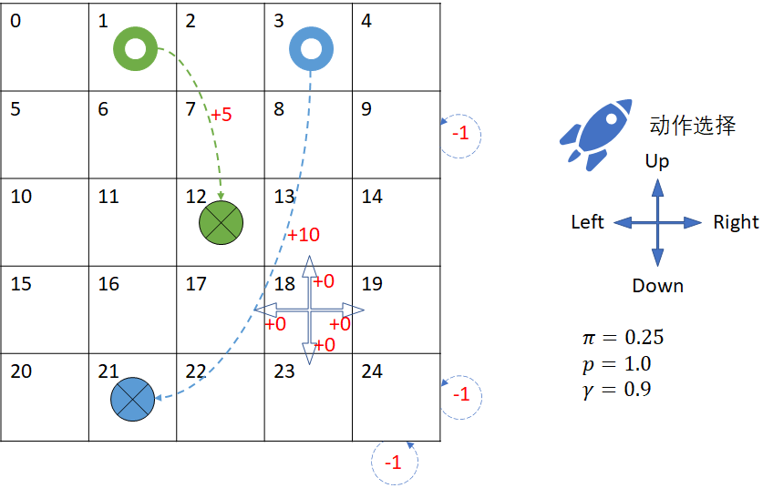

因为在射击问题中，有以下几个特点：

- 是一个单向选择和转移的过程，最后形成了一张有向无环图。这就决定了我们可以从后向前一步步**回溯**，自下向上逐层计算状态价值函数 $v_\pi(s)$ 和动作价值函数 $q_\pi(s,a)$，直到开始状态。其计算过程是：$v_T \to q_\pi \to v_\pi \to q_\pi \to v_\pi$，如图 mdp-8 所示。

- 每个分支的细节分析起来比较多，但实际上分支之间的区别只存在于状态转移的过程的具体概率数值上。比如图 mdp-7 所示，其中的“红3”动作后的状态转移概率是 [0.25,0.7.0.05]，而动作“红5”的状态转移概率是 [0.2,0.75,0.05]。这种细节只是导致计算结果不同，但概念是相同的。

- 而另外一个重要的策略选择问题，我们暂时用“红:蓝=0.4:0.6”的统计结果设定了，在两次射击时都是如此。但是在实际问题中，游客各有各的策略，这种统一的设定只是一种统计结果。游乐场老板虽然精明，但是游客们也不是傻子，谁都知道连续两次选择红色气球是有机会得到最高值 6 分的奖励的，只不过是能不能顺利实现的问题。


### 迭代问题

在前面的射击气球问题中，我们根据贝尔曼期望方程中的状态价值函数 $v_\pi$ 和动作价值函数 $q_\pi$ 的定义，用反推的方法，手工计算出了各个节点的价值函数，以加深对价值函数定义的理解。

但是，如果有些问题没有定义终止状态的话，我们该从何下手来计算呢？

其实在学习马尔可夫奖励过程和贝尔曼方程时，曾经使用迭代方法来得到状态价值函数 $v$ 的收敛值，而在这里可以使用同样的方法来解决没有终止状态的贝尔曼期望方程的问题。


### 穿越虫洞问题

<center>


图 1
</center>

问题描述

- 在一个 5x5 的宇宙空间中，一艘探索太空的宇宙飞船可以任意向四个方向行驶，策略 $\pi=0.25$。

- 比如在 $s_{18}$ 处，如果选择向右行驶，将会以 $p=1.0$ 的转移概率达到 19，并得到 0 的奖励。

- 如果在如 $s_{24}$ 所示的角落处向右行驶或向下行驶，将会碰撞能量屏障使飞船受损，飞船位置不发生改变，得到 -1 的“奖励”，但并非终止状态。其它角落处也是如此，一共有 4 个角落状态。

- 如果在如 $s_9$ 所示的边界处向右行驶，将会碰撞能量屏障使飞船受损，得到 -1 的“奖励”，飞船位置不发生改变，但并非终止状态，还可以进一步行驶。其它边界处也是如此，一共有 12 个边界状态。

- 在 $s_1$ 和 $s_3$ 处有两个虫洞，分别通向 $s_{12}$ 和 $s_{21}$，但后者并非终止状态。

- 在 $s_1$ 处进行下一步行驶时，将无条件地达到 $s_{12}$ 处，并得到 +5 的奖励。

- 在 $s_3$ 处进行下一步行驶时，将无条件地达到 $s_{21}$ 处，并得到 +10 的奖励。

注意两点

1. 没有终止状态，也就是说没有分幕，飞船可以一直行驶。
2. 到达 $s_1,s_3$ 时，不是被立刻吸入虫洞，而是要进行下一步动作时才会时空转移。也就说在 $s_1,s_3$ 并没有机会向上行驶而出界。

没有终点状态的话，我们无法确定任意一个状态的价值函数，进而算出其上游的动作价值函数。所以，我们必须研究一下马尔可夫决策过程下的贝尔曼期望方程的迭代解法了。

### 二级回溯

从前面的推导中，可以在已知 $q_\pi(s,a)$ 时计算出 $v_\pi(s)$（式5），也可以已知 $v_\pi(s)$ 计算出 $q_\pi(s,a)$（式2），这似乎变成了一个鸡生蛋蛋生鸡的死循环问题。能不能像贝尔曼方程那样，从$v_\pi(s')$ 计算出 $v_\pi(s)$ 来，从$q_\pi(s',a')$ 计算出 $q_\pi(s,a)$ 来呢？这样的话，我们就可以继续利用前面学过的迭代法或者矩阵法来方便地解出状态价值函数和动作价值函数了。

先绘制出两张二级回溯图，方便公式推导。如图 6 所示。

<center>


图 6
</center>

先看左图，我们的目的是想从 $v_\pi(s')$ 得到 $v_\pi(s)$，中间隔着一个 $q_\pi(s,a)$。如果把 $q_\pi(s,a)$ 的表达式带入 $v_\pi(s)$ 的表达式，就可以达到消去 $q_\pi(s,a)$ 的目的了。


于是可以把式 2.1 的 $q_\pi(s,a)$ 带入式 5：


$$
\begin{aligned}
v_\pi(s) &= \sum_a \pi(a|s)q_\pi(s,a) &(式5)
\\
(带入式2.1替换 q_\pi \to)&=\sum_a \pi(a|s) \Big(\sum_{s'} p_{ss'}^a [r_{ss'}^a+\gamma v_\pi(s')]\Big) &(10.1)
\\
(矩阵形式\to)&=\sum_a \pi(a|s) \Big(P^a_{ss'}[R^a_{ss'}+\gamma V_\pi(s')]\Big) &(10.2)
\\
(动作奖励函数形式\to)&=\sum_a \pi(a|s) \Big( R^a(s)+ \gamma P_{ss'}^a V_\pi(s') \Big) &(10.3)
\end{aligned}
\tag{10}
$$

式 10 就是 $v_\pi$ 的迭代表达式。

再看右图，想把$v_\pi(s')$ 消掉，需要先得到它的表达式。

从式 5 把 $s,a$ 换成 $s',a'$，可以得到式 11：

$$
v_\pi(s') = \sum_{a'} \pi(a'|s')q_\pi(s',a')
\tag{11}
$$

把式 11 带入式 2：

$$
\begin{aligned}
q_\pi(s,a)&=\sum_{s'} p_{ss'}^a \big [r_{ss'}^a+\gamma v_\pi(s') \big ] &(式2.1)
\\
(带入式11替换v_\pi\to)&=\sum_{s'} p_{ss'}^a \Big ( r_{ss'}^a+\gamma \sum_{a'} [\pi(a'|s')q_\pi(s',a') ] \Big) &(12.1)
\\
(动作奖励函数形式 \to)&=R^a(s)+\gamma \sum_{s'} p_{ss'}^a \Big ( \sum_{a'} [\pi(a'|s')q_\pi(s',a')] \Big) &(12.2)
\end{aligned}
\tag{12}
$$

式 12 就是 $q_\pi$ 的迭代的表达形式。

本节的公式有些多，下面总结一下，便于读者以后速查。

表 3 $v_\pi, q_\pi$ 的互换速查表

|=|$v_\pi$|$q_\pi$|
|-|-|-|
|$v_\pi$|$v_\pi(s)=\sum_a \pi(a \mid s) \Big(\sum_{s'} p_{ss'}^a [r_{ss'}^a+\gamma v_\pi(s')]\Big)$<br>(式10.1)|$v_\pi(s) = \sum_{a} \pi(a \mid s)q_\pi(s,a)$ <br>(式5)|
|$q_\pi$|$q_\pi(s,a)=\sum_{s'} p_{ss'}^a \big [r_{ss'}^a+\gamma v_\pi(s') \big ]$<br> (式2.1)|$q_\pi(s,a)=\sum_{s'} p_{ss'}^a \Big ( r_{ss'}^a+\gamma \sum_{a'} [\pi(a'\mid s')q_\pi(s',a') ] \Big)$<br> (式12.1)|

在表 3 中，我们只给出了公式的原始形式，读者可以在实际用使用矩阵形式或是奖励函数形式。

### 建模

在强化学习中，经常会用图 x 这种方格（或长方格）来研究各种算法，所以有必要建立一个通用的模型，用数据定义模型的各种行为。

模型可以分为四个小部分

#### 状态部分

```Python
# 状态空间 = 空间宽度 x 空间高度
GridWidth, GridHeight = 5, 5
# 起点，可以多个
StartStates = []
# 终点，可以多个
EndStates = []
```
- 空间宽度和高度可以不相等，比如 3 X 4。
- 有些场景需要定义起点，比如迷宫游戏。
- 很多场景需要定义终止状态，到达此状态后算是分幕结束。

#### 动作部分
```Python
# 动作空间
LEFT, UP, RIGHT, DOWN  = 0, 1, 2, 3
Actions = [LEFT, UP, RIGHT, DOWN]
# 初始策略
Policy = [0.25, 0.25, 0.25, 0.25]
# 状态转移概率: [SlipLeft, MoveFront, SlipRight, SlipBack]
SlipProbs = [0.0, 1.0, 0.0, 0.0]
```
- 按中国人的习惯，定义左、上、右、下顺时针顺序的四个方向。
- 动作空间就由这四个动作组成。当然，在醉汉回家问题中，只有左、右两个动作。
- 初始策略，就是在 4 个方向上随机选择。
- 状态转移概率，就是在动作执行后，是否会出现偏差。举例来说，在冰面向前行走，很有可能冰面太滑而造成向左 0.2、向右 0.1、向前 0.7 的状态转移概率，那么改值就可以写成 [0.2, 0.7, 0.1, 0.0]。注意顺序不能乱。

#### 奖励部分

```Python
# 每走一步的奖励值，可以是0或者-1
StepReward = 0
# 特殊奖励 from s->s' then get r, 其中 s,s' 为状态序号，不是坐标位置
SpecialReward = {
    (0,0):-1,       # s0 -> s0 得到-1奖励
    (1,1):-1,
    (2,2):-1,
    (3,3):-1,
    (4,4):-1,
    (5,5):-1,
    (9,9):-1,
    (10,10):-1,
    (14,14):-1,
    (15,15):-1,
    (19,19):-1,
    (20,20):-1,
    (21,21):-1,
    (22,22):-1,
    (23,23):-1,
    (24,24):-1,
    (1,12):+5,
    (3,21):+10
}
```
- 每走一步都可以有 -1 的奖励，或者 0。
- 特殊奖励，比如本例中的碰撞边界得 -1，或者穿越虫洞得 +5 或 +10。

#### 特殊移动

```Python
# 特殊移动，用于处理类似虫洞场景
SpecialMove = {
    (1,LEFT):12,    # 从状态1执行向左的动作会到达状态12
    (1,UP):12,
    (1,RIGHT):12,
    (1,DOWN):12,
    (3,LEFT):20,
    (3,UP):21,
    (3,RIGHT):21,
    (3,DOWN):21
}
# 墙
Blocks = []
```

- 特殊移动用于处理本例中的虫洞场景，比如“(1,LEFT):12”，表示“从状态 1 执行向左的动作会到达状态 12”。
- 墙，用于搭建迷宫类场景。撞墙后一般原地不动。
