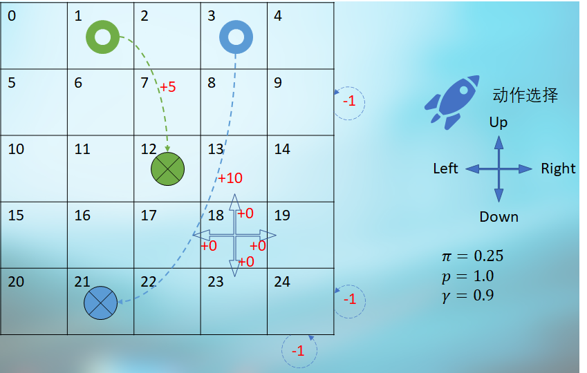
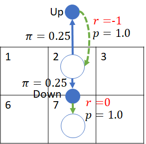

## 9.1 穿越虫洞问题

### 9.1.1 提出问题

图 9.1.1 穿越虫洞问题

问题描述

- 在一个 5x5 的宇宙空间中，一艘探索太空的宇宙飞船可以任意向四个方向行驶，策略 $\pi=0.25$。

- 比如在 $s_{18}$ 处，如果选择向右行驶，将会以 $p=1.0$ 的转移概率达到 19，并得到 0 的奖励。

- 如果在如 $s_{24}$ 所示的角落处向右行驶或向下行驶，将会碰撞能量屏障使飞船受损，飞船位置不发生改变，得到 -1 的“奖励”，但并非终止状态。其它角落处也是如此，一共有 4 个角落状态（序号为：0，4，20，24）。

- 如果在如 $s_9$ 所示的边界处向右行驶，将会碰撞能量屏障使飞船受损，得到 -1 的“奖励”，飞船位置不发生改变，但并非终止状态，还可以进一步行驶。其它边界处也是如此，一共有 12 个边界状态（序号为：1，2，3，5，9，10，14，15，19，21，22，23）。

- 在 $s_1$ 和 $s_3$ 处有两个虫洞：

    - 在 $s_1$ 处进行下一步行驶时，无论任何方向，将无条件地达到 $s_{12}$ 处，并得到 +5 的奖励，但后者并非终止状态。

    - 在 $s_3$ 处进行下一步行驶时，无论任何方向，将无条件地达到 $s_{21}$ 处，并得到 +10 的奖励，但后者并非终止状态。

    所以序号为 1,3 的两个状态可以从边界状态中去掉。

### 9.1.2 问题特点

注意几点：

1. 没有终止状态，也就是说没有分幕，飞船可以一直行驶。
2. 到达 $s_1,s_3$ 时，不是被立刻吸入虫洞，而是要进行下一步动作时才会时空转移。也就说在 $s_1,s_3$ 并没有机会向上行驶而出界。
3. 关于边角位置的状态，如图 x 所示，以状态 $s_2$ 为例：
    - 如果从该状态以 0.25 的概率选择向上移动，会以概率 1.0 回到 $s_2$，并有 -1 的奖励。所以说，这里面既有策略 $\pi$，又有转移概率 $p$，只不过只有一个下游状态，没有分支。
    - 如果从 $s_2$ 以 0.25 的概率选择向下移动，会以 1.0 的概率转移到 $s_7$，得到 0 的奖励。

图 6

没有终点状态的话，我们无法确定任意一个状态的价值函数，进而算出其上游的动作价值函数。所以，我们必须研究一下马尔可夫决策过程下的贝尔曼期望方程的迭代解法了。

在前面的射击气球问题中，我们根据贝尔曼期望方程中的状态价值函数 $v_\pi$ 和动作价值函数 $q_\pi$ 的定义，用反推的方法，手工计算出了各个节点的价值函数，以加深对价值函数定义的理解。

但是，如果有些问题没有定义终止状态的话，我们该从何下手来计算呢？

其实在学习马尔可夫奖励过程和贝尔曼方程时，曾经使用迭代方法来得到状态价值函数 $v$ 的收敛值，而在这里可以使用同样的方法来解决没有终止状态的贝尔曼期望方程的问题。

