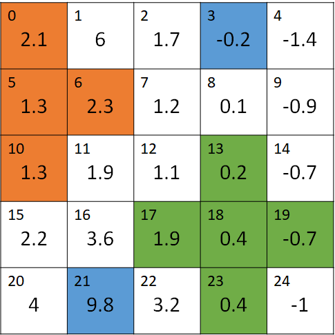
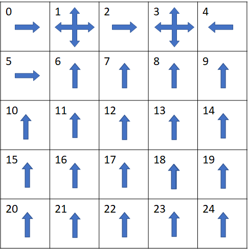

## 9.2 建模

在强化学习中，经常会用图 x 这种方格（或长方格）来研究各种算法，所以有必要建立一个通用的模型，用数据定义模型的各种行为。

模型可以分为四个小部分

### 9.2.1 状态部分

```Python
# 状态空间 = 空间宽度 x 空间高度
GridWidth, GridHeight = 5, 5
# 起点，可以多个
StartStates = []
# 终点，可以多个
EndStates = []
```
- 空间宽度和高度可以不相等，比如 3 X 4。
- 有些场景需要定义起点，比如迷宫游戏。
- 很多场景需要定义终止状态，到达此状态后算是分幕结束。

#### 动作部分
```Python
# 动作空间
LEFT, UP, RIGHT, DOWN  = 0, 1, 2, 3
Actions = [LEFT, UP, RIGHT, DOWN]
# 初始策略
Policy = [0.25, 0.25, 0.25, 0.25]
# 状态转移概率: [SlipLeft, MoveFront, SlipRight, SlipBack]
SlipProbs = [0.0, 1.0, 0.0, 0.0]
```
- 按中国人的习惯，定义左、上、右、下顺时针顺序的四个方向。
- 动作空间就由这四个动作组成。当然，在醉汉回家问题中，只有左、右两个动作。
- 初始策略，就是在 4 个方向上随机选择。
- 状态转移概率，就是在动作执行后，是否会出现偏差。举例来说，在冰面向前行走，很有可能冰面太滑而造成向左 0.2、向右 0.1、向前 0.7 的状态转移概率，那么改值就可以写成 [0.2, 0.7, 0.1, 0.0]。注意顺序不能乱。

#### 奖励部分

```Python
# 每走一步的奖励值，可以是0或者-1
StepReward = 0
# 特殊奖励 from s->s' then get r, 其中 s,s' 为状态序号，不是坐标位置
SpecialReward = {
    (0,0):-1,       # s0 -> s0 得到-1奖励
    (2,2):-1,
    ......
    (1,12):+5,
    (3,21):+10
}
```
- StepReward 表示每走一步都可以有 -1 的奖励，或者 0。
- 特殊奖励，比如本例中的碰撞边界得 -1，或者穿越虫洞得 +5 或 +10。这个字典不管智能体是如何从 $s_1$ 到达 $s_1$ 的，也就是忽略了中间的动作选择和状态转移两个步骤，只看起始和终止状态。

#### 特殊移动

```Python
# 特殊移动，用于处理类似虫洞场景
SpecialMove = {
    (1,LEFT):12,    # 从状态1执行向左的动作会到达状态12
    (1,UP):12,
    (1,RIGHT):12,
    (1,DOWN):12,
    (3,LEFT):20,
    (3,UP):21,
    (3,RIGHT):21,
    (3,DOWN):21
}
# 墙
Blocks = []
```

- 特殊移动用于处理本例中的虫洞场景，比如“(1,LEFT):12”，表示“从状态 1 执行向左的动作会到达状态 12”。
- 墙，用于搭建迷宫类场景。撞墙后一般原地不动。


### 结果

字典

```
状态->动作->转移->奖励 字典：
state = 0
        action = LEFT
         [(1.0, 0, -1)]
        action = UP
         [(1.0, 0, -1)]
        action = RIGHT
         [(1.0, 1, 0)]
        action = DOWN
         [(1.0, 5, 0)]
state = 1
        action = LEFT
         [(1.0, 12, 5)]
        action = UP
         [(1.0, 12, 5)]
        action = RIGHT
         [(1.0, 12, 5)]
        action = DOWN
         [(1.0, 12, 5)]
......
```
- 在 $s_0$ 状态，向左和向上移动时，都会以 p=1.0 的概率返回，并得到 -1 的奖励。
- 在 $s_1$ 状态，向任意方向移动时，都会以 p=1.0 的概率达到 $s_{12}$ 状态，并得到 +5 的奖励。

#### $v_\pi$

```
迭代次数 =  41
V_pi
[[ 1.66  5.63  4.52  8.73  3.28]
 [ 0.64  2.02  2.3   2.99  1.51]
 [-0.35  0.41  0.7   0.75  0.05]
 [-1.16 -0.56 -0.34 -0.43 -0.97]
 [-1.96 -1.41 -1.22 -1.34 -1.85]]
```
迭代了 41 次收敛，


我们检查一下 $v_\pi$ 的计算是否正确


<center>


图 6
</center>

$v_\pi(s)=\sum_a \pi(a \mid s) \Big(\sum_{s'} p_{ss'}^a [r_{ss'}^a+\gamma v_\pi(s')]\Big)$

其中，$\pi=0.25,p=1.0$，而 $r$ 根据情况有所不同

蓝色 $s=s_3,s'=s_{21},\pi(a|s_3)=0.25,p^a_{3,21}=1,r^a_{3,21}=10$

$$
\begin{aligned}
v_\pi(s_{3})&=\sum_{a \in (L,U,R,D)} \pi(a|s_3) \Big(\sum_{s'=S_{21}} p^a_{3,21} [r^a_{3,21}+0.9 v(s_{21})] \Big)
\\
&=4 \times 0.25 \times \Big(1\times[10+0.9\times(-1.41)]\Big)
\\
&\approx 8.73
\end{aligned}
$$

与$v_\pi(s_3)$的值吻合。

橙色和绿色的部分的验证由读者在思考与练习中完成。

再分析一下两个虫洞入口 $s_1,s_3$ 的状态价值函数值

$v_\pi(s_3)=8.73$，小于离开此状态的即时奖励（$R_{t+1}=10$），而 $v_\pi(s_1)=5.63$，大于离开此状态时的即时奖励（$R_{t+1}=5$）。这是为什么呢？

- 因为 $s_3$ 的状态价值函数由其下游状态 $s_{21}$ 决定，而飞船在 $s_{21}$ 有 0.25 的可能出界而得到负的奖励。

- 而 $s_1$ 的下游状态 $s_{12}$ 在中心区域，很不容易出界，状态价值为正数，所以 $v_\pi(s_1)$ 的值要大于即时奖励值。


#### $q_\pi$

```
Q_pi
[[ 0.49  0.49  5.07  0.58]
 [ 5.63  5.63  5.63  5.63]
 [ 5.07  3.06  7.86  2.07]
 [ 8.73  8.73  8.73  8.73]
 [ 7.86  1.95  1.95  1.36]
 [-0.42  1.49  1.82 -0.32]
 [ 0.58  5.07  2.07  0.37]
 [ 1.82  4.06  2.69  0.63]
 [ 2.07  7.86  1.36  0.67]
 [ 2.69  2.95  0.36  0.05]
 [-1.32  0.58  0.37 -1.04]
 [-0.32  1.82  0.63 -0.51]
 [ 0.37  2.07  0.67 -0.31]
 [ 0.63  2.69  0.05 -0.38]
 [ 0.67  1.36 -0.95 -0.87]
 [-2.04 -0.32 -0.51 -1.76]
 [-1.04  0.37 -0.31 -1.27]
 [-0.51  0.63 -0.38 -1.1 ]
 [-0.31  0.67 -0.87 -1.2 ]
 [-0.38  0.05 -1.87 -1.67]
 [-2.76 -1.04 -1.27 -2.76]
 [-1.76 -0.51 -1.1  -2.27]
 [-1.27 -0.31 -1.2  -2.1 ]
 [-1.1  -0.38 -1.67 -2.2 ]
 [-1.2  -0.87 -2.67 -2.67]]
```

$q_\pi$ 数据解读：

- 一共有 25 行数据，代表了 25 个状态。
- 每行有 4 列数据，代表了每个状态下的四个动作的动作价值函数值，顺序是“左上右下”。

以第一行数据为例：[ 0.49  0.49  5.07  0.58]，可以看到最大值是 5.07，对应的动作是“右”，于是我们就在图 x 的第 0 个状态中绘制一个向右的箭头，表示智能体应该在此处选择向右走。

<center>


图 6
</center>

再看第二行数据：[ 5.63  5.63  5.63  5.63]，四个值相等，表示可以任意选择一个方向，我们就可以再图 x 的第 1 个状态中绘制一个四个方向的箭头。

针对第二行数据，如果使用 np.argmax([5.63, 5.63, 5.63, 5.63]) 函数，只会返回第一个最大值，这不是我们想要的，应该使用下面的代码来获得所有的最佳动作：
```python
best_actions = np.argwhere(self.policy == np.max(self.policy))  #应该返回 [0,1,2,3]
```

绘制完全部 25 个状态的最佳动作后，我们来一起分析一下。

合理的动作：

- 在状态 1 和 3，任意向四个方向移动，都会无条件穿过虫洞，这个没有问题；
- 在状态 2 向右走，因为 $v_3$ 的价值大于 $v_1$ 的价值；
- 在状态 0 向右走到达状态 1，虽然 $v_3$ 更好，但是要绕远（0->5->6->7->2->3），得不偿失；

不合理的动作：

- 在状态 6，是不是可以向右走以便最终到达状态 3 更好呢？
- 在状态 24，如果想最短路径到达状态 3，应该可以选择向上和向左两个方向，在图 x 中只有一个向上的选择。
- 状态 7 和状态 24 情况一样，应该有向上和向右两个可选项，图中只有一个。

分析至此，虽然图 x 中的动作选择大方向没错，但是有些细节值得推敲，也许这个策略组合还不是最佳的。


### 思考与练习

1. 验证图 x 中 橙色 $v_\pi(s_{5})$ 和 绿色 $v_\pi(s_{18})$ 的 $v_\pi$ 值
