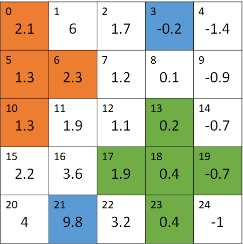
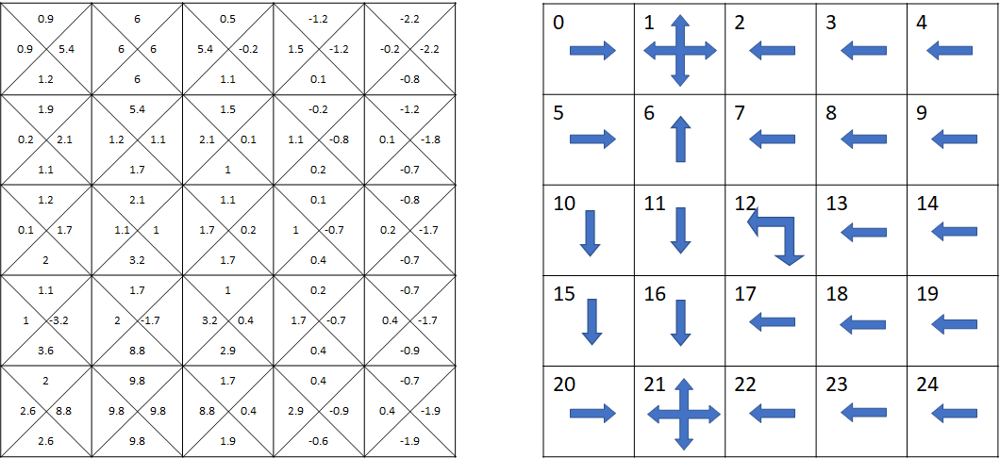

## 9.2 随机策略下的结果

### 9.2.1 通用的模型逻辑

有了模型的数据定义后，需要把它转换成模型的代码逻辑。创建一个 GridWorld 类来读取 9.1.3 中的模型数据定义。需要保证这个类可以处理所有 GridWorld 形式的数据。

【代码位置】GridWorld_0_Model.py

```Python
class GridWorld(object):
    # 生成环境
    def __init__(self, ...):
        ...
    # 用于生成状态-动作字典
    def __init_states(self, Probs, StepReward):
        ...
    # 用于计算移动后的下一个状态
    # 左上角为 [0,0], 横向为 x, 纵向为 y
    def __get_next_state(self, s, x, y, action):
        ...
```

此时可以运行 Wormhole_0_Data.py，打印输出“状态->动作->转移->奖励字典”，用于观察我们在该模型中的数据设置是否正确。

```
state = 0
        action = LEFT
         [(1.0, 0, -1)]
        action = UP
         [(1.0, 0, -1)]
        action = RIGHT
         [(1.0, 1, 0)]
        action = DOWN
         [(1.0, 5, 0)]
state = 1
        action = LEFT
         [(1.0, 12, 5)]
        action = UP
         [(1.0, 12, 5)]
        action = RIGHT
         [(1.0, 12, 5)]
        action = DOWN
         [(1.0, 12, 5)]
...
state = 24
    ...
```
为了节省篇幅，我们只截取了其中的一部分输出内容。

- state = 0

    在状态 $s_0$ 时，向左和向上的移动都会出界（然后返回 $s_0$），得 -1 奖励。向右和向下的移动可以以概率 1.0 到达 $s_1,s_5$，0 分奖励。
- state = 1

    在状态 $s_1$ 时，任何一个动作都会以 1.0 的概率移动到 $s_{12}$，并得到 5 分奖励。

- state = 24
    一共有 $[s_0,\cdots,s_{24}]$ 25 个状态，数据形式上一样，内容不尽相同。


有了这个模型，我们下一步可以继续解决穿越虫洞问题了。


### 9.2.2 过程控制

在第 8 章的末尾，我们已经利用贝尔曼期望方程实现了迭代算法，**算法实现**代码单独存放在 Algo_PolicyValueFunction.py 中，就是为了可以在任何地方复用。

在本章中，我们又在前面创建了模型的**数据定义**和通用的**模型逻辑**，再加上上面的**算法实现**，万事俱备了。但是先捋清楚它们之间的调用关系。

<center>


图 9.2.1 模块关系
</center>

如图 9.2.1 所示。

- 数据定义：Wormhole_0_Data.py，定义穿越虫洞问题的模型。
- 模型逻辑：GridWorld_0_Model.py，接收数据定义，用通用逻辑生成模型。
- 算法实现：Algo_PolicyValueFunction.py，接收模型，运行算法。
- 过程控制与结果输出：Wormhole_1_Vpi.py，控制以上过程，输出结果。

这种设计的好处就是可以高度复用，比如：

- 更换数据定义，就可以把穿越虫洞问题变成悬崖行走问题或迷宫问题，但是模型逻辑部分和算法部分不需要改动。

- 更换算法实现，就可以把计算贝尔曼价值函数问题变成后面要学习的计算贝尔曼最有价值函数问题。

过程控制代码如下：

```Python
import numpy as np
import Wormhole_0_Data as data              # 数据定义
import GridWorld_0_Model as model           # 模型逻辑
import Algo_PolicyValueFunction as algo     # 算法实现
import DrawQpi as drawQ                     # 结果输出

if __name__=="__main__":
    env = model.GridWorld(
        # 关于状态的参数
        data.GridWidth, data.GridHeight, data.StartStates, data.EndStates,  
        # 关于动作的参数
        data.Actions, data.Policy, data.SlipProbs,                     
        # 关于奖励的参数
        data.StepReward, data.SpecialReward,                     
        # 关于移动的限制 
        data.SpecialMove, data.Blocks)                        

    gamma = 0.9
    iteration = 1000
    # 运行算法
    V_pi, Q_pi = algo.V_in_place_update(env, gamma, iteration)
    # 打印输出
    print("V_pi")
    V = np.reshape(np.round(V_pi,2), (data.GridWidth, data.GridHeight))
    print(V)
    print("Q_pi")
    print(np.round(Q_pi,2))
    # 字符图形化显示
    drawQ.draw(Q_pi, (data.GridWidth, data.GridHeight))
```

### 9.2.3 结果输出与分析

#### 状态价值函数 $v_\pi(s)$ 的结果

```
迭代次数 =  41
V_pi
[[ 1.66  5.63  4.52  8.73  3.28]
 [ 0.64  2.02  2.3   2.99  1.51]
 [-0.35  0.41  0.7   0.75  0.05]
 [-1.16 -0.56 -0.34 -0.43 -0.97]
 [-1.96 -1.41 -1.22 -1.34 -1.85]]
```
迭代了 41 次收敛。我们验算一下 $v_\pi$ 的计算是否正确。

<center>


图 9.2.2 状态价值函数 $v_\pi(s)$ 的结果
</center>

$v_\pi(s)=\sum_a \pi(a \mid s) \Big(\sum_{s'} p_{ss'}^a [r_{ss'}^a+\gamma v_\pi(s')]\Big)$

其中，$\pi=0.25,p=1.0$，而 $r$ 根据情况有所不同

蓝色 $s=s_3,s'=s_{21},\pi(a|s_3)=0.25,p^a_{3,21}=1,r^a_{3,21}=10$

$$
\begin{aligned}
v_\pi(s_{3})&=\sum_{a \in (L,U,R,D)} \pi(a|s_3) \Big(\sum_{s'=S_{21}} p^a_{3,21} [r^a_{3,21}+0.9 v(s_{21})] \Big)
\\
&=4 \times 0.25 \times \Big(1\times[10+0.9\times(-1.41)]\Big)
\\
&\approx 8.73
\end{aligned}
$$

与$v_\pi(s_3)$的值吻合。

橙色和绿色的部分的验证由读者在思考与练习中完成。

再分析一下两个虫洞入口 $s_1,s_3$ 的状态价值函数值

$v_\pi(s_3)=8.73$，小于离开此状态的即时奖励（$R_{t+1}=10$），而 $v_\pi(s_1)=5.63$，大于离开此状态时的即时奖励（$R_{t+1}=5$）。这是为什么呢？

- 因为 $s_3$ 的状态价值函数由其下游状态 $s_{21}$ 决定，而飞船在 $s_{21}$ 有 0.25 的可能出界而得到负的奖励。

- 而 $s_1$ 的下游状态 $s_{12}$ 在中心区域，很不容易出界，状态价值为正数，所以 $v_\pi(s_1)$ 的值要大于即时奖励值。


#### 动作价值函数 $q_\pi(s,a)$ 的结果

```
Q_pi
[[ 0.49  0.49  5.07  0.58]
 [ 5.63  5.63  5.63  5.63]
 [ 5.07  3.06  7.86  2.07]
 [ 8.73  8.73  8.73  8.73]
 [ 7.86  1.95  1.95  1.36]
 [-0.42  1.49  1.82 -0.32]
 [ 0.58  5.07  2.07  0.37]
 [ 1.82  4.06  2.69  0.63]
 [ 2.07  7.86  1.36  0.67]
 [ 2.69  2.95  0.36  0.05]
 [-1.32  0.58  0.37 -1.04]
 [-0.32  1.82  0.63 -0.51]
 [ 0.37  2.07  0.67 -0.31]
 [ 0.63  2.69  0.05 -0.38]
 [ 0.67  1.36 -0.95 -0.87]
 [-2.04 -0.32 -0.51 -1.76]
 [-1.04  0.37 -0.31 -1.27]
 [-0.51  0.63 -0.38 -1.1 ]
 [-0.31  0.67 -0.87 -1.2 ]
 [-0.38  0.05 -1.87 -1.67]
 [-2.76 -1.04 -1.27 -2.76]
 [-1.76 -0.51 -1.1  -2.27]
 [-1.27 -0.31 -1.2  -2.1 ]
 [-1.1  -0.38 -1.67 -2.2 ]
 [-1.2  -0.87 -2.67 -2.67]]
```

$q_\pi$ 数据解读：

- 一共有 25 行数据，代表了 25 个状态。
- 每行有 4 列数据，代表了每个状态下的四个动作的动作价值函数值，顺序是“左上右下”。

以第一行数据为例：[ 0.49  0.49  5.07  0.58]，可以看到最大值是 5.07，对应的动作是“右”，于是我们就在图 x 的第 0 个状态中绘制一个向右的箭头，表示智能体应该在此处选择向右走。

<center>


图 9.2.3 动作价值函数 $q_\pi(s,a)$ 的结果
（左图：四个方向上的数值；右图：最大值代表的动作方向）
</center>

再看第二行数据：[ 5.63  5.63  5.63  5.63]，四个值相等，表示可以任意选择一个方向，我们就可以再图 x 的第 1 个状态中绘制一个四个方向的箭头。

针对第二行数据，如果使用 np.argmax([5.63, 5.63, 5.63, 5.63]) 函数，只会返回第一个最大值，这不是我们想要的，应该使用下面的代码来获得所有的最佳动作：
```python
best_actions = np.argwhere(self.policy == np.max(self.policy))  #应该返回 [0,1,2,3]
```

绘制完全部 25 个状态的最佳动作后，我们来一起分析一下。

合理的动作：

- 在状态 1 和 3，任意向四个方向移动，都会无条件穿过虫洞，这个没有问题；
- 在状态 2 向右走，因为 $v_3$ 的价值大于 $v_1$ 的价值；
- 在状态 0 向右走到达状态 1，虽然 $v_3$ 更好，但是要绕远（0->5->6->7->2->3），得不偿失；

不合理的动作：

- 在状态 6，是不是可以向右走以便最终到达状态 3 更好呢？
- 在状态 24，如果想最短路径到达状态 3，应该可以选择向上和向左两个方向，在图 x 中只有一个向上的选择。
- 状态 7 和状态 24 情况一样，应该有向上和向右两个可选项，图中只有一个。

分析至此，虽然图 x 中的动作选择大方向没错，但是有些细节值得推敲，也许这个策略组合还不是最佳的。


### 思考与练习

1. 验证图 x 中 橙色 $v_\pi(s_{5})$ 和 绿色 $v_\pi(s_{18})$ 的 $v_\pi$ 值
