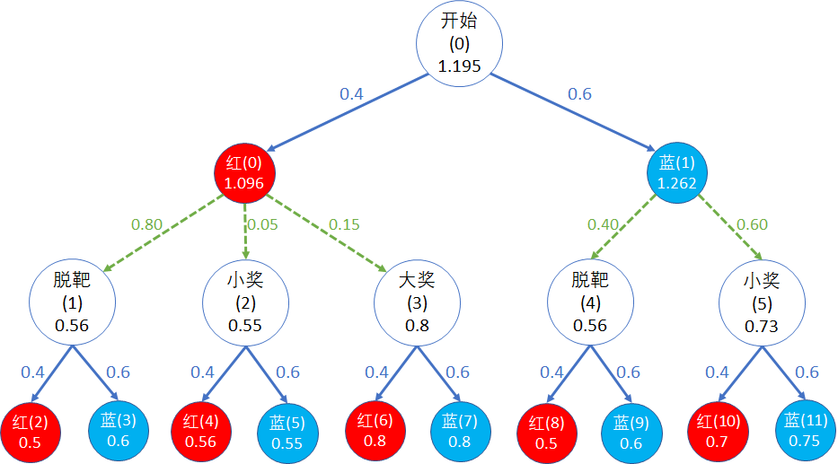

## 9.3 策略对价值函数的影响

### 9.3.1 给定策略下的状态函数值

让我们先暂时从穿越虫洞的问题中穿越回到射击气球的问题，因为还有一个疑问没有解决。

射击气球问题的初始化环境指定的策略是这样的：

```python
    Policy = {          # 原始策略
        0:[0.4,0.6],    # 在状态 0 时，选择射击红球的概率0.4，选择射击蓝球的概率0.6
        1:[0.4,0.6],    # 在状态 1 时，同上
        2:[0.4,0.6],
        3:[0.4,0.6],
        4:[0.4,0.6],
        5:[0.4,0.6],
        6:[0.4,0.6]     # 可以不定义，因为在终止状态没有动作
    }
```

前面也提到过，这个策略是通过统计游客的行为而得到的。意味着在100个游客中，有40个游客会选择射击红色气球，另外60个游客会选择射击蓝色气球，两轮射击都是如此。用公式表示为：

$$
\underbrace{\pi(a \mid s)=\mathbb P [A_t=a|S_t=s]}_{式(8.3.1)}=
\begin{cases}
0.4, & a=射击红球
\\
0.6, & a=射击蓝球
\end{cases}
\tag{9.3.1}
$$


所以最终的状态与动作价值函数结果如图 9.3.1 所示。

<center>


图 9.3.1
</center>

但是，这还没有回答在第 8 章最开始提出的问题：**你**做为一个聪明的游客应该如何选择呢？

因为一个不怎么“聪明”的游客也会想到：

1. 应该连续两次选择射击红球才有可能得到 6 元的奖励，大于开始付出的 4 元；
2. 如果射中一次红球、一次蓝球，刚好 4 元；
3. 如果射中两次蓝球，只有 2 元。

所以 0.4:0.6 这个数字，只是游乐场老板统计的结果，对于你来说这是最好的策略吗？

### 9.3.2 尝试不同的策略带来的影响

为了验证策略对最终结果的影响，我们可以尝试修改一下该策略，然后比较“开始(0)”状态的价值函数的值 $v_\pi(s_0)$，看看谁高谁低。因为对于本例来说，对下游状态的所有策略上的修改，最终会反映到开始状态的，所以我们只需要简单地比较开始状态的价值函数值就可以了。

【代码位置】Shoot_0_Try_Policy.py

```python
import numpy as np
import copy
import Shoot_2_DataModel as dataModel
import Algo_PolicyValueFunction as algo

if __name__=="__main__":
    Policy = {          # 原始策略
        0:[0.4,0.6]     # 下同
        ......
    }
    gamma = 1
    max_iteration = 1000
    env = dataModel.Env(Policy)
    V,Q = algo.calculate_Vpi_Qpi(env, gamma, max_iteration)
    print("在原始策略下的状态价值函数值")
    print(np.round(V,5))
    print("在原始策略下的动作价值函数值")
    print(Q)
    ......(未完待续)
```

这一部分的输出结果同图 9.3.1 相同，我们只是为了方便比对。

```
在原始策略下的状态价值函数值 V:
[1.19548 0.56    0.554   0.8     0.56    0.73    0.     ]
在原始策略下的动作价值函数值 Q:
[[1.0957 1.262 ]
 [0.5    0.6   ]
 [0.56   0.55  ]
 [0.8    0.8   ]
 [0.5    0.6   ]
 [0.7    0.75  ]
 [0.     0.    ]]
```

接下来修改策略，再进行价值计算，看看结果如何：

```python
    ......(接上一段代码)
    # 新策略
    test_policy = np.array([
        [0.2,0.8],  # 修改状态 0 的策略
        [0.5,0.5],  # 修改状态 1 的策略
        [0.3,0.7],  # 修改状态 2 的策略
        [0.1,0.9],  # 修改状态 3 的策略
        [0.3,0.7],  # 修改状态 4 的策略
        [0.6,0.4]   # 修改状态 5 的策略
    ])
    # 每次只修改一个策略,保持其它策略不变,以便观察其影响
    for i in range(6):
        print(str.format("修改状态 {0} 的策略:{1}", i, test_policy[i]))
        new_policy = copy.deepcopy(Policy)  # 继承原始策略
        new_policy[i] = test_policy[i]      # 只修改其中一个状态的策略
        env = dataModel.Env(new_policy)     # 输入新策略
        V,Q = algo.calculate_Vpi_Qpi(env, gamma, max_iteration) # 价值计算
        print(np.round(V,5))
```       
打印输出结果：

```
修改状态 0 的策略:[0.2 0.8]
[1.22874 0.56    0.554   0.8     0.56    0.73    0.     ]
修改状态 1 的策略:[0.5 0.5]
[1.19228 0.55    0.554   0.8     0.56    0.73    0.     ]
修改状态 2 的策略:[0.3 0.7]
[1.19546 0.56    0.553   0.8     0.56    0.73    0.     ]
修改状态 3 的策略:[0.1 0.9]
[1.19548 0.56    0.554   0.8     0.56    0.73    0.     ]
修改状态 4 的策略:[0.3 0.7]
[1.19788 0.56    0.554   0.8     0.57    0.73    0.     ]
修改状态 5 的策略:[0.6 0.4]
[1.19188 0.56    0.554   0.8     0.56    0.72    0.     ]
```

### 9.3.3 结果分析

上述结果不方便分析，下面把结果列在表 9.3.1 中，便于对照比较。

表 9.3.1 修改策略后的状态价值函数

|策略 $\to$ 价值|$v'_\pi(s_0)$|$v'_\pi(s_1)$|$v'_\pi(s_2)$|$v'_\pi(s_3)$|$v'_\pi(s_4)$|$v'_\pi(s_5)$|$v'_\pi(s_6)$|
|-|:-:|:-:|:-:|:-:|:-:|:-:|:-:|
|原始策略[0.4, 0.6]下的$v_\pi(s)$|1.19548 | 0.56 | 0.554 | 0.8 | 0.56 | 0.73 | 0 |
|$s_0$的新策略$\pi'(s_0)$=[0.2, 0.8]|**1.22874**| 0.56|    0.554| 0.8| 0.56 | 0.73 | 0|
|$s_1$的新策略$\pi'(s_1)$=[0.7, 0.3]|**1.19228**|**0.55**| 0.554| 0.8| 0.56| 0.73 |0|
|$s_2$的新策略$\pi'(s_2)$=[0.3, 0.7]|**1.19546**| 0.56 | **0.553**| 0.8| 0.56| 0.73 | 0|
|$s_3$的新策略$\pi'(s_3)$=[0.1, 0.9]|1.19548| 0.56| 0.554| 0.8 |0.56 | 0.73 | 0|
|$s_4$的新策略$\pi'(s_4)$=[0.5, 0.5]|**1.19788**|0.56| 0.554|0.8|**0.57**|0.73|0|
|$s_5$的新策略$\pi'(s_5)$=[0.6, 0.4]|**1.19188**| 0.56|0.554 |0.8 | 0.56 |**0.72** | 0|

表 9.3.1 中，第一行为原始策略的基准值，便于比较。后面每行中，我们把与基准值相比有变化的值都用黑体标了出来，便于读者可以快速发现差异。

从$v'_\pi(s_0)$ 的值看，有的子策略提高了该值，比如 $\pi'(s_0),\pi'(s_4)$；另外一些子策略降低了该值，比如 $\pi'(s_1),\pi'(s_2),\pi'(s_5)$；而 $\pi'(s_3)$ 对改值没有影响。所以，有必要搞清楚每个策略的具体影响，才能获得最大利益。

- 对状态 $s_0$ 的策略修改

把状态(0) 的策略 $\pi(s_0)$ 从 [0.4,0.6] 修改为 [0.2,0.8] 后，对后续状态的价值函数都没有影响，但是 $v_0$ 的价值函数提高到了 1.22874（基准值为 1.19548）。

原因是根据式 8.4.5，策略 $\pi$ 相当于在使用 $q_\pi$ 计算 $v_\pi$ 时的权重：

$$
v_\pi(s) = \sum_{a \in A(s)} \pi(a|s)q_\pi(s,a)
\tag{由8.4.5}
$$

状态“红(0)”的动作价值函数比“蓝(1)”小：$q_\pi(s_0,a_0)=1.0957,q_\pi(s_0,a_1)=1.262$。而在原始策略 $\pi(s_0)$ 中，$q_\pi(s_0,a_1)$ 占比 0.6，新策略 $\pi'(s_0)$ 中 $q_\pi(s_0,a_1)$ 占比 0.8，所以最后会影响到 $v_\pi(s_0)$ 的价值：

$$
\begin{aligned}
v_\pi(s_0) &= \pi_0(a_0|s_0)q_\pi(s_0,a_0)+\pi_0(a_1|s_0)q_\pi(s_0,a_1)
\\
&=0.4\times1.0957+0.6\times1.262 = 1.19548
\\
v'_\pi(s_0) &= \pi'(s_0)(a_0|s_0)q_\pi(s_0,a_0)+ \pi'(s_0)(a_1|s_0)q_\pi(s_0,a_1)
\\
&= 0.2 \times 1.0957 + 0.8 \times 1.262 = 1.22874
\end{aligned}
\tag{9.3.2}
$$

注意，$\pi_0$ 的修改只会影响到状态 $s_0$。

- 对状态 $s_1$ 的策略修改

$\pi_1$ 的修改会影响到状态值 $v_\pi(s_1)$，进而会影响到它的上游的 $q_\pi(s_0,a_0)$ 的值，以及再上游的状态 $v_\pi(s_0)$ 的值。

所以从表 9.3.1 中看，$v_\pi(s_1)=0.55$，低于原始策略的 $0.56$，所以最后 $v'_\pi(s_0)=1.19228$，也低于原始策略的 $1.19548$。

- 对状态 $s_3$ 的策略修改

为什么对状态 $s_3$ 的策略 $\pi_3$ 修改没有影响到任何状态值的变化呢？

因为它的下游动作价值函数 $q_\pi(s_3,a_0)=q_\pi(s_3,a_1)=0.8$，所以无论权重是多少，只要权重之和为 1，结果都是 0.8。

- 其它状态

 新的策略 $\pi'$ 的数值，有些会提高 $v_\pi(s_0)$ 的值，有些会降低 $v_\pi(s_0)$ 的值，完全依赖于具体的策略数值。比如 $\pi'(s_1)=[0.7, 0.3]$ 降低了 $v_\pi(s_0)$ 的值，改成 $\pi'(s_1)=[0.3, 0.7]$ 就会提高 $v_\pi(s_0)$ 的数值。


### 思考与练习
