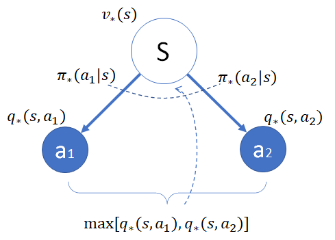

## 9.6 贝尔曼最优方程

### 9.6.1 最优动作价值函数 $q_*$

最优动作价值函数 $q_*$ 的表达式，其实与 $q_\pi$ 函数相同，因为都是从下游的状态价值函数 $v(s')$ 再加上状态转移概率及奖励计算而来，并没有取最大值的操作，只不过下游状态前者是 $v_*$，后者是 $v_\pi$，只要我们先假设它们是已知的，对 Q 函数的计算就没有区别。

$q_*$ 函数的模型如图 9.6.1 所示。

图 9.6.1 $q_*$ 函数模型

所以有实例化推导：

$$
\begin{aligned}
q_*(s,a) & = p_1[r_1+\gamma v_*(s_1)]+p_2[r_2+\gamma v_*(s_2)]+p_3[r_3+\gamma v_*(s_3)]
\\
&=\sum_{s'} p_{ss'}^a [r_{ss'}^a+\gamma v_*(s')] &(1)
\\
&=P^a_{ss'}[R^a_{ss'}+\gamma V_\pi(s')] &(2)
\\
&= R^a(s)+ \gamma P_{ss'}^a V_\pi(s')  &(3)
\end{aligned}
\tag{9.6.1}
$$

这与式（9.5.3）并不矛盾，前者是用 $q_\pi$ 来表示 $q_*$，这里是用 $v_*$ 来表示 $q_*$。

### 9.6.2 最优状态价值函数 $v_*$

最优状态价值函数 $v_*$ 与 $v_\pi$ 的计算是不同的，由于需要在 $\pi_*$ 处取下游状态 $q_*(s,a)$ 中的最大值，所以不再是加权求和的运算，而是最大值运算。

$v_*$ 函数的模型如图 9.6.2 所示。

图 9.6.2 $v_*$ 函数模型

策略单元选择时，总是取下游的动作 Q 函数中最大的那一个，即：

$$
\pi_*(a|s)=
\begin{cases}
1 & a=\argmax\limits_{a \in A(s)}  q_*(s,a)
\\
0 & 其它
\end{cases}
\tag{9.6.2}
$$

所以有实例化推导：

$$
\begin{aligned}
v_*(s) &=\pi_*(a_1|s)q_*(s,a_1) + \pi_*(a_2|s)q_*(s,a_2)
\\
&=\sum \pi_*(a|s)q_*(s,a)   &(1)
\\
&= \max_{a \in A(s)} q_*(s,a) &(2)
\end{aligned}
\tag{9.6.3}
$$

在众多的 $\pi_*(a_i|s)q_*(s,a_i)$ 中，只有一个 $\pi_*(a_i|s)=1$，其它都是 0，所以相当于取最大值。这样的话，式（9.5.6）的子式（1）就与 $v_\pi$ 函数的形式保持一致了。

### 9.6.3 手撕简化版穿越虫洞

下面我们就来一起看一下式（9.6.1）和式（9.6.3）在实际应用中的如何使用。

在 9.1 节中，我们提出了一个穿越虫洞的问题，是一个 5x5 的方格世界，没有终止状态。因为要手算，所以我们简化一下，变成 2x2 的方格世界，只有一个从 $s_0$ 到 $s_3$ 的穿越，得到 +5 的奖励，折扣为 0.5，其它设置都是前面的问题一样。如图 9.6.3。

图 9.6.3 简化的穿越虫洞问题

状态 $s_0,s_1,s_2,s_3$，每个状态下都有 4 个动作，价值函数为 $q(s,a), s=[0,1,2,3], a=[0,1,2,3]$。下面来求这个问题的最优价值函数 $V_*$ 和最优动作函数 $Q_*$。

根据式（9.6.3），列出 $V_*$ 的方程组（9.6.4）：

$$
V_*=
\begin{cases}
v_0=\max [q(0,0),q(0,1),q(0,2),q(0,3)]
\\
v_1=\max [q(1,0),q(1,1),q(1,2),q(1,3)]
\\
v_2=\max [q(2,0),q(2,1),q(2,2),q(2,3)]
\\
v_3=\max [q(3,0),q(3,1),q(3,2),q(3,3)]
\end{cases}
\tag{9.6.4}
$$
其中，$q$ 值在 $Q_*$ 方程组（9.6.5）中，根据式（9.6.1）得到：
$$
Q_*=
\begin{cases}
q(0,0)=q(0,1)=q(0,2)=q(0,3)=1\times(5+0.5v_3)=5+0.5v_3
\\
q(1,0)=1\times(0+0.5v_0)=0.5v_0
\\
q(1,1)=q(1,2)=1\times(-1+0.5v_2)=0.5v_1-1
\\
q(1,3)=1\times(0+0.5v_3)=0.5v_3
\\
q(2,0)=q(2,3)=1\times(-1+0.5v_2)=0.5v_2-1
\\
q(2,1)=1\times(0+0.5v_0)=0.5v_0
\\
q(2,2)=1\times(0+0.5v_3)=0.5v_3
\\
q(3,0)=1\times(0+0.5v_2)=0.5v_2
\\
q(3,1)=1\times(0+0.5v_1)=0.5v_1
\\
q(3,2)=q(3,3)=1\times(-1+0.5v_3)=0.5v_3-1
\end{cases}
\tag{9.6.5}
$$
把式（9.6.5）代入到式（9.6.4）中，并去掉重复项：
$$
V_*=
\begin{cases}
v_0=\max [5+0.5v_3] &(1)
\\
v_1=\max [0.5v_0,0.5v_1-1,0.5v_3] &(2)
\\
v_2=\max [0.5v_2-1,0.5v_0,0.5v_3] &(3)
\\
v_3=\max [0.5v_2,0.5v_1,0.5v_3-1] &(4)
\end{cases}
\tag{9.6.6}
$$

简化方程组：

1. 由式（9.6.6）的子式(1)，得到：$v_0=5+0.5v_3$。

2. 由式（9.6.6）的子式(2)，我们先假设 $v_1 \ge 0$，则 $v_1>0.5v_1-1$，所以有：$v_1=\max [0.5v_0,0.5v_1-1,0.5v_3]=\max [0.5v_0,0.5v_3]$。

3. 同理，假设 $v_2 \ge 0$，则式（9.6.6）的子式(3)变成：$v_2=\max [0.5v_0,0.5v_3]$。

4. 同理，假设 $v_3 \ge 0$，则式（9.6.6）的子式(4)变成：$v_3=\max [0.5v_2,0.5v_1]$。

整理一下：

$$
V_*=
\begin{cases}
v_0=5+0.5v_3    &(1)
\\
v_1= \max[0.5v_0,0.5v_3]    &(2)
\\
v_2= \max [0.5v_0,0.5v_3]   &(3)
\\
v_3= \max [0.5v_2,0.5v_1]   &(4)
\end{cases}
\tag{9.6.7}
$$

进一步简化：

1. 由式（9.6.7）子式(2)(3)可知，$v_1=v_2$，所以，子式(4)为：$v_3=\max[0.5v_1,0.5v_2]=\max[0.5v_1]=0.5v_1$。

2. 将$v_3=0.5v_1$代入式（9.6.7）子式(2)：$v_1= \max[0.5v_0,0.5v_3]=\max[0.5v_0,0.25v_1]=0.5v_0$，是因为假设 $v_1 \ge 0$，所以可以从 $\max$ 运算中去掉 $0.25v_1$。

再整理一下：

$$
V_*=
\begin{cases}
v_0=5+0.5v_3
\\
v_1=0.5v_0
\\
v_1=v_2
\\
v_3=0.5v_1
\end{cases}
\tag{9.6.8}
$$
解方程组（9.6.8）得：
$$
V_*=
\begin{cases}
v_0=\frac{40}{7} \approx 5.71
\\
v_1=\frac{20}{7} \approx 2.86
\\
v_2=\frac{20}{7} \approx 2.86
\\
v_3=\frac{10}{7} \approx 1.43
\end{cases}
\tag{9.6.9}
$$
进而可以根据式（9.6.5）解得 $Q_*$：
$$
Q_*=
\begin{cases}
q(0,0)=q(0,1)=q(0,2)=q(0,3) \approx 5.71
\\
q(1,0)=1\times(0+0.5v_0) \approx 2.86
\\
q(1,1)=q(1,2) \approx 0.43
\\
q(1,3)=1\times(0+0.5v_3) \approx 0.71
\\
q(2,0)=q(2,3) \approx 0.43
\\
q(2,1) \approx 2.86
\\
q(2,2) \approx 0.71
\\
q(3,0)=q(3,1) \approx 1.43
\\
q(3,2)=q(3,3) \approx -0.29
\end{cases}
\tag{9.6.10}
$$

我们把 $V_*,Q_*$ 的结果绘制在图 9.6.4 中，处于中间位置的是 $v_*$，处于四边的是 $q_*$。可以看到 $v_*=\max(q_*)$，即中间的数字等于四边的数字中的最大值。

图 9.6.4 最优价值函数 $V_*, Q_*$

在图 9.6.4 中同时画出了 $\max(q_*)$ 所代表的动作方向，都和预想的一致。

### 思考与练习
