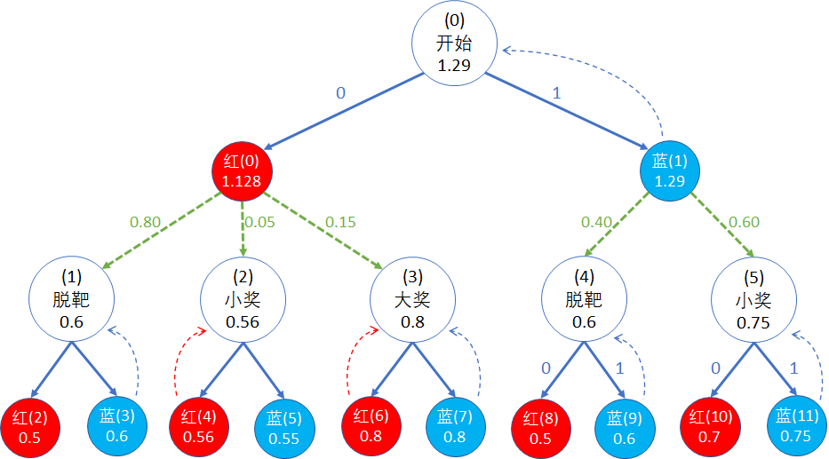

## 9.5 最优价值函数

### 9.5.1 最优状态价值函数 $v_*$ 的定义

最优状态价值函数的定义：

$$
\begin{aligned}
v_*(s) &\doteq \max_\pi v_\pi(s) 
\\
&=\max\big[v_{\pi_1}(s),v_{\pi_2}(s),\cdots,v_{\pi_m}(s)\big]
\end{aligned}
\tag{9.5.1}
$$

对于任意状态 $s \in S$，假设采用了 $m$ 个不同的策略 $\pi_i(s)$ 时，得到了 $m$ 个相同或不同的 $v_{\pi_i}(s)$，其中最大的那个值，定义为状态 $s$ 下的最优状态价值函数 $v_*(s)$，对应的 $\pi_i(s)$ 称为最优策略 $\pi_*(s)$。

请注意，式（9.5.1）定义的是**一个策略单元**的最优策略，而最优策略组 $\pi_*(S)$ 是由所有的最优策略单元组成，即：

$$
\pi_*(S) \doteq \Big [\pi_*(s_0),\pi_*(s_1),\cdots,\pi_*(s_n)\Big ], \quad s_0,s_1,\cdots,s_n \in S
\tag{9.5.2}
$$

一般文献中所说的**最优策略**，实际上是指的式（9.5.2），它包含了所有的最优策略单元。注意，状态空间 $S$ 中有多少个状态，式（9.5.2）的方括号中就必须有多少个最优策略单元，少一个都不行。

举例来说，上一小节中，我们只取出了 $v_\pi(s_0)=1.29$ 的 8 个策略组，列在表 9.5.1 中。

表 9.5.1  $v_\pi(s_0)=1.29$ 的策略组
|策略组序号|$v_\pi(s_0)$|$v_\pi(s_1)$|$v_\pi(s_2)$|$v_\pi(s_3)$|$v_\pi(s_4)$|$v_\pi(s_5)$|$v_\pi(s_6)$|
|:-:|-|:-:|:-:|:-:|:-:|:-:|:-:|
|$\pi_{35}$|1.29| 0.5|**0.56**| 0.8|  0.6  |0.75| 0  |
|$\pi_{39}$|1.29| 0.5|**0.56**| 0.8|  0.6  |0.75| 0  |
|$\pi_{43}$|1.29| 0.5|0.55| 0.8|  0.6  |0.75| 0  |
|$\pi_{47}$|1.29| 0.5|0.55| 0.8|  0.6  |0.75| 0  |
|$\pi_{51}$|1.29|**0.6**|**0.56**| 0.8|  0.6  |0.75| 0  |
|$\pi_{55}$|1.29|**0.6**|**0.56**| 0.8|  0.6  |0.75| 0  |
|$\pi_{59}$|1.29|**0.6**|  0.55| 0.8|  0.6  |0.75| 0  |
|$\pi_{63}$|1.29|**0.6**|  0.55| 0.8|  0.6  |0.75| 0  |
|最大值|**1.29**|**0.6**|**0.56**|**0.8**|**0.6**|**0.75**|0|

按照式（9.5.1）的定义，需要满足所有 $v_\pi(s)$ 都是最大值的条件。

- $v_\pi(s_0),v_\pi(s_3),v_\pi(s_4),v_\pi(s_5)$，所有策略组具有相同的最大值；
- $v_\pi(s_1)$，最大值 0.6，只有策略组 51,55,59,63 满足；
- $v_\pi(s_2)$，最大值 0.56，只有策略组 35,39,51,59 满足。

以上三者求最小子集，从最优状态价值函数来评判，最优策略组为 51,55。

### 9.5.2 最优动作价值函数 $q_*$ 的定义

最优动作价值函数的定义：

$$
\begin{aligned}
q_*(s,a) &\doteq \max_\pi q_\pi(s,a) 
\\
&=\max\big[q_{\pi_1}(s,a),q_{\pi_2}(s,a),\cdots,q_{\pi_m}(s,a)\big]
\end{aligned}
\tag{9.5.3}
$$

对于任意状态 $s \in S$ 和动作 $a \in A(s)$，假设采用了 $m$ 个不同的策略 $\pi_i(s)$ 时，得到了 $m$ 个相同或不同的 $q_{\pi_i}(s,a)$，其中最大的那个值，定义为状态 $s$ 下采用动作 $a$ 的最优动作价值函数 $q_*(s,a)$，对应的 $\pi_i(s)$ 称为最优策略 $\pi_*(s)$。

和 $v_*$ 一样，式（9.5.3）定义的是最优策略单元，它们的组合成为最优策略组。

读者可自行运行以下代码，可以得到上述 8 个策略组的 Q 函数值列表。

【代码位置】 Shoot_4_OptimalSearchQ.py

表 9.5.2 8个策略组的 Q 函数

|策略组序号$\to$|$q_\pi(s_0,a_0)$|$q_\pi(s_0,a_1)$|$\cdots$|
|:-:|:-:|:-:|-|
|$\pi_{35}$|1.048|1.29|$\cdots$|
|$\pi_{39}$|1.048|1.29|$\cdots$|
|$\pi_{43}$|1.0475|1.29|$\cdots$|
|$\pi_{47}$|1.0475|1.29|$\cdots$|
|$\pi_{51}$|**1.218**|1.29|$\cdots$|
|$\pi_{55}$|**1.218**|1.29|$\cdots$|
|$\pi_{59}$|1.217|1.29|$\cdots$|
|$\pi_{63}$|1.217|1.29|$\cdots$|
|最大值|**1.218**|**1.29**|$\cdots$|

表 9.5.2 只列出了 $q_\pi(s_0,a_0),q_\pi(s_0,a_1)$ 两个值，因为其它值都相等，为了节省篇幅，没有列出。

两列的最大值分别为 1.218,1.29，只有策略组 51,55 等于最大值， 而其它 6 个策略组的 $q_\pi(s_0,a_0)$ 函数值会小于最大值。因此，只有策略组 51,55 满足式（9.5.3），成为最优策略组，这也与用 $v_*$ 做评判标准得到的结果相同。

这说明针对本例，最优策略并不是唯一的。在其它强化学习问题中，也是如此：

1. 可以保证有最优策略；
2. 可以保证找到最优策略；
3. 不能保证找到所有最优策略。

### 9.5.3 结果分析

#### 为什么会有两个最优策略？

把策略组 51,55 的 V 函数和 Q 函数的晦涩数字标注在图 9.5.1 中，一目了然：

图 9.5.1 搜索最优策略的结果

策略 51,55 的区别在表 9.5.2 中。

表 9.5.2 策略51,55的区别
|策略组合序号|$\pi(s_0)$|$\pi(s_1)$|$\pi(s_2)$|$\pi(s_3)$|$\pi(s_4)$|$\pi(s_5)$|
|:-:|:-:|:-:|:-:|:-:|:-:|:-:|
|$\pi_{51}$|1|1|0|0|1|1|
|$\pi_{55}$|1|1|0|1|1|1|

从表中的数据比较，只有 $\pi(s_2),\pi(s_3)$ 不一样，而这两个策略单元对应的是图 9.5.1 的“大奖(3)”状态和“红(6),蓝(6)”两个动作。由于两个动作的 Q 函数值都是 0.8，所以无论选择哪个动作，大奖(3)的 V 函数都是 0.8，因此两种策略没有区别。

在方格世界中也经常有这种情况发生，走两条路会到达同一个目标，并且奖励相同，就会产生两个值相等的策略。

#### 为什么 8 个备选策略中只有 2 个是最优策略？

上一节中得知，在总共 64 个策略组合中，有 8 个可以让 $v_\pi(s_0)$ 达到最大值 1.29。

观察策略组序号的话，对数字敏感的读者可能会发现，它是一个等差数列，相邻数字之间相差 4。这个现象很有趣，一定与二进制的排列相关。进一步，我们可以把策略组的情况（二进制表示形式）做一个异或操作：

表 9.5.3 选出的策略组合中的动作选择（0表示选择红球，1表示选择蓝球）

|策略组合序号|$\pi(s_0)$|$\pi(s_1)$|$\pi(s_2)$|$\pi(s_3)$|$\pi(s_4)$|$\pi(s_5)$|
|:-:|:-:|:-:|:-:|:-:|:-:|:-:|
|$\pi_{35}$|1|0|0|0|1|1|
|$\pi_{39}$|1|0|0|1|1|1|
|$\pi_{43}$|1|0|1|0|1|1|
|$\pi_{47}$|1|0|1|1|1|1|
|$\pi_{51}$|1|1|0|0|1|1|
|$\pi_{55}$|1|1|0|1|1|1|
|$\pi_{59}$|1|1|1|0|1|1|
|$\pi_{63}$|1|1|1|1|1|1|
|XOR|**0**|**1**|**1**|**1**|**0**|**0**|

从表 9.5.3 中的异或结果可以看到，上述 8 个策略组中的共同点是在 $\pi(s_0),\pi(s_4),\pi(s_5)$ 三个策略上都选择 1（蓝色球），而在 $\pi(s_1),\pi(s_2),\pi(s_3)$ 三个策略上选择不同。

其根本原因在于在 $s_0$ 状态，选择射击蓝色气球 $\pi(a|s_0)=1$，在图 9.5.1 中，走了右侧的分支。本例的特点就是左右分支是二选一的，只要在右侧的后续流程中，使用 $\pi(a|s_4)=1,\pi(a|s_5)=1$，那么就能保证 $v_\pi(s_0)=1.29$，而在 $\pi(s_1),\pi(s_2),\pi(s_3)$ 三个策略上选择什么无所谓。

虽然其它 6 个策略也可以让 $v_\pi(s_0)=1.29$，但是根据式（9.5.1,9.5.3）的定义，它们不是最优策略，因为在其它几个 V,Q 函数值上不满足最大值条件。

### 思考与练习
