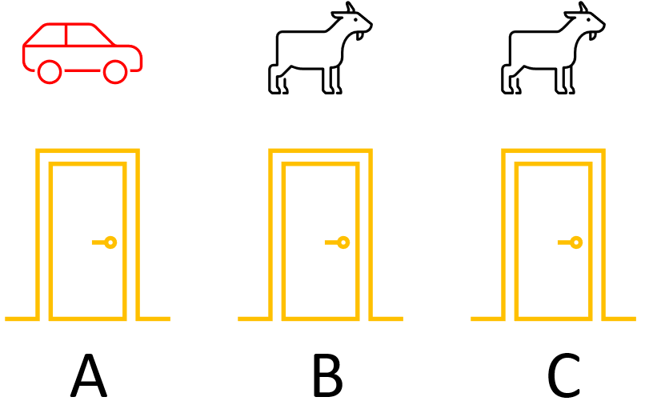

## 三门问题

三门问题——亦称为蒙提霍尔问题，出自美国的电视游戏节目Let's Make a Deal。问题的名字来自该节目的主持人蒙提·霍尔（Monty Hall）[2]。问题是这样的：

参赛者面前有三扇关闭着的门，其中一扇的后面是一辆汽车，选中后面有车的那扇门就可以赢得该汽车，而另外两扇门后面则各藏有一只山羊。当参赛者选定了一扇门，但未去开启它的时候，主持人会开启剩下两扇门中的一扇，露出其中一只山羊。主持人其后会问参赛者要不要换另一扇仍然关上的门。问题是：换另一扇门是否会增加参赛者赢得汽车的机率？

图1

针对上面的问题，我们可以给出下列不存在任何歧义的叙述：

1. 现在有三扇门ABC，只有一扇门后面有汽车，其余两扇门后面都是山羊。
2. 汽车事先被放置于三扇门中的一扇后面（在图1中我们假设汽车在 A 门后面）。
3. 参赛者在三扇门中挑选一扇。他在挑选前并不知道三扇门后面分别是什么。
4. 主持人知道每扇门后面有什么。
5. 主持人不能打开参赛者挑选的门。
6. 如果参赛者挑了一扇有山羊的门，主持人就会挑另一扇有山羊的门并打开。
7. 如果参赛者挑了一扇有汽车的门，主持人随意在另外两扇有山羊的门中挑一扇门并打开。
8. 参赛者会被问是否保持他的原来选择，还是转而选择剩下的那一扇门。

问题：转换选择可以增加参赛者拿到汽车的机会吗？

首先说明一点，本问题并不是典型的强化学习问题，而是用概率论就可以解决的问题。但是，通过对这个问题的分析过程和解决途径的学习，我们可以体会到强化学习的一般方法。

### 经验归纳法

有些社会经验的人（他们往往会忘记大学时学习的数学知识），可能会这么想：

- 商家是不会让顾客占便宜的，买的不如卖的精，千万别信。
- 我上次换了一个 team（团队），但是两年后依然没有得到 promotion（升职），这次不换了。
- 有些人总是利用信息不对称的优势，引（诱）导他人做有些热想到达目的的事，我不能上当。
- 我的第一感觉很准，而且一贯运气不错，我要坚持己见。
- 山羊只吃草，汽车还要烧油，不划算。

这些社会心理学的问题已经超出了本书的范畴，在本书中，这些都可以称为伪科学。

### 简单的穷举法

稍微有点儿头脑的人，会这样想：

- 主持人打开一扇门后，在关闭的两扇门中，其中一个有汽车的概率是$\frac{1}{2}$，所以换不换都没用。
- 一共两只山羊，一辆汽车，所以中奖汽车的概率是 $\frac{1}{3}$。

可以进行更细致的推理，如表1。

|情况|奖品所在之门|参赛者 初始选择之门|主持人 打开之门|参赛者 是否更换选择|参赛者 最终选择之门|是否中奖|中奖概率|
|:-:|:--:|:--:|:--:|:--:|:--:|:--:|:--:|
|1|A|A|B|Yes|C|No|0|
|2|A|A|B|No|A|Yes|$\frac{1}{8}$|
|3|A|A|C|Yes|B|No|0|
|4|A|A|C|No|A|Yes|$\frac{1}{8}$|
|5|A|B|C|Yes|A|Yes|$\frac{1}{8}$|
|6|A|B|C|No|B|No|0|
|7|A|C|B|Yes|A|Yes|$\frac{1}{8}$|
|8|A|C|B|No|C|No|0|

我们用表1中的两种情况举例说明：

- 第1种情况：

  - 汽车在 A 门后；
  - 参赛者选择了 A 门（但是参赛者并不知道自己的选择是否正确）；
  - 主持人可以打开 B 和 C 门，假设他打开了 B 门，露出一只山羊；
  - 主持人问参赛者是否要更换选择；
  - 参赛者更换了选择，从 A 换到了 C；
  - 没有中奖汽车。

- 第5种情况：

  - 汽车在 A 门后；
  - 参赛者选择了 B 门（但是参赛者并不知道自己的选择是否正确）；
  - 主持人只能打开 C 门，露出一只山羊；
  - 主持人问参赛者是否要更换选择；
  - 参赛者更换了选择，从 A 换到了 B；
  - 中奖汽车！

读者可以自己推导一下其他情况，不再赘述。

从表 1 中，统计一下“参赛者是否更换选择”一列，Yes/No 各占一半；而对应的“是否中奖”一列，也是各占一半，与“更换选择”一列没有一致性（即两者都是 Yes 或者都是 No）。从而可以得到结论，在 8 种情况种：

- 更换选择时，中奖 2 次，概率为 $\frac{1}{8}+\frac{1}{8}=\frac{1}{4}$
- 不更换选择时，中奖 2 次，概率为 $\frac{1}{8}+\frac{1}{8}=\frac{1}{4}$

所以无论是否更换选择，中奖汽车的概率都是 $\frac{1}{4}$。

似乎问题到此可以结束讨论了，电视台和主持人似乎只是把中奖游戏又换了个花样以便赢得电视观众的收视率。但情况真的如此吗？

### 科学的穷举法

表 1 中的推导存在着一个细节，读者可能并没有注意：

- 当奖品所在之门和参赛者初始选择之门都是 A 时，主持人可以在 B 和 C 中任意打开一扇门，概率为 50%。
- 但是如果奖品所在之门是 A，参赛者初始选择之门是 B，此时主持人只能打开 C 门，概率为100%，没有别的选择！

另外，参赛者初选之门也是有概率的，选择ABC三个门的概率相等，都是 $\frac{1}{3}$。

所以，我们需要把这两个情况变成概率放在表2中。

表2

|情况|奖品所在之门|参赛者初始选 择之门及概率|主持人打开 之门及概率|参赛者是否 更换选择|参赛者最终 选择之门|是否中奖|中奖概率|
|:-:|:--:|:--:|:--:|:--:|:--:|:--:|:--:|:--:|
|1|A|A, $\frac{1}{3}$|B, $\frac{1}{2}$|Yes|C|No|0|
|2|A|A, $\frac{1}{3}$|B, $\frac{1}{2}$|No|A|Yes|$\frac{1}{3} \times \frac{1}{2}=\frac{1}{6}$|
|3|A|A, $\frac{1}{3}$|C, $\frac{1}{2}$|Yes|B|No|0|
|4|A|A, $\frac{1}{3}$|C, $\frac{1}{2}$|No|A|Yes|$\frac{1}{3} \times \frac{1}{2}=\frac{1}{6}$|
|5|A|B, $\frac{1}{3}$|C, 1|Yes|A|Yes|$\frac{1}{3} \times 1=\frac{1}{3}$|
|6|A|B, $\frac{1}{3}$|C, 1|No|B|No|0|
|7|A|C, $\frac{1}{3}$|B, 1|Yes|A|Yes|$\frac{1}{3} \times 1=\frac{1}{3}$|
|8|A|C, $\frac{1}{3}$|B, 1|No|C|No|0|

如果严格按照上述的条件，那么答案是会。不换门的话，赢得汽车的几率是1/3。换门的话，赢得汽车的几率是2/3。

### 理论推导

首先扩展一下问题，假设有 $n$ 个门，参赛者先选择了一个门，然后主持人打开了一个没有汽车的门，那么场上现在还有 $n-1$ 个关闭的门。

下面我们以上帝视角来分析各种情况：

- 定义事件 $X_1$ 是初始选择到了汽车的概率，$P(X_1)=\frac{1}{n}$
- 事件 $X_1$ 的反向事件 $X_2$ 是初始没有选择到了汽车的概率，$P(X_2)=1-P(X_1)=\frac{n-1}{n}$
- 定义事件 $Y$ 是一个固执的参赛者的经历，**没有改变选择而中奖**的概率是：
  - 因为 $X_1$ 是初始选择时就中奖的事件，幸运地**没有改变选择**，所以有：$P(Y|X_1)=1$, 
  - 相反，如果初始时选择错误，依然固执地**没有改变选择**，那么中奖概率为0，所以有：$P(Y|X_2)=0$
- 定义事件 $Z$ 是一个头脑灵活的参赛者的经历，**改变了选择而中奖**，则有：
    - 在初始选择正确时，但是不幸**改变了选择**，则中奖概率为0，所以有：$P(Z|X_1)=0$
    - 在初始选择时错误，但是最终**改变了选择**，除去主持人打开的一扇门，以及放弃了自己初选的一扇门，剩余 $n-2$ 扇门的中奖概率是 $P(Z|X_2)=\frac{1}{n-2}$

根据全概率公式：

$$
P(Y)=\sum_{i=1}^{n} P(X_i)P(Y|X_i)
\\
P(Z)=\sum_{i=1}^{n} P(X_i)P(Z|X_i)
$$

**没有改变选择而中奖**的概率是：

$$
\begin{aligned}
P(Y) &= P(X_1)P(Y|X_1)+P(X_2)P(Y|X_2)
\\
&=\frac{1}{n} \times 1 + \frac{n-1}{n} \times 0 
\\
&= \frac{1}{n}
\end{aligned}
$$

**改变选择而中奖**的概率是：

$$
\begin{aligned}
P(Z) &= P(X_1)P(Z|X_1)+P(X_2)P(Z|X_2)
\\
&=\frac{1}{n} \times 0 + \frac{n-1}{n} \times \frac{1}{n-2}
\\
&= \frac{n-1}{n(n-2)}
\end{aligned}
$$

比较 $P(Z)$ 和 $P(Y)$ 的大小：

$$P(Z)-P(Y)=\frac{n-1}{n(n-2)}-\frac{1}{n}=\frac{1}{n(n-2)}$$

当 $n>2$ 时，$P(Z)-P(Y) > 0$，所以改变选择而中奖的概率大于不改变选择而中奖的概率，应该改变选择。

特别地，如果 $n=3$，则：$P(Y)=\frac{1}{3},P(Z)=\frac{2}{3}$，改变选择中奖的概率是不改变的 2 倍。

### 代码模拟

