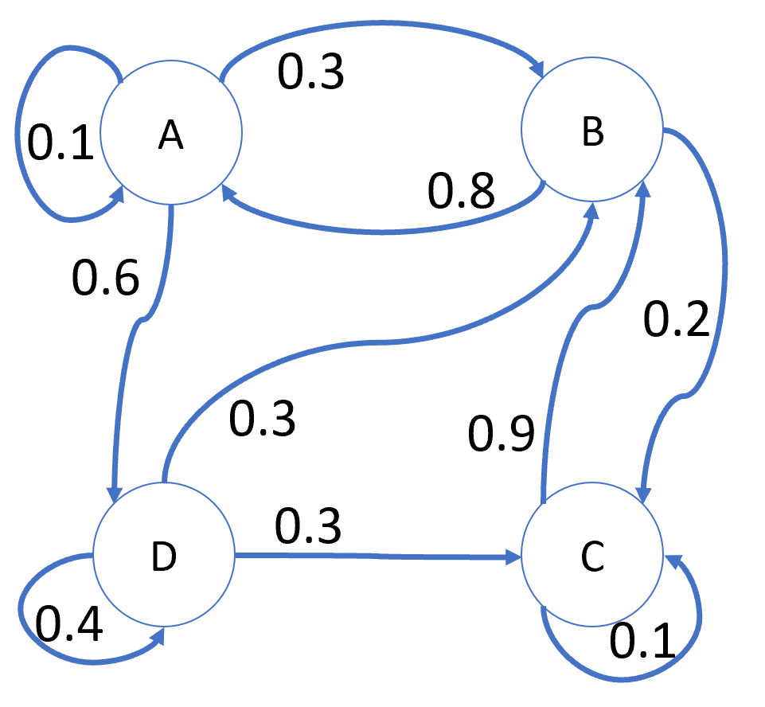
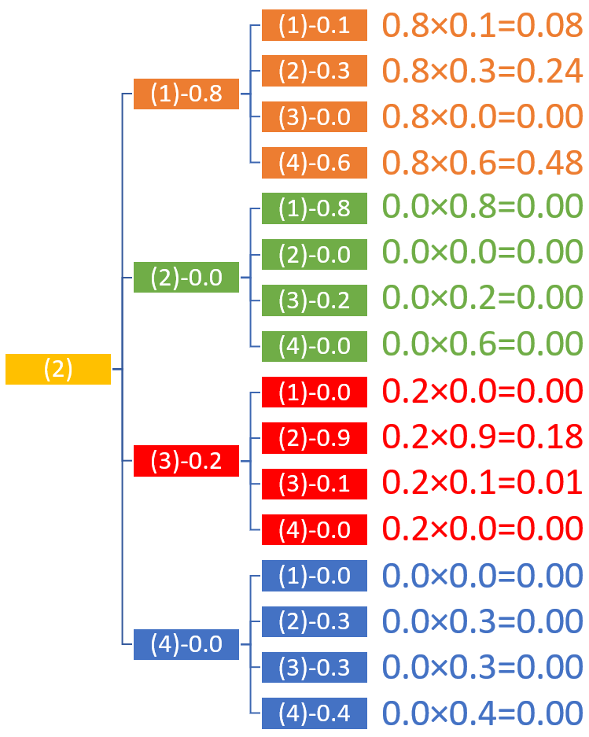

## 租车问题

### 1 提出问题

在北京有一个租车连锁公司，分别在海淀区、朝阳区、通州区、丰台区开设了 4 个门店，编号分别为 (1)、(2)、(3)、(4)。客户可以从任意一个店租车，用完后归还到任意一个店。公司统计了去年全年的租车、还车记录，发现了如下现象（假设都是当日租当日还）：

- 从(1)号店租车后
    - 还到(1)号店的概率是0.1
    - 还到(2)号店的概率是0.3
    - 还到(3)号店的概率是0.0
    - 还到(4)号店的概率是0.6

当然，也统计了从(2)(3)(4)号店租车还车的记录，绘制在图 1 中，避免赘述。

图 1

为了招徕顾客，公司特地买了一辆高档宝驴车，以普通价格出租。公司经理想知道如果有一天这辆车从(2)号店出租了，3 天后的早晨会在哪个店出现？10 天后又会如何？

一般情况下，读者会根据图 1 从(2)店出发，根据概率顺藤摸瓜地计算出第2天的情况，再计算出第3天的情况。

- 第 2 天早晨出现在各门店的概率是：0.8, 0.0, 0.2, 0.0。
- 第 3 天早晨出现在各门店的概率是......有点儿复杂，我们绘制出图 2 来帮助整理数据。

图 2

从图2一眼就可以看出来，出现在各门店的概率就是两个连续的概率之乘积，比如：
- 第 2 天出现在(1)号店的概率是 0.8；
- 第 3 天，由于(1)号店有0.1的概率回到本身，所以出现在(1)号店的概率是$0.8 \times 0.1=0.08$。

所以，该车出现在(1)号店的概率是0.08。

其它店的所有情况列在表 1 中

表1

|从$\rightarrow$到|(1)号门店|(2)号门店|(3)号门店|(4)号门店|<第2天>|
|-|-|-|-|-|-|
|(1)号门店|$0.8\times0.1=0.08$|$0.8\times0.3=0.24$|$0.8\times0.0=0.00$|$0.8\times0.6=0.48$|$0.8$|
|(2)号门店|$0.0\times0.8=0.0$|$0.0\times0.0=0.0$|$0.0\times0.2=0.0$|$0.0\times0.0=0.0$|$0.0$|
|(3)号门店|$0.2\times0.0=0.00$|$0.2\times0.9=0.18$|$0.2\times0.1=0.02$|$0.2\times0.0=0.00$|$0.2$|
|(4)号门店|$0.0\times0.0=0.0$|$0.0\times0.3=0.0$|$0.0\times0.3=0.0$|$0.0\times0.4=0.0$|$0.0$|
|< 第3天 >|$0.08$|$0.24+0.18=0.42$|$0.02$|$0.48$|$1.0$|

数据解读：
- 以第 2 行数据为例，第 2 天不会出现在(2)号门店，因为从(2)号门店出租的车没有还到本店的；
- 但是，最后一行显示，到了第 3 天，出现在(2)号门店的概率是 0.42，原因是(1)(3)(4)号门店的出租车都有可能还到(2)号门店。

OK! 3天后的问题解决了，那么10天后呢？这么计算太复杂了。我们引入转移概率矩阵的概念来帮助解决问题。

### 转移概率矩阵

把图1变成表2，可以看作是矩阵

表2

|P: 从$\rightarrow$到|(1)|(2)|(3)|(4)|输出总和|
|:-:|-|-|-|-|-|
|(1)|0.1|0.3|0.0|0.6|1.0|
|(2)|0.8|0.0|0.2|0.0|1.0|
|(3)|0.0|0.9|0.1|0.0|1.0|
|(4)|0.0|0.3|0.3|0.4|1.0|
|输入总和|0.9|1.5|0.6|1.0|4.0|

- 是一个 $n \times n$ 的方阵
- 矩阵各元素都是非负的，即：$0 \le P_{i,j} \le 1$
- 各行元素（输出概率）之和为 1，即：$\sum^n_{j=1} P_{i,j}=1$
- 对于输入概率总和没有限制，但是最终的总和（右下角）在行列上肯定应该一致，都是4.0（因为有个 4 个门店）。

$$
P = 
\begin{bmatrix}
P_{11} & P_{12} & P_{13} & P_{14}
\\
P_{21} & P_{22} & P_{23} & P_{24}
\\
P_{31} & P_{32} & P_{33} & P_{34}
\\
P_{41} & P_{42} & P_{43} & P_{44}
\end{bmatrix}= 
\begin{bmatrix}
0.1 & 0.3 & 0.0 & 0.6
\\
0.8 & 0.0 & 0.2 & 0.0
\\
0.0 & 0.9 & 0.1 & 0.0
\\
0.0 & 0.3 & 0.3 & 0.4
\end{bmatrix}
$$

$$
P = 
\begin{bmatrix}
P_{11} & \cdots & P_{1n}
\\
\vdots & \ddots & \vdots
\\
P_{n1} & \cdots & P_{nn}
\end{bmatrix}
$$

