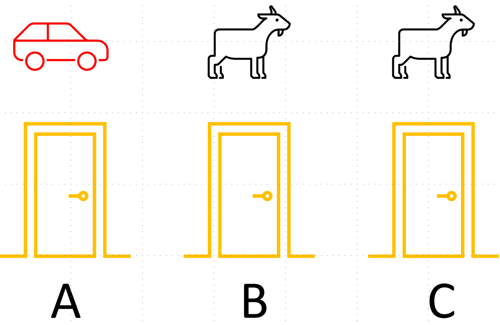

## 三门问题

三门问题——亦称为蒙提霍尔问题，出自美国的电视游戏节目Let's Make a Deal。问题的名字来自该节目的主持人蒙提·霍尔（Monty Hall）[2]。问题是这样的：

参赛者面前有三扇关闭着的门，其中一扇的后面是一辆汽车，选中后面有车的那扇门就可以赢得该汽车，而另外两扇门后面则各藏有一只山羊。当参赛者选定了一扇门，但未去开启它的时候，主持人会开启剩下两扇门中的一扇，露出其中一只山羊。主持人其后会问参赛者要不要换另一扇仍然关上的门。问题是：换另一扇门是否会增加参赛者赢得汽车的机
率？

图1

针对上面的问题，我们可以给出下列不存在任何歧义的叙述：

1. 现在有三扇门ABC，只有一扇门后面有汽车，其余两扇门后面都是山羊。
2. 汽车事前被放置于三扇门的其中一扇后面（在图1中我们假设汽车在 A 门后面）。
3. 参赛者在三扇门中挑选一扇。他在挑选前并不知道三扇门后面分别是什么。我们假设他挑选了 A 门。
4. 主持人知道每扇门后面有什么。
5. 如果参赛者挑了一扇有山羊的门，主持人就会挑另一扇有山羊的门并打开。
6. 如果参赛者挑了一扇有汽车的门，主持人随意在另外两扇有山羊的门中挑一扇门并打开。
7. 参赛者会被问是否保持他的原来选择，还是转而选择剩下的那一扇门。

问题：转换选择可以增加参赛者拿到汽车的机会吗？

首先说明一点，本问题并不是典型的强化学习问题，而是用概率论就可以解决的问题。但是，通过对这个问题的分析过程和解决途径的学习，我们可以体会到强化学习的一般方法。

### 经验归纳法

有些社会经验的人（他们往往会忘记大学时学习的数学知识），可能会这么想：

- 商家是不会让顾客占便宜的，买的不如卖的精，千万别信。
- 我上次换了一个 team（团队），但是两年后依然没有得到 promotion（升职），这次不换了。
- 有些人总是利用信息不对称的优势，引（诱）导他人做有些热想到达目的的事，我不能上当。
- 我的第一感觉很准，而且一贯运气不错，我要坚持己见。

稍微有点儿头脑的人，会这样想：

- 主持人打开一扇门后，在关闭的两扇门中，其中一个有汽车的概率是50%，所以我换不换都没用。

如果严格按照上述的条件，那么答案是会。不换门的话，赢得汽车的几率是1/3。换门的话，赢得汽车的几率是2/3。

