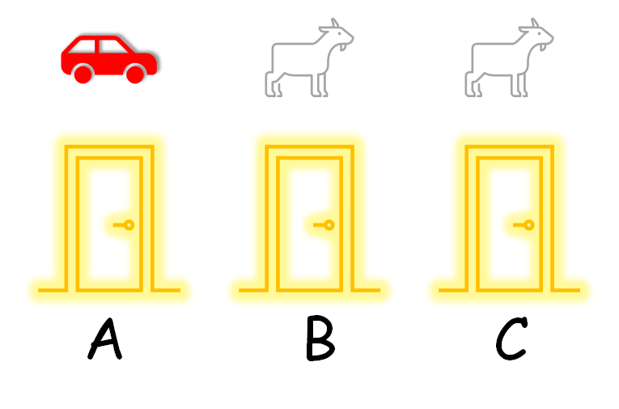

## 1.1 蒙提霍尔问题

### 1.1.1 提出问题

三门问题——亦称为蒙提霍尔问题，出自美国的电视游戏节目Let's Make a Deal。问题的名字来自该节目的主持人蒙提·霍尔（Monty Hall）[2]。问题是这样的：

参赛者面前有三扇关闭着的门，其中一扇的后面是一辆汽车，选中后面有车的那扇门就可以赢得该汽车，而另外两扇门后面则各藏有一只山羊。当参赛者选定了一扇门，但未去开启它的时候，主持人会开启剩下两扇门中的一扇，露出其中一只山羊。主持人其后会问参赛者要不要换另一扇仍然关上的门。问题是：换另一扇门是否会增加参赛者赢得汽车的机率？

图 1.1.1 蒙提霍尔问题

针对上面的问题，我们可以给出下列不存在任何歧义的叙述：

1. 现在有三扇门ABC，只有一扇门后面有汽车，其余两扇门后面都是山羊。
2. 汽车事先被放置于三扇门中的一扇后面（在图1中我们假设汽车在 A 门后面）。
3. 参赛者在三扇门中挑选一扇。他在挑选前并不知道三扇门后面分别是什么。
4. 主持人知道每扇门后面有什么。
5. 主持人不能打开参赛者挑选的门。
6. 如果参赛者挑了一扇有山羊的门，主持人就会挑另一扇有山羊的门并打开。
7. 如果参赛者挑了一扇有汽车的门，主持人随意在另外两扇有山羊的门中挑一扇门并打开。
8. 参赛者会被问是否保持他的原来选择，还是转而选择剩下的那一扇门。

问题：转换选择可以增加参赛者拿到汽车的机会吗？

首先说明一点，本问题并不是典型的强化学习问题，而是用概率论就可以解决的问题。但是，通过对这个问题的分析过程和解决途径的学习，我们可以体会到强化学习的一般方法。

### 1.1.2 经验归纳法

有些社会经验的人（他们往往会忘记大学时学习的数学知识），可能会这么想：

- 商家是不会让顾客占便宜的，买的不如卖的精，千万别信。
- 有些人总是利用信息不对称的优势，引（诱）导他人做有些热想到达目的的事，我不能上当。
- 我的第一感觉很准，而且一贯运气不错，我要坚持己见。
- 山羊只吃草，汽车还要烧油，不划算，领一只山羊也不错。

*注：这些社会心理学的问题已经超出了本书的范畴，在本书中，这些都可以称为伪科学。*

### 1.1.3 逻辑推理

稍微有点儿逻辑头脑的人，会这样推理：

- 主持人打开一扇门后，在关闭的两扇门中，其中一个有汽车的概率是$\frac{1}{2}$，所以换不换都没用。
- 一共两只山羊，一辆汽车，所以中奖汽车的概率是 $\frac{1}{3}$，无论耍什么花样。
- 假设规则变成在主持人打开一扇门之后才选择，那么参赛者一定是在剩下的两扇门之间以50%的概率中奖汽车，这与开始选择哪扇门没有关系。

*注：人们总会混淆数理推导与逻辑推理的关系。*

### 1.1.4 简单的穷举法

由于只有三扇门，所以我们不妨穷举所有可能性，如表1。

|情况|奖品所在之门|参赛者 初始选择之门|主持人 打开之门|参赛者 是否更换选择|参赛者 最终选择之门|是否中奖|
|:-:|:--:|:--:|:--:|:--:|:--:|:--:|
|1|A|A|B|Yes|C|No|
|2|A|A|B|No|A|Yes|
|3|A|A|C|Yes|B|No|
|4|A|A|C|No|A|Yes|
|5|A|B|C|Yes|A|Yes|
|6|A|B|C|No|B|No|
|7|A|C|B|Yes|A|Yes|
|8|A|C|B|No|C|No|

我们用表1中的两种情况举例说明：

- 第1种情况：

  - 汽车在 A 门后；
  - 参赛者选择了 A 门（但是参赛者并不知道自己的选择是否正确）；
  - 主持人可以打开 B 和 C 门，假设他打开了 B 门，露出一只山羊；
  - 主持人问参赛者是否要更换选择；
  - 参赛者更换了选择，从 A 换到了 C；
  - 没有中奖汽车，领走了一只咩咩叫的山羊。

- 第5种情况：

  - 汽车在 A 门后；
  - 参赛者选择了 B 门（但是参赛者并不知道自己的选择是否正确）；
  - 主持人只能打开 C 门，露出一只山羊；
  - 主持人问参赛者是否要更换选择；
  - 参赛者更换了选择，从 A 换到了 B；
  - 中奖汽车！

从表 1 中，进行一下简单的统计，在“参赛者是否更换选择”一列：
- 有 4 种情况选择 Yes，中奖 2 次，50%。
- 有 4 种情况选择 No，中奖 2 次，50%。

所以“**是否中奖**”与“**更换选择**”没有一致性，从而得到结论：**无论是否更换选择，中奖汽车的概率都是 $\frac{1}{2}$**。

当汽车在 B 门或 C 门后时，情况与表 1 相同，读者可以自己推导一下，在此不再赘述。

似乎问题到此可以结束讨论了，电视台和主持人似乎只是把中奖游戏又换了个花样以便赢得电视观众的收视率。但情况真的如此吗？
