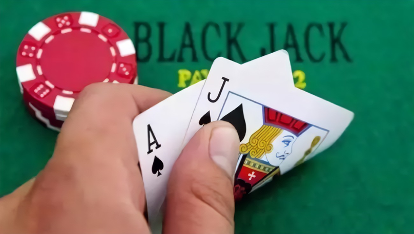

## 11.1 二十一点问题

二十一点是一个十分具有趣味性的牌类游戏，最早出现在16世纪，起源于法国，法语称为ving-et-un（20 和 1）。后传入英国并广泛流传。如果玩家拿到黑心 A 和黑心 J 会给予额外的奖励，英文名称叫黑杰克（Blackjack）。

<center>


图 11.1.1 二十一点游戏
</center>

该游戏由 2 到 6 人进行，一名庄家，其余为玩家。

使用除大小王之外的 52 张扑克牌，一般为多副牌（比如四副）混在一起使用，以避免依赖一些简单的概率计算来获胜。比如，如果只使用一副牌，则一共有四张 A；如果有四个玩家都有一张 A，那么庄家肯定没有 A。如果是四副牌的话，就不用考虑这些问题了，相当于牌池足够大。

玩家的目标是使手中牌的点数之和不超过 21 点且尽量大。

游戏过程中会给庄家和玩家每人发两张牌，一张为明牌，一张为暗牌。接下来会有几种情况：

- 如果玩家手中的两张牌之点数和为 21，称为天和，除非庄家也是天和（算平局），否则玩家直接获胜。

- 玩家可以根据手中牌点数和的大小与庄家手中牌点数来要牌 (hit) 并决定何时停牌 (stick) 。当选择继续要牌后，若总和大于21点，则算自爆（bust），游戏失败，无论后续庄家如何。

- 全部停牌后，庄家翻开扣着的牌，如果点数之和小于 17 点，则继续要牌，直到所有点数之和是 17 点或大于 17 点后，和玩家进行比较，谁的点数更靠近 21，谁获胜；如果庄家自爆，玩家获胜；若两方点数相同，则为平局。

具体点数计算规则如下：

1. 2 到 10 的点数就是其牌面的数字；
2. J,Q,K 三种牌均记为 10 点；
3. A（Ace牌）可以当作 1 点，也可以当作 11 点，11 点时称为“有可用的 A”（Usable Ace）。


#### 动作空间

我们要研究的是玩家的策略，所以只有两个动作：

- 要牌（hit）= 1
- 停牌（stick）= 0


#### 状态空间

表 11.1.1 玩家的状态空间

|庄家明牌点数 $\to$<br>玩家点数总和$\downarrow$|1|2|...|10|
|-|-|-|-|-|
|12||||
|13||||
|...||||
|20||||
|21||||

玩家的状态由两个因素决定：

1. 庄家手中的牌（一张明牌）；
2. 玩家自己手中的所有牌。

因为当玩家手中的牌不到 12 点时，再来任何一张牌都后，总数都不会超过 21 点，所以肯定是要牌。我们只考虑 12 点到 21 点（包含天和的情况）之间的情况。

所有的状态在表 11.1.1 中所示，一共有 10x10=100 种状态。另外，玩家有 A 的话，那将会有很大的变数，所以有 A 无 A 算是第三个因素，那么整个状态空间是 2x10x10=200。

#### 分幕与奖励

- 玩家赢，R=1；
- 玩家输，R=-1；
- 平局，R=0。

每一局看作一幕，中间过程没有任何奖励。

在这个强化学习问题中，拿到黑桃 A 和 J 不再有奖励，因为它与强化学习无关，只与运气有关。

#### 强化学习的目标

另外，在实际的游戏中，庄家面对多个玩家，假设一个玩家自爆，不影响其它玩家继续，庄家会得到针对该玩家的奖励，即使庄家后面输给其它玩家或自爆。

在本问题中，是站在某个玩家的角度来考虑问题，不管其它玩家的情况如何。因为庄家的规则是固定的，玩家的策略相对灵活，而不同的玩家有不同的策略，因人而异。我们的目的是找到最优的玩家策略。

所以，就假设只有庄家和一个玩家。那么强化学习的目标就是在表 11.1.1 中的每个格子内决定采取要牌（hit）还是停牌（stick）。

#### 环境测试

【代码位置】MC_111_BlackJack.py

```python
import gym
import numpy as np

env = gym.make('Blackjack-v1', sab=True)    # 使用 Sutton 书中的设置
for i in range(10):      # 循环 10 幕
    s = env.reset()     # 重置环境，开始一幕
    Episode = []        # 保存记录
    while True:
        action = np.random.choice(env.action_space.n)   # 随机选择动作做测试
        next_s, r, done, _ = env.step(action)   # 与环境交互
        Episode.append((s, action, r, next_s))  # 保存 (S,A,R,S')
        if done:    # 本幕结束
            break
        s = next_s  # 迭代
    print(Episode)
env.close()
```

其中的参数（Arguments）sab=True 的含义是使用 Sutton and Barto 书中的设置。

得到的部分典型结果如下：

```
# s,              a, r,    s'
[((20, 7, False), 1, -1.0, (29, 7, False))]
......
[((19, 2, True), 0, 1.0, (19, 2, True))]
......
[((17, 7, True), 1, 0.0, (18, 7, True)), ((18, 7, True), 1, 0.0, (20, 7, True)), 
((20, 7, True), 1, 0.0, (21, 7, True)), ((21, 7, True), 0, 1.0, (21, 7, True))]
......
[((16, 9, False), 1, 0.0, (18, 9, False)), ((18, 9, False), 0, -1.0, (18, 9, False))]
```

- 第一个结果

    20：初始玩家拿到两张牌 20 点；
    7：庄家明牌 7 点；
    False：玩家没有 A；
    1：选择要牌。
    -1.0：玩家输了，奖励 -1.0。
    原因在 s' 中，三张牌 29 点，爆了（bust）。

- 第二个结果

    初始玩家拿到两张牌 19 点，庄家明牌 2 点，玩家有 A；选择停牌。
    赢了，奖励 1.0。原因是庄家可能爆了，或者点数少。

- 第三个结果

    初始玩家拿到两张牌 17 点，庄家明牌 7 点，玩家有 A；选择要牌；
    又拿到一张 A，18 点，选择要牌；
    拿到一张 2，20 点，选择要牌；
    又拿到一张 A（太幸运了！），21 点，选择停牌。
    赢了，奖励 1.0。原因是庄家点数小。

- 第四个结果

    初始玩家拿到两张牌 16 点，庄家明牌 9 点，玩家没有 A；选择要牌；
    拿到一张 2，18 点，选择停牌。
    输了，奖励 -1.0。原因是庄家点数大。

在结果中并没有说明输或赢的原因，是笔者根据基本逻辑猜测的，对于强化学习问题来说并不重要。
